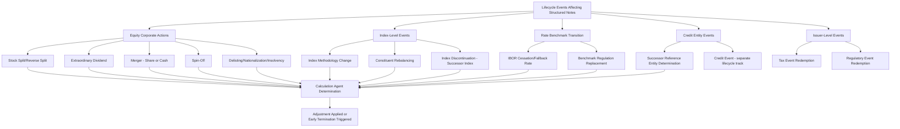

## Corporate Action and Lifecycle Event Handling

### Definition and Conceptual Overview

Corporate action and lifecycle event handling refers to the contractual mechanisms and operational processes by which a structured note's terms are **adjusted, substituted, or otherwise modified** in response to events affecting the underlying reference asset(s) that are unrelated to the ordinary path of market pricing — such as stock splits, mergers, spin-offs, index composition changes, dividend policy changes, or issuer/entity-level restructurings. These provisions exist to preserve, as closely as practicable, the **economic intent** of the original payoff despite the underlying's structural transformation.

**Key Points**

- Corporate action handling is governed by detailed, pre-specified adjustment methodologies embedded in the note's Conditions, typically incorporating or referencing standard derivatives industry definitions (e.g., ISDA Equity Derivatives Definitions) rather than being negotiated bespoke for each event.
- The **calculation agent** is responsible for determining whether a corporate action has occurred, whether it has a "diluting or concentrative effect" (or equivalent threshold under the applicable definitions), and what adjustment (if any) is required.
- Lifecycle event handling spans a broad taxonomy: equity corporate actions, index-level changes (index provider methodology changes, constituent changes), rate benchmark transitions (e.g., IBOR reform), credit-related entity changes (successor determination), and issuer-level events (tax/regulatory redemption triggers, discussed in the early redemption topic).

---

### Taxonomy of Equity Corporate Actions and Standard Adjustments

#### 1. Stock Splits and Reverse Splits

- Mechanical, formulaic adjustment: strike price and number of shares/reference units are adjusted by the split ratio, preserving the aggregate economic value of the reference exposure.

$$K_{\text{adjusted}} = K_{\text{original}} \times \frac{1}{\text{Split Ratio}}, \quad N_{\text{shares, adjusted}} = N_{\text{shares, original}} \times \text{Split Ratio}$$

#### 2. Ordinary vs. Extraordinary Dividends

- **Ordinary dividends** are generally assumed/embedded in the option pricing model at issuance (via a dividend yield assumption) and typically require **no ad hoc adjustment** — this is the standard treatment.
- **Extraordinary/special dividends** exceeding a materiality threshold (defined in the Conditions, often referencing a percentage of share price) typically trigger a **strike/barrier adjustment** to compensate for the value transferred out of the share price via the special distribution, since such distributions are not adequately captured by the standard dividend yield assumption used in original pricing.

#### 3. Mergers and Acquisitions

- **Share-for-share mergers**: the reference underlying is typically adjusted to reference the acquiring company's shares, using the exchange ratio, with the calculation agent determining whether the adjustment preserves the theoretical value of the position ("adjustment event") or whether the merger constitutes a more disruptive event requiring alternative treatment (e.g., cancellation and payment, or substitution with a basket including cash/acquirer shares).
- **Cash mergers (going-private transactions)**: the underlying effectively ceases to exist as a continuously tradeable reference; the note's terms typically provide for **early cancellation and settlement at fair value**, or substitution of the cash merger consideration as a fixed component going forward (converting the equity-linked feature into a fixed-cash-flow feature from that point).

#### 4. Spin-Offs

- The calculation agent determines whether to (a) adjust the original underlying's reference price to reflect the value distributed via the spin-off (with no separate reference to the spun-off entity), or (b) incorporate the spun-off entity as an **additional component** of a basket, tracking both parent and spin-off going forward, depending on the Conditions' specified methodology and the calculation agent's determination of the appropriate treatment.

#### 5. Nationalization, Insolvency, and Delisting

- These are typically treated as more severe "extraordinary events" under standard definitions, often triggering **early termination and cash settlement at fair value** (similar to a cash merger), rather than an ongoing adjustment, since no viable continuing reference exists.

**Example**

*Merger Adjustment Walkthrough*

- Underlying: Company A shares, initial reference price $50.00
- Event: Company A acquired by Company B in a stock-for-stock merger, exchange ratio 0.75 Company B shares per Company A share
- Company B shares trading at $70.00 at merger completion
- Calculation agent determines: theoretical equivalent value = $0.75 \times \$70.00 = \$52.50$, reasonably close to pre-merger Company A value, treated as a **standard adjustment event**
- Adjustment: underlying reference is substituted to Company B shares, with the note's strike/barrier levels adjusted by the exchange ratio (multiplied by 0.75) to preserve the original percentage-based barrier/strike relationships
- Going forward, all barrier observations and coupon determinations reference Company B's share price at the adjusted levels

---

### Diagram: Corporate Action Adjustment Decision Process (svg_diagram)

<svg xmlns="http://www.w3.org/2000/svg" viewBox="0 0 900 400">
<text x="450" y="25" font-size="16" font-weight="bold" text-anchor="middle">Corporate Action Adjustment Process (svg_diagram)</text>
<rect x="60" y="55" width="220" height="55" fill="#dbeafe" stroke="#1e3a8a" stroke-width="1.5" />
<text x="170" y="78" font-size="11" text-anchor="middle" font-weight="bold">Corporate Action Announced</text>
<text x="170" y="95" font-size="9" text-anchor="middle">Split, dividend, merger, spin-off</text>
<line x1="280" y1="82" x2="340" y2="82" stroke="black" stroke-width="1.5" marker-end="url(#a6)" />
<rect x="350" y="55" width="230" height="55" fill="#fef3c7" stroke="#92400e" stroke-width="1.5" />
<text x="465" y="78" font-size="11" text-anchor="middle" font-weight="bold">Calculation Agent Assessment</text>
<text x="465" y="95" font-size="9" text-anchor="middle">Materiality &amp; diluting/concentrative effect</text>
<line x1="465" y1="110" x2="465" y2="150" stroke="black" stroke-width="1.5" marker-end="url(#a6)" />
<rect x="150" y="155" width="200" height="60" fill="#dcfce7" stroke="#166534" stroke-width="1.5" />
<text x="250" y="178" font-size="10" text-anchor="middle" font-weight="bold">No Material Effect</text>
<text x="250" y="195" font-size="9" text-anchor="middle">No adjustment required</text>
<text x="250" y="208" font-size="9" text-anchor="middle">(e.g., ordinary dividend)</text>
<rect x="380" y="155" width="200" height="60" fill="#fde68a" stroke="#854d0e" stroke-width="1.5" />
<text x="480" y="178" font-size="10" text-anchor="middle" font-weight="bold">Standard Adjustment</text>
<text x="480" y="195" font-size="9" text-anchor="middle">Formulaic strike/ratio</text>
<text x="480" y="208" font-size="9" text-anchor="middle">adjustment applied</text>
<rect x="610" y="155" width="220" height="60" fill="#fee2e2" stroke="#991b1b" stroke-width="1.5" />
<text x="720" y="178" font-size="10" text-anchor="middle" font-weight="bold">Extraordinary Event</text>
<text x="720" y="195" font-size="9" text-anchor="middle">Cash merger, delisting, nationalization</text>
<text x="720" y="208" font-size="9" text-anchor="middle">→ Early termination/settlement</text>
<line x1="250" y1="215" x2="250" y2="250" stroke="black" stroke-width="1.5" marker-end="url(#a6)" />
<line x1="480" y1="215" x2="480" y2="250" stroke="black" stroke-width="1.5" marker-end="url(#a6)" />
<line x1="720" y1="215" x2="720" y2="250" stroke="black" stroke-width="1.5" marker-end="url(#a6)" />
<rect x="150" y="255" width="680" height="75" fill="#ede9fe" stroke="#5b21b6" stroke-width="1.5" />
<text x="490" y="280" font-size="11" text-anchor="middle" font-weight="bold">Note Continues (or Terminates) Under Revised Terms</text>
<text x="490" y="298" font-size="9" text-anchor="middle">Calculation agent notifies noteholders per Conditions;</text>
<text x="490" y="312" font-size="9" text-anchor="middle">hedging desk rebalances corresponding hedge position accordingly</text>
</svg>

---

### Diagram: Lifecycle Event Taxonomy (Mermaid)

---

### Index-Level Lifecycle Events

#### Index Methodology Changes

- Index providers periodically revise methodology (e.g., sector weighting changes, ESG screening criteria updates); the note's Conditions typically provide that the calculation agent will **continue to use the index as officially calculated and published** by the index sponsor, without independent adjustment, unless the change is so material as to trigger a "index modification" event under the Conditions.

#### Index Discontinuation and Successor Index Selection

- If an index sponsor **permanently discontinues** an index without a direct replacement, the Conditions typically empower the calculation agent to select a **successor index** with a substantially similar methodology and objective, or, absent a suitable successor, to calculate the index level itself using the last available methodology (a "calculation agent index" provision).
- This is a significant point of calculation agent discretion, since the choice of successor index (or the calculation agent's own methodology replication) directly determines the note's future payoff, and investors have limited practical ability to contest this determination.

#### Constituent-Level Rebalancing

- Routine index rebalancing (periodic addition/removal of constituent stocks per standard index rules) is **not** typically treated as an adjustment event requiring note-level modification — the note simply continues to track the index "as is," inclusive of routine rebalancing, since this is inherent to how the index is designed to function.

---

### Rate Benchmark Transition (IBOR Reform Context)

- Legacy notes referencing discontinued or discontinuing IBOR-style benchmarks (e.g., LIBOR, which ceased/transitioned across major currencies through 2023, with some USD LIBOR settings continuing in synthetic form for legacy contracts) required **fallback provisions** specifying the replacement risk-free rate (e.g., SOFR for USD, SONIA for GBP, €STR for EUR) plus any applicable **spread adjustment** to compensate for the structural difference between the credit-sensitive IBOR and the near-risk-free replacement rate.
- ISDA's **IBOR Fallbacks Supplement and Protocol** (effective 2021) established standardized fallback language and spread adjustment methodology widely adopted across derivatives documentation, and equivalent fallback language was incorporated into structured note Conditions for legacy LIBOR-linked notes to ensure continuity absent active amendment.
- New issuance since the transition is generally structured directly off the relevant risk-free rate (SOFR, SONIA, €STR, etc.) or term versions thereof (Term SOFR), avoiding the fallback issue prospectively, though notes referencing these newer benchmarks still require their own fallback provisions for potential future discontinuation.

**Key Points**

- Benchmark transition is a **well-documented, largely completed** industry-wide event for legacy LIBOR exposure as of the current date, but remains a relevant template for how structured note documentation handles **any future reference rate discontinuation**, and investors in rate-linked notes should understand which specific benchmark and fallback methodology applies to their instrument.

---

### Credit-Related Lifecycle Events (Successor Determination)

- For credit-linked notes referencing a single reference entity, corporate events such as mergers, spin-offs, or asset transfers can trigger a **Successor Determination** process under ISDA Credit Derivatives Definitions, whereby the calculation agent (or, for index-referencing determinations, the relevant ISDA Determinations Committee) identifies the entity or entities that should be treated as the new reference entity(ies) going forward, potentially splitting a single reference entity's exposure across multiple successors based on relative assumption of the original entity's relevant obligations.
- This is distinct from the **credit event** determination itself (default, restructuring, bankruptcy) and instead addresses **corporate reorganization** of the reference entity without necessarily implying any credit deterioration.

---

### Notification and Investor Communication Requirements

- The Conditions typically specify a **notification mechanism** (e.g., notice via the clearing systems, publication on a specified website, or direct notice through the distributor) by which the calculation agent must inform noteholders of adjustment determinations, though the **timing and specificity** of such notices can vary and, in practice, the level of detail investors receive is not always immediate or fully transparent to the end retail investor, particularly where notes are held through multiple layers of custody/nominee structures.
- Distributors and private banks often play a critical intermediary role in translating calculation agent notices into investor-comprehensible communications, though this is an operational/service practice rather than a standardized regulatory requirement in most jurisdictions. [Unverified: the specific notification standards and investor communication practices vary by issuer, jurisdiction, and distribution channel, and should be confirmed against the applicable Conditions and distributor practices for a given note.]

---

### Impact on Hedging and Valuation

- Corporate action adjustments require the hedging desk to **simultaneously rebalance the corresponding hedge position** to reflect the adjusted underlying/strike, ideally in a manner that is economically neutral (the adjustment is designed to preserve, not create or destroy, value for either party), though in practice **some residual basis risk or hedging cost** can arise around complex corporate events (e.g., cash mergers, spin-offs with illiquid new components).
- Successor index selection or calculation-agent-index methodology replication can introduce **tracking differences** between the discontinued index's historical behavior and the successor's going-forward behavior, a source of potential valuation divergence from what investors may have originally expected based on the original index's characteristics.

---

### Common Pitfalls and Misconceptions

- **Assuming all dividends trigger adjustments**: only extraordinary/special dividends above a materiality threshold typically trigger strike/barrier adjustments; ordinary dividends are generally pre-embedded in original pricing assumptions.
- **Assuming mergers always result in note termination**: share-for-share mergers with adequate liquidity in the acquirer's stock are frequently handled via **continuing adjustment** (substitution and ratio adjustment) rather than early termination, which is typically reserved for cash mergers or more disruptive corporate events.
- **Underestimating successor index selection discretion**: investors sometimes assume an index-linked note's underlying is immutable, without recognizing the calculation agent's contractual authority to select a successor index or replicate methodology if the original index is discontinued.
- **Conflating routine index rebalancing with an adjustment event**: ordinary constituent additions/removals within an index's normal methodology do not typically require any note-level adjustment, unlike genuine corporate actions affecting individual reference underlyings.
- **Overlooking benchmark transition relevance for legacy notes**: older notes referencing now-discontinued rate benchmarks may be operating under fallback provisions that materially change the effective reference rate from what was originally marketed, even though the note's headline terms appear unchanged.

---

### Related Topics

- ISDA Equity Derivatives Definitions and Standard Adjustment Methodology
- Extraordinary Dividend Materiality Thresholds and Strike Adjustment
- Successor Index Selection and Calculation Agent Index Provisions
- ISDA IBOR Fallbacks Supplement and Spread Adjustment Methodology
- Successor Reference Entity Determination in Credit-Linked Notes
- Calculation Agent Discretion and Manifest Error Provisions
- Cash Merger and Extraordinary Event Early Termination Mechanics
- Hedge Rebalancing Around Corporate Action Adjustment Dates
- Investor Notification Standards for Lifecycle Events
- Index Methodology Change vs. Index Discontinuation Distinctions