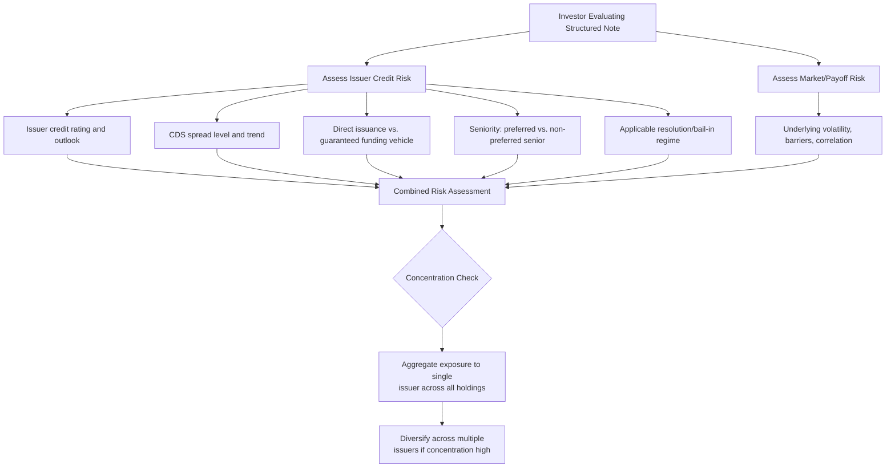

## Issuer Credit Risk in Structured Notes

### Definition and Conceptual Overview

Issuer credit risk in structured notes refers to the risk that the note investor bears the **default or insolvency risk of the issuing entity**, independent of and in addition to the market risk associated with the embedded derivative/underlying reference. Because structured notes are, in almost all standard forms, issued as **senior unsecured debt obligations** of the issuer (or a funding vehicle guaranteed by the issuer), a note's total value depends jointly on (a) the performance of the embedded payoff formula and (b) the issuer's ability to actually pay what is owed.

**Key Points**

- A structured note is **not** a fund, a segregated trust, or a deposit unless specifically structured as such (e.g., an MLCD/structured deposit, covered separately) — it is a **direct, unsecured contractual claim** on the issuer.
- Even a note with "100% principal protection" only protects principal **conditional on the issuer remaining solvent** — the phrase describes the payoff formula's floor, not a guarantee against issuer default.
- This dual-risk nature (market risk + credit risk) is frequently underweighted by retail investors, who may focus primarily on the underlying's performance scenario while overlooking the issuer as a distinct risk factor — a dynamic regulators have specifically targeted through enhanced disclosure requirements (KID risk indicators, credit risk factor sections in prospectuses).

---

### Legal Structure and Ranking

#### Direct Issuance vs. Guaranteed Issuance

- **Direct issuance**: the note is issued directly by the bank/financial institution itself, ranking pari passu with the issuer's other senior unsecured obligations.
- **Guaranteed issuance via funding vehicle**: many structured notes are issued by a special-purpose **funding subsidiary** (sometimes in a favorable jurisdiction for tax/regulatory reasons) with the notes benefiting from an unconditional and irrevocable **guarantee** from the parent bank — in this case, investors bear the credit risk of the guarantor (the parent), with the funding vehicle itself typically holding minimal independent credit substance.

#### Seniority and Ranking Within Capital Structure

- Structured notes are typically **senior unsecured** obligations, ranking above subordinated debt, preference shares, and equity in an insolvency waterfall, but **below secured creditors** and, in many jurisdictions post-financial-crisis reforms, potentially subject to **bail-in** mechanisms (discussed below) that can rank certain senior unsecured liabilities differently based on statutory "preferred" versus "non-preferred" senior debt classifications.

$$\text{Insolvency Waterfall (simplified, typical jurisdiction):} \\
\text{Secured Creditors} > \text{Preferred Senior Debt} > \text{Non-Preferred Senior Debt (often incl. structured notes)} > \text{Subordinated Debt} > \text{Equity}$$

**Key Points**

- Some jurisdictions (notably certain EU member states implementing the Bank Recovery and Resolution Directive, "BRRD") have created a **statutory ranking distinction between "preferred" and "non-preferred" senior debt**, where non-preferred senior debt (often the category structured notes fall into, depending on jurisdiction and issuer election) ranks **below** preferred senior debt but above subordinated debt — this is a jurisdiction- and issuer-specific structural feature that materially affects loss-absorption priority in a resolution scenario. [Unverified: the specific classification of a given structured note as preferred vs. non-preferred senior debt depends on the issuer's jurisdiction, entity structure, and the specific note's terms, and should be confirmed against the applicable offering documentation.]

---

### Bail-In and Resolution Regime Risk

- Following the 2008 financial crisis, many jurisdictions implemented **bank resolution regimes** (e.g., the EU's BRRD/Single Resolution Mechanism, the UK's Banking Act special resolution regime, the US's Orderly Liquidation Authority under Dodd-Frank Title II) empowering resolution authorities to **write down or convert to equity** certain liabilities of a failing bank — including, potentially, senior unsecured structured notes — as part of a "bail-in" designed to recapitalize the institution without taxpayer-funded bailouts.
- This means structured note investors may, in a resolution scenario, face **principal write-down or conversion to equity of the failing institution**, even absent a formal bankruptcy/insolvency proceeding, and even where the note's own payoff formula (based on the underlying's performance) would otherwise have returned full principal.
- Bail-in regimes typically preserve a **hierarchy of loss absorption**, generally bailing in equity and subordinated debt before senior unsecured/non-preferred senior debt, but the exact order, scope, and application to structured notes specifically varies by jurisdiction and requires case-by-case analysis of the applicable resolution framework.

**Key Points**

- Bail-in risk is a **structurally distinct risk layer** from ordinary default/bankruptcy risk — it can be triggered by a regulatory determination that an institution is "failing or likely to fail" even before a formal insolvency event, and its application to a given note depends on the specific jurisdiction, issuing entity, and instrument classification.

---

### Diagram: Issuer Credit Risk Layers (svg_diagram)

<svg xmlns="http://www.w3.org/2000/svg" viewBox="0 0 900 420">
<text x="450" y="25" font-size="16" font-weight="bold" text-anchor="middle">Issuer Credit Risk — Layered Structure (svg_diagram)</text>
<rect x="60" y="55" width="780" height="60" fill="#dbeafe" stroke="#1e3a8a" stroke-width="1.5" />
<text x="450" y="80" font-size="12" text-anchor="middle" font-weight="bold">Note Payoff Formula Performs as Designed</text>
<text x="450" y="98" font-size="9" text-anchor="middle">(underlying performance, barriers, coupons calculated correctly)</text>
<line x1="450" y1="115" x2="450" y2="145" stroke="black" stroke-width="1.5" marker-end="url(#a7)" />
<text x="560" y="135" font-size="9" text-anchor="middle">But payment still depends on...</text>
<rect x="60" y="150" width="780" height="60" fill="#fef3c7" stroke="#92400e" stroke-width="1.5" />
<text x="450" y="175" font-size="12" text-anchor="middle" font-weight="bold">Issuer/Guarantor Solvency at Each Payment Date</text>
<text x="450" y="193" font-size="9" text-anchor="middle">Senior unsecured claim — no segregated assets back the note</text>
<line x1="450" y1="210" x2="450" y2="240" stroke="black" stroke-width="1.5" marker-end="url(#a7)" />
<rect x="60" y="245" width="780" height="60" fill="#fee2e2" stroke="#991b1b" stroke-width="1.5" />
<text x="450" y="270" font-size="12" text-anchor="middle" font-weight="bold">Resolution/Bail-In Regime Applicability</text>
<text x="450" y="288" font-size="9" text-anchor="middle">Potential write-down/conversion even absent formal insolvency</text>
<line x1="450" y1="305" x2="450" y2="335" stroke="black" stroke-width="1.5" marker-end="url(#a7)" />
<rect x="60" y="340" width="780" height="60" fill="#ede9fe" stroke="#5b21b6" stroke-width="1.5" />
<text x="450" y="365" font-size="12" text-anchor="middle" font-weight="bold">Actual Recovery in Default/Resolution Scenario</text>
<text x="450" y="383" font-size="9" text-anchor="middle">Determined by seniority ranking, recovery rate, resolution outcome</text>
</svg>

---

### Diagram: Credit Risk Assessment Framework (Mermaid)

---

### Market-Observable Indicators of Issuer Credit Risk

#### Credit Ratings

- Rating agencies (S&P, Moody's, Fitch) provide issuer-level (and sometimes issue-specific) credit ratings reflecting assessed default probability; investors typically reference the **senior unsecured rating** as most relevant to structured notes, though the specific note's ranking (preferred/non-preferred senior, if applicable) may warrant a distinct rating if issued.
- Ratings are a **lagging, periodically-updated** indicator and can diverge from real-time market-implied credit risk, particularly during rapidly evolving credit events.

#### CDS Spreads (Credit Default Swap)

- The issuer's CDS spread (cost of purchasing default protection) provides a **market-implied, continuously updated** measure of perceived default risk, and is the input the pricing desk uses (via the bond floor discount curve) when structuring and repricing notes, as discussed in the pricing/hedging and secondary market topics.
- A rising CDS spread signals deteriorating market perception of issuer creditworthiness and directly reduces the mark-to-market value of outstanding structured notes issued by that entity (via the wider discount applied to the bond floor component).

#### Credit Spread as a Structuring Input

- As discussed in prior pricing topics, a **wider issuer credit spread mechanically increases the available option budget** at issuance (since the bond floor is discounted more heavily, freeing more proceeds for the embedded derivative), which can result in a riskier issuer offering superficially more attractive headline terms — a critical, non-intuitive linkage investors should understand when comparing notes across issuers.

$$\text{Achievable Terms} \propto f(\text{Issuer Credit Spread}, \text{Rates}, \text{Implied Volatility})$$

**Key Points**

- Comparing headline coupons or participation rates across issuers **without adjusting for issuer credit spread differences** can lead investors to select a note based primarily on the issuer's credit risk premium rather than genuinely superior structuring or market view — a standard analytical pitfall specific to this asset class.

---

### Diversification and Concentration Risk Management

- Because structured notes are unsecured issuer obligations (not principal-segregated instruments comparable to funds), investors accumulating substantial exposure to a single issuer across multiple notes are **concentrating credit risk**, even if each individual note references a different, uncorrelated underlying.
- Prudent portfolio construction for structured note allocations typically involves:
  - **Laddering across multiple issuers** to limit single-name issuer credit concentration
  - **Laddering across maturities** to reduce reinvestment risk concentration at a single point in the credit cycle
  - Monitoring **aggregate issuer exposure** across the full portfolio (including non-structured-note holdings of the same issuer's other debt/equity), not just the structured note allocation in isolation

**Next Steps**

- Request or calculate the **issuer's current CDS spread and credit rating** alongside any structured note proposal, treating it as a distinct due-diligence input separate from the underlying market view.
- Confirm whether the note is **directly issued or guaranteed via a funding vehicle**, and identify the actual credit-risk-bearing entity.
- Determine the note's **specific seniority classification** (senior unsecured, preferred/non-preferred senior, if applicable in the issuer's jurisdiction) and how this ranks within the issuer's broader capital structure.
- Assess whether the issuer is subject to a **bail-in/resolution regime** applicable in its jurisdiction of incorporation, and understand how structured notes are typically treated within that regime's loss-absorption hierarchy.
- Track **aggregate exposure to each issuer** across the full investment portfolio, not merely within a single structured note allocation, to avoid inadvertent concentration.

---

### Comparison: Credit Risk Profile Across Related Product Wrappers

| Wrapper | Issuer Credit Risk Exposure | Insurance/Protection |
| --- | --- | --- |
| Structured Note (senior unsecured) | Full, from first dollar | None |
| Structured Deposit / MLCD | Present above deposit insurance coverage limit | Deposit insurance on principal, up to limit |
| Fund-wrapped structured strategy (e.g., UCITS-compliant) | Reduced (assets typically segregated, subject to counterparty risk on any embedded swap/derivative within the fund) | Regulatory fund investor protections (varies by regime) |
| Exchange-Traded Note (ETN) | Full, similar to structured note (unsecured debt of the issuer) | None (distinct from Exchange-Traded Funds, which hold segregated assets) |

**Key Points**

- Investors sometimes conflate structured notes with **funds or ETFs**, which typically hold segregated underlying assets and carry materially different (often lower) counterparty risk profiles — this distinction is fundamental and a frequent source of investor misunderstanding, particularly given superficially similar marketing terminology (e.g., "linked to," "tracking") used across both product categories.

---

### Common Pitfalls and Misconceptions

- **Treating "principal protected" as "issuer-default-proof"**: principal protection describes the payoff formula's floor under the issuer's continued solvency — it provides no protection against issuer default or bail-in.
- **Comparing coupons across issuers without adjusting for credit spread**: a materially higher coupon from a lower-rated or wider-spread issuer may simply reflect compensation for additional credit risk, not superior structuring value.
- **Assuming exchange listing implies reduced credit risk**: listing status (discussed in the issuance documentation topic) relates to trading/liquidity eligibility, not credit enhancement — a listed note carries the same issuer credit risk as an unlisted equivalent from the same issuer.
- **Overlooking bail-in applicability**: assuming traditional bankruptcy/insolvency is the only credit risk scenario, without considering that certain jurisdictions' resolution regimes can impose losses via regulatory action before a formal insolvency proceeding.
- **Confusing structured notes with fund/ETF wrappers**: assuming segregated-asset protections apply, when in fact structured notes are direct, unsecured contractual claims on the issuing entity's general credit.
- **Under-diversifying issuer exposure**: accumulating structured note positions across many different underlyings but concentrated in a small number of issuers, inadvertently creating significant single-name credit concentration.

---

### Related Topics

- Senior Unsecured vs. Preferred/Non-Preferred Senior Debt Classification
- Bank Recovery and Resolution Directive (BRRD) and Bail-In Mechanics
- CDS Spread as a Structuring and Valuation Input
- Credit Rating Agency Methodology for Financial Institution Issuers
- Funding Vehicle Structures and Parent Guarantee Mechanics
- Structured Notes vs. ETNs vs. ETFs: Credit Risk Comparison
- Issuer Concentration Risk Management in Structured Product Portfolios
- Dodd-Frank Orderly Liquidation Authority (US Resolution Framework)
- PRIIPs KID Credit Risk Indicator Disclosure
- Own-Credit Spread Impact on Structured Note Pricing and Secondary Value