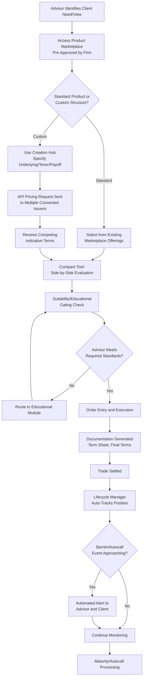

## Automated Structuring Platforms and Technology

### Definition and Conceptual Overview

Automated structuring platforms and technology refer to the software infrastructure — multi-issuer marketplaces, pricing APIs, lifecycle management systems, and increasingly AI-assisted design tools — that digitize the structured product value chain: idea generation, real-time multi-issuer pricing/quoting, order entry, documentation generation, post-trade lifecycle monitoring, and portfolio-level analytics. These platforms have transformed structured note distribution from a manual, relationship-driven, single-issuer process into a competitive, technology-mediated marketplace, particularly in the US retail/private wealth channel.

**Key Points**

- The core value proposition is **disintermediating the manual RFQ (request-for-quote) process** — historically requiring an advisor to individually call or email multiple issuers, wait for indicative terms, and manually track resulting positions across spreadsheets.
- Independent, **issuer-agnostic multi-issuer platforms** (as distinct from single-issuer proprietary portals) are the dominant model in the US wealth management channel, enabling advisors to compare terms across competing issuers for economically similar structures.
- Technology spans the **full product lifecycle**: pre-trade education/suitability, pricing/creation, order execution, and post-trade monitoring (barrier tracking, autocall alerts, maturity processing) — not merely the initial transaction.

---

### Market Landscape: Platform Categories

#### 1. Independent Multi-Issuer Platforms (US Wealth Channel)

The dominant category in US retail/private bank distribution, exemplified by platforms such as Luma Financial Technologies and Halo Investing. These platforms:

- Aggregate multiple issuers' structured note offerings into a single interface, enabling advisors to compare indicative and live pricing across competing banks for similar structures
- Provide a **"Creation Hub"**-style custom structuring tool allowing advisors to specify underlying, tenor, and payoff type, then solicit competitive pricing from connected issuers via API
- Include **lifecycle management modules** that automatically track held positions against barrier levels, autocall observation dates, and maturity events, generating alerts for advisors and end clients

Luma's adaptive API pricing feature allows for a more consistent, transparent and efficient price discovery process for financial professionals around the globe that use Luma's Creation Hub module to customize products that meet the risk profile of individual clients. As one industry executive described the shift: "Automated pricing is the latest feature we are providing financial professionals to simplify the structured product investment process... A cornerstone of structured products, which is especially highlighted in today's volatile market environment, is that they're highly customizable to fit specific investment views." [businesswire](https://www.businesswire.com/news/home/20210928005392/en/Luma-Financial-Technologies-Enhances-Market-Leading-Platform-with-API-Pricing-Feature)[businesswire](https://www.businesswire.com/news/home/20210928005392/en/Luma-Financial-Technologies-Enhances-Market-Leading-Platform-with-API-Pricing-Feature)

Platform-level tracking scale illustrates market penetration: Luma's issuer-agnostic structured product data engine delivers real-time data feeds via secure APIs, with the platform tracking and administering more than $300 billion in structured products globally and supporting the full product lifecycle, including post-trade performance monitoring and analytics. [blackrock](https://www.blackrock.com/aladdin/discover/press-release-aladdin-wealth-adds-luma-structured-product-data-to-platform)

#### 2. Institutional Multi-Dealer RFQ Platforms

For institutional-size tickets, platforms extend the fixed income/derivatives RFQ model to structured products. RFQ-hub operates as a bilateral multi-dealer and broker-neutral platform facilitating requests and trading across listed and OTC vanilla derivatives through to more complex structured products, with roughly two dozen investment banks connected, enabling institutional asset managers, mutual funds, pension funds, hedge funds and wealth managers to source liquidity via requests for quotes and indications of interest. [globaltrading](https://www.globaltrading.net/?p=2668)

Broader multi-asset RFQ infrastructure providers (e.g., Tradeweb) have historically extended their institutional RFQ protocols — originally built for fixed income — into adjacent structured and derivative product distribution, both at the institutional level and, via retail-facing extensions, into structured CD and note distribution for broker-dealers and RIAs.

#### 3. Portfolio Management and Risk Aggregation Integration

A significant recent development is the integration of structured product data directly into mainstream portfolio/risk management systems used by wealth managers. Luma announced a strategic integration with BlackRock's Aladdin Wealth platform, enabling global wealth managers and private banks to benefit from a unified, whole-portfolio view to more effectively forecast, analyze, and evaluate structured exposures within client portfolios. This addresses a long-standing structural gap: structured notes' idiosyncratic, non-fungible nature (unique ISINs, bespoke payoffs) historically made them difficult to model consistently alongside standard asset classes within traditional portfolio management and risk systems. [blackrock](https://www.blackrock.com/aladdin/discover/press-release-aladdin-wealth-adds-luma-structured-product-data-to-platform)

#### 4. Regional Bank-Specific Lifecycle Platforms

Individual issuers/distributors are increasingly white-labeling or partnering with independent platform technology for market-specific lifecycle management. A recent example: Luma and TD Securities partnered to bring automated structured products management and lifecycle analytics to wealth management firms across Canada, with the collaboration centralizing lifecycle tracking, analytics, and performance reporting for both TD-issued and third-party notes. The initial phase is designed to help users move beyond manual tracking with access to analytics, performance reporting, and key product event monitoring centralized into one platform, addressing the immediate need to automate lifecycle management for structured notes, with future enhancements expected to include advanced reporting and analysis, customized educational modules, and enhanced order management leveraging the platform's creation and marketplace capabilities. [Luma and TD Securities Partner to Transform Structured Products Management in Canada +2](https://ffnews.com/news/luma-and-td-securities-partner-to-transform-structured-products-management-in-canada)

**Key Points**

- The shift toward embedding structured product data into general-purpose institutional risk platforms (Aladdin-style integration) reflects growing recognition that structured note exposures need to be assessed **alongside**, not separately from, an investor's broader portfolio (equity beta, duration, credit exposure) — addressing a historical blind spot in holistic risk management.
- Regional/jurisdiction-specific partnerships (e.g., the Canada-focused TD Securities/Luma partnership) indicate continued geographic expansion of platform-based structuring technology beyond its original US retail wealth management base.

---

### Diagram: Automated Structuring Platform Architecture (svg_diagram)

<svg xmlns="http://www.w3.org/2000/svg" viewBox="0 0 950 480">
<text x="475" y="25" font-size="16" font-weight="bold" text-anchor="middle">Automated Structuring Platform — Architecture (svg_diagram)</text>
<rect x="40" y="55" width="200" height="60" fill="#dbeafe" stroke="#1e3a8a" stroke-width="1.5" />
<text x="140" y="78" font-size="11" text-anchor="middle" font-weight="bold">Advisor / Buy-Side User</text>
<text x="140" y="95" font-size="9" text-anchor="middle">Specifies underlying, tenor,</text>
<text x="140" y="107" font-size="9" text-anchor="middle">payoff type via Creation Hub</text>
<line x1="240" y1="85" x2="300" y2="85" stroke="black" stroke-width="1.5" marker-end="url(#a8)" />
<rect x="310" y="55" width="220" height="60" fill="#fef3c7" stroke="#92400e" stroke-width="1.5" />
<text x="420" y="78" font-size="11" text-anchor="middle" font-weight="bold">Multi-Issuer Pricing API</text>
<text x="420" y="95" font-size="9" text-anchor="middle">Simultaneous RFQ to connected</text>
<text x="420" y="107" font-size="9" text-anchor="middle">issuer pricing engines</text>
<line x1="530" y1="85" x2="590" y2="85" stroke="black" stroke-width="1.5" marker-end="url(#a8)" />
<rect x="600" y="30" width="150" height="40" fill="#dcfce7" stroke="#166534" stroke-width="1.5" />
<text x="675" y="54" font-size="9" text-anchor="middle" font-weight="bold">Issuer A Pricing Engine</text>
<rect x="600" y="80" width="150" height="40" fill="#dcfce7" stroke="#166534" stroke-width="1.5" />
<text x="675" y="104" font-size="9" text-anchor="middle" font-weight="bold">Issuer B Pricing Engine</text>
<rect x="600" y="130" width="150" height="40" fill="#dcfce7" stroke="#166534" stroke-width="1.5" />
<text x="675" y="154" font-size="9" text-anchor="middle" font-weight="bold">Issuer C Pricing Engine</text>
<line x1="600" y1="50" x2="530" y2="75" stroke="#888" stroke-width="1" stroke-dasharray="3,3" />
<line x1="600" y1="100" x2="530" y2="90" stroke="#888" stroke-width="1" stroke-dasharray="3,3" />
<line x1="600" y1="150" x2="530" y2="100" stroke="#888" stroke-width="1" stroke-dasharray="3,3" />
<line x1="140" y1="115" x2="140" y2="180" stroke="black" stroke-width="1.5" marker-end="url(#a8)" />
<rect x="40" y="185" width="300" height="55" fill="#fce7f3" stroke="#9d174d" stroke-width="1.5" />
<text x="190" y="207" font-size="11" text-anchor="middle" font-weight="bold">Compare Tool</text>
<text x="190" y="223" font-size="9" text-anchor="middle">Side-by-side competing terms,</text>
<text x="190" y="235" font-size="9" text-anchor="middle">suitability, and compliance checks</text>
<line x1="190" y1="240" x2="190" y2="275" stroke="black" stroke-width="1.5" marker-end="url(#a8)" />
<rect x="40" y="280" width="300" height="55" fill="#ede9fe" stroke="#5b21b6" stroke-width="1.5" />
<text x="190" y="302" font-size="11" text-anchor="middle" font-weight="bold">Order Entry &amp; Execution</text>
<text x="190" y="318" font-size="9" text-anchor="middle">Trade booked, documentation</text>
<text x="190" y="330" font-size="9" text-anchor="middle">generated per issuance workflow</text>
<line x1="190" y1="335" x2="190" y2="370" stroke="black" stroke-width="1.5" marker-end="url(#a8)" />
<rect x="40" y="375" width="300" height="60" fill="#fed7aa" stroke="#c2410c" stroke-width="1.5" />
<text x="190" y="398" font-size="11" text-anchor="middle" font-weight="bold">Lifecycle Manager</text>
<text x="190" y="414" font-size="9" text-anchor="middle">Barrier/autocall monitoring,</text>
<text x="190" y="426" font-size="9" text-anchor="middle">alerts, maturity processing</text>
<line x1="340" y1="405" x2="420" y2="405" stroke="black" stroke-width="1.5" marker-end="url(#a8)" />
<rect x="430" y="375" width="300" height="60" fill="#bfdbfe" stroke="#1e3a8a" stroke-width="1.5" />
<text x="580" y="398" font-size="11" text-anchor="middle" font-weight="bold">Portfolio Risk Integration</text>
<text x="580" y="414" font-size="9" text-anchor="middle">Feed into whole-portfolio</text>
<text x="580" y="426" font-size="9" text-anchor="middle">risk/analytics platforms</text>
</svg>

---

### Diagram: End-to-End Digital Workflow (Mermaid)

---

### Core Platform Functional Modules

#### Education and Compliance Gating

Platforms increasingly enforce **educational barriers**, restricting advisor access to specific product types until required training/certification is completed and tracked within the platform itself — a mechanism designed to support regulatory suitability and complexity-disclosure obligations (see MiFID II product governance and FINRA complex products guidance discussed in the issuance documentation topic) at the point of sale rather than relying solely on after-the-fact supervisory review.

#### Comparison and Pre-Trade Analytics

Comparison tools address a specific historical pain point: advisors no longer need to individually request product pricing or manually track and compare product information through spreadsheets — comparison tools allow advisors to make more informed, data-driven decisions while also increasing compliance and suitability. This typically involves a structured **evaluate → identify → manage** workflow: comparing and evaluating through platform data and analytics, identifying the right structured products for the client, and then managing assets and client portfolios going forward. [lumafintech](https://lumafintech.com/luma-compare-structured-products/)[lumafintech](https://lumafintech.com/luma-compare-structured-products/)

#### Lifecycle and Post-Trade Management

Automated lifecycle tracking replaces manual monitoring of barrier levels, coupon determination dates, and autocall triggers. Products traded through the platform are automatically tracked in a Lifecycle Manager module, where users can quickly access product details, performance reports, term sheets, and analytics; automation allows organizing each product and setting notifications to alert users about upcoming events related to their holdings. Independent platforms position this as directly reducing **operational risk** versus legacy manual tracking approaches: this shift away from fragmented systems allows for real-time performance monitoring and automated event tracking, ensuring that no critical maturity or knock-out dates are missed. [lumafintech](https://lumafintech.com/2020/11/05/how-lumas-technology-drives-structured-product-innovations/)[ffnews](https://ffnews.com/news/luma-and-td-securities-partner-to-transform-structured-products-management-in-canada)

#### Standardized Identifiers and Market Infrastructure Integration

A structural challenge for structured products has historically been the lack of standardized data identifiers comparable to those used for listed securities, complicating aggregation, reporting, and integration with mainstream financial data infrastructure. Industry efforts have specifically targeted this gap by assigning standardized identifiers to structured product vehicles, aiming to bring these instruments into comparable data infrastructure as stocks, ETFs, and mutual funds — directly enabling the kind of whole-portfolio risk integration seen in the Aladdin Wealth partnership described above.

---

### Impact on the Structuring and Distribution Value Chain

**Key Points**

- **Price competition and transparency**: multi-issuer platforms structurally increase pricing competition among issuers for economically similar payoffs, a dynamic historically more established in European/Asian structured product markets before extending into the US: multi-issuer API pricing capabilities for customization of structured products had long been offered to financial professionals in Europe and Asia before becoming more broadly available in the US market. [businesswire](https://www.businesswire.com/news/home/20210928005392/en/Luma-Financial-Technologies-Enhances-Market-Leading-Platform-with-API-Pricing-Feature)
- **Reduced barriers to entry for advisors/investors**: automated platforms have historically been associated with reducing minimum investment thresholds and broadening access beyond traditional high-net-worth-only distribution, as smaller-ticket orders become operationally viable to process and aggregate at scale.
- **Operational efficiency for issuers**: API-based pricing and standardized documentation generation reduce the marginal cost for issuers of quoting and issuing large volumes of small-denomination notes, supporting the broader trend toward more frequent, smaller issuance sizes relative to legacy bespoke institutional-only structuring.
- **Persistent limitations**: [Inference] despite platform aggregation, secondary market liquidity for individual notes remains governed by the issuing dealer's own bid-making willingness (as discussed in the secondary market making topic) — platform technology has primarily transformed the **primary issuance and monitoring** experience rather than fundamentally creating independent secondary market liquidity comparable to exchange-traded instruments.

---

### Emerging Technology Directions

- **AI-assisted structuring and natural-language product design**: [Speculation] increasing exploration across the industry of AI/large-language-model-assisted tools to translate a client's stated market view or risk tolerance directly into candidate structure specifications, though the maturity and specific adoption of such capabilities across platforms varies and should be verified against current platform documentation rather than assumed as a settled, universal feature.
- **Deeper embedded analytics within institutional risk systems**: the Aladdin Wealth integration exemplifies a broader industry direction of structured product data becoming a native input into standard portfolio risk/scenario systems, rather than requiring separate, manually reconciled tracking.
- **Blockchain/distributed-ledger exploration**: some newer entrants have explored blockchain-based infrastructure for structured product issuance and tracking, aiming to improve settlement efficiency and record-keeping transparency, though this remains a smaller, more experimental segment of the broader platform landscape relative to established API/marketplace models. [Unverified: the current commercial maturity and adoption scale of blockchain-based structured product platforms should be confirmed against up-to-date sources given the fast-evolving nature of this specific sub-segment.]

---

### Common Pitfalls and Misconceptions

- **Assuming platform-quoted pricing eliminates the need for independent due diligence**: automated competitive pricing improves price discovery but does not substitute for understanding issuer credit risk, payoff mechanics, and structural features specific to each quoted note.
- **Conflating platform-based comparison with secondary market liquidity**: pre-trade price comparison across issuers at issuance is a distinct capability from post-trade secondary market-making, which remains dealer-specific and is not necessarily enhanced simply because the note was originated through a multi-issuer platform.
- **Underestimating the educational/compliance gating layer**: some platforms restrict product access based on completed training, meaning advisor access to certain structure types may be platform- and firm-policy-dependent rather than universally available.
- **Treating standardized identifiers as full fungibility**: assigning standardized identifiers improves data aggregation and reporting but does not make individual structured notes fungible or exchange-tradeable in the way standardized identifiers do for stocks or ETFs, given each note's bespoke terms.

---

### Related Topics

- Multi-Issuer RFQ Mechanics and Competitive Price Discovery
- FINRA and MiFID II Complexity-Based Distribution Gating
- Structured Product Data Standardization and Identifier Assignment
- Portfolio-Level Risk Aggregation for Structured Note Holdings
- API-Based Pricing Integration Between Platforms and Issuer Desks
- Post-Trade Lifecycle Monitoring and Automated Barrier/Autocall Alerts
- Secondary Market Making Technology vs. Primary Distribution Technology
- AI and Natural-Language Tools in Structured Product Design
- Regional Platform Expansion and Cross-Border Distribution Technology
- Educational Certification Requirements in Structured Product Distribution