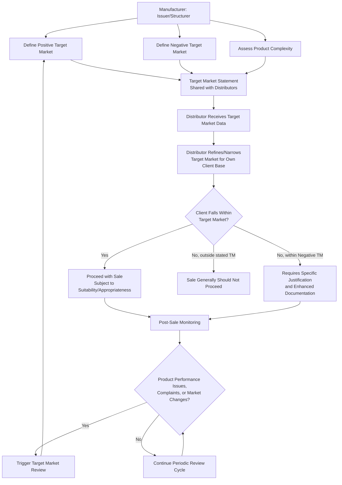

## Target Market and Product Governance

### Definition and Conceptual Overview

Target market and product governance refers to the regulatory framework requiring **manufacturers** (issuers and structurers) and **distributors** of financial instruments — including structured products — to identify, document, and continuously review the category of end investors for whom a product is designed to be appropriate, and to ensure the product is actually distributed consistently with that identified population. The framework is most comprehensively codified under **MiFID II** (EU/UK-derived) product governance rules, though equivalent concepts exist under other regimes (e.g., FINRA suitability and complex product guidance in the US).

**Key Points**

- Product governance shifts responsibility "upstream" — manufacturers must design products with a defined target investor in mind **before** distribution begins, rather than relying solely on point-of-sale suitability checks to catch mismatches after the fact.
- The framework applies distinctly to **manufacturers** (who define the target market) and **distributors** (who must distribute consistently with it, potentially narrowing but not widening the defined target market for their specific client base).
- Product governance is a **continuous, lifecycle obligation** — not a one-time exercise at product launch — requiring periodic review, especially following material product performance events, complaints, or market developments.

---

### The Five (or Six) Target Market Dimensions (MiFID II Framework)

Under ESMA's MiFID II product governance guidelines, manufacturers must assess the target market across defined categories:

#### 1. Client Type

- Retail client, professional client, and/or eligible counterparty — determining the broad regulatory category of investor the product is designed for.

#### 2. Knowledge and Experience

- The level of product knowledge and investment experience required to understand the instrument's key features and risks — e.g., "advanced" for complex autocallable structures, versus "basic" for simple principal-protected notes.

#### 3. Financial Situation, with a Focus on the Ability to Bear Losses

- Whether the target investor can financially absorb the loss scenarios embedded in the product's risk profile, ranging from "no capital loss" (principal-protected structures) to "loss beyond capital" (leveraged or geared structures with potential for losses exceeding initial investment).

#### 4. Risk Tolerance and Compatibility with Risk/Reward Profile

- Alignment between the product's risk/reward profile (as reflected in metrics such as the PRIIPs Summary Risk Indicator) and the target investor's general risk appetite and specific investment objectives.

#### 5. Client Objectives and Needs

- Investment horizon compatible with the product's tenor and liquidity characteristics; specific objectives the product is designed to meet (e.g., income generation, capital growth, hedging).

#### 6. Distribution Strategy (Distributor-Facing Dimension)

- The appropriate distribution channels and methods (e.g., advised sales only, execution-only, discretionary portfolio management) through which the product should reasonably be made available, given its complexity and risk profile.

**Example**

*Target Market Statement — Autocallable Worst-Of Note*

- Client type: Retail (with enhanced disclosure) and Professional
- Knowledge/experience: Advanced — investor must understand autocall mechanics, barrier/knock-in features, worst-of basket risk, and issuer credit risk
- Ability to bear losses: Can bear losses up to 100% of capital (product does not guarantee principal)
- Risk tolerance: Higher risk tolerance; SRI (PRIIPs) typically 4–6 depending on barrier level and underlying volatility
- Objectives: Enhanced income generation with market view that underlying(s) will remain range-bound or moderately positive; NOT suitable for capital preservation objectives
- Investment horizon: Compatible with up to [X]-year tenor, understanding early redemption (autocall) may shorten actual holding period
- Distribution strategy: Advised sales channel only; not suitable for pure execution-only distribution given complexity classification

---

### Diagram: Target Market Definition Process (svg_diagram)

<svg xmlns="http://www.w3.org/2000/svg" viewBox="0 0 900 400">
<text x="450" y="25" font-size="16" font-weight="bold" text-anchor="middle">Target Market Assessment — Manufacturer Process (svg_diagram)</text>
<rect x="60" y="55" width="200" height="55" fill="#dbeafe" stroke="#1e3a8a" stroke-width="1.5" />
<text x="160" y="78" font-size="10" text-anchor="middle" font-weight="bold">Client Type</text>
<text x="160" y="95" font-size="9" text-anchor="middle">Retail/Professional/ECP</text>
<rect x="280" y="55" width="200" height="55" fill="#fef3c7" stroke="#92400e" stroke-width="1.5" />
<text x="380" y="78" font-size="10" text-anchor="middle" font-weight="bold">Knowledge/Experience</text>
<text x="380" y="95" font-size="9" text-anchor="middle">Basic to Advanced</text>
<rect x="500" y="55" width="200" height="55" fill="#dcfce7" stroke="#166534" stroke-width="1.5" />
<text x="600" y="78" font-size="10" text-anchor="middle" font-weight="bold">Ability to Bear Losses</text>
<text x="600" y="95" font-size="9" text-anchor="middle">No loss to loss beyond capital</text>
<rect x="720" y="55" width="140" height="55" fill="#fee2e2" stroke="#991b1b" stroke-width="1.5" />
<text x="790" y="78" font-size="10" text-anchor="middle" font-weight="bold">Risk Tolerance</text>
<text x="790" y="95" font-size="9" text-anchor="middle">SRI alignment</text>
<rect x="160" y="140" width="280" height="55" fill="#ede9fe" stroke="#5b21b6" stroke-width="1.5" />
<text x="300" y="163" font-size="10" text-anchor="middle" font-weight="bold">Client Objectives/Needs</text>
<text x="300" y="180" font-size="9" text-anchor="middle">Income, growth, hedge, horizon</text>
<rect x="460" y="140" width="280" height="55" fill="#fce7f3" stroke="#9d174d" stroke-width="1.5" />
<text x="600" y="163" font-size="10" text-anchor="middle" font-weight="bold">Distribution Strategy</text>
<text x="600" y="180" font-size="9" text-anchor="middle">Advised/execution-only/DPM</text>
<line x1="160" y1="110" x2="450" y2="220" stroke="#888" stroke-width="1" stroke-dasharray="3,3" />
<line x1="380" y1="110" x2="450" y2="220" stroke="#888" stroke-width="1" stroke-dasharray="3,3" />
<line x1="600" y1="110" x2="450" y2="220" stroke="#888" stroke-width="1" stroke-dasharray="3,3" />
<line x1="790" y1="110" x2="450" y2="220" stroke="#888" stroke-width="1" stroke-dasharray="3,3" />
<line x1="300" y1="195" x2="450" y2="220" stroke="#888" stroke-width="1" stroke-dasharray="3,3" />
<line x1="600" y1="195" x2="450" y2="220" stroke="#888" stroke-width="1" stroke-dasharray="3,3" />
<rect x="280" y="225" width="340" height="60" fill="#fed7aa" stroke="#c2410c" stroke-width="1.5" />
<text x="450" y="248" font-size="11" text-anchor="middle" font-weight="bold">Positive Target Market Statement</text>
<text x="450" y="265" font-size="9" text-anchor="middle">Documented, embedded in KID/marketing materials,</text>
<text x="450" y="278" font-size="9" text-anchor="middle">shared with distributors</text>
<line x1="450" y1="285" x2="450" y2="315" stroke="black" stroke-width="1.5" marker-end="url(#a9)" />
<rect x="230" y="320" width="440" height="60" fill="#bfdbfe" stroke="#1e3a8a" stroke-width="1.5" />
<text x="450" y="343" font-size="11" text-anchor="middle" font-weight="bold">Negative Target Market Statement</text>
<text x="450" y="360" font-size="9" text-anchor="middle">Explicitly identifies investor categories for</text>
<text x="450" y="373" font-size="9" text-anchor="middle">whom the product is NOT designed/suitable</text>
</svg>

---

### Positive vs. Negative Target Market

- **Positive target market**: the affirmative description of the investor category the product is designed for (as illustrated in the example above).
- **Negative target market**: an explicit statement identifying investor categories for whom the product is **not** compatible — e.g., "not suitable for investors requiring capital preservation," "not suitable for investors with no experience with derivative-linked instruments," "not suitable for investors requiring guaranteed liquidity before maturity."

**Key Points**

- The negative target market is not merely the logical inverse of the positive statement — it requires **specific, deliberate identification** of likely mismatch scenarios, since regulators have found that vague or purely formulaic negative target market statements provide insufficient practical guidance to distributors.
- Distribution to clients falling within the **negative target market** is not automatically prohibited but requires **specific justification and enhanced documentation** by the distributor, demonstrating why the sale remains in the client's best interest despite falling outside the manufacturer's defined negative parameters.

---

### Diagram: Manufacturer-Distributor Governance Loop (Mermaid)

---

### Manufacturer Obligations in Detail

#### Product Approval Process

- Before a product is marketed or distributed, manufacturers must operate an internal **product approval process** that specifies an identified target market for each product, assesses all relevant risks to that target market, and ensures the intended distribution strategy is consistent with the identified target market.
- This process must be integrated with the broader **product design and pricing process** (discussed in the pricing/hedging topic) — the economic terms and risk profile of the product should be assessed for consistency with the target market at the design stage, not retrofitted afterward.

#### Complexity and Risk Assessment

- Manufacturers must specifically assess whether the product represents a **simple** or **complex** financial instrument for purposes of the appropriateness test applicable to non-advised/execution-only sales, and whether the product's risk/reward profile is genuinely understood by, and consistent with, the interests of the identified target market.
- Structured products with embedded derivatives, barriers, path-dependent features, or multiple underlyings are generally classified as **complex**, triggering enhanced appropriateness testing obligations before execution-only distribution can proceed (as opposed to simpler, non-complex instruments which may qualify for a lighter-touch appropriateness regime).

#### Ongoing Review Obligations

- Manufacturers must **regularly review** products, considering any event that could materially affect the potential risk to the identified target market, at least assessing whether the product remains consistent with the needs of the identified target market and whether the intended distribution strategy remains appropriate.
- Review triggers include: material market volatility events affecting realized product outcomes, patterns of complaints, changes in the underlying's characteristics, and periodic scheduled reviews (typically annual, though frequency should be risk-based).

---

### Distributor Obligations in Detail

- Distributors must obtain the target market information from manufacturers and use it, combined with their own knowledge of their client base, to determine the target market **for products they actually distribute** — distributors may **narrow** but should not **widen** the manufacturer-defined target market without specific justification.
- Distributors must ensure their **distribution strategy** (advised, execution-only, discretionary portfolio management) is consistent with the target market assessment, and must periodically review actual sales patterns against the intended target market to identify potential mismatches.
- Where a distributor identifies a **significant** mismatch between actual sales and intended target market, or receives information suggesting the product no longer meets the needs of the target market, it has an obligation to inform the manufacturer to support the manufacturer's own review process.

**Key Points**

- The manufacturer-distributor relationship in product governance is explicitly **bidirectional**: distributors are not merely passive recipients of manufacturer target market statements but have an active feedback obligation when real-world distribution patterns or client outcomes suggest a misalignment.

---

### Interaction with PRIIPs KID and Complexity Classification

- The target market assessment directly informs, and should be consistent with, the **PRIIPs Key Information Document's** Summary Risk Indicator and recommended holding period disclosures (discussed in the primary issuance documentation topic) — a mismatch between a product's stated SRI/complexity and its defined target market's risk tolerance would itself indicate a governance failure.
- FINRA's approach in the US, while not identically structured to MiFID II's formal target market regime, achieves analogous investor protection objectives through **complex product-specific supervisory and disclosure guidance**, requiring firms to have reasonable-basis and customer-specific suitability determinations tailored to a product's complexity, alongside enhanced training and supervisory procedures for registered representatives distributing complex structured products.

---

### Common Failure Modes and Regulatory Findings

**Key Points**

- **Overly broad target markets**: regulators have specifically flagged target market statements that are so broadly defined (e.g., "suitable for retail investors seeking growth") that they provide little practical filtering value, failing to meaningfully distinguish the product from simpler, lower-risk alternatives.
- **Generic negative target market statements**: boilerplate negative target market language that fails to identify specific, product-relevant investor categories to exclude undermines the framework's intended protective function.
- **Distribution outside the defined target market without justification**: instances where distributors have sold products to clients clearly outside the negative target market (e.g., clients with stated capital preservation objectives purchasing barrier-risk autocallables) without the required enhanced justification documentation.
- **Static target markets not updated for product performance**: failing to trigger a target market review following material adverse product outcomes (e.g., a cluster of autocallable notes breaching barriers during a market stress event) represents a common supervisory finding, since the framework requires this to be a living, responsive process.
- **Insufficient distributor-manufacturer feedback loops**: distributors failing to communicate observed sales pattern mismatches back to manufacturers, breaking the bidirectional obligation central to the framework's design.

---

### Practical Governance Documentation Checklist

**Next Steps**

- Confirm the product's documented **positive and negative target market statements** are specific to the product's actual risk/reward and complexity profile, not generic boilerplate.
- Verify the target market assessment is **cross-referenced and consistent** with the PRIIPs KID's Summary Risk Indicator, recommended holding period, and cost disclosures.
- Confirm the **distribution strategy** specified (advised-only, execution-only eligible, discretionary portfolio management) aligns with the product's complexity classification.
- Establish a documented **review trigger framework** (scheduled periodic review plus event-driven triggers such as complaints, adverse performance, or market stress events).
- Confirm **distributor-level narrowing** (if applicable) is documented, along with any specific justification process for sales falling within a negative target market segment.
- For firms operating across jurisdictions, confirm alignment (or documented, deliberate divergence) between MiFID II-style target market governance and FINRA/other local regime suitability and complex-product supervisory requirements.

---

### Common Pitfalls and Misconceptions

- **Treating target market assessment as a one-time, launch-stage exercise**: the obligation is continuous and lifecycle-based, requiring ongoing review responsive to market and product performance developments.
- **Assuming target market compliance eliminates individual suitability/appropriateness obligations**: target market governance operates **alongside**, not as a substitute for, point-of-sale suitability (advised) or appropriateness (execution-only) assessments for each individual client.
- **Confusing "negative target market" with an absolute prohibition**: sales to clients within a negative target market segment are not automatically barred but require specific, documented justification.
- **Assuming manufacturers and distributors have identical obligations**: the framework explicitly differentiates manufacturer obligations (product design, initial and ongoing target market definition) from distributor obligations (application to specific client base, sales pattern monitoring, feedback to manufacturer).
- **Underestimating cross-border complexity**: firms distributing products across multiple regulatory regimes (e.g., EU/UK MiFID II alongside US FINRA rules) must navigate materially different, though conceptually related, product governance and suitability frameworks rather than assuming a single unified standard applies globally.

---

### Related Topics

- PRIIPs KID Summary Risk Indicator and Recommended Holding Period
- MiFID II Appropriateness Testing for Complex Instruments
- FINRA Complex Products Supervisory and Disclosure Guidance
- Manufacturer vs. Distributor Obligations Under Product Governance Rules
- Point-of-Sale Suitability vs. Upstream Product Governance
- Negative Target Market Documentation and Justification Standards
- Product Review Triggers and Post-Issuance Governance Monitoring
- Cross-Border Distribution and Multi-Regime Suitability Compliance
- Complexity Classification of Structured Products
- Distributor Feedback Obligations and Sales Pattern Monitoring