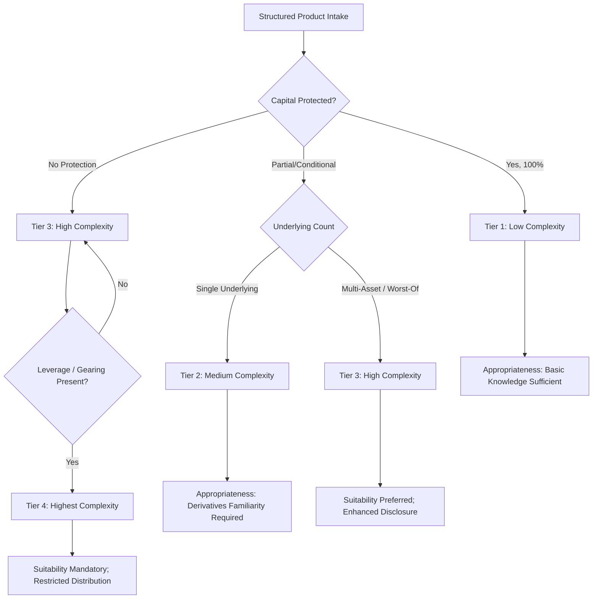
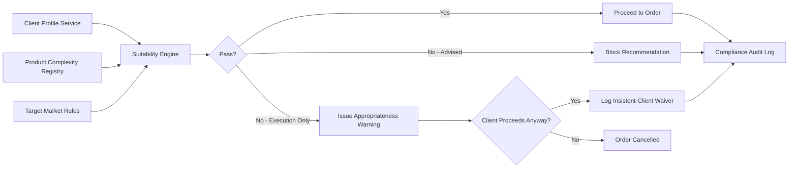

## Suitability and Appropriateness Assessments

### Overview

Suitability and appropriateness assessments are the regulatory and procedural mechanisms by which distributors of structured products evaluate whether a specific product matches a specific client's financial situation, knowledge, objectives, and risk tolerance before execution. These frameworks form the primary investor-protection layer in structured products distribution, distinct from prudential regulation (capital adequacy) or disclosure regulation (documentation), because they operate at the point of sale and are client-specific rather than product-generic.

The two tests — suitability and appropriateness — are related but legally and procedurally distinct, most clearly separated under the EU's MiFID II framework, and echoed with variations under FINRA rules (US), the FCA Conduct of Business Sourcebook (UK), and MAS Notice FAA-N16 (Singapore).

### Suitability vs. Appropriateness: Core Distinction

**Key Points**

- **Suitability** applies when a firm provides investment advice or discretionary portfolio management. It requires the firm to actively recommend that the product is right for the client, based on a positive fit across multiple dimensions.
- **Appropriateness** applies to non-advised (execution-only) sales. It is a narrower, negative test: the firm checks whether the client has sufficient knowledge and experience to understand the risks of the product, without assessing whether the product serves the client's objectives.
- Suitability is the higher bar. A structured product can pass an appropriateness test (client understands leverage, barriers, credit risk) while failing suitability (product doesn't match the client's time horizon or liquidity needs).

$$\text{Suitability} = f(\text{Knowledge}, \text{Experience}, \text{Financial Situation}, \text{Objectives}, \text{Risk Tolerance})$$

$$\text{Appropriateness} = f(\text{Knowledge}, \text{Experience})$$

Appropriateness is a strict subset of suitability's input variables — it omits financial situation and objectives entirely.

### Regulatory Frameworks by Jurisdiction

#### MiFID II (EU/EEA)

Under MiFID II Articles 25(2) and 25(3):

- Structured products are classified as "complex" instruments (per Article 25(4) exemptions), which means they are **never** eligible for the simplified execution-only regime available to non-complex instruments like plain vanilla shares and bonds.
- This means even execution-only sales of structured products require, at minimum, an **appropriateness assessment**.
- If advice or discretionary management is involved, a full **suitability assessment** is mandatory, and a **Suitability Report** must be issued to the client before the transaction (or immediately after, for certain distance transactions, under strict conditions).
- ESMA Guidelines (ESMA35-43-3172) specify that firms must gather information proportionate to the complexity and risk of the product — a leveraged, multi-underlying autocallable requires deeper due diligence than a simple capital-protected note.

#### FINRA (United States)

- FINRA Rule 2111 (Suitability) applies a three-pronged test:
  - **Reasonable-basis suitability**: the firm must understand the product itself (due diligence on the manufacturer's product).
  - **Customer-specific suitability**: the product must fit the individual client's profile.
  - **Quantitative suitability**: for accounts where the firm has control, the pattern of recommendations (e.g., frequency of structured note purchases) must not be excessive or churned.
- FINRA Regulatory Notice 12-03 specifically addresses structured products, flagging concerns around complexity, principal-at-risk features, issuer credit risk, and liquidity constraints (many structured notes have no active secondary market).
- Regulation Best Interest (Reg BI), effective since 2020, layers a broker-dealer "best interest" standard on top of suitability for retail customers, requiring disclosure of conflicts (e.g., embedded commissions in structured note pricing).

#### FCA COBS (United Kingdom)

- COBS 9 governs suitability for advised sales; COBS 10 governs appropriateness for non-advised sales.
- The FCA has issued specific guidance (e.g., thematic reviews on structured product mis-selling, following post-2008 enforcement actions) requiring firms to stress-test whether retail clients understand barrier/knock-in mechanics, autocall triggers, and worst-of basket structures.
- The Consumer Duty (effective July 2023) adds an overarching requirement that products deliver "fair value" and are distributed to a compatible **target market**, reinforcing suitability at both the product-design and point-of-sale stages.

#### MAS Notice FAA-N16 / SFA (Singapore)

- Requires a **Customer Account Review (CAR)** and **Customer Knowledge Assessment (CKA)** before selling Specified Investment Products (SIPs), a category that explicitly includes structured products.
- If a client fails the CKA (insufficient knowledge/experience) and the sale is non-advised, the firm must issue warnings and, in some cases, refuse the transaction or require a "trade acknowledgment" waiver — though regulatory scrutiny of blanket waivers has increased.

### Client Categorization: The Gating Mechanism

Before any suitability/appropriateness test occurs, the client must be categorized, since the depth of assessment required depends entirely on the classification:

| Category | Typical Definition | Assessment Burden |
| --- | --- | --- |
| Retail Client | Individuals, most default classification | Full suitability/appropriateness required; highest disclosure |
| Professional Client (elective) | Meets quantitative thresholds (portfolio size, transaction frequency, professional experience) | Reduced assessment; firm can rely on presumed knowledge |
| Eligible Counterparty | Regulated financial institutions, large corporates, governments | Suitability/appropriateness rules largely disapplied |

**Key Points**

- Elective professional status (opting up) requires the client to pass a quantitative test (e.g., under MiFID II: portfolio > €500,000, 10+ trades of significant size per quarter over the last year, or relevant professional experience) **and** an explicit written waiver acknowledging loss of retail protections.
- Misclassification is a recurring enforcement theme — regulators have penalized firms for opting clients up to professional status primarily to avoid suitability obligations without genuine evidence of sophistication.

### Assessment Dimensions in Practice

#### 1. Knowledge and Experience

- Product-type-specific: experience with equities does not imply experience with autocallables or variance swaps.
- Typically captured via questionnaires scoring familiarity with: derivatives generally, leverage, barrier/knock-in features, capital-at-risk structures, and credit-linked instruments.
- Structured products are frequently subdivided by complexity tier (e.g., "capital protected," "capital at risk — conditional," "capital at risk — leveraged/geared") with escalating knowledge thresholds.

#### 2. Financial Situation

- Source and level of regular income, assets, liabilities, and — critically for structured products — **liquidity needs**, since most structured notes are illiquid or have punitive early-redemption terms.
- Concentration risk: firms assess what proportion of the client's investable assets the structured product would represent.

#### 3. Investment Objectives

- Time horizon (structured products have fixed maturities, often 1–7 years).
- Risk tolerance, expressed both qualitatively (client self-report) and reconciled against quantitative risk indicators (e.g., the EU PRIIPs Summary Risk Indicator, 1–7 scale).
- Purpose (capital preservation vs. yield enhancement vs. directional/leveraged speculation) — a mismatch here is the most common suitability failure point, e.g., selling a leveraged autocallable to a client whose stated objective is capital preservation.

### Product Complexity Mapping

A practical suitability workflow maps product features to required client sophistication tiers:

### Documentation and Audit Trail Requirements

**Key Points**

- **Suitability Report**: required pre-trade for advised sales under MiFID II, documenting how the recommendation matches the client's profile, including explicit rationale for why the product's risk/return/complexity fits stated objectives.
- **Appropriateness Warning**: where a non-advised client fails the appropriateness test but insists on proceeding, the firm must issue a standardized warning and log the client's decision to proceed against advice — this record is a key evidentiary artifact in later disputes or regulatory examinations.
- Records must typically be retained for 5–7 years depending on jurisdiction (MiFID II: 5 years minimum, extendable to 7 by national regulators).
- Target Market Assessment (a manufacturer-side obligation under MiFID II Product Governance rules, RTS complementing Articles 16(3) and 24(2)) must be reconciled against the actual client at point of sale — a "negative target market" designation (e.g., "not for clients seeking capital protection") should trigger an automated block or escalation in the distribution system.

### Common Failure Modes (Historical Enforcement Themes)

- **Complexity-blindness**: treating all "structured products" as one suitability bucket rather than tiering by embedded derivative complexity (e.g., a simple reverse convertible vs. a multi-asset worst-of autocallable with FX quanto features).
- **Static questionnaires**: using outdated risk profiles that don't reflect changed client circumstances (e.g., approaching retirement, reduced income).
- **Target market mismatch**: distributing manufacturer-defined "positive target market" products without verifying the specific client falls within it, especially in execution-only/online channels.
- **Inducement-driven bias**: embedded commissions or structuring fees creating an incentive to recommend higher-margin (often higher-complexity) products — a core Reg BI and MiFID II inducements-rule concern.
- **Waiver overuse**: routinely obtaining "insistent client" waivers to bypass negative suitability findings, which regulators increasingly treat as a red flag rather than a safe harbor.

### System/Architecture Considerations for Distribution Platforms

[Inference] For a distribution platform implementing these checks programmatically, a typical architecture separates concerns as follows:

- The **Product Complexity Registry** should be versioned per-product, since a product's complexity tier can be revisited (e.g., following regulatory reclassification or a PRIIPs KID risk indicator update).
- The **Suitability Engine** should be auditable and explainable — regulators increasingly expect firms to demonstrate not just the pass/fail outcome but the specific factors driving it, which argues against black-box scoring models for this particular control.
- [Unverified] Firms operating cross-border distribution (e.g., passporting under MiFID II) typically need jurisdiction-aware rule sets, since thresholds for professional-client opt-up and specific disclosure wording differ by member state despite the harmonizing directive.

### Worked Example

A retail client with a stated objective of "capital preservation," a 2-year time horizon, and no prior derivatives experience is offered a 3-year autocallable note on a worst-of basket of three technology stocks, offering an 8% p.a. conditional coupon but with capital at risk below a 60% barrier at maturity.

**Suitability assessment outcome**: Fails on multiple dimensions —

- Time horizon mismatch (3-year product vs. 2-year need)
- Objective mismatch (capital preservation vs. capital-at-risk product)
- Knowledge gap (no derivatives experience vs. Tier 3/4 complexity product)

A compliant advised-sale workflow would block this recommendation. In an execution-only channel, the appropriateness test alone (knowledge/experience only) would likely also fail, given the client's lack of derivatives experience, triggering a mandatory warning before any waiver-based override could be considered.

**Next Steps**

- PRIIPs KID and Summary Risk Indicator methodology
- MiFID II Product Governance and Target Market Determination
- FINRA Regulatory Notice 12-03 deep dive on structured note distribution
- Reg BI conflict-of-interest disclosure requirements
- Post-sale suitability monitoring and periodic re-assessment obligations
- Cross-border distribution and passporting complexities under MiFID II
- Insistent-client waiver documentation standards and regulatory scrutiny trends