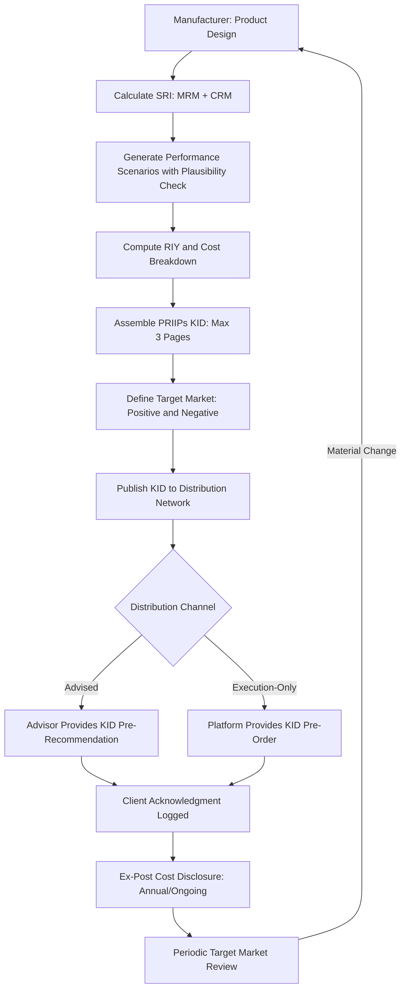

## Key Information Documents and Disclosure Rules

### Overview

Key Information Documents (KIDs) and their associated disclosure regimes are the standardized, pre-contractual disclosure layer for structured products, designed to give retail investors comparable, comprehensible information before purchase. Unlike suitability/appropriateness assessments (which are client-specific, point-of-sale controls), disclosure rules are product-specific and apply regardless of distribution channel — they must exist and be provided even in a fully execution-only, non-advised sale.

The dominant global template is the EU's **PRIIPs KID** (Packaged Retail and Insurance-based Investment Products), but comparable regimes exist under UK onshored rules (post-Brexit divergence), US prospectus/disclosure requirements, and various APAC frameworks.

### PRIIPs Regulation (EU) — Core Framework

**Key Points**

- Governed by Regulation (EU) No 1286/2014 (PRIIPs Regulation), with technical detail specified in Commission Delegated Regulation (EU) 2017/653 (RTS), substantially revised by Commission Delegated Regulation (EU) 2021/2268, applicable from January 1, 2023.
- Applies to any "packaged" retail investment product where the amount repayable is subject to fluctuations because of exposure to reference values (structured products fall squarely within scope) or where the product is insurance-based.
- The KID must be provided to retail investors **in good time before** they are bound by a contract — for structured products, this typically means before subscription during the initial offer period, or before execution for secondary-market/execution-only trades.
- Maximum length: 3 sides of A4 paper when printed, designed to force concise, standardized presentation rather than exhaustive legal disclosure.

### KID Structure — Mandatory Sections

The PRIIPs KID follows a fixed template with limited room for manufacturer customization:

| Section | Content |
| --- | --- |
| What is this product? | Type, objectives, underlying(s), term/maturity, manufacturer identity |
| What are the risks and what could I get in return? | Summary Risk Indicator (SRI), performance scenarios, maximum loss statement |
| What happens if [manufacturer] is unable to pay out? | Issuer credit risk disclosure, deposit guarantee scheme applicability (usually none for structured notes) |
| What are the costs? | Reduction in Yield (RIY), cost composition breakdown, entry/exit/ongoing costs |
| How long should I hold it and can I cash in early? | Recommended holding period, early exit consequences, liquidity constraints |
| How can I complain? | Complaints handling process and contact routing |
| Other relevant information | Cross-references to prospectus, additional documentation |

### Summary Risk Indicator (SRI)

**Key Points**

- A single integer from **1 (lowest risk) to 7 (highest risk)**, combining two sub-components:
  - **Market Risk Measure (MRM)**: derived from Value-at-Risk (VaR) methodology, classified into MRM classes 1–5.
  - **Credit Risk Measure (CRM)**: based on the manufacturer/issuer's credit quality (rating-based or, absent a rating, a conservative default), classified into CRM classes 1–6.
- The combination methodology maps the MRM/CRM pair to a final 1–7 SRI via a prescribed lookup matrix in the RTS.
- For structured products with capital-at-risk features (autocallables, reverse convertibles, worst-of baskets), the SRI frequently lands in the 4–6 range, correlating strongly with the complexity tiers referenced in suitability assessments.

$$\text{SRI} = g(\text{MRM}, \text{CRM}), \quad \text{MRM} \in \{1,...,5\}, \quad \text{CRM} \in \{1,...,6\}$$

### Performance Scenarios

Post-2023 RTS revision (Delegated Regulation 2021/2268) fundamentally changed this section following widespread criticism that pre-2023 "favourable/moderate/unfavourable" scenarios (based purely on historical VaR-style backward-looking simulations) produced misleadingly optimistic figures, especially for structured products with capped upside.

- **Pre-2023 methodology**: four scenarios (favourable, moderate, unfavourable, stress) generated via historical simulation, criticized for showing implausibly high "favourable" returns on capped-upside autocallables.
- **Post-2023 methodology**: retains the four scenarios but requires manufacturers to apply **plausibility checks** against the product's actual payoff structure (e.g., a capped note cannot show a favourable-scenario return exceeding its cap), and mandates additional narrative warnings where scenario methodology may not adequately reflect payoff asymmetries.
- [Unverified] Industry practice on implementing these plausibility overlays varies by manufacturer, and supervisory convergence on methodology consistency remains an active ESMA/national regulator focus area.

### Costs Disclosure — Reduction in Yield (RIY)

**Key Points**

- Costs must be expressed both as a monetary amount and as an annualized **Reduction in Yield (RIY)** — the percentage-point reduction in expected return caused by the total cost load, benchmarked against a hypothetical zero-cost scenario.
- Cost categories broken out: one-off costs (entry/exit), ongoing costs, transaction costs (embedded in the derivative structuring), and incidental costs (e.g., performance fees, though rare in vanilla structured notes).
- For structured products specifically, embedded structuring costs are often opaque to the end investor because they are baked into the initial issue price via the pricing of the embedded derivative component — the RIY calculation is intended to surface this even when a standalone "commission" is not separately itemized.

### Comparison: PRIIPs KID vs. UCITS KIID vs. US Prospectus Disclosure

| Dimension | PRIIPs KID | UCITS KIID | US Prospectus (Reg S-K / 1933 Act) |
| --- | --- | --- | --- |
| Scope | Packaged retail products incl. structured products | UCITS funds only | Registered securities incl. structured notes |
| Length | Max 3 pages | Max 2 pages | No strict page cap; often 50+ pages |
| Risk metric | 1–7 SRI (MRM + CRM) | 1–7 SRRI (volatility-only, being phased into PRIIPs SRI) | Narrative risk factors, no standardized scale |
| Cost metric | RIY (annualized) | Total Expense Ratio (TER) | Fee table, itemized |
| Legal status | Standalone, legally binding pre-contractual document | Standalone, legally binding | Integrated into registration statement |

[Inference] UCITS funds are transitioning from the KIID to the PRIIPs KID format under extended PRIIPs scope, with implementation timelines subject to periodic regulatory extension — firms tracking this convergence should verify current applicability dates rather than relying on any single fixed date, since the transition deadline has been pushed back multiple times since the original 2019 target.

### UK Post-Brexit Divergence

- The UK onshored the PRIIPs Regulation into domestic law (UK PRIIPs) post-Brexit, but has since pursued divergent reform.
- The FCA has consulted on replacing UK PRIIPs KIDs with a new **Consumer Composite Investments (CCI)** disclosure regime, intended to address criticisms of the SRI/performance-scenario methodology (particularly the same capped-upside distortion issues flagged in the EU) while giving the FCA more flexibility outside the EU's centralized RTS process.
- [Unverified] The precise implementation timeline and final CCI technical standards should be verified against current FCA publications, as this reform has been under active consultation and firms should not assume static requirements here — check the FCA's latest CCI policy statements for the current status before treating any specific effective date as settled.

### Distribution-Side Obligations Beyond the KID

**Key Points**

- **Target Market Assessment**: manufacturers must define a positive and negative target market (MiFID II Product Governance, complementing but distinct from the PRIIPs KID itself); distributors must check client fit against this target market at point of sale.
- **Ex-post cost and charges disclosure**: MiFID II Article 24(4) requires firms to disclose realized (not just projected) costs to clients on an ongoing/annual basis, distinct from the pre-contractual KID costs section.
- **Product governance record-keeping**: manufacturers must periodically review whether the product continues to meet its target market's needs, particularly relevant for structured products with long tenors where market conditions may diverge materially from issuance assumptions.
- **Complaints and redress disclosure**: the KID's "How can I complain?" section must route to a functioning complaints process, often cross-referenced to national Financial Ombudsman-equivalent schemes.

### Disclosure Workflow (Manufacturer to Distributor to Client)

### SRI Visual Reference (svg_diagram)

<svg xmlns="http://www.w3.org/2000/svg" viewBox="0 0 720 200">
<text x="360" y="24" text-anchor="middle" font-size="16" font-weight="bold" font-family="sans-serif">Summary Risk Indicator Scale (svg_diagram)</text>
<g font-family="sans-serif" font-size="13">
<rect x="40" y="60" width="80" height="50" fill="#2e7d32" />
<rect x="120" y="60" width="80" height="50" fill="#66bb6a" />
<rect x="200" y="60" width="80" height="50" fill="#c0ca33" />
<rect x="280" y="60" width="80" height="50" fill="#fdd835" />
<rect x="360" y="60" width="80" height="50" fill="#fb8c00" />
<rect x="440" y="60" width="80" height="50" fill="#f4511e" />
<rect x="520" y="60" width="80" height="50" fill="#c62828" />
<text x="80" y="90" text-anchor="middle" fill="white" font-weight="bold">1</text>
<text x="160" y="90" text-anchor="middle" fill="white" font-weight="bold">2</text>
<text x="240" y="90" text-anchor="middle" fill="white" font-weight="bold">3</text>
<text x="320" y="90" text-anchor="middle" fill="white" font-weight="bold">4</text>
<text x="400" y="90" text-anchor="middle" fill="white" font-weight="bold">5</text>
<text x="480" y="90" text-anchor="middle" fill="white" font-weight="bold">6</text>
<text x="560" y="90" text-anchor="middle" fill="white" font-weight="bold">7</text>
<text x="80" y="130" text-anchor="middle">Capital</text>
<text x="80" y="145" text-anchor="middle">Protected</text>
<text x="320" y="130" text-anchor="middle">Autocallable /</text>
<text x="320" y="145" text-anchor="middle">Reverse Conv.</text>
<text x="560" y="130" text-anchor="middle">Leveraged /</text>
<text x="560" y="145" text-anchor="middle">Geared</text>
<text x="40" y="180" font-size="12" fill="#555">Lower Risk</text>
<text x="560" y="180" font-size="12" fill="#555">Higher Risk</text>
</g>
</svg>

### Common Implementation Failure Modes

- **Stale KIDs**: failing to regenerate the KID when underlying market data shifts materially (e.g., volatility spikes affecting VaR-based MRM), especially for continuously-offered ("open") structured product programs rather than single-issuance notes.
- **Scenario gaming**: pre-2023 practice of selecting favourable historical lookback windows to inflate the "favourable" scenario — largely addressed by the 2023 plausibility-check reform but a known historical enforcement theme.
- **Cost opacity**: itemizing only explicit fees while embedded derivative structuring margin remains invisible outside the aggregate RIY figure, which can obscure cost comparison across manufacturers even when the RIY is technically compliant.
- **Target market drift**: distributing a product to a broader client base than the original target market as demand grows, without re-validating fit — a distinct but related failure to the SRI/KID accuracy issues above, and a frequent supervisory examination focus.
- **Language/format non-localization**: distributing a KID in a language the target retail market cannot reasonably be expected to understand, breaching the "comprehensible" standard central to PRIIPs' purpose.

### Worked Example

A 3-year autocallable note on a single equity index, with a 105% autocall trigger, 70% capital-at-risk barrier, and 7% p.a. conditional coupon, is issued by a bank with an A- credit rating.

- **MRM**: likely class 3–4 given moderate index volatility and the conditional (not guaranteed) capital protection.
- **CRM**: A- rating typically maps to CRM class 2–3 under the standard RTS mapping table.
- **Combined SRI**: likely lands at 4, reflecting "medium" risk on the 1–7 scale — [Inference] the exact figure depends on the specific MRM/CRM combination table cell and the manufacturer's VaR calculation inputs, so this should be treated as illustrative rather than a guaranteed output.
- **Performance scenarios**: post-2023 rules require the "favourable" scenario to respect the 7% coupon cap structurally — it cannot show unlimited upside participation, since the payoff is capped by design.
- **RIY**: would capture the bid-offer spread embedded in issuance plus any ongoing platform/custody fees, expressed as an annualized drag on the stated coupon.

**Next Steps**

- PRIIPs SRI calculation methodology: MRM/CRM lookup tables in detail
- 2023 Delegated Regulation performance-scenario plausibility checks
- UK CCI regime development and FCA consultation outcomes
- Ex-post cost disclosure under MiFID II Article 24(4)
- Target Market Assessment and Product Governance (MiFID II)
- Cross-border KID translation and localization obligations
- US structured note prospectus disclosure vs. PRIIPs KID comparison