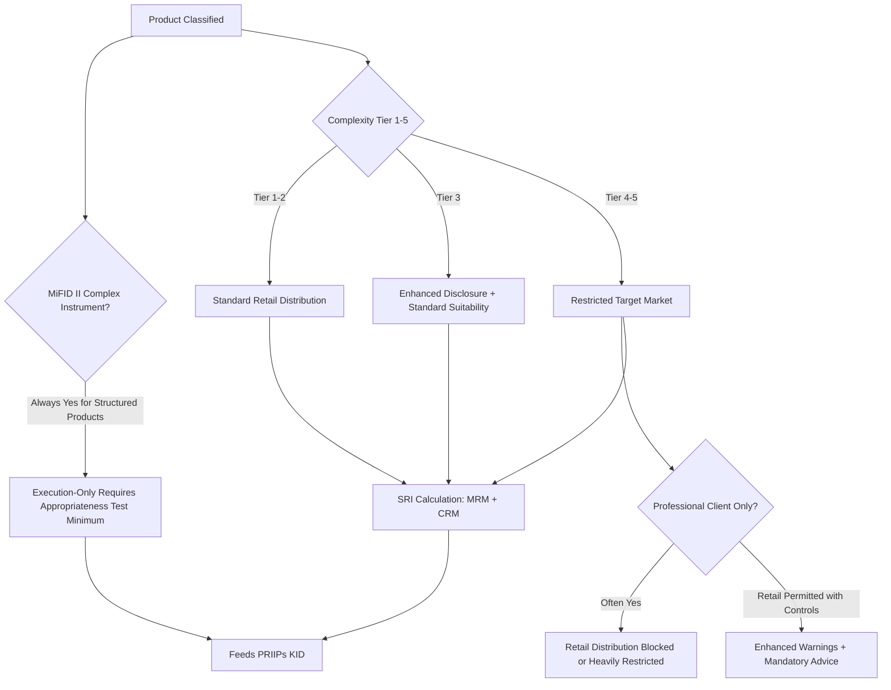

## Complexity and Risk Rating of Structured Products


### Overview

Complexity and risk rating frameworks classify structured products along multiple axes — payoff mechanics, underlying structure, market risk, credit risk, and liquidity — to drive downstream regulatory obligations: which clients may access a product, what disclosure depth is required, and whether advised or execution-only distribution is permissible. Unlike a single credit rating, structured product classification is inherently multi-dimensional because "risk" for a structured note comprises several largely independent components that a single scalar score cannot fully capture, which is why most regulatory frameworks decompose it rather than relying on one number.

This item connects directly to the two preceding topics: complexity tiering feeds the suitability/appropriateness threshold (higher complexity → higher client sophistication required), and risk rating feeds the KID's Summary Risk Indicator (SRI) computation.

### Dimensions of Complexity

**Key Points**

- **Payoff complexity**: number and type of embedded derivative components. A simple capital-protected note (zero-coupon bond + long call) is low complexity; a worst-of autocallable with memory coupons and digital barriers stacks multiple path-dependent features.
- **Underlying complexity**: single-asset vs. basket, and within baskets, correlation-sensitive structures (worst-of, best-of, rainbow) are materially more complex than simple averaging baskets because their payoff depends on cross-asset correlation, not just individual asset behavior.
- **Path dependency**: European (maturity-only observation) vs. American/Bermudan-style barriers (continuous or discrete observation throughout the life), autocall observation dates, and memory-coupon mechanics (where missed coupons can be "caught up" on a later observation) all add layers of conditional logic a retail investor must understand.
- **Leverage/gearing**: participation rates above 100%, or inverse/geared payoffs, amplify both complexity and market risk simultaneously.
- **Currency structure**: quanto features (fixing FX risk at a predetermined rate) vs. unhedged cross-currency exposure add a further complexity layer often underappreciated by retail investors.

### Regulatory Complexity Classification Frameworks

#### MiFID II Complex vs. Non-Complex Instruments

Article 25(4) MiFID II defines which instruments qualify for the simplified execution-only regime (non-complex). Structured products are essentially **always classified as complex** because they fail the non-complex tests, which generally require:

- No embedded derivative or structure that could make the cost or return difficult for the client to understand.
- Sufficiently frequent liquidity and publicly available pricing.
- No feature that could result in the investor incurring liabilities beyond the acquisition cost.

Since structured notes embed derivatives by construction, they are categorically excluded from execution-only treatment without at least an appropriateness test — this is the direct regulatory link from complexity classification to the previous suitability/appropriateness topic.

#### PRIIPs Manufacturer Complexity Indicators

While PRIIPs does not use a standalone "complexity score" distinct from the SRI, ESMA and national regulators (e.g., the French AMF, the UK FCA in pre-Brexit joint guidance) have issued **complexity indicators** or "complexity gradings" used in some jurisdictions to flag products requiring enhanced warnings, particularly:

- AMF's historical "complexity index" for structured products marketed to French retail clients, grading products based on the number of scenarios and the difficulty of predicting the maximum loss.
- Products graded "high complexity" under such frameworks often trigger mandatory investor warnings distinct from (and in addition to) the standard KID.

### Structured Product Complexity Taxonomy

A commonly used practitioner taxonomy tiers structured products roughly as follows:

| Tier | Category | Example Structures | Typical Complexity Drivers |
| --- | --- | --- | --- |
| 1 | Capital Protected | Zero-coupon + call, participation notes | Single underlying, no barrier, principal protected at maturity |
| 2 | Capital Protected — Conditional | Notes with issuer call features, digital coupons | Single underlying, simple conditional payoff |
| 3 | Yield Enhancement — Capital at Risk | Reverse convertibles, single-underlying autocallables | Barrier mechanics, capital at risk below barrier |
| 4 | Yield Enhancement — Multi-Asset | Worst-of autocallables, basket reverse convertibles | Correlation risk, path dependency, memory coupons |
| 5 | Leveraged / Exotic | Geared worst-of notes, rainbow options, cliquet structures | Leverage, multiple exotic features stacked, quanto/FX layers |

[Inference] This tiering broadly mirrors — but is not identical to — the SRI bands discussed under the KID topic; a Tier 4–5 product will typically, though not always, carry a higher SRI, since SRI also depends heavily on issuer credit quality (CRM), which is independent of payoff complexity.

### Market Risk Rating Components

**Key Points**

- **Volatility of underlying(s)**: higher implied/historical volatility increases both the probability of barrier breach and the width of potential outcomes.
- **Correlation risk** (multi-asset products): for worst-of structures, *lower* correlation between underlyings paradoxically *increases* risk to the investor, since the worst performer drives the payoff and diversification benefits the issuer's hedge, not the investor's outcome. This is a frequently misunderstood point in retail communications.
- **Barrier proximity and type**: European (observed only at maturity) barriers are generally less risky than American (continuously observed) barriers of the same nominal level, because continuous observation increases the probability of breach even if the underlying recovers by maturity.
- **Time to maturity / observation frequency**: longer tenors and more frequent autocall observation dates change the risk/return profile in ways that are not always intuitive to non-specialist investors (more observation dates can either increase early-redemption probability, reducing time-in-market risk, or extend worst-case exposure, depending on structure).

### Credit Risk Component

**Key Points**

- Structured notes are typically **unsecured, unsubordinated obligations** of the issuing entity — the investor bears full issuer credit risk in addition to market risk on the underlying. This is structurally distinct from, e.g., a fund investing directly in the referenced assets, where the fund's assets are segregated from the manager's balance sheet.
- Under PRIIPs, this maps to the **CRM (Credit Risk Measure)** component of the SRI, and the KID's dedicated "What happens if [manufacturer] is unable to pay out?" section.
- [Unverified] Whether a structured note is *bail-inable* under bank resolution regimes (e.g., EU BRRD, UK Banking Act special resolution regime) affects worst-case investor outcomes upon issuer failure, and this treatment can vary by note seniority and jurisdiction — this should be verified against the specific issuer's resolution regime and the note's legal ranking rather than assumed uniform across products.

### Liquidity Risk Rating

**Key Points**

- Most structured notes have **no active secondary market**; liquidity, where it exists, is typically provided at the issuer's or arranger's discretion via an indicative bid, not a guaranteed exit price.
- Early redemption (if contractually available) often carries penalty pricing reflecting unwind costs of the embedded derivative hedge, meaning quoted "early exit value" can be materially below both the issue price and the theoretical fair value.
- This feeds directly into the KID's "How long should I hold it and can I cash in early?" section and is a recurring theme in suitability failures where a client's actual liquidity needs (established during the suitability assessment) don't match the product's illiquid profile.

### Composite Risk Rating Construction (Illustrative Methodology)

A practitioner-level composite rating (distinct from, but informing, the regulatory SRI) might combine dimensions as follows:

$$\text{Composite Risk Score} = w_1 \cdot \text{MarketRisk} + w_2 \cdot \text{CreditRisk} + w_3 \cdot \text{LiquidityRisk} + w_4 \cdot \text{ComplexityScore}$$

Where weights $w_1, w_2, w_3, w_4$ are calibrated by the manufacturer's risk committee and $\sum w_i = 1$. [Inference] There is no single universally mandated weighting scheme across jurisdictions for this composite view (unlike the SRI's prescribed MRM/CRM lookup matrix); firms often develop internal proprietary composite scores for product governance purposes that sit alongside, rather than replace, the regulatory SRI.

### Complexity-to-Distribution-Control Mapping



### Complexity Dimensions Visual (svg_diagram)

<svg xmlns="http://www.w3.org/2000/svg" viewBox="0 0 700 320">
<text x="350" y="24" text-anchor="middle" font-size="16" font-weight="bold" font-family="sans-serif">Structured Product Risk Dimensions (svg_diagram)</text>
<g font-family="sans-serif" font-size="13">
<circle cx="350" cy="170" r="90" fill="none" stroke="#333" stroke-width="1.5" />
<text x="350" y="175" text-anchor="middle" font-weight="bold">Structured Product</text>



```
<line x1="350" y1="170" x2="200" y2="70" stroke="#1565c0" stroke-width="2" />
<rect x="120" y="45" width="140" height="45" fill="#e3f2fd" stroke="#1565c0" />
<text x="190" y="65" text-anchor="middle">Market Risk</text>
<text x="190" y="80" text-anchor="middle" font-size="11">Vol, Correlation, Barrier</text>

<line x1="350" y1="170" x2="530" y2="70" stroke="#c62828" stroke-width="2" />
<rect x="450" y="45" width="140" height="45" fill="#ffebee" stroke="#c62828" />
<text x="520" y="65" text-anchor="middle">Credit Risk</text>
<text x="520" y="80" text-anchor="middle" font-size="11">Issuer, Seniority</text>

<line x1="350" y1="170" x2="200" y2="270" stroke="#2e7d32" stroke-width="2" />
<rect x="120" y="250" width="140" height="45" fill="#e8f5e9" stroke="#2e7d32" />
<text x="190" y="270" text-anchor="middle">Liquidity Risk</text>
<text x="190" y="285" text-anchor="middle" font-size="11">Secondary Market</text>

<line x1="350" y1="170" x2="530" y2="270" stroke="#f57f17" stroke-width="2" />
<rect x="450" y="250" width="140" height="45" fill="#fffde7" stroke="#f57f17" />
<text x="520" y="270" text-anchor="middle">Payoff Complexity</text>
<text x="520" y="285" text-anchor="middle" font-size="11">Path Dependency</text>
```

</g>
</svg>

### Common Failure Modes

- **Conflating credit rating with product risk rating**: assuming a high issuer credit rating (low CRM) offsets high market-risk complexity (high MRM) in investor communications, when the two are independent and both matter for worst-case outcomes.
- **Underweighting correlation risk in worst-of structures**: marketing "diversified" multi-asset baskets without clarifying that low correlation *increases* worst-of downside risk.
- **Ignoring observation-frequency effects**: treating a daily-observed American barrier as equivalent in risk to a European (maturity-only) barrier at the same nominal level.
- **Static complexity classification**: failing to reclassify a product if its embedded risk profile changes materially post-issuance (e.g., following an underlying's volatility regime shift or an issuer credit downgrade) — particularly relevant for ongoing product governance reviews.
- **Retail distribution of Tier 4–5 products via mass-market execution-only channels** without adequate gating, a recurring theme in post-2008 and post-COVID volatility enforcement actions across multiple jurisdictions.

### Worked Example

Compare two structured notes, both issued by the same A-rated bank with identical 3-year tenor:

**Note A**: Single-underlying (broad equity index) capital-protected note, 100% capital protection, 80% participation in upside.

- Complexity Tier: 1
- Market Risk: Low (no barrier, no capital at risk)
- Credit Risk: Moderate (same issuer, unmitigated by structure)
- Liquidity Risk: Moderate (illiquid but principal is protected at maturity regardless of early market moves)
- Likely SRI: 2–3

**Note B**: Worst-of autocallable on three single-name tech stocks, 60% barrier, 9% p.a. memory coupon, no capital protection.

- Complexity Tier: 4
- Market Risk: High (correlation risk, barrier breach risk, single-name concentration)
- Credit Risk: Moderate (same issuer as Note A — this component is identical)
- Liquidity Risk: High (single-name volatility widens secondary bid-offer spreads further than an index-linked note)
- Likely SRI: 5–6

Both notes share identical issuer credit risk, illustrating that the SRI divergence is driven almost entirely by the market-risk and complexity dimensions, not the credit component — a useful diagnostic when explaining SRI differences to clients or internal stakeholders.

**Related Topics**

- SRI methodology and MRM/CRM lookup mechanics (cross-reference to KID topic)
- MiFID II complex vs. non-complex instrument determination in practice
- Correlation risk modeling for worst-of and rainbow structures
- Barrier monitoring: American vs. European observation impact on pricing and risk
- Issuer credit risk and bank resolution/bail-in treatment of structured notes
- Product governance: periodic complexity and target market re-review
- AMF/national complexity indicators and enhanced retail warning regimes