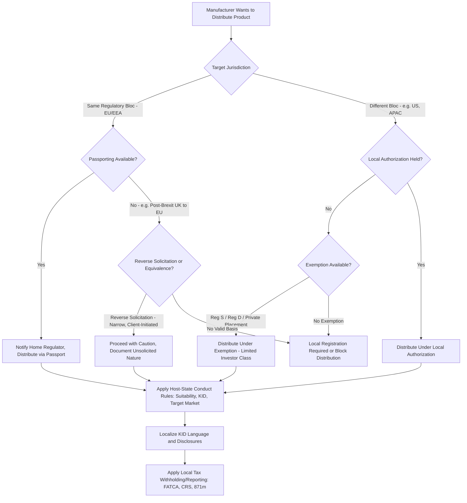

## Cross Border Distribution Considerations


### Overview

Cross-border distribution of structured products introduces a layered compliance problem: the product must satisfy not only the manufacturer's home-jurisdiction regulatory requirements but also the securities, marketing, tax, and investor-protection rules of every jurisdiction into which it is distributed. Unlike suitability, disclosure, and complexity rating (which are largely product/client-specific controls within a single regulatory perimeter), cross-border distribution is fundamentally a **jurisdictional gating problem** — determining *where* a product can legally be offered, marketed, or sold at all, before any suitability or disclosure question becomes relevant.

This topic sits downstream of complexity/risk rating and disclosure: a product's KID, SRI, and target market determination must often be adapted per jurisdiction even when the underlying structure is identical.

### Core Jurisdictional Concepts

**Key Points**

- **Passporting**: within a harmonized regulatory bloc (notably the EU/EEA under MiFID II), a firm authorized in one member state can distribute across others without separate national authorization, subject to notification procedures.
- **Reverse solicitation**: an exemption in many jurisdictions allowing a firm with no local authorization to service a client who approaches the firm *unprompted* — this is narrowly construed and a recurring area of regulatory scrutiny, since firms cannot structure marketing to engineer reverse solicitation and then claim the exemption.
- **Private placement regimes**: many jurisdictions permit distribution to a limited class of sophisticated/professional investors without full public-offering registration, but the thresholds and permitted investor categories vary significantly (e.g., EU professional client definitions vs. US "accredited investor" vs. Swiss "qualified investor").
- **Equivalence/substituted compliance**: some jurisdictions permit foreign firms to rely on their home-country regulatory regime if it is formally deemed "equivalent," though equivalence determinations are political as much as technical and can be withdrawn.

### EU/EEA: MiFID II Passporting Mechanics

- A firm authorized in one EU/EEA member state (the "home" state) can passport into other member states ("host" states) via either:
  - **Freedom to provide services**: cross-border distribution without a physical branch, notified to the home regulator, which informs the host regulator.
  - **Freedom of establishment**: setting up a branch in the host state, subject to host-state conduct-of-business rules for that branch's activities.
- Product governance and target market rules (as discussed under the KID/disclosure topic) must still account for host-state-specific distributor networks, even where the manufacturer's home-state authorization covers the passport.
- [Unverified] Post-Brexit, UK-authorized firms lost automatic EU passporting rights; the specific bilateral arrangements, equivalence determinations, and transitional permissions applicable to structured products distribution should be verified against current FCA/ESMA guidance rather than assumed static, since this area has continued to evolve.

### US Cross-Border Considerations

**Key Points**

- Structured notes sold in the US are typically registered securities under the Securities Act of 1933, requiring either full SEC registration (shelf registration is common for programmatic note issuance) or reliance on an exemption (e.g., Regulation D private placements to accredited investors, Regulation S for offshore offerings excluded from US registration).
- **Regulation S** governs offers and sales of securities outside the US that are not required to be registered under the 1933 Act — critical for non-US manufacturers wanting to distribute structured notes to non-US investors without triggering US registration, but requiring careful structuring to avoid "flowback" into the US market.
- FINRA member firms distributing structured products to US retail clients remain subject to FINRA Rule 2111 suitability and Regulatory Notice 12-03 guidance (per the earlier suitability topic) regardless of where the manufacturer is domiciled.
- [Unverified] The precise interaction between Regulation S safe harbors and FATCA/CRS reporting obligations for structured note distribution can be technically intricate and jurisdiction-dependent; this should be confirmed against current SEC and IRS guidance for any specific distribution structure rather than treated as settled by general principle alone.

### APAC Fragmentation

Unlike the EU's harmonized passporting regime, APAC lacks a unified cross-border framework, requiring jurisdiction-by-jurisdiction analysis:

| Jurisdiction | Key Regime | Structured Product Treatment |
| --- | --- | --- |
| Singapore | Securities and Futures Act (SFA), MAS Notice FAA-N16 | Specified Investment Products (SIPs) category; CAR/CKA required (per earlier suitability topic) |
| Hong Kong | SFC Code of Conduct | "Complex products" classification similar in spirit to MiFID II; enhanced suitability obligations post-Lehman minibond enforcement actions |
| Japan | Financial Instruments and Exchange Act (FIEA) | Detailed solicitation regulations distinguishing professional vs. general investors |
| Australia | Corporations Act, ASIC RG 274 | Design and Distribution Obligations (DDO) regime, conceptually parallel to EU target market rules |

[Inference] The general pattern across APAC jurisdictions mirrors the EU/US in substance (enhanced suitability for complex products, target-market-style gating, mandatory disclosure) even where the specific statutory mechanics and terminology differ, reflecting convergent post-2008/post-Lehman-minibond regulatory responses across the region.

### Marketing and Promotion Restrictions

**Key Points**

- Many jurisdictions restrict "financial promotions" or "marketing communications" targeting local retail investors even where no sale occurs — meaning a manufacturer's website, factsheet, or KID can itself trigger local regulatory obligations if accessible to or targeted at residents of a jurisdiction where the firm is not authorized.
- Geo-blocking, jurisdiction-specific disclaimers, and IP-based access restrictions are common (though imperfect) mitigants, but regulators increasingly scrutinize whether such measures are genuinely effective versus nominal.
- The EU's financial promotion regime under MiFID II/national implementing measures interacts with the UK's separate (post-Brexit) financial promotion regime under FSMA, meaning identical marketing material may need separate local compliance review for EU vs. UK audiences despite historical regulatory alignment.

### Language and Localization Requirements

- KID/disclosure documents (per the prior disclosure topic) generally must be provided in a language the local retail investor base can reasonably be expected to understand — this is a distinct, additional requirement layered on top of jurisdictional authorization.
- Local regulators may prescribe specific official-language requirements (e.g., certain EU member states requiring local-language KIDs even where English is commercially prevalent), which can create operational lag in multi-jurisdiction product launches.

### Tax Withholding and Reporting Complexity

**Key Points**

- Cross-border structured note distribution frequently intersects with withholding tax regimes on coupon/return payments, which can vary by investor residency, issuer domicile, and underlying asset jurisdiction (e.g., US withholding tax under Section 871(m) for notes referencing US equity underlyings, which specifically targets equity-linked instruments including many structured products).
- **FATCA** (US) and **CRS** (OECD Common Reporting Standard) impose cross-border information-reporting obligations on distributors and custodians, requiring investor tax-residency certification as part of onboarding — this is procedurally distinct from suitability/appropriateness onboarding but often bundled into the same client-onboarding workflow operationally.
- [Unverified] Section 871(m) withholding determinations for a specific structured product depend on delta and other technical thresholds relative to the referenced US equity exposure, and the applicable rate/exemption should be confirmed against current IRS regulations and the specific product's terms rather than assumed uniform across all equity-linked notes.

### Cross-Border Distribution Decision Flow



### Jurisdictional Layering Visual (svg_diagram)

<svg xmlns="http://www.w3.org/2000/svg" viewBox="0 0 700 260">
<text x="350" y="24" text-anchor="middle" font-size="16" font-weight="bold" font-family="sans-serif">Cross-Border Compliance Layers (svg_diagram)</text>
<g font-family="sans-serif" font-size="13">
<rect x="150" y="45" width="400" height="40" fill="#e3f2fd" stroke="#1565c0" />
<text x="350" y="70" text-anchor="middle">Manufacturer Home-State Authorization</text>



```
<rect x="150" y="95" width="400" height="40" fill="#e8f5e9" stroke="#2e7d32" />
<text x="350" y="120" text-anchor="middle">Passport / Exemption / Local Registration</text>

<rect x="150" y="145" width="400" height="40" fill="#fffde7" stroke="#f57f17" />
<text x="350" y="170" text-anchor="middle">Host-State Conduct Rules: Suitability, KID, Target Market</text>

<rect x="150" y="195" width="400" height="40" fill="#ffebee" stroke="#c62828" />
<text x="350" y="220" text-anchor="middle">Tax Withholding and Reporting: FATCA, CRS, 871(m)</text>
```

</g>
</svg>

### Common Failure Modes

- **Engineered reverse solicitation**: marketing activity (webinars, targeted emails, localized factsheets) that undermines a claimed reverse-solicitation basis for distribution, exposing the firm to unauthorized-distribution enforcement risk.
- **Stale passporting notifications**: failing to update host-state notifications when the scope of activity or branch structure changes, particularly post-Brexit for firms with historical EU-wide passports now requiring jurisdiction-by-jurisdiction re-establishment.
- **Flowback risk under Regulation S**: structuring an offshore offering that is nominally compliant but where secondary trading or affiliate distribution channels effectively route the securities back to US persons within the restricted period.
- **KID localization lag**: launching a product across multiple jurisdictions simultaneously but delaying local-language KID production, creating a window where local distributors technically cannot lawfully offer the product to retail clients.
- **Inconsistent target market application**: applying a single (often manufacturer-home-jurisdiction) target market determination across all distribution jurisdictions without adjusting for local investor protection thresholds or local professional-client definitions, which can differ materially (e.g., EU vs. Swiss vs. Singapore qualified/professional investor tests).
- **Underestimating withholding tax leakage**: failing to model Section 871(m)-style withholding into the product's advertised return, leading to investor confusion when net proceeds diverge from headline coupon figures.

### Worked Example

A UK-based manufacturer wants to distribute a worst-of autocallable note (referencing US technology stocks) to retail clients in Germany, Singapore, and via reverse inquiry from a US-based family office.

- **Germany (EU/EEA)**: Since Brexit, the UK manufacturer no longer holds automatic MiFID II passporting rights into Germany. It must either establish EU authorization (e.g., via an EU-domiciled subsidiary or branch), rely on equivalence provisions if applicable, or distribute through an EU-authorized third-party distributor holding its own passport — the manufacturer's UK authorization alone is insufficient.
- **Singapore**: Distribution to retail clients triggers SFA/MAS Notice FAA-N16 obligations, including classification as a Specified Investment Product requiring CAR/CKA assessment (linking back to the suitability topic), regardless of the manufacturer's UK or EU status.
- **US family office (reverse inquiry)**: If genuinely unsolicited, this may fall under Regulation S or a private-placement exemption (e.g., Regulation D if the family office qualifies as accredited), but the firm must carefully document that no US-directed marketing occurred, and Section 871(m) withholding analysis applies given the US equity underlying regardless of the exemption basis used for the offering itself.

Across all three, the underlying product structure is identical, but the compliance pathway, required documentation, target market determination, and tax treatment diverge substantially per jurisdiction — illustrating why cross-border distribution is typically the most operationally complex layer of structured products compliance, sitting on top of (not replacing) the suitability, disclosure, and complexity-rating obligations covered in the preceding topics.

**Next Steps**

- MiFID II passporting notification mechanics and host-state conduct rule interaction
- Regulation S / Regulation D exemption structuring for non-US manufacturers
- Section 871(m) delta-based withholding determination methodology
- FATCA/CRS onboarding integration with suitability/KYC workflows
- APAC jurisdiction-by-jurisdiction comparison: SFC, MAS, FIEA, ASIC DDO
- Post-Brexit UK-EU equivalence and third-country regime developments
- Reverse solicitation documentation standards and enforcement precedent