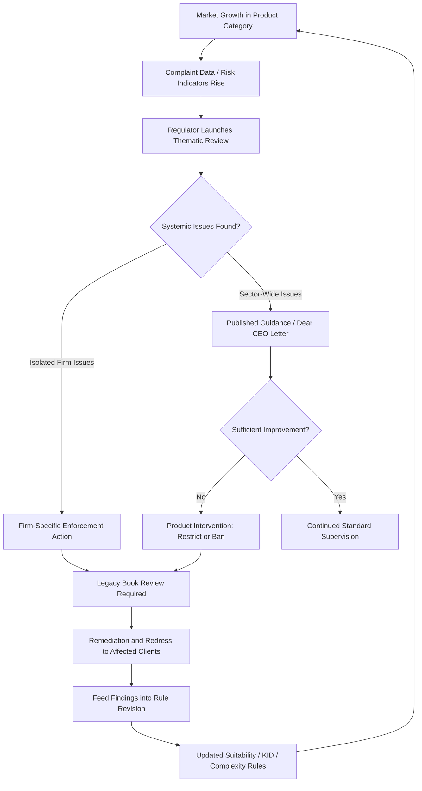

## Regulatory Scrutiny of Retail Structured Products

### Overview

Regulatory scrutiny of retail structured products refers to the ongoing supervisory, enforcement, and policy-development activity that regulators conduct beyond the baseline rules already covered — suitability/appropriateness, KID disclosure, complexity rating, and cross-border distribution. This topic synthesizes how regulators actively monitor, investigate, and intervene in the retail structured products market: thematic reviews, enforcement precedent, product intervention powers, and the historical enforcement episodes that shaped the current rulebook. Where the earlier topics describe the *rules as designed*, this topic describes the *supervisory mechanisms that test whether the rules work in practice* and the market episodes that triggered successive waves of reform.

### Historical Enforcement Episodes Shaping Current Regulation

**Key Points**

- **Lehman Brothers minibonds (2008)**: The collapse of Lehman Brothers as a credit-linked note issuer/guarantor caused significant retail losses in several Asian markets (notably Hong Kong and Singapore), where structured notes marketed as relatively low-risk "minibonds" were in fact complex credit derivatives referencing Lehman's own credit risk. This episode is widely credited with driving the enhanced suitability and complex-product classification regimes subsequently adopted by the HKSFC and MAS (referenced under the cross-border topic's APAC comparison), and is frequently cited as the foundational case study in structured products mis-selling regulation.
- **UK structured product mis-selling reviews**: The FCA (and its predecessor, the FSA) conducted multiple thematic reviews of structured product sales practices in the UK retail market, identifying recurring issues including inadequate risk disclosure, unsuitable sales to risk-averse clients, and unclear communication of capital-at-risk features — contributing to the COBS suitability/appropriateness enhancements referenced in the earlier suitability topic.
- **Post-2008 EU regulatory response**: The broader 2008 financial crisis catalyzed the MiFID II reform program (superseding MiFID I), embedding the complex-instrument classification, product governance, and target market requirements discussed across the disclosure and complexity topics — structured products were a specific focus given their role in several national mis-selling controversies during and after the crisis.
- [Unverified] The specific quantum of investor losses and precise regulatory findings from any individual historical episode should be verified against primary regulatory publications (e.g., official FCA/HKSFC/MAS enforcement notices or thematic review reports) for any context requiring exact figures, since secondary summaries can vary in precision and this response synthesizes general, well-established patterns rather than citing specific loss figures.

### Supervisory Mechanisms

#### Thematic Reviews

- Regulators periodically conduct sector-wide thematic reviews examining a specific practice across multiple firms simultaneously (rather than firm-by-firm routine supervision), often triggered by complaint volume, market growth in a product category, or emerging risk themes identified through other supervisory channels.
- Structured products have been a recurring thematic review subject across major regulators (FCA, MAS, HKSFC, and EU national competent authorities under ESMA coordination), typically examining: suitability assessment quality, KID/disclosure accuracy, marketing material framing (connecting to the behavioral topic), and product governance/target market adherence.
- Thematic review findings typically result in published guidance, "Dear CEO" letters (a common FCA supervisory tool) setting expectations, or in more serious cases, formal enforcement action against individual firms found to have systemic failures.

#### Product Intervention Powers

**Key Points**

- Certain regulators hold explicit **product intervention powers** allowing them to restrict, ban, or impose conditions on the marketing/distribution of specific product types to retail investors, distinct from (and more powerful than) disclosure or suitability rule-setting.
- Under MiFID II/MiFIR (Article 40, and equivalent ESMA/national competent authority powers), regulators can temporarily prohibit or restrict marketing of financial instruments where investor protection concerns are identified — this power has been used for various complex/leveraged retail product categories, illustrating the mechanism's availability even where structured products specifically are not always the direct target of any given intervention.
- The UK FCA retained equivalent intervention powers post-Brexit under onshored legislation, and has exercised comparable powers over other complex retail product categories (e.g., contracts for difference), establishing precedent for the regulatory toolkit potentially applicable to high-complexity structured products (Tier 4–5, per the complexity topic) if systemic concerns emerge.
- [Unverified] Whether any specific product intervention action has been taken against a particular structured product sub-category at any given time is a fast-moving supervisory fact that should be verified via current regulator publications rather than assumed static, given that intervention measures are periodically reviewed, renewed, or allowed to lapse.

#### Complaints Data and Conduct Risk Monitoring

- Regulators and Financial Ombudsman-equivalent bodies track complaint volumes and outcomes by product category, using elevated complaint rates for structured products as a trigger for closer supervisory attention — this operationalizes the KID's "How can I complain?" section (from the disclosure topic) as a data source feeding back into supervisory prioritization, not merely a client-facing requirement.
- Conduct risk indicators monitored by firms' own compliance/risk functions (and increasingly expected by regulators as part of Consumer Duty-style oversight) include: post-sale complaint rates by product tier, rates of "insistent client" waiver usage (flagged as a red flag under the suitability topic), and outcomes testing (tracking whether products perform as their KID scenarios suggested).

### Post-Sale and Ongoing Supervisory Themes

**Key Points**

- **Outcomes testing / fair value assessment**: under frameworks like the UK Consumer Duty (referenced under the disclosure topic), firms are expected to periodically assess whether structured products actually deliver fair value in practice, not merely at the point of KID publication — comparing realized outcomes against the KID's performance scenarios over time.
- **Legacy book review**: regulators have periodically required firms to review back-books of previously sold structured products against updated suitability/disclosure standards, particularly following a rule change, to identify and remediate historical mis-selling even where the original sale was compliant with then-applicable rules.
- **Vulnerable customer considerations**: increasing regulatory focus (particularly under the UK Consumer Duty and similar frameworks elsewhere) on whether structured products distribution processes adequately identify and protect vulnerable customers, who may be disproportionately susceptible to the behavioral biases discussed in the prior topic (anchoring, framing, complexity-as-credibility) regardless of formal knowledge/experience test outcomes.

### Regulatory Scrutiny Lifecycle

### Enforcement-to-Rule-Reform Mapping

| Historical Episode / Theme | Primary Jurisdiction(s) | Downstream Regulatory Response |
| --- | --- | --- |
| Lehman minibonds | Hong Kong, Singapore | Complex product classification, enhanced CAR/CKA (SFC, MAS) |
| UK structured product thematic reviews | United Kingdom | COBS 9/10 suitability/appropriateness enhancements |
| Post-2008 crisis, broad market complexity concerns | EU-wide | MiFID II complex instrument regime, product governance rules |
| PRIIPs KID performance scenario criticism (pre-2023) | EU-wide | 2023 RTS revision, plausibility-check methodology |
| Ongoing fair value / outcomes concerns | UK | Consumer Duty outcomes testing requirement |

[Inference] This mapping illustrates a general and recurring regulatory pattern across the topics covered in this chapter — enforcement/thematic review findings feed into disclosure format revision (KID topic), complexity classification refinement (complexity topic), and suitability procedure enhancement (suitability topic) — rather than each regulatory instrument developing independently; the specific causal attribution between any single enforcement episode and a specific rule change is, in most cases, a matter of regulatory policy history that can be confirmed via the relevant regulator's own consultation papers and final rule statements.

### Common Failure Modes Identified in Supervisory Findings

- **Suitability documentation without substantive assessment**: firms completing suitability questionnaires as a compliance formality without the underlying assessment genuinely driving the recommendation — a recurring thematic review finding across jurisdictions, distinct from outright suitability test failure since the paperwork may appear compliant while the substantive judgment is absent.
- **KID technical compliance without effective communication**: satisfying PRIIPs formatting rules while marketing materials surrounding the KID undermine its risk message through framing (directly connecting to the behavioral topic's framing-effect discussion) — regulators have increasingly scrutinized the *combination* of KID plus marketing material as the relevant unit of assessment, not the KID in isolation.
- **Delayed legacy book remediation**: firms identifying historical mis-selling issues internally but delaying systematic back-book review and client remediation, which regulators have treated as an aggravating factor in subsequent enforcement severity.
- **Inadequate vulnerable customer identification**: distribution processes that apply uniform suitability/appropriateness procedures without additional safeguards for customers exhibiting vulnerability indicators (cognitive impairment, financial distress, low literacy), an increasing focus area under Consumer Duty-style frameworks.
- **Cross-border regulatory arbitrage perception**: distributing higher-risk product variants preferentially into jurisdictions perceived to have weaker enforcement intensity — a pattern regulators have flagged as a coordination concern, motivating increased cross-border supervisory information-sharing (connecting to the cross-border distribution topic).

### Worked Example

A national regulator's thematic review of autocallable note distribution finds: (1) suitability questionnaires routinely score clients as having "high" risk tolerance based on a single self-reported answer without corroborating evidence from financial situation data; (2) marketing brochures for a specific product family prominently feature the 9% headline coupon in large font while the capital-at-risk barrier mechanic appears only in smaller-font footnotes; (3) complaint data shows elevated complaint rates specifically for clients over 65 who purchased the product following a barrier breach event.

**Likely regulatory response sequence**, consistent with the lifecycle above:

- Immediate: firm-specific supervisory engagement, likely requiring remediation of the identified suitability questionnaire design flaw.
- Sector-wide: if the marketing framing pattern is found industry-wide (not isolated to one firm), a published thematic review report and "Dear CEO"-style letter setting expectations for marketing material balance between headline rate and risk disclosure.
- Vulnerable customer finding: likely triggers specific guidance on age/vulnerability-sensitive suitability procedures, given the elevated complaint concentration in an older client demographic.
- Redress: legacy book review requiring the firm to assess whether previously sold notes to similarly-profiled clients require remediation, feeding into the broader legacy book review theme.

This illustrates how a single thematic review can simultaneously surface findings connecting back to suitability procedure design (earlier topic), disclosure/marketing framing (disclosure and behavioral topics), and vulnerable customer protection — demonstrating why regulatory scrutiny functions as the supervisory feedback loop testing whether the preceding chapter topics' rules are achieving their intended investor protection outcomes in practice.

**Next Steps**

- Lehman minibond case study: detailed regulatory findings and remediation outcomes
- MiFID II/MiFIR Article 40 product intervention power mechanics
- UK Consumer Duty outcomes testing and fair value assessment methodology
- Vulnerable customer identification frameworks in structured products distribution
- Legacy book review and client remediation program design
- Comparative analysis: FCA thematic review process vs. MAS/HKSFC equivalents
- Conduct risk indicator design for ongoing structured products supervision