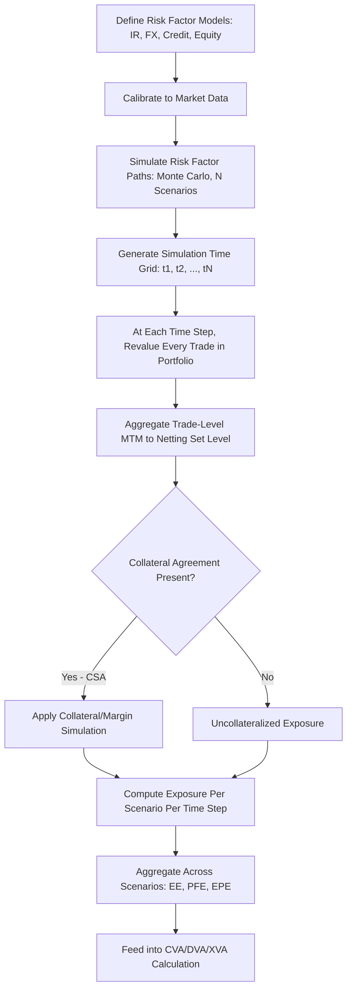

## Counterparty Exposure Measurement


### Overview

Counterparty exposure measurement quantifies the potential loss a firm faces if its derivatives counterparty defaults before contractual obligations are fulfilled. Unlike traded market risk (which measures potential loss from adverse price moves on a position), counterparty exposure is inherently **bilateral and contingent**: exposure only crystallizes into loss if the counterparty defaults *and* the position has positive value to the surviving party at that moment. This topic forms the foundation for the XVA (valuation adjustment) framework covered elsewhere in this chapter, since every XVA metric (CVA, DVA, FVA, etc.) is built on top of an exposure profile computed using the methods described here.

### Core Exposure Definitions

**Key Points**

- **Current Exposure (CE)**: the exposure if the counterparty were to default today, equal to $\max(V, 0)$ where $V$ is the current mark-to-market value of the portfolio to the surviving party. A negative MTM position has zero current exposure (the surviving party owes money, not vice versa).
- **Potential Future Exposure (PFE)**: an estimate of the maximum (or a high-percentile) exposure at a specified future date or dates, given the portfolio's possible evolution — critical because derivatives contracts can run for years, during which market moves can turn a currently out-of-the-money position significantly in-the-money.
- **Expected Exposure (EE)**: the probability-weighted average of positive exposure at a future date, $EE(t) = \mathbb{E}[\max(V(t), 0)]$, taken under the real-world or risk-neutral measure depending on the application (risk-neutral for CVA pricing, real-world for regulatory capital in some frameworks).
- **Expected Positive Exposure (EPE)**: the time-weighted average of expected exposure over a specified horizon, $EPE = \frac{1}{T}\int_0^T EE(t)\, dt$, commonly used as a regulatory capital input.

$$CE = \max(V, 0)$$


$$EE(t) = \mathbb{E}^{\mathbb{Q}}[\max(V(t), 0)]$$


$$EPE = \frac{1}{T}\int_0^T EE(t)\,dt$$

### Why Exposure Is Not Simply Mark-to-Market

**Key Points**

- A single derivative's exposure is not static — it evolves as the underlying market factors move and as the contract approaches maturity (time decay of optionality, roll-down of forward-starting features).
- **Diffusion effect**: over longer horizons, uncertainty about future market levels increases, tending to increase potential exposure — this dominates in the earlier part of a trade's life.
- **Amortization/time-decay effect**: as a contract approaches maturity, fewer future cashflows remain to generate exposure, and the remaining time for adverse moves shrinks — this tends to reduce exposure toward maturity.
- These two competing effects typically produce a **hump-shaped** expected exposure profile for many single instruments (e.g., a plain vanilla interest rate swap): exposure rises as diffusion dominates, peaks at an intermediate point, then declines as amortization dominates approaching maturity.

### Exposure Profile Shapes by Instrument Type

| Instrument Type | Typical Exposure Profile Shape | Driving Factor |
| --- | --- | --- |
| Interest rate swap | Hump-shaped | Diffusion vs. amortization trade-off |
| FX forward (single exchange) | Increasing then drops to zero at maturity | Diffusion dominates until single cashflow date |
| Cross-currency swap | Elevated, hump-shaped with larger magnitude | Notional exchange at maturity adds FX-driven jump risk |
| Long-dated option (purchased) | Increasing toward maturity or plateauing | No amortizing notional; value driven by time value and moneyness |
| Amortizing/accreting swap | Profile shape shifts with notional schedule | Notional amortization directly scales exposure magnitude |

[Inference] These are general, widely-observed patterns from the exposure modeling literature and industry practice; the exact shape for any specific trade depends on its particular cashflow schedule, optionality, and the calibration of the underlying market factor models, so this table should be read as a set of typical tendencies rather than a guarantee for every parameterization.

### Simulation-Based Exposure Calculation Methodology

Modern exposure measurement (particularly for CVA/XVA purposes) is almost universally computed via **Monte Carlo simulation** of the relevant risk factors, because closed-form solutions are generally unavailable once netting, collateral, and portfolio-level effects are included.



**Key Points**

- **Risk factor simulation**: models for each relevant market factor (interest rate curves, FX rates, equity prices, credit spreads) are calibrated and simulated forward under the risk-neutral measure (for pricing/CVA) using models such as Hull-White for rates, Black-Scholes/local-vol/stochastic-vol for equity/FX, or more sophisticated multi-factor models depending on the desk's modeling standards.
- **Revaluation at each time step**: at every simulated future date on the time grid, every trade in the netting set is revalued using its own pricing model, conditional on the simulated market state at that scenario/time-step combination — this is computationally the most expensive step, motivating techniques like American Monte Carlo (regression-based exposure estimation) for path-dependent/callable trades where full nested simulation would be prohibitively expensive.
- **Netting set aggregation**: trades under a single legally enforceable netting agreement (e.g., ISDA Master Agreement) are aggregated to a single portfolio value per scenario/time-step *before* taking the $\max(V,0)$ floor, since netting allows negative-value trades to offset positive-value trades against the same counterparty — this is why netting set definition (which trades are legally netted together) is a critical input, not merely an operational detail.

### The Effect of Netting on Exposure

$$\text{Exposure}_{\text{netted}} = \max\left(\sum_i V_i, 0\right) \leq \sum_i \max(V_i, 0) = \text{Exposure}_{\text{gross}}$$

- Netting exposure is always less than or equal to gross (unnetted) exposure summed trade-by-trade, since netting allows offsetting negative and positive trade values before applying the floor.
- The netting benefit is maximized when trade values within the netting set are negatively correlated or naturally offsetting (e.g., a pay-fixed and receive-fixed swap with the same counterparty), and minimized (approaching zero benefit) when all trades in the set tend to move in the same direction.
- Legal enforceability of netting is jurisdiction- and counterparty-type-dependent; risk and capital treatment generally require a legal opinion confirming netting enforceability in the relevant jurisdiction before netting benefit can be recognized for regulatory capital purposes.

### Collateral and Margin Period of Risk

**Key Points**

- Under a Credit Support Annex (CSA) or similar collateral agreement, exposure is mitigated by collateral posted/received based on the portfolio's mark-to-market value, subject to a **threshold** (uncollateralized exposure amount) and **minimum transfer amount (MTA)**.
- **Margin Period of Risk (MPoR)**: the assumed period between the last collateral exchange before a counterparty default and the point at which the position is closed out/re-hedged — exposure during this window is generally *not* fully collateral-mitigated because collateral calls, disputes, and close-out procedures take time to execute, especially under stressed/default conditions.
- Regulatory frameworks (e.g., under Basel III SA-CCR, discussed further under regulatory capital topics) prescribe minimum MPoR assumptions (often 10 business days for non-centrally-cleared, non-disputed collateralized trades, longer for disputed collateral or larger/less liquid netting sets), directly scaling the exposure add-on for collateralized portfolios.
- [Unverified] Specific MPoR day-count parameters and their conditions for application (e.g., threshold-based extensions for large netting sets) should be verified against the current applicable regulatory text (Basel framework or local implementing regulation) for any specific capital calculation, as these technical parameters have been subject to periodic recalibration.

### Regulatory Exposure Methodologies

| Methodology | Framework | Key Characteristic |
| --- | --- | --- |
| Current Exposure Method (CEM) | Basel II (legacy) | Simple add-on factors by asset class; largely superseded |
| Standardized Approach for Counterparty Credit Risk (SA-CCR) | Basel III | Formula-based, more risk-sensitive than CEM; current standard for non-model banks |
| Internal Model Method (IMM) | Basel II/III | Bank-specific Monte Carlo-based EPE/PFE models, subject to regulatory approval |

[Inference] SA-CCR is generally understood in the industry as designed to be more risk-sensitive than its CEM predecessor while remaining more standardized (and less computationally intensive) than full IMM approaches, positioning it as the primary methodology for banks without regulatory approval for internal exposure models; exact formula mechanics (e.g., supervisory factors, maturity/delta adjustments) are technical implementation details best confirmed against current Basel Committee/local regulator publications given periodic recalibration of supervisory parameters.

### PFE Profile Visualization (svg_diagram)

<svg xmlns="http://www.w3.org/2000/svg" viewBox="0 0 680 320">
<text x="340" y="24" text-anchor="middle" font-size="16" font-weight="bold" font-family="sans-serif">Exposure Profile: Interest Rate Swap (svg_diagram)</text>
<g font-family="sans-serif" font-size="12">
<line x1="60" y1="270" x2="620" y2="270" stroke="#333" stroke-width="1.5" />
<line x1="60" y1="270" x2="60" y2="50" stroke="#333" stroke-width="1.5" />
<text x="330" y="300" text-anchor="middle">Time to Maturity</text>
<text x="30" y="160" text-anchor="middle" transform="rotate(-90 30 160)">Exposure</text>



```
<path d="M 60 270 C 180 130, 300 80, 380 90 C 460 100, 560 200, 620 270" fill="none" stroke="#c62828" stroke-width="2.5" />
<text x="380" y="70" fill="#c62828" text-anchor="middle" font-weight="bold">PFE (95th percentile)</text>

<path d="M 60 270 C 180 220, 300 195, 380 200 C 460 205, 560 240, 620 270" fill="none" stroke="#1565c0" stroke-width="2.5" />
<text x="380" y="220" fill="#1565c0" text-anchor="middle" font-weight="bold">EE (Expected Exposure)</text>

<line x1="60" y1="270" x2="620" y2="270" stroke="#2e7d32" stroke-width="2" stroke-dasharray="4,4" />
<text x="580" y="260" fill="#2e7d32" font-size="11">Zero exposure floor</text>
```

</g>
</svg>

### Trade-Level vs. Portfolio-Level Considerations for Structured Products

**Key Points**

- Structured products embedding path-dependent features (autocalls, barriers — per the earlier complexity topic) present specific exposure-modeling challenges: the payoff's dependence on discrete observation dates means exposure can jump discontinuously around autocall/barrier observation events, requiring the simulation time grid to be fine enough to capture these dates precisely.
- For structured products issued as notes (rather than OTC derivatives), the relevant counterparty exposure typically sits with the **issuer's hedging counterparty** (the bank's own trading desk hedging the embedded derivative), meaning exposure measurement here is an internal/interbank consideration distinct from the investor-facing issuer credit risk discussed under the earlier disclosure/complexity topics (which concerns the *investor's* exposure to the *note issuer*, not the issuer's own hedge counterparty exposure).
- Wrong-way risk (where exposure to a counterparty is adversely correlated with that counterparty's own credit quality — e.g., a bank facing rising exposure to a hedge fund precisely when broader market stress also weakens that hedge fund's creditworthiness) requires specific modeling attention beyond standard independent risk-factor simulation, and is a recurring focus in both internal risk management and regulatory capital add-ons (e.g., the SA-CCR alpha multiplier partially reflects general wrong-way risk considerations at a portfolio level).

### Common Implementation Failure Modes

- **Netting set misclassification**: aggregating trades for exposure calculation that are not, in fact, covered by a single enforceable netting agreement, overstating netting benefit and understating true exposure.
- **Coarse simulation time grids around discrete observation dates**: for structured products with autocall/barrier features, a simulation grid that doesn't align with actual observation dates can materially misstate exposure around these discontinuity points.
- **Ignoring MPoR in collateralized exposure**: treating fully-collateralized trades as having negligible exposure without accounting for the margin period of risk window, understating exposure particularly for less liquid or larger netting sets where MPoR assumptions extend further.
- **Static correlation assumptions in multi-factor simulation**: using historical correlation estimates that don't hold under stressed/crisis conditions (correlation breakdown or spike), a known limitation particularly relevant for wrong-way risk scenarios.
- **Conflating investor-facing issuer credit risk with hedge-counterparty exposure**: as noted above, these are distinct exposure relationships that are sometimes incorrectly merged in less rigorous internal risk frameworks, obscuring the actual locus of counterparty risk within a structured product's full lifecycle.

### Worked Example

A bank enters a 5-year receive-fixed interest rate swap with a corporate counterparty, notional $100 million, under an ISDA/CSA with a $2 million threshold and 10-business-day MPoR.

- At inception, MTM ≈ 0, so current exposure ≈ 0.
- Simulating forward, expected exposure rises over the first 2–3 years as rate uncertainty accumulates (diffusion effect), then declines toward year 5 as fewer future cashflows remain (amortization effect) — consistent with the hump-shaped profile typical of vanilla swaps.
- If simulated MTM at year 2 is $5 million in the bank's favor, collateral mitigates exposure down toward the $2 million threshold, but the MPoR window means exposure during a hypothetical default event could still reflect market moves during the ~10-business-day close-out period, so realistic modeled exposure at that point is not simply floored at $2 million but reflects a distribution incorporating potential MTM changes during MPoR.
- EPE over the trade's life is computed as the time-weighted average of this expected exposure profile, feeding directly into the CVA calculation (the subject of the XVA topics following in this chapter) as the exposure input multiplied by the counterparty's default probability and loss-given-default.

**Next Steps**

- Credit Valuation Adjustment (CVA) calculation methodology
- Debit/Funding/Margin Valuation Adjustments (DVA, FVA, MVA)
- SA-CCR formula mechanics: supervisory factors and maturity adjustments
- Wrong-way risk modeling techniques and regulatory capital treatment
- American Monte Carlo / Longstaff-Schwartz regression for path-dependent exposure
- Netting agreement legal enforceability and jurisdictional considerations
- Collateral/CSA parameter modeling: threshold, MTA, and MPoR calibration