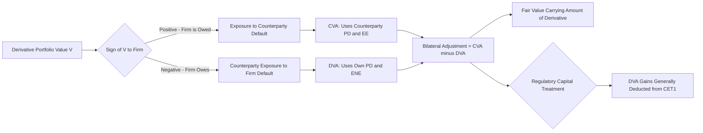

## Debit Valuation Adjustment DVA


### Overview

Debit Valuation Adjustment (DVA) is the mirror image of CVA: it measures the reduction in a firm's own derivative liabilities that arises from the possibility of the firm's *own* default. Where CVA captures the risk that the counterparty defaults while owing money to the firm, DVA captures the symmetric fact that the counterparty is exposed to the firm's own credit risk on trades where the firm itself owes money. DVA is the component that converts unilateral CVA (covered in the previous topic) into bilateral CVA, and is among the most conceptually and practically debated adjustments in the XVA family — accounting-compliant, yet economically contested in terms of whether it represents a genuinely realizable value.

### Conceptual Definition

**Key Points**

- DVA represents the expected gain to the firm (equivalently, the expected loss to the counterparty) arising from the possibility that the firm itself defaults before fulfilling its negative-value obligations under the derivatives portfolio.
- Symmetrically to CVA's dependence on positive expected exposure, DVA depends on the firm's own **negative exposure** — the portion of the portfolio's value that is owed *by* the firm *to* the counterparty, since this is the amount the firm would be relieved of paying in the event of its own default (subject to counterparty recovery in the bankruptcy proceeding).
- Because DVA increases in magnitude as the firm's own credit quality deteriorates (wider own-credit spreads imply higher own-default probability), DVA creates the well-documented and widely debated **"DVA paradox"**: a firm's reported earnings can *improve* purely because the market perceives the firm's own creditworthiness to have worsened, even though nothing about the firm's actual operating performance has changed.

### The DVA Formula

DVA is structurally identical to CVA but applied to the firm's own negative exposure and own default probability, using the counterparty's exposure perspective:

$$DVA = (1 - R_{own}) \int_0^T ENE^*(t) \, dPD_{own}(t)$$

Or in discretized form:

$$DVA = (1 - R_{own}) \sum_{i=1}^{N} ENE^*(t_i) \cdot [PD_{own}(t_{i-1}, t_i)] \cdot DF(t_i)$$

Where:

- $R_{own}$ = the firm's own recovery rate in default
- $ENE^*(t_i)$ = discounted **Expected Negative Exposure**, i.e., $\mathbb{E}[\min(V(t_i), 0)]$ in magnitude — the mirror of the EE term used in CVA
- $PD_{own}(t_{i-1}, t_i)$ = the firm's own marginal default probability, typically derived from the firm's own CDS spread curve (or a proxy where the firm's CDS is illiquid)

$$ENE(t) = \mathbb{E}^{\mathbb{Q}}[\min(V(t), 0)]$$

**Key Points**

- Bilateral CVA, combining both adjustments, is expressed as:

$$\text{Bilateral CVA/DVA Adjustment} = CVA - DVA$$

- A net *reduction* in the derivative liability's carrying value occurs when DVA exceeds CVA — i.e., when the firm's own default risk (as priced by the market) exceeds the counterparty's, all else equal.
- The own default probability term structure is generally sourced from the calculating firm's own traded CDS spreads where a liquid market exists, though liquidity in single-name CDS on the calculating institution itself can be limited for some firms, requiring proxy approaches analogous to those used for illiquid counterparty CDS curves in CVA calculation.

### Why DVA Is Controversial

**Key Points**

- **The monetization problem**: DVA gains are only realizable in practice if the firm can actually close out or novate its liabilities at the DVA-adjusted (lower) value, or if the firm genuinely defaults (at which point the "gain" is moot from a going-concern shareholder perspective, since the firm itself has failed). Critics argue that absent an actual default or an ability to monetize the credit-improvement gain through some hedging mechanism, DVA represents an accounting-recognized but not economically realizable benefit.
- **Perverse incentive concerns**: because DVA gains increase as a firm's own credit quality worsens, financial statement users and regulators have expressed concern that DVA can obscure genuine deterioration in a firm's financial health behind an accounting gain, complicating both external analysis and, in some contexts, internal risk-based compensation metrics if not carefully excluded.
- **Regulatory capital treatment diverges from accounting treatment**: this tension is significant enough that prudential regulators have generally required DVA (and other own-credit valuation gains) to be **deducted from regulatory capital** (Common Equity Tier 1) even where it is recognized in accounting P&L/equity — reflecting the view that DVA gains should not be treated as loss-absorbing capital precisely because they cannot be monetized in the going-concern scenario regulatory capital is meant to protect against.
- [Unverified] The precise regulatory capital deduction treatment (e.g., specific Basel provisions governing DVA and other own-credit-risk fair value gains) should be confirmed against the current applicable Basel framework and local implementing rules, as this is a specific technical capital adequacy provision subject to the standard caveats about jurisdictional implementation and periodic recalibration noted elsewhere in this material.

### Accounting Standards Context

- Both IFRS 13 (Fair Value Measurement) and US GAAP (ASC 820, Fair Value Measurement) require entities to incorporate **non-performance risk** — which includes the reporting entity's own credit risk — into the fair value measurement of derivative liabilities, providing the accounting basis for DVA recognition.
- This requirement means DVA is not merely an optional risk-management overlay but a required component of fair value measurement for financial reporting purposes wherever derivative liabilities exist on the balance sheet.
- [Inference] The practical effect is that DVA volatility flows through reported earnings (or, depending on the specific standard and classification, through other comprehensive income for certain own-credit-risk components under some accounting elections), which is precisely the mechanism generating the "paradox" effect described above and the reason external analysts frequently adjust reported earnings to strip out DVA/CVA volatility when assessing underlying operating performance.

### CVA/DVA Symmetry Diagram



### Bilateral Exposure Profile Visualization (svg_diagram)

<svg xmlns="http://www.w3.org/2000/svg" viewBox="0 0 680 320">
<text x="340" y="24" text-anchor="middle" font-size="16" font-weight="bold" font-family="sans-serif">Bilateral Exposure: EE and ENE (svg_diagram)</text>
<g font-family="sans-serif" font-size="12">
<line x1="60" y1="170" x2="620" y2="170" stroke="#333" stroke-width="1.5" />
<line x1="60" y1="170" x2="60" y2="40" stroke="#333" stroke-width="1" />
<line x1="60" y1="170" x2="60" y2="290" stroke="#333" stroke-width="1" />
<text x="330" y="310" text-anchor="middle">Time</text>



```
<path d="M 60 170 C 180 100, 300 80, 380 85 C 460 90, 560 130, 620 170" fill="#1565c0" fill-opacity="0.15" stroke="#1565c0" stroke-width="2.5" />
<text x="200" y="95" fill="#1565c0" font-weight="bold">EE(t): drives CVA</text>

<path d="M 60 170 C 180 220, 300 250, 380 245 C 460 240, 560 200, 620 170" fill="#c62828" fill-opacity="0.15" stroke="#c62828" stroke-width="2.5" />
<text x="200" y="270" fill="#c62828" font-weight="bold">ENE(t): drives DVA</text>

<text x="30" y="105" font-size="11">Positive V</text>
<text x="30" y="245" font-size="11">Negative V</text>
```

</g>
</svg>

### DVA and Hedging: A Fundamental Asymmetry

**Key Points**

- CVA can, in principle, be hedged relatively directly by purchasing CDS protection on the counterparty (shorting the counterparty's credit risk).
- DVA hedging is structurally more problematic: a firm cannot, in general, buy protection on itself in a way that pays out cleanly upon its own default (since the firm's own default would typically impair its ability to receive on such a hedge, and regulators/market conventions generally do not treat "self-referencing" CDS protection as a viable or permitted hedge).
- In practice, some institutions approximate DVA hedging using proxy instruments — e.g., buying protection on a basket of comparable financial institutions or using the firm's own bond spreads as a partial economic proxy — but this remains an imperfect hedge subject to basis risk between the proxy and the firm's own actual credit dynamics.
- [Inference] This hedging asymmetry between CVA (generally hedgeable via counterparty CDS) and DVA (generally not cleanly hedgeable) is frequently cited in the practitioner and academic literature as reinforcing the broader critique that DVA represents an accounting recognition without a corresponding realizable/hedgeable economic position, distinguishing it materially from CVA's more operationally actionable character.

### DVA in the Context of Structured Products Distribution

**Key Points**

- Returning to the structured products distribution chapter's disclosure and complexity topics: from the *retail investor's* perspective, the investor holds an analog of a long CVA-type exposure to the note issuer (bearing the issuer's default risk, as reflected in the KID's credit risk section) — but the investor does **not** hold any DVA-type offsetting benefit, since the investor's own default risk is irrelevant to the note's valuation (the investor is not a derivatives counterparty posting bilateral exposure in the way an institutional swap counterparty would).
- This asymmetry reinforces why structured note credit risk (covered under the KID/disclosure topic) is properly understood as analogous to *unilateral* CVA borne entirely by the investor, rather than the bilateral CVA/DVA framework applicable to institutional OTC derivatives relationships — a useful conceptual bridge between this chapter's institutional XVA framework and the retail distribution chapter's investor-facing credit risk disclosure.

### Common Implementation and Conceptual Failure Modes

- **Treating DVA as freely monetizable P&L**: internal performance/compensation frameworks that do not appropriately adjust for or exclude DVA volatility risk rewarding trading desks for gains driven purely by the firm's own credit deterioration rather than genuine trading performance.
- **Inconsistent own-CDS curve sourcing**: using stale, illiquid, or inappropriately proxied own-credit spread curves, introducing volatility or bias into DVA that doesn't reflect genuine market-implied own-default risk.
- **Netting set inconsistency between CVA and DVA legs**: failing to apply the same netting set definition and simulation methodology symmetrically to both the EE (CVA) and ENE (DVA) legs of the same portfolio, which can introduce internal inconsistency in the bilateral adjustment.
- **Regulatory capital double-counting or omission errors**: incorrectly applying the DVA prudential filter (the CET1 deduction referenced above), either failing to deduct recognized DVA gains or double-deducting in ways inconsistent with the applicable regulatory framework.
- **Ignoring the FVA overlap**: DVA and Funding Valuation Adjustment (FVA, covered as a related topic in this chapter) have a documented and actively debated conceptual overlap — some frameworks argue FVA effectively double-counts elements of DVA under certain funding assumptions — an important nuance for the dedicated FVA topic to address, but worth flagging here as a known point of tension in unifying the full XVA suite consistently.

### Worked Example

Consider the same institutional swap desk from the CVA topic. Suppose at a future simulated date, the same 5-year swap portfolio with a corporate counterparty now has a *negative* MTM to the bank of $4 million (i.e., the bank owes the counterparty).

- This negative-value scenario contributes to **ENE**, not EE — it is irrelevant to CVA (which only cares about exposure where the bank is owed money) but directly relevant to DVA (where the bank's own default would relieve it, in expectation, of some portion of this liability).
- If the bank's own 5-year CDS-implied cumulative default probability is, say, 3% (lower than the counterparty's 8% assumed in the CVA topic's example, consistent with the bank typically being better-rated than a mid-sized corporate counterparty), and using a similar 60% own-LGD assumption: a simplified illustrative approximation gives $DVA \approx 0.60 \times \$4\text{ million (average ENE)} \times 0.03 \approx \$72{,}000$.
- The bilateral adjustment to the swap's carrying value would then net the CVA (from the earlier topic, approximately $144,000) against this DVA ($72,000), producing a net CVA-DVA adjustment of roughly $72,000 reducing the swap's fair value — illustrating concretely how DVA partially offsets CVA in bilateral fair value measurement, while remaining subject to the regulatory capital deduction and monetization critiques discussed above.

**Next Steps**

- Funding Valuation Adjustment (FVA) and its conceptual overlap with DVA
- Margin Valuation Adjustment (MVA) for initial margin funding costs
- Own-credit CDS curve construction and proxy methodologies
- Regulatory capital prudential filters for own-credit fair value gains
- IFRS 13 / ASC 820 non-performance risk requirements in detail
- DVA hedging approximation strategies and basis risk analysis
- KVA (Capital Valuation Adjustment) and its relationship to the broader XVA suite