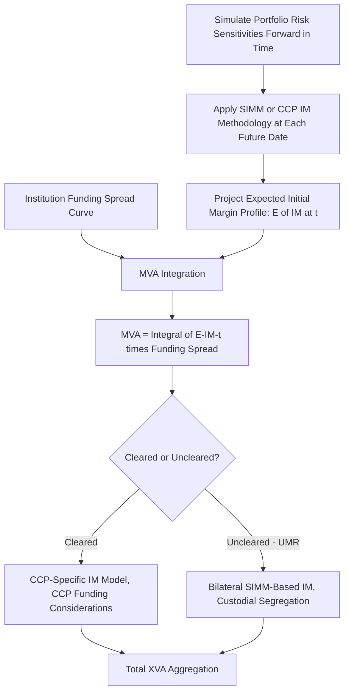
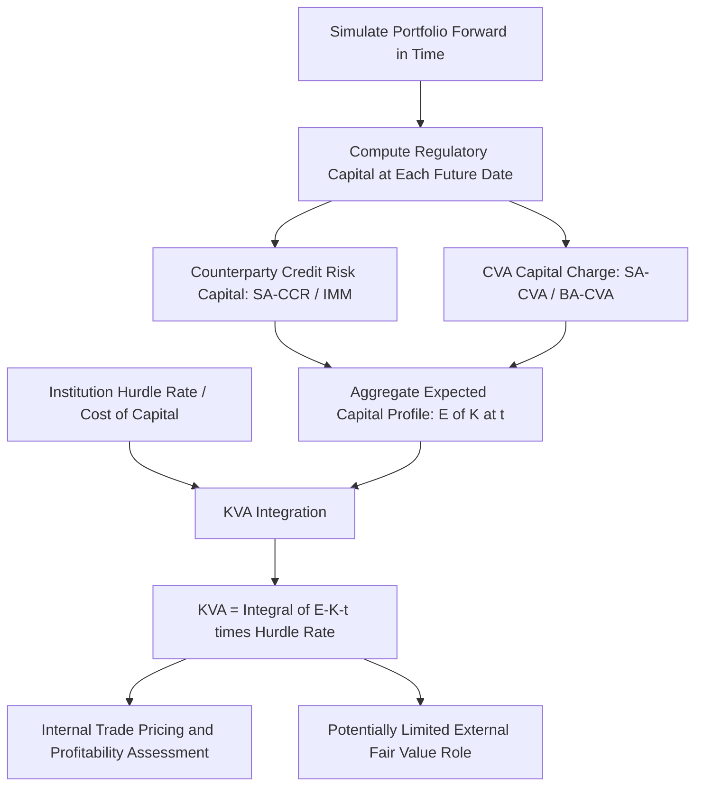

## Margin and Capital Valuation Adjustments MVA and KVA


### Overview

Margin Valuation Adjustment (MVA) and Capital Valuation Adjustment (KVA) complete the XVA suite built up across this chapter, addressing two further frictions beyond default risk (CVA/DVA) and unsecured funding (FVA): the cost of funding **initial margin** posted against derivatives positions, and the cost of holding **regulatory capital** against those same positions over their life. Both adjustments emerged later in the XVA literature than CVA/DVA/FVA, driven directly by post-2008 regulatory reforms — mandatory initial margin requirements for non-centrally-cleared derivatives, and the Basel III capital framework — that introduced these costs as material, quantifiable features of running a derivatives book rather than secondary considerations.

### Margin Valuation Adjustment (MVA)

#### Conceptual Origin

**Key Points**

- Post-2008 reforms (notably the Basel Committee on Banking Supervision/IOSCO framework for margin requirements on non-centrally-cleared derivatives, and mandatory initial margin at CCPs for cleared trades) require counterparties to post **initial margin (IM)** in addition to variation margin (VM) — collateral sized to cover potential future exposure over a close-out period, held to protect against gap risk in a default scenario, distinct from variation margin's role of covering current mark-to-market exposure.
- Unlike variation margin (which typically moves dollar-for-dollar with the position's MTM and is usually posted/received as cash, largely funding-neutral in steady state), initial margin is a **standalone funding requirement**: the posting party must source and fund this collateral for the life of the requirement, and — critically — initial margin is typically **segregated** and does not earn the posting party a return equivalent to its funding cost, creating a genuine funding drag analogous to (but distinct from) the FVA concept covered in the previous topic.
- MVA is the present value of this initial margin funding cost over the life of the derivatives position, computed by projecting the expected initial margin requirement forward through time and applying the institution's funding spread to that projected IM balance.

#### The MVA Formula

$$MVA = \int_0^T \mathbb{E}[IM(t)] \cdot s_{funding}(t) \, dt$$

Where:

- $\mathbb{E}[IM(t)]$ = the expected initial margin requirement at time $t$, which itself typically must be estimated via a forward-projected **SIMM (Standard Initial Margin Model)** calculation or CCP-specific IM methodology applied to simulated future portfolio states
- $s_{funding}(t)$ = the institution's funding spread, structurally the same input used in the FVA calculation from the previous topic

**Key Points**

- Computing MVA is substantially more computationally intensive than CVA/DVA/FVA because it requires **simulating the initial margin requirement itself forward in time** — not merely the portfolio's MTM value, but the full risk-sensitivity profile (e.g., SIMM's risk-factor sensitivity buckets) that determines IM at each future simulation date, often requiring nested simulation or regression-based approximation techniques (conceptually related to the American Monte Carlo methods referenced for path-dependent exposure in the exposure measurement topic).
- MVA is generally most significant for **long-dated, non-centrally-cleared derivatives** subject to bilateral IM requirements (uncleared margin rules, "UMR"), and for centrally cleared trades where CCP-mandated initial margin is a standard feature of clearing membership — meaning MVA has become a first-order pricing consideration precisely because of the regulatory mandate that created mandatory IM posting for large swaths of the derivatives market.
- [Unverified] The specific IM methodology (ISDA SIMM parameters, CCP-specific margin models, and applicable thresholds under uncleared margin rules) is technical, jurisdiction-specific, and subject to periodic recalibration, so any specific IM sizing assumption should be verified against the current applicable SIMM version or CCP margin methodology documentation rather than treated as fixed.

#### MVA Calculation Workflow



### Capital Valuation Adjustment (KVA)

#### Conceptual Origin

**Key Points**

- Basel III (and successor Basel III finalization reforms) require banks to hold regulatory capital against counterparty credit risk exposures — including the capital charges discussed in the exposure measurement topic (SA-CCR-based default risk capital) and the CVA capital charge discussed in the CVA topic (SA-CVA/BA-CVA).
- Holding regulatory capital is not free: shareholders require a return on the capital allocated to support a given business activity, typically expressed as a **hurdle rate** or **cost of capital (CoC)** — meaning that every derivatives position, by consuming regulatory capital over its life, imposes an economic cost on the institution equal to the cost of capital applied to the capital consumed.
- KVA is the present value of this cost-of-capital charge, projected over the life of the trade/portfolio, analogous in structure to MVA but driven by projected **regulatory capital requirements** rather than projected initial margin requirements.

#### The KVA Formula

$$KVA = \int_0^T \mathbb{E}[K(t)] \cdot h(t) \, dt$$

Where:

- $\mathbb{E}[K(t)]$ = the expected regulatory capital requirement (encompassing relevant components — counterparty credit risk capital, CVA capital, and potentially other applicable charges) at future time $t$
- $h(t)$ = the institution's hurdle rate / cost of capital, reflecting the return shareholders require on capital allocated to the derivatives business

**Key Points**

- Like MVA, computing KVA requires projecting a regulatory quantity (capital requirement) forward through simulated future states, compounding the computational complexity already present in exposure/CVA/MVA simulation with the additional layer of applying the relevant regulatory capital formula (SA-CCR, SA-CVA, or applicable internal model outputs) at each future simulated date.
- KVA is generally understood as the least standardized and most institution-specific of the major XVA components, since the hurdle rate is a firm-specific (often business-line-specific) internal cost-of-capital assumption set by senior management/finance functions, not a market-observable input in the way CDS spreads (CVA/DVA) or funding spreads (FVA/MVA) are.
- [Inference] Because KVA depends on a subjective, internally-determined hurdle rate rather than a market-calibrated input, it is generally regarded in practitioner discussion as sitting furthest from a "market-consistent" valuation adjustment and closest to an internal strategic/profitability pricing tool — meaning its role in external fair value reporting (as distinct from internal trade pricing and profitability assessment) is understood to be more limited and institution-dependent than CVA/DVA's more established accounting grounding, a characterization that should be treated as a general practitioner framing rather than a definitive standardized rule, given the continuing evolution of practice in this area.

#### KVA Calculation Workflow



### MVA and KVA in the Full XVA Stack

The complete XVA suite, building cumulatively across this chapter's topics, can be summarized as follows:

| Adjustment | Risk Priced | Key Input | Primary Purpose |
| --- | --- | --- | --- |
| CVA | Counterparty default risk | Counterparty CDS/PD, EE | Fair value + regulatory capital |
| DVA | Own default risk | Own CDS/PD, ENE | Fair value (bilateral symmetry) |
| FVA | Unsecured funding cost/benefit | Own funding spread, EE/ENE | Economic/funding pricing |
| MVA | Initial margin funding cost | Own funding spread, projected IM | Economic/funding pricing |
| KVA | Regulatory capital cost | Hurdle rate, projected capital | Internal profitability pricing |

$$\text{Total XVA} = CVA - DVA + FVA + MVA + KVA$$

[Inference] This additive total is a commonly used organizing framework in the XVA literature for conceptual purposes, but given the documented FVA/DVA overlap debate discussed in the previous topic, a naive fully-additive sum across all five components may double-count certain own-credit/funding-related effects unless the institution has an explicit, internally consistent netting/overlap policy — so this formula should be understood as an organizing summary of the component parts rather than a claim that simple addition is universally the correct aggregation methodology across all institutional practice.

### Full XVA Stack Visualization (svg_diagram)

<svg xmlns="http://www.w3.org/2000/svg" viewBox="0 0 700 340">
<text x="350" y="24" text-anchor="middle" font-size="16" font-weight="bold" font-family="sans-serif">The XVA Stack (svg_diagram)</text>
<g font-family="sans-serif" font-size="13">
<rect x="200" y="45" width="300" height="42" fill="#e3f2fd" stroke="#1565c0" />
<text x="350" y="71" text-anchor="middle">Risk-Free Derivative Value</text>



```
<rect x="200" y="92" width="300" height="42" fill="#ffebee" stroke="#c62828" />
<text x="350" y="118" text-anchor="middle">− CVA (Counterparty Default Risk)</text>

<rect x="200" y="139" width="300" height="42" fill="#e8f5e9" stroke="#2e7d32" />
<text x="350" y="165" text-anchor="middle">+ DVA (Own Default Risk)</text>

<rect x="200" y="186" width="300" height="42" fill="#fff3e0" stroke="#ef6c00" />
<text x="350" y="212" text-anchor="middle">± FVA (Funding Cost/Benefit)</text>

<rect x="200" y="233" width="300" height="42" fill="#f3e5f5" stroke="#6a1b9a" />
<text x="350" y="259" text-anchor="middle">− MVA (Initial Margin Funding)</text>

<rect x="200" y="280" width="300" height="42" fill="#eceff1" stroke="#455a64" />
<text x="350" y="306" text-anchor="middle">− KVA (Regulatory Capital Cost)</text>
```

</g>
</svg>

### Interaction Between MVA and KVA

**Key Points**

- MVA and KVA are related but address different constraints: MVA prices the funding cost of posting collateral that is largely mandated by regulation (UMR/CCP rules) to mitigate counterparty risk in a default scenario, while KVA prices the cost of capital held against the residual risk that remains even after that collateral mitigation.
- There is a documented interaction: higher initial margin (driving MVA) generally *reduces* the residual exposure that drives regulatory capital requirements (since IM directly mitigates the potential future exposure inputs to SA-CCR/CVA capital calculations) — meaning MVA and KVA are not fully independent, and a rigorous joint calculation should reflect this exposure-mitigating effect of IM on the capital projection feeding KVA, rather than computing each in isolation using inconsistent exposure assumptions.
- [Unverified] The precise quantitative interaction/offset relationship between IM-driven exposure reduction and capital charge reduction depends on the specific regulatory capital formula (SA-CCR mechanics) and margin methodology in effect, and should be modeled with reference to the current applicable regulatory technical specifications rather than assumed to follow a simple universal relationship.

### Common Implementation Failure Modes

- **Treating MVA/KVA as static point-in-time costs rather than dynamically projected**: given both require forward projection of margin/capital requirements (not just portfolio MTM), using a static current-IM or current-capital figure rather than a properly simulated forward profile materially understates or misstates these adjustments for long-dated trades.
- **Inconsistent hurdle rate application across business lines**: applying a single firm-wide hurdle rate to KVA calculations without reflecting genuinely different risk/return profiles or capital efficiency across different derivatives business lines, distorting relative trade profitability comparisons.
- **Ignoring the MVA-KVA exposure interaction**: computing MVA and KVA using inconsistent underlying exposure/capital assumptions that don't reflect how IM posting mitigates the capital charge, as flagged above, leading to a double-counted or internally inconsistent total XVA figure.
- **Applying KVA inappropriately to external fair value reporting**: given KVA's internally-determined hurdle rate input and its practitioner characterization as closer to an internal pricing tool, institutions should exercise particular care (and generally seek accounting guidance) before including KVA in formal fair value financial statement adjustments, versus its more established role in internal trade pricing and desk profitability assessment.
- **Underestimating MVA computational burden**: given the nested-simulation requirement for projecting IM forward, under-resourcing the computational infrastructure for MVA (e.g., relying on simplified proxies that don't capture genuine SIMM sensitivity-bucket dynamics) can materially misprice long-dated, IM-heavy trades.

### Worked Example

Continuing the running 5-year swap example: suppose the trade is subject to bilateral uncleared margin rules, requiring both variation margin (already assumed in the FVA topic's baseline) and initial margin.

- A SIMM-based calculation projects an average expected initial margin requirement of approximately $8 million over the trade's life (reflecting the swap's risk sensitivity profile under the SIMM methodology).
- Using the same 0.80% funding spread from the FVA topic: $MVA \approx \$8\text{ million} \times 0.80\% \times 5\text{ years (illustrative time-weighted approximation)} \approx \$320{,}000$ — a funding cost, since IM must be sourced and funded without offsetting return.
- Separately, suppose the trade's regulatory capital requirement (combining SA-CCR default risk capital and SA-CVA capital) averages approximately $2 million over its life, and the institution's hurdle rate is 12%: $KVA \approx \$2\text{ million} \times 12\% \times 5\text{ years (illustrative time-weighted approximation)} \approx \$1{,}200{,}000$.
- A properly integrated calculation would recognize that the $8 million IM posting (driving the MVA figure above) itself reduces the exposure inputs feeding the $2 million capital estimate (driving KVA) — meaning these two figures, computed independently in this simplified illustration, would in a rigorous joint framework need reconciliation to avoid inconsistency between the IM-mitigated and unmitigated exposure assumptions feeding each calculation respectively.
- Combining across this chapter's running example: Total XVA ≈ CVA ($144,000) − DVA ($72,000) + FVA (−$40,000) + MVA ($320,000) + KVA ($1,200,000) ≈ **$1,552,000**, illustrating how KVA and MVA, once mandatory margin and capital regimes are considered, can dominate the total XVA figure relative to the earlier CVA/DVA/FVA components for a bilaterally-margined, capital-intensive trade — a pattern broadly consistent with the post-crisis regulatory reforms (UMR, Basel III capital) having been specifically designed to make these costs economically material.

**Related Topics**

- ISDA SIMM methodology and risk-sensitivity-bucket mechanics
- SA-CCR and SA-CVA regulatory capital formula interaction with IM mitigation
- Cost-of-capital / hurdle rate determination methodologies in bank finance functions
- Central clearing IM models vs. bilateral SIMM-based uncleared margin rules
- Full XVA desk P&L attribution and cross-adjustment consistency governance
- Nested simulation and regression-based techniques for forward IM/capital projection
- Accounting and fair value reporting boundaries for MVA and KVA specifically