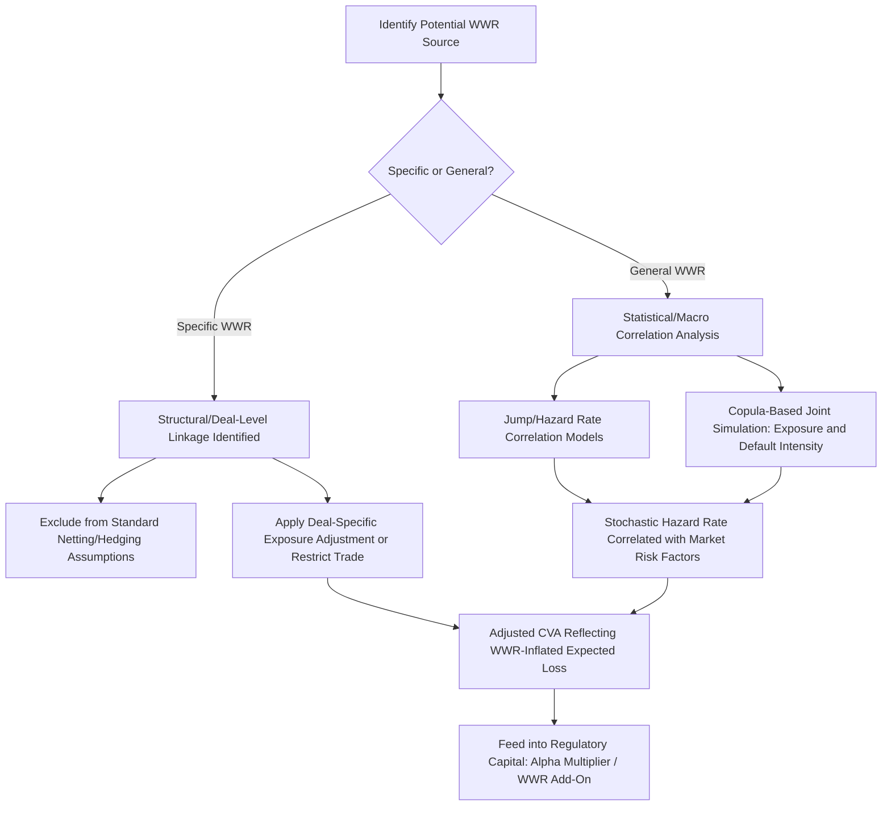

## Wrong Way Risk


### Overview

Wrong-Way Risk (WWR) arises when exposure to a counterparty is adversely correlated with that counterparty's own credit quality — meaning exposure tends to be highest precisely when the probability of the counterparty defaulting is also elevated. This directly undermines a core simplifying assumption embedded in the standard CVA formula covered earlier in this chapter, which — in its baseline form — treats exposure $EE(t)$ and default probability $PD(t)$ as independently computable and then multiplies them together. Wrong-way risk is the case where that independence assumption breaks down, and it is one of the most operationally and modeling-significant complications in the counterparty credit risk framework, referenced but not fully developed in the earlier exposure measurement and CVA topics.

### Conceptual Definition

**Key Points**

- **General Wrong-Way Risk (GWWR)**: arises from a broad, macro-level correlation between a counterparty's creditworthiness and general market risk factors — for example, a counterparty in a cyclical industry whose credit quality tends to deteriorate during the same broad market downturns that also happen to increase the bank's exposure to that counterparty across its derivatives book generally.
- **Specific Wrong-Way Risk (SWWR)**: arises from a direct, structural, deal-specific or entity-specific linkage between the exposure-generating instrument and the counterparty's own credit quality — the canonical example being a derivative referencing the counterparty's own equity, debt, or a closely affiliated entity's securities, where the underlying and the counterparty's credit risk are mechanically linked, not merely statistically correlated.
- The distinction matters because **specific WWR is generally considered the more severe and more tractable-to-identify case** (the linkage is structural and often can be identified by inspection of the trade's terms), while **general WWR is more diffuse, harder to detect systematically, and requires portfolio-level or macro correlation modeling** to capture.
- **Right-Way Risk** is the favorable mirror image — exposure that tends to *decrease* precisely when counterparty default probability rises, which is beneficial from a risk perspective but receives comparatively less regulatory and modeling attention given the asymmetric focus on downside risk in prudential frameworks.

### Canonical Examples of Specific Wrong-Way Risk

**Key Points**

- **Equity derivatives referencing the counterparty's own stock**: e.g., a total return swap or option where the bank has positive exposure precisely when the counterparty's own share price has fallen — a scenario where declining equity value is often itself correlated with (or a leading indicator of) rising default probability for that same entity.
- **Credit default swaps where the reference entity is affiliated with the counterparty**: for example, a CDS bought from a bank counterparty referencing a corporate entity closely tied to that same bank (e.g., a major borrower, a sovereign whose fiscal health is closely linked to that bank's home jurisdiction, or a financial institution in the same banking group) — if the reference entity defaults, the protection-selling counterparty's own ability to pay may be simultaneously impaired by the same shock.
- **Collateral wrong-way risk**: where collateral posted by the counterparty is itself correlated with that counterparty's own credit quality (e.g., a counterparty posting its own company's bonds or shares as collateral) — in a default scenario, the collateral's value may decline precisely when it is most needed, a distinct but related manifestation sometimes analyzed separately as "wrong-way collateral risk."
- **Emerging market sovereign/bank linkage**: derivatives with an emerging-market bank counterparty where the exposure is driven by that same country's currency or sovereign risk — since sovereign and domestic bank credit quality are frequently closely linked (the so-called "sovereign-bank nexus"), a currency or rates derivative with such a counterparty can carry embedded general WWR even without an explicit contractual linkage.

### Mathematical Framing: Why Independence Fails

The standard CVA formula from the earlier topic assumes:

$$CVA_{\text{independent}} = (1-R)\sum_i EE(t_i) \cdot PD(t_{i-1}, t_i)$$

implicitly treating $EE(t)$ and the default event as independent, so that the expectation of their product equals the product of their expectations. Under wrong-way risk, exposure and default probability are correlated, so the *true* CVA requires the expectation of the product directly:

$$CVA_{\text{true}} = (1-R) \, \mathbb{E}\left[ \sum_i \max(V(t_i), 0) \cdot \mathbb{1}_{\{\tau \in (t_{i-1}, t_i]\}} \right]$$

Where $\tau$ is the counterparty's default time. When exposure $V(t)$ and default timing $\tau$ are positively correlated (WWR), this true expectation **exceeds** the independence-based approximation, meaning standard CVA calculations that ignore WWR **systematically understate** true counterparty risk for WWR-affected trades.

$$\text{WWR present} \implies CVA_{\text{true}} > CVA_{\text{independent}}$$

### Wrong-Way Risk Modeling Approaches



**Key Points**

- **Copula-based approaches**: model the joint distribution of the market risk factors driving exposure and the counterparty's default intensity (hazard rate) using a copula structure that allows for correlation between the two, going beyond the independence assumption while preserving tractable marginal distributions for each component individually.
- **Stochastic intensity models with correlated drivers**: model the counterparty's default hazard rate as itself a stochastic process correlated with the underlying market risk factors (e.g., linking default intensity to the same interest rate, equity, or FX factors driving the exposure simulation), allowing WWR to emerge endogenously from the joint dynamics rather than being imposed as an ad hoc adjustment.
- **Deal-specific exclusion/restriction approaches**: for clearly identified specific WWR (e.g., a derivative referencing the counterparty's own name), many institutions apply policy-based restrictions — either declining to trade such structures, requiring specific additional approval, or applying a deal-specific conservative exposure add-on — rather than relying purely on statistical correlation modeling, given the structural (near-certain) nature of specific WWR versus the more probabilistic nature of general WWR.
- [Inference] Copula and correlated-intensity modeling approaches are generally understood in the quantitative finance literature to be more suited to capturing general WWR (where the correlation is genuinely statistical/macro in nature) than specific WWR (where the linkage is closer to a structural certainty that arguably requires a different, more deterministic treatment such as direct exclusion or an explicit worst-case exposure assumption), reflecting the differing character of the two WWR categories described above.

### Regulatory Treatment of Wrong-Way Risk

**Key Points**

- Basel Committee guidance has historically required banks using internal models (IMM) for counterparty credit risk capital to specifically identify and address wrong-way risk, given the demonstrated tendency of standard EPE-based capital models to understate risk when WWR is present — this connects directly to the IMM approach referenced in the exposure measurement topic's regulatory methodology comparison.
- The **alpha multiplier** used in regulatory EAD (Exposure at Default) calculations under both IMM and SA-CCR frameworks (referenced in the exposure measurement topic) is, in part, calibrated to reflect general portfolio-level effects including a conservative buffer for risks such as general wrong-way risk that are difficult to capture precisely at the individual netting-set level — though [Unverified] the exact calibration rationale and whether it is considered a fully sufficient WWR buffer versus requiring additional firm-specific WWR add-ons should be confirmed against current Basel Committee technical documentation, since this has been subject to ongoing regulatory refinement.
- Specific wrong-way risk transactions are frequently subject to **enhanced supervisory scrutiny and specific capital treatment** distinct from the general portfolio-level alpha buffer, reflecting regulators' view that specific WWR represents a more severe and more readily identifiable risk than the general case, warranting more targeted (rather than purely statistical-model-based) regulatory response.
- Regulatory stress testing frameworks for counterparty credit risk frequently include specific WWR scenario requirements, testing whether a bank's exposure to systemically important or concentrated counterparties would spike under stress scenarios correlated with those same counterparties' credit deterioration.

### WWR Exposure-Default Correlation Visualization (svg_diagram)

<svg xmlns="http://www.w3.org/2000/svg" viewBox="0 0 680 320">
<text x="340" y="24" text-anchor="middle" font-size="16" font-weight="bold" font-family="sans-serif">Wrong-Way Risk: Exposure vs Default Intensity (svg_diagram)</text>
<g font-family="sans-serif" font-size="12">
<line x1="60" y1="270" x2="620" y2="270" stroke="#333" stroke-width="1.5" />
<line x1="60" y1="270" x2="60" y2="50" stroke="#333" stroke-width="1.5" />
<text x="330" y="300" text-anchor="middle">Time / Market Stress</text>



```
<path d="M 60 250 C 200 230, 350 150, 620 70" fill="none" stroke="#c62828" stroke-width="2.5" />
<text x="420" y="95" fill="#c62828" font-weight="bold">Exposure (WWR case)</text>

<path d="M 60 260 C 200 240, 350 160, 620 80" fill="none" stroke="#6a1b9a" stroke-width="2.5" stroke-dasharray="5,3" />
<text x="380" y="165" fill="#6a1b9a" font-weight="bold">Counterparty Default Intensity</text>

<path d="M 60 250 C 200 200, 350 170, 620 150" fill="none" stroke="#1565c0" stroke-width="2" stroke-dasharray="2,2" />
<text x="200" y="185" fill="#1565c0" font-size="11">Independence-assumed exposure (understated)</text>
```

</g>
</svg>

### Wrong-Way Risk and Structured Products

**Key Points**

- Connecting to the structured products distribution chapter's complexity topic: certain structured product hedging arrangements can embed WWR at the manufacturer's hedge-desk level — for example, a bank hedging a structured note referencing an emerging-market equity basket via swaps with a local counterparty whose own credit quality is closely tied to that same emerging market's macro conditions exhibits classic general WWR characteristics.
- Credit-linked notes represent a particularly clear structural connection to specific WWR: a note where the coupon or principal is linked to the credit quality of a reference entity, sold via a special purpose vehicle or directly by an issuer, can embed WWR-like dynamics if the issuer's own credit quality is correlated with the reference entity's — a dynamic conceptually similar to the affiliated-reference-entity CDS example described above, and a reason such structures often receive specific additional scrutiny in both product design and the manufacturer's internal hedge-desk risk management.
- This reinforces a recurring theme across this chapter: the institutional-level modeling challenges (WWR, exposure simulation, XVA) that determine a bank's internal cost of manufacturing and hedging a structured product are conceptually distinct from, but ultimately feed into, the pricing and risk characteristics that are then disclosed to and assessed for retail investors under the suitability, complexity-rating, and disclosure frameworks covered earlier in this material.

### Common Implementation Failure Modes

- **Failing to identify specific WWR at deal inception**: booking a trade with an evident structural linkage to the counterparty's own credit quality (e.g., referencing the counterparty's own equity or an affiliated entity) without flagging it for the enhanced review process such transactions typically warrant, relying instead on standard independence-assumption CVA pricing that will materially understate true risk.
- **Applying only general WWR statistical models to specific WWR cases**: using a copula-correlation-based adjustment calibrated for diffuse macro correlation when the actual risk is a near-deterministic structural linkage, understating the severity of genuinely specific WWR scenarios that may warrant a more conservative, near-worst-case exposure treatment rather than a moderate correlation adjustment.
- **Ignoring collateral wrong-way risk separately from exposure wrong-way risk**: focusing WWR analysis solely on the derivative's own exposure profile while failing to also assess whether posted collateral is itself correlated with the same counterparty's credit quality, missing a related but analytically distinct risk channel.
- **Static correlation assumptions that break down under stress**: using historically-calibrated correlation parameters for general WWR modeling that fail to capture correlation spikes during genuine crisis conditions — a limitation also flagged under the exposure measurement topic's failure modes, and particularly acute for WWR specifically since WWR's economic significance is concentrated precisely in tail/stress scenarios where historical average correlations are least representative.
- **Treating the regulatory alpha multiplier as a complete WWR solution**: assuming the standardized regulatory buffer (alpha multiplier under IMM/SA-CCR) fully addresses firm-specific WWR concentrations, when it is generally understood as a portfolio-level, generic conservatism buffer rather than a substitute for identifying and specifically managing concentrated or specific WWR exposures within a firm's actual book.

### Worked Example

A bank sells CDS protection to Counterparty X (a mid-sized regional bank in Country Y) referencing the sovereign debt of Country Y itself.

- This is a textbook **specific wrong-way risk** structure: if Country Y's sovereign credit deteriorates (triggering the CDS to move in-the-money for the protection buyer, generating exposure to Counterparty X), Counterparty X's own creditworthiness — as a bank domiciled in and heavily exposed to Country Y's sovereign and economy — is very likely simultaneously deteriorating for the same underlying reason (the classic sovereign-bank nexus referenced above).
- A standard independence-assumption CVA calculation, treating Counterparty X's default probability and the CDS exposure as independently computable, would **materially understate** the true expected loss, since in the scenario that matters most (sovereign stress), both the exposure and the default probability spike together rather than being driven by unrelated risk factors.
- A properly risk-managed approach would likely flag this trade for specific WWR treatment at inception — potentially declining the trade, requiring additional collateral/margin terms, applying a conservative deterministic exposure assumption rather than the standard simulated EE profile, or at minimum ensuring the CVA desk (referenced in the earlier CVA topic) explicitly overlays a WWR adjustment onto the standard independence-based CVA figure before pricing or accepting the trade.
- This example also illustrates the specific-vs-general distinction concretely: had the bank instead faced generic, unrelated *market-wide* volatility correlated only loosely with Counterparty X's credit quality (rather than the direct sovereign-bank structural link), the analysis would sit closer to general WWR, warranting the copula/correlated-intensity modeling approaches described above rather than a near-automatic deal-level restriction.

**Related Topics**

- Copula-based joint simulation techniques for correlated exposure and default intensity
- Stochastic hazard rate models with market-factor-correlated default intensity
- Regulatory alpha multiplier calibration under IMM and SA-CCR
- Sovereign-bank nexus risk and emerging market counterparty exposure
- Credit-linked note structuring and embedded wrong-way risk considerations
- WWR stress testing scenario design for regulatory and internal risk management
- Collateral wrong-way risk as a distinct analytical category from exposure WWR