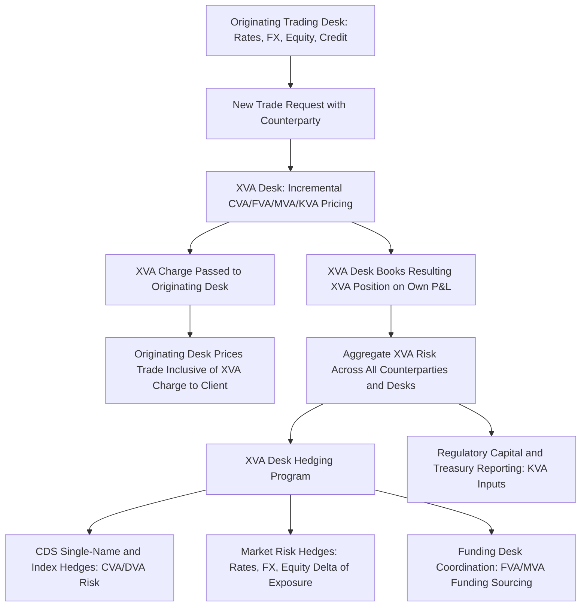

## XVA Desk Organization and Hedging


### Overview

The XVA desk is the organizational function responsible for centralizing, pricing, and managing the full suite of valuation adjustments covered across this chapter — CVA, DVA, FVA, MVA, and KVA — on behalf of an institution's derivatives franchise. This topic synthesizes the preceding, largely quantitative XVA topics into an operational and organizational lens: how banks structure the desk itself, how P&L and cost is attributed across the firm, and how the resulting aggregate XVA risk is hedged in practice. Where earlier topics addressed "how each adjustment is calculated," this topic addresses "who calculates and manages it, and how the resulting risk is run."

### Rationale for Centralization

**Key Points**

- Prior to the emergence of dedicated XVA desks (a post-2008 development in most major dealers, following the crisis-driven prominence of CVA/FVA discussed in earlier topics), counterparty risk pricing was often handled in a decentralized, inconsistent manner by individual trading desks, each applying ad hoc or desk-specific credit adjustments.
- Centralization addresses the **netting-set non-additivity problem** flagged in the CVA topic: because incremental CVA (and FVA/MVA) depends on the *existing* portfolio with a given counterparty, only a centralized function with visibility across the *entire* firm's exposure to that counterparty can correctly price the true marginal XVA cost of a new trade — a desk-siloed pricing approach cannot see this portfolio effect and will systematically mis-price trades relative to their true incremental contribution.
- Centralization also enables **netting of XVA risk itself** across the firm's book — e.g., CVA CS01 hedges (single-name or index CDS) can be managed as a single aggregated position across all business lines' exposure to a given counterparty, rather than each desk independently and redundantly (or inconsistently) hedging its own slice of exposure to the same name.

### Typical XVA Desk Organizational Model



**Key Points**

- **Origination-to-XVA-desk workflow**: when a trading desk wants to execute a new derivative with a given counterparty, it typically requests an XVA quote (incremental CVA, FVA, MVA, and sometimes KVA) from the centralized XVA desk *before* pricing the trade to the client — the XVA charge becomes a direct input to the client-facing price, ensuring counterparty risk costs are embedded in execution rather than absorbed silently by the firm.
- **P&L attribution mechanics**: the XVA desk typically "owns" the resulting XVA position on its own book (taking on the associated CVA/DVA/FVA/MVA risk and managing it centrally), while the originating desk's P&L reflects the trade net of the XVA charge paid — this separation allows each function's performance to be measured against its own mandate (origination/client relationship for trading desks; counterparty risk management for the XVA desk).
- [Inference] The precise mechanics of P&L attribution, charge-back methodology, and whether the XVA desk operates as a formal internal "counterparty" to originating desks (booking offsetting internal trades) or via a simpler cost-allocation model varies considerably by institution and is generally a matter of each firm's specific internal governance and finance function design, so this description represents a commonly observed general pattern rather than a single universally standardized architecture.

### XVA Desk Hedging Instruments and Strategy

**Key Points**

- **CVA/DVA hedging**: primarily via single-name CDS (where liquid, directly hedging identified counterparty default risk) and CDS index products (e.g., CDX, iTraxx) for counterparties without liquid single-name CDS or for hedging systematic/portfolio-level credit spread risk — echoing the CVA topic's discussion of hedging instruments but framed here at the aggregated desk level rather than per-trade.
- **Market risk (exposure) hedging**: since CVA/DVA/FVA/MVA all depend on the underlying exposure profile $EE(t)/ENE(t)$, which is itself sensitive to the same market risk factors (rates, FX, equity, commodities) driving the underlying derivatives, the XVA desk must also hedge the **exposure sensitivity** of its CVA/FVA/MVA book to these market factors — meaning the XVA desk runs a genuine multi-asset-class Greeks book (CVA delta with respect to rates, FX delta of exposure, etc.), not merely a pure credit-spread hedging operation.
- **Funding coordination with treasury**: FVA and MVA pricing (from the earlier topics) depend on the institution's actual funding spread and its projected funding requirements — the XVA desk typically works closely with (or is functionally integrated with) the treasury/funding desk to ensure FVA/MVA pricing reflects genuine, achievable funding costs rather than a theoretical or inconsistent internal assumption.
- **Wrong-way risk overlay management**: per the previous topic, WWR-affected trades require specific handling distinct from standard CVA hedging — the XVA desk (or a specialized function within it) typically maintains policies for identifying, pricing, and where appropriate declining or restricting WWR-affected trades, since standard CDS hedges may not adequately capture the true risk of structurally WWR-linked exposures.

### CVA Greeks and Risk Management

**Key Points**

- **CS01 (Credit Spread 01)**: sensitivity of the CVA book's value to a 1 basis point parallel shift in a counterparty's (or index's) credit spread curve — the primary risk metric driving single-name/index CDS hedge sizing.
- **Exposure-driven Greeks**: sensitivities of the CVA/FVA/MVA figures to the underlying market risk factors (e.g., CVA delta to interest rates, CVA vega to volatility for option-heavy portfolios) — these arise because the exposure profile $EE(t)$ itself depends on simulated market factor paths, meaning a shift in current market levels or volatility changes the projected future exposure and hence the XVA figures, independent of any change in credit spreads.
- **Cross-gamma and higher-order sensitivities**: because CVA depends jointly on exposure *and* credit spreads (and WWR-affected trades depend on the *correlation* between them), sophisticated XVA desks also monitor cross-sensitivities (e.g., how CS01 itself changes as underlying market levels move) — a materially more complex risk profile than a standard single-asset-class trading desk's Greeks, reflecting XVA's inherently multi-factor, path-dependent nature established across the earlier exposure and CVA topics.

### XVA Desk P&L and Risk Flow Visualization (svg_diagram)

<svg xmlns="http://www.w3.org/2000/svg" viewBox="0 0 700 300">
<text x="350" y="24" text-anchor="middle" font-size="16" font-weight="bold" font-family="sans-serif">XVA Desk Risk Aggregation and Hedging (svg_diagram)</text>
<g font-family="sans-serif" font-size="12">
<rect x="40" y="50" width="140" height="45" fill="#e3f2fd" stroke="#1565c0" />
<text x="110" y="77" text-anchor="middle">Rates Desk</text>
<rect x="200" y="50" width="140" height="45" fill="#e3f2fd" stroke="#1565c0" />
<text x="270" y="77" text-anchor="middle">FX Desk</text>
<rect x="360" y="50" width="140" height="45" fill="#e3f2fd" stroke="#1565c0" />
<text x="430" y="77" text-anchor="middle">Equity Desk</text>
<rect x="520" y="50" width="140" height="45" fill="#e3f2fd" stroke="#1565c0" />
<text x="590" y="77" text-anchor="middle">Credit Desk</text>



```
<line x1="110" y1="95" x2="350" y2="150" stroke="#666" />
<line x1="270" y1="95" x2="350" y2="150" stroke="#666" />
<line x1="430" y1="95" x2="350" y2="150" stroke="#666" />
<line x1="590" y1="95" x2="350" y2="150" stroke="#666" />

<rect x="200" y="150" width="300" height="50" fill="#fff3e0" stroke="#ef6c00" />
<text x="350" y="180" text-anchor="middle" font-weight="bold">Centralized XVA Desk</text>

<line x1="280" y1="200" x2="220" y2="250" stroke="#666" />
<line x1="350" y1="200" x2="350" y2="250" stroke="#666" />
<line x1="420" y1="200" x2="480" y2="250" stroke="#666" />

<rect x="100" y="250" width="140" height="40" fill="#e8f5e9" stroke="#2e7d32" />
<text x="170" y="275" text-anchor="middle" font-size="11">CDS Hedges</text>
<rect x="280" y="250" width="140" height="40" fill="#e8f5e9" stroke="#2e7d32" />
<text x="350" y="275" text-anchor="middle" font-size="11">Market Risk Hedges</text>
<rect x="460" y="250" width="140" height="40" fill="#e8f5e9" stroke="#2e7d32" />
<text x="530" y="275" text-anchor="middle" font-size="11">Treasury/Funding Coord.</text>
```

</g>
</svg>

### Interaction with Regulatory Capital and Treasury Functions

**Key Points**

- The XVA desk's activity feeds directly into several regulatory reporting and capital streams established in the earlier CVA and MVA/KVA topics: the CVA capital charge (SA-CVA/BA-CVA), counterparty credit risk capital (SA-CCR/IMM), and — where the institution incorporates it — internal KVA-based profitability metrics used in capital allocation decisions across business lines.
- Close coordination with the **treasury function** is essential given FVA and MVA's dependence on the institution's actual funding curve (as discussed in the FVA and MVA topics) — treasury typically owns the firm's overall funding strategy and cost of funds, meaning the XVA desk's FVA/MVA pricing inputs are often sourced from or closely coordinated with treasury's funds transfer pricing framework, rather than being independently derived by the XVA function in isolation.
- **Risk committee and model governance oversight**: given the complexity and materiality of XVA figures (as illustrated by the chapter's running worked example, where KVA and MVA dominated the total XVA figure), most institutions subject XVA models — exposure simulation, CVA/DVA/FVA/MVA/KVA calculation methodologies, and hedging effectiveness — to formal model validation and risk committee governance, reflecting the significant P&L and capital impact these models carry.

### Common Organizational and Hedging Failure Modes

- **Incomplete centralization creating pricing inconsistency**: if certain business lines or legal entities within a group are excluded from the centralized XVA desk's purview (e.g., due to legacy systems, acquired subsidiaries, or regional booking model complexity), the netting-set-level incremental pricing benefit discussed above breaks down for the excluded population, reintroducing the desk-siloed mispricing problem centralization was designed to solve.
- **Hedge basis risk between proxy and actual instruments**: for counterparties without liquid single-name CDS, using index or sector proxy hedges introduces basis risk between the proxy's behavior and the actual counterparty's credit dynamics — a hedge effectiveness gap that can be material during idiosyncratic credit events affecting the specific counterparty but not the broader index/sector.
- **Under-resourced computational infrastructure for real-time incremental pricing**: given the simulation-intensive nature of exposure, MVA, and KVA calculation (flagged repeatedly across this chapter's topics), providing traders with genuinely real-time incremental XVA quotes for pricing decisions is a significant technology challenge — approximation techniques (e.g., pre-computed sensitivity grids, machine-learning-based exposure proxies) are increasingly used to bridge the gap between full simulation accuracy and trading-desk response-time requirements, though such approximations introduce their own model risk that requires separate validation.
- **Governance gaps around WWR and specific-risk overlays**: if the XVA desk's standard pricing/hedging workflow doesn't have a clear, enforced escalation path for identified specific wrong-way risk trades (per the previous topic), such trades can be priced and hedged using standard (WWR-blind) methodology, understating true risk despite the WWR having been technically "identified" at some point in the process.
- **Misaligned incentives between originating desks and the XVA desk**: if originating trading desks perceive the XVA charge purely as a cost to be minimized (e.g., through counterparty selection or netting set structuring primarily aimed at reducing the charge rather than genuinely reducing risk), this can create tension between the XVA desk's risk management mandate and trading desks' origination/revenue incentives, a recurring organizational design challenge referenced in industry practitioner discussion.

### Worked Example: Desk Workflow for a New Trade

Continuing the chapter's running example, suppose the rates desk wants to execute a new 3-year interest rate swap with the same corporate counterparty already carrying the existing 5-year swap analyzed throughout this chapter (with existing CVA ≈ $144,000, existing total XVA ≈ $1,552,000 as computed in the MVA/KVA topic).

- The rates desk submits the proposed new trade terms to the XVA desk before finalizing pricing to the client.
- The XVA desk computes **incremental CVA/FVA/MVA/KVA** by re-running the full netting-set simulation with the new trade added, comparing the resulting total XVA against the existing $1,552,000 baseline — per the CVA topic's non-additivity principle, if the new 3-year swap happens to be a pay-fixed swap (partially offsetting the existing receive-fixed 5-year swap's exposure profile), the incremental XVA charge could be materially *lower* than the new trade's standalone XVA would suggest, or even negative for the CVA/FVA components specifically.
- If the new trade also references the counterparty's own credit-linked characteristics in some way (unlikely for a vanilla IRS, but illustrating the WWR escalation workflow), the XVA desk's WWR policy would separately flag this for enhanced review regardless of the netting benefit computed above.
- The resulting incremental XVA charge is passed to the rates desk, which embeds it into the client-facing price; the XVA desk then books the incremental CVA/DVA/FVA/MVA position on its own book and adjusts its aggregate CDS and market-risk hedges (per the hedging program above) to reflect the now-larger, two-trade netting set's updated exposure and credit spread sensitivity profile.
- This concrete workflow illustrates, in operational terms, the full chapter's arc: exposure simulation (topic 1) and netting-set aggregation, feeding CVA/DVA/FVA/MVA/KVA calculation (topics 2–6, incorporating WWR overlay per topic 7 where relevant), consumed and managed by the centralized XVA desk function described in this final topic — closing the loop from individual adjustment mechanics to the organizational infrastructure that prices, charges, and hedges them across an institution's derivatives franchise in practice.

**Related Topics**

- Internal funds transfer pricing (FTP) governance and treasury coordination models
- Model validation and risk committee governance frameworks for XVA models
- Machine-learning and proxy techniques for real-time incremental XVA pricing
- CDS index and single-name hedge basis risk management
- Cross-business-line incentive design between origination and centralized risk desks
- XVA desk P&L attribution methodologies across institutions
- Legal entity and booking model complexity in centralized XVA coverage