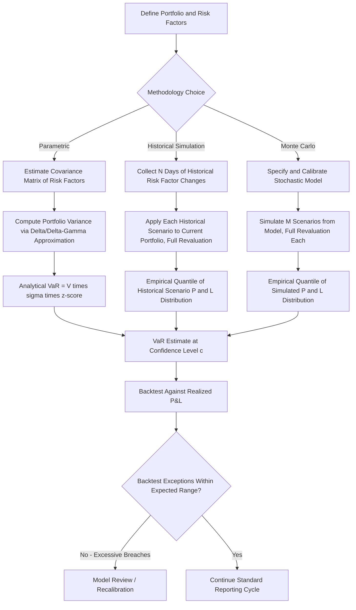

## Value at Risk Methodologies


### Overview

Value at Risk (VaR) is a statistical measure summarizing the potential loss a portfolio could experience over a defined time horizon at a specified confidence level under normal market conditions. It answers a specific question: "What is the maximum loss I would not expect to exceed, X% of the time, over the next N days?" VaR became the dominant market risk metric following its adoption in the Basel market risk capital framework and its popularization through industry frameworks like J.P. Morgan's RiskMetrics in the 1990s, and remains foundational to both regulatory capital calculation and internal risk limit-setting, notwithstanding its well-documented limitations (several of which motivated the Expected Shortfall/stress-testing frameworks that succeeded or supplemented it in later Basel iterations).

### Formal Definition

**Key Points**

- VaR is formally defined as the loss level $L^*$ such that the probability of losses exceeding $L^*$ over the holding period is no greater than $(1 - c)$, where $c$ is the confidence level:

$$P(\text{Loss} > VaR_c) = 1 - c$$

- Equivalently, VaR is the $(1-c)$-quantile of the portfolio's loss distribution over the specified horizon — commonly expressed at 95% or 99% confidence, over a 1-day or 10-day holding period (the latter being the Basel regulatory standard horizon for market risk capital purposes).
- VaR says nothing about the **magnitude** of losses beyond the threshold — this is arguably the most important limitation of VaR as a risk measure, and is the primary conceptual motivation for **Expected Shortfall (ES)**, which measures the *average* loss conditional on exceeding the VaR threshold, and which Basel's Fundamental Review of the Trading Book (FRTB) framework adopted as the primary regulatory market risk metric, supplementing (in some contexts, substantially superseding for regulatory capital purposes) standalone VaR.

$$ES_c = \mathbb{E}[\text{Loss} \mid \text{Loss} > VaR_c]$$

### The Three Core VaR Methodologies

#### 1. Parametric (Variance-Covariance) VaR

**Key Points**

- Assumes portfolio returns are normally distributed (or follow some other specified parametric distribution), allowing VaR to be computed analytically from the portfolio's estimated mean, variance, and covariance structure across risk factors, without requiring simulation.
- For a portfolio with value $V$ and estimated return volatility $\sigma$ over the holding period, VaR at confidence level $c$ is:

$$VaR_c = V \cdot \sigma \cdot z_c$$

Where $z_c$ is the relevant quantile of the standard normal distribution (e.g., $z_{0.99} \approx 2.33$, $z_{0.95} \approx 1.645$).

- For a multi-asset portfolio, this extends to using the full covariance matrix $\Sigma$ of risk factor returns and the portfolio's sensitivity vector $w$ (delta exposures to each risk factor):

$$\sigma_p = \sqrt{w^T \Sigma w}$$

- **Advantages**: computationally fast (closed-form, no simulation required), straightforward to decompose into risk-factor contributions (marginal VaR, component VaR) for risk attribution purposes.
- **Key limitation**: the normality assumption systematically understates tail risk for most real financial return distributions, which exhibit **fat tails (excess kurtosis)** and **negative skew** for many asset classes (equities in particular tend to show larger, more frequent negative tail moves than a normal distribution would predict) — meaning parametric VaR tends to understate true risk at high confidence levels precisely where the risk measure matters most.
- A further limitation: parametric VaR handles **linear** exposures well (deltas) but is poorly suited to portfolios with significant **non-linear** exposures (options with gamma/convexity), since the linear/quadratic approximations typically used (delta-normal or delta-gamma variants) can materially misstate the risk of option-heavy portfolios, particularly for large market moves where convexity effects dominate.

#### 2. Historical Simulation VaR

**Key Points**

- Constructs the loss distribution by applying **actual historical changes** in risk factors (e.g., the past 250 or 500 trading days of observed returns) to the *current* portfolio, generating a set of hypothetical historical scenario P&Ls, then taking the empirical quantile of that simulated P&L distribution as the VaR estimate.
- **Advantages**: makes no explicit distributional assumption (non-parametric), naturally captures fat tails, skew, and empirical correlations exactly as they occurred historically, and handles non-linear instruments (options) correctly since each historical scenario involves full portfolio revaluation rather than a linear/delta approximation.
- **Key limitation**: entirely backward-looking — historical simulation VaR implicitly assumes the future will resemble the specific historical window used, meaning it can be slow to react to genuinely new risk regimes and is highly sensitive to the choice of lookback window length (a longer window smooths estimates but may include stale, no-longer-relevant regimes; a shorter window reacts faster to recent volatility but produces a noisier, less statistically robust quantile estimate from fewer effective observations).
- **Ghost effect / phantom effect**: because historical simulation VaR uses a rolling fixed window, a single extreme historical event (e.g., a crisis day) remains fully weighted in the VaR estimate every day until it "rolls off" the window at the end of the lookback period, then disappears abruptly — causing VaR to jump discontinuously on that roll-off date even though nothing in current market conditions changed, a well-documented artifact of the pure historical simulation approach.

#### 3. Monte Carlo Simulation VaR

**Key Points**

- Generates a large number of hypothetical future risk-factor scenarios by simulating from a specified stochastic model (calibrated to historical or implied volatilities/correlations, or more sophisticated models incorporating fat tails, jumps, or stochastic volatility), revalues the portfolio under each simulated scenario, and takes the empirical quantile of the resulting simulated P&L distribution.
- **Advantages**: the most flexible of the three approaches — can incorporate any specified distributional assumption (including fat-tailed distributions, jump processes, or regime-switching models that better reflect empirical market behavior than either the normal-distribution assumption of parametric VaR or the fixed historical window of historical simulation), and handles non-linear/path-dependent instruments correctly via full revaluation, similar to historical simulation but with the flexibility to generate scenarios well beyond the historical record.
- **Key limitation**: computationally the most intensive of the three methods (particularly for large portfolios with path-dependent or exotic instruments requiring full revaluation at each simulated scenario — directly analogous to the computational burden discussed for exposure/XVA simulation elsewhere in this material), and result quality is entirely dependent on the accuracy of the underlying stochastic model calibration — a poorly specified model (wrong volatility, wrong correlation structure, wrong tail behavior) produces a precise-looking but potentially inaccurate VaR figure, a form of model risk distinct from, but analogous to, the "garbage in, garbage out" risk present in any simulation-based methodology.

### Methodology Comparison

| Dimension | Parametric | Historical Simulation | Monte Carlo |
| --- | --- | --- | --- |
| Distributional assumption | Normal (typically) | None (empirical) | User-specified (flexible) |
| Computational cost | Low | Moderate | High |
| Handles non-linear payoffs | Poorly (without extensions) | Well (full revaluation) | Well (full revaluation) |
| Captures fat tails/skew | Poorly (under normality) | Yes, if present historically | Yes, if modeled |
| Forward-looking flexibility | Limited | None (backward-looking only) | High (fully specifiable) |
| Key artifact/weakness | Underestimates tail risk | Ghost effect, window dependency | Model risk, calibration sensitivity |

### VaR Calculation Workflow (Generic)



### VaR Distribution Comparison Visualization (svg_diagram)

<svg xmlns="http://www.w3.org/2000/svg" viewBox="0 0 680 320">
<text x="340" y="24" text-anchor="middle" font-size="16" font-weight="bold" font-family="sans-serif">Normal vs Fat-Tailed Loss Distribution (svg_diagram)</text>
<g font-family="sans-serif" font-size="12">
<line x1="60" y1="260" x2="620" y2="260" stroke="#333" stroke-width="1.5" />
<text x="330" y="290" text-anchor="middle">Loss</text>



```
<path d="M 60 260 C 150 260, 220 60, 340 60 C 460 60, 530 260, 620 260" fill="none" stroke="#1565c0" stroke-width="2.5" />
<text x="440" y="100" fill="#1565c0" font-weight="bold">Normal (Parametric)</text>

<path d="M 60 260 C 130 258, 200 200, 260 100 C 300 60, 340 60, 380 100 C 440 200, 510 255, 620 258" fill="none" stroke="#c62828" stroke-width="2.5" />
<text x="480" y="200" fill="#c62828" font-weight="bold">Fat-Tailed (Empirical)</text>

<line x1="460" y1="260" x2="460" y2="60" stroke="#666" stroke-dasharray="4,3" />
<text x="465" y="55" font-size="11">99% VaR (Normal)</text>
<line x1="510" y1="260" x2="510" y2="60" stroke="#666" stroke-dasharray="4,3" />
<text x="515" y="40" font-size="11">True 99% VaR (Fat-tail, higher)</text>
```

</g>
</svg>

### Backtesting VaR Models

**Key Points**

- Regulatory frameworks (Basel market risk capital rules) require banks using internal VaR models to **backtest** — comparing daily VaR estimates against subsequently realized P&L, counting the number of "exceptions" (days where actual loss exceeded the VaR estimate) over a rolling window (typically 250 trading days).
- The Basel **traffic light system** classifies backtesting performance into green (few exceptions, consistent with the model's stated confidence level), yellow (an elevated but not necessarily disqualifying exception count, triggering increased regulatory scrutiny and potential capital multiplier increases), and red (excessive exceptions, indicating likely model inadequacy and triggering mandatory capital multiplier increases and model review) zones, based on the statistical likelihood of observing that many exceptions if the model were genuinely well-calibrated at its stated confidence level.
- [Unverified] The precise exception-count thresholds for each zone and the specific capital multiplier scaling factors should be verified against the current applicable Basel framework and local regulatory implementation, since these parameters are technical regulatory specifications subject to the standard caveats noted elsewhere regarding periodic recalibration.

### Scaling and Holding Period Considerations

**Key Points**

- A common simplifying convention scales a 1-day VaR to a longer holding period (e.g., the Basel-standard 10-day period) using the **square-root-of-time rule**:

$$VaR_{T\text{-day}} = VaR_{1\text{-day}} \times \sqrt{T}$$

- This scaling is only strictly valid under the assumption that returns are independently and identically distributed (i.i.d.) with no autocorrelation — a simplifying assumption that is frequently violated in practice (volatility clustering, mean-reversion, and autocorrelation in returns are all well-documented empirical features of many markets), meaning the square-root-of-time scaling is a **widely used approximation with known limitations** rather than a theoretically rigorous result for most real portfolios.
- [Inference] Given these known limitations, more rigorous approaches (direct simulation over the full target holding period, rather than scaling a shorter-period estimate) are generally preferred where computationally feasible, particularly for portfolios with material non-linear or path-dependent exposures where the square-root scaling approximation is least reliable; the continued widespread use of the scaling shortcut in practice reflects a common trade-off between computational convenience and methodological precision rather than a claim that the shortcut is fully accurate in all cases.

### VaR's Known Limitations and the Move Toward Expected Shortfall

**Key Points**

- **Non-subadditivity**: VaR is not guaranteed to be subadditive — meaning the VaR of a combined portfolio can, in certain (typically fat-tailed or non-normal) cases, exceed the sum of the VaRs of its individual components, violating the basic diversification principle that combining risks should not increase total risk. This is a significant theoretical criticism, since it means VaR does not always behave as a "coherent" risk measure in the formal mathematical sense.
- **No information about tail severity**: as noted in the formal definition above, VaR is silent on the magnitude of losses beyond the threshold — two portfolios can have identical VaR figures while having very different tail-risk profiles (one with a moderate loss just beyond VaR, another with catastrophic tail losses), a distinction VaR alone cannot capture.
- These limitations directly motivated the Basel Committee's **Fundamental Review of the Trading Book (FRTB)**, which shifted the primary regulatory market risk capital metric toward **Expected Shortfall** at a 97.5% confidence level (rather than the traditional 99% VaR), specifically to address the tail-severity blindness of standalone VaR, while VaR itself remains in widespread use for internal risk limits, reporting, and as a component of the broader risk management toolkit even where it is no longer the sole regulatory capital metric.

### Common Implementation Failure Modes

- **Relying solely on parametric VaR for portfolios with significant optionality**: as noted above, delta-normal or delta-gamma approximations can materially misstate risk for option-heavy books, particularly during large market moves where higher-order convexity effects dominate — a recurring theme connecting to the general point (echoed across the exposure/XVA topics earlier in this material) that linear approximations of inherently non-linear risk require careful validation against full-revaluation methods.
- **Ignoring the ghost effect in historical simulation VaR**: failing to anticipate or communicate the mechanical VaR jump that occurs when an extreme historical event rolls out of the lookback window, which can create confusing or misleading risk reporting discontinuities unrelated to genuine changes in current portfolio risk.
- **Over-reliance on square-root-of-time scaling for non-i.i.d. return series**: applying the scaling shortcut to portfolios or risk factors with known autocorrelation or volatility clustering (e.g., many credit spread or emerging market series) without validating the assumption, introducing scaling error into the resulting multi-day VaR estimate.
- **Static model calibration without regime-awareness**: using volatility/correlation estimates calibrated over a benign historical period without stress-testing or otherwise accounting for potential regime shifts, a limitation shared conceptually with the static correlation assumption failure mode flagged under the wrong-way risk topic earlier in this chapter's broader risk measurement themes.
- **Treating VaR as a complete risk picture rather than one input among several**: given VaR's documented tail-severity blindness and non-subadditivity limitations, using VaR in isolation (without complementary stress testing, Expected Shortfall, or scenario analysis) can create a false sense of comprehensive risk coverage — most robust risk management frameworks explicitly treat VaR as one component of a broader toolkit rather than a standalone sufficient risk measure.

### Worked Example

A portfolio has a current value of $50 million, and its daily return volatility is estimated at 1.2% based on a parametric (variance-covariance) approach using a 250-day lookback for covariance estimation.

- **Parametric 1-day 99% VaR**: $VaR_{0.99} = \$50\text{M} \times 1.2\% \times 2.33 \approx \$1.398\text{ million}$.
- Scaling to a 10-day regulatory holding period via the square-root-of-time rule: $VaR_{10\text{-day}} \approx \$1.398\text{M} \times \sqrt{10} \approx \$4.42\text{ million}$ — subject to the scaling limitations noted above if the portfolio's underlying returns exhibit meaningful autocorrelation.
- If the same portfolio is instead evaluated via historical simulation using the same 250-day window, and that window happens to include a period of unusually high volatility (e.g., a market stress episode), the historical simulation VaR would likely exceed the parametric estimate at the 99% confidence level, reflecting the empirical fat-tail behavior the parametric normal-distribution assumption does not capture — a concrete illustration of why the two methodologies can produce materially different VaR figures for the identical portfolio and historical data window, and why institutions often compute and monitor multiple methodologies in parallel rather than relying on a single approach.
- If the portfolio contains significant option exposure, a Monte Carlo approach with full revaluation at each simulated scenario would generally be considered the most reliable of the three for capturing the true, non-linear risk profile — though at materially higher computational cost, echoing the cost/accuracy trade-off theme recurring throughout this chapter's simulation-based methodologies.

**Next Steps**

- Expected Shortfall (ES) methodology and the FRTB regulatory framework
- Stress testing and scenario analysis as VaR complements
- Backtesting frameworks and the Basel traffic light system in detail
- Delta-gamma and other non-linear VaR approximation refinements
- Volatility and correlation estimation techniques: EWMA, GARCH models
- Coherent risk measures and the mathematical properties of ES vs. VaR
- Liquidity-adjusted VaR and holding period assumptions for illiquid positions