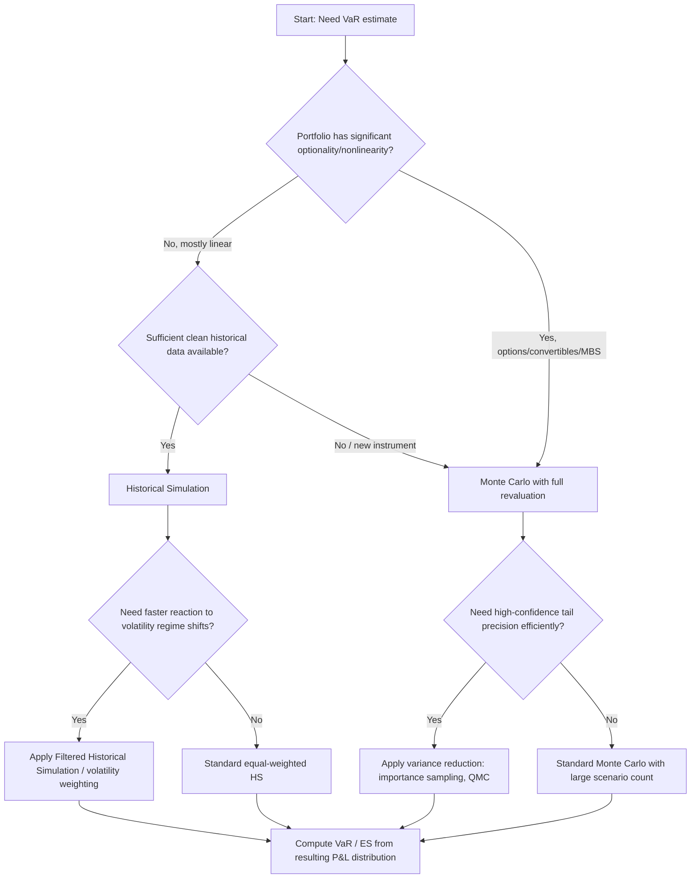

## Historical Simulation and Monte Carlo VaR

### Overview

Historical Simulation (HS) and Monte Carlo (MC) Simulation are the two principal non-parametric/simulation-based approaches to computing Value-at-Risk (VaR), contrasted with the parametric (variance-covariance/delta-normal) method. Both methods generate a distribution of possible portfolio P&L outcomes and read off a quantile, but they differ fundamentally in how that distribution is constructed — HS resamples actual historical market moves, while MC generates synthetic scenarios from an assumed statistical model.

### Historical Simulation VaR

**Core Methodology**

1. Collect a historical window of risk factor returns (e.g., 250, 500, or 1000 trading days).
2. Apply each historical day's set of risk factor changes to today's actual portfolio (full or partial revaluation).
3. This produces $n$ hypothetical P&L outcomes representing "what would happen today if yesterday's-type move happened again."
4. Sort the P&L outcomes ascending (losses first).
5. VaR at confidence $\alpha$ is the loss at the $(1-\alpha)$ percentile of the sorted distribution.

$$VaR_\alpha = -L_{(k)}, \quad k = \lceil n(1-\alpha) \rceil$$

where $L_{(k)}$ is the $k$-th order statistic of the P&L distribution.

**Key Points**

- **Advantages**: no distributional assumption (captures actual fat tails, skew, and empirical correlations); intuitive and easy to explain to stakeholders/regulators; automatically reflects historical co-movements between risk factors without needing an explicit covariance matrix.
- **Disadvantages**: entirely backward-looking — a risk event not in the historical window cannot appear in the VaR estimate ("ghost effect" also occurs, where an extreme historical day continues to inflate VaR for exactly the length of the lookback window, then vanishes abruptly when it rolls out of the sample); requires a long, clean historical dataset for every risk factor including new instruments; equal-weights all historical days by default, which can be slow to react to a regime change in volatility.

### Weighted / Enhanced Historical Simulation Variants

- **Age-Weighted HS (Boudoukh, Richardson, Whitelaw 1998)**: assigns exponentially declining weights to older observations so recent data has more influence, weight $w_i = \lambda^{i-1}(1-\lambda)/(1-\lambda^n)$.
- **Volatility-Weighted / Filtered Historical Simulation (FHS, Hull-White 1998)**: rescale historical returns by the ratio of current estimated volatility (e.g., from a GARCH or EWMA model) to the volatility prevailing on the historical date, then apply these rescaled returns. This addresses the "stale volatility" issue directly, letting VaR react quickly to current market conditions while preserving the empirical shape of returns.
- **Bootstrapped Historical Simulation**: resample historical returns with replacement (or via block bootstrap for time dependence) to build a larger synthetic sample, reducing quantile estimation noise at high confidence levels.

### Monte Carlo VaR

**Core Methodology**

1. Specify a stochastic model for the joint evolution of risk factors (e.g., multivariate normal or t-distributed returns, or a full stochastic process like Geometric Brownian Motion for equities, or Heston/SABR for volatility surfaces).
2. Estimate/calibrate model parameters: means, volatilities, correlations (or an entire covariance matrix), or model-specific parameters (mean reversion speed, vol-of-vol, jump intensity, etc.).
3. Generate a large number of pseudo-random scenarios (typically 10,000–100,000+) for the risk factors over the VaR horizon.
4. Full revaluation: reprice the actual portfolio (including nonlinear instruments — options, MBS, structured notes) under every simulated scenario.
5. Compute P&L for each scenario, sort, and extract the VaR (and ES) at the desired quantile — identical final step to HS.

**Key Points**

- **Advantages**: not limited to historical data — can capture scenarios that have never occurred but are statistically plausible under the model; naturally accommodates nonlinear payoffs (options, convertibles) via full repricing, capturing gamma/vega effects that a delta-normal approach misses; flexible to overlay stress scenarios, jumps, or fat-tailed innovations.
- **Disadvantages**: computationally expensive, especially with full revaluation of large derivatives books — often requires variance reduction techniques; model risk is significant — the VaR is only as good as the assumed stochastic process and calibrated parameters; correlation/covariance estimation for high-dimensional portfolios is itself statistically challenging (the curse of dimensionality in the covariance matrix).

### Random Number Generation and Correlated Scenarios

For multivariate simulation, correlated normal (or t-distributed) shocks are typically generated via **Cholesky decomposition** of the covariance matrix $\Sigma = LL^T$:

$$\mathbf{z}_{correlated} = L \cdot \mathbf{z}_{independent}$$

where $\mathbf{z}_{independent}$ is a vector of i.i.d. standard normal draws. For fat-tailed or asymmetric dependence structures, **copulas** (Gaussian, Student-t, or Clayton/Gumbel for tail dependence) are used to join arbitrary marginal distributions while preserving a specified dependence structure — critical because linear correlation understates joint tail risk (multiple assets often crash together more than a Gaussian copula implies).

### Variance Reduction Techniques

**Key Points**

- **Antithetic Variates**: for each random draw $z$, also use $-z$, halving variance for symmetric problems at roughly the same computational cost.
- **Control Variates**: use a correlated instrument with a known closed-form price/moment to reduce estimator variance.
- **Importance Sampling**: shift the sampling distribution to oversample the tail region relevant to high-confidence VaR/ES, then reweight by the likelihood ratio — substantially improves precision for 99%+ quantile estimation without needing more total scenarios.
- **Stratified Sampling / Quasi-Monte Carlo (Sobol sequences)**: ensures more even coverage of the probability space than pure pseudo-random sampling, improving convergence rate from $O(n^{-1/2})$ toward $O((\log n)^d/n)$ in some settings. [Inference] The practical benefit of QMC diminishes in very high dimensions due to the curse of dimensionality affecting low-discrepancy sequences.

### Worked Numerical Comparison

Assume a simple equity portfolio worth $10,000,000 with a single risk factor (index return), and we want 1-day 99% VaR.

**Historical Simulation** (using 500 daily returns):

- Apply each of the 500 historical daily returns to today's $10M position.
- Sort the 500 resulting P&L figures.
- 99% VaR uses the 5th worst outcome ($500 \times 0.01 = 5$).
- Suppose the 5th worst historical daily return was -3.1%: $VaR_{99\%} = \$10{,}000{,}000 \times 0.031 = \$310{,}000$.

**Monte Carlo** (assuming daily returns $\sim N(0, \sigma=1.6\%)$, calibrated from recent data):

- Simulate 50,000 draws from $N(0, 0.016^2)$.
- The 1st percentile (worst 1%) of a standard normal is $z_{0.01} = -2.326$.
- $VaR_{99\%} = \$10{,}000{,}000 \times 2.326 \times 0.016 = \$372{,}160$.

The discrepancy ($310K vs $372K) illustrates real-world divergence: HS reflects the actual empirical tail (possibly thinner than normal in a calm historical window, or fatter in a stressed one), while MC/parametric VaR here assumes normality, which can overstate or understate risk depending on the true tail shape of the underlying return distribution.

### Comparison Table

| Dimension | Historical Simulation | Monte Carlo Simulation |
| --- | --- | --- |
| Distributional assumption | None (empirical) | Explicit (must specify a model) |
| Captures fat tails/skew | Automatically, from data | Only if the chosen model includes them |
| Handles novel/unseen scenarios | No — limited to history | Yes — can simulate never-seen combinations |
| Nonlinear instrument handling | Full revaluation possible | Full revaluation possible (its core strength) |
| Computational cost | Lower (one pass per historical day) | Higher (thousands of scenarios, often full reval) |
| Responsiveness to regime change | Slow unless weighted/filtered | Fast — recalibrate parameters |
| Model risk | Low (data-driven) | Higher (process/parameter misspecification) |
| Regulatory acceptance | Widely used, FRTB-compatible with stressed calibration | Widely used, especially for derivatives books |

### Diagram: VaR Methodology Decision Flow

### Diagram: Historical Simulation vs Monte Carlo Data Flow (svg_diagram)

<svg xmlns="http://www.w3.org/2000/svg" viewBox="0 0 780 380">
<text x="390" y="25" text-anchor="middle" font-size="16" font-weight="bold">HS vs MC: Scenario Generation Paths (svg_diagram)</text>
<rect x="30" y="60" width="320" height="280" rx="8" fill="#eaf2fb" stroke="#2c6fbb" stroke-width="1.5" />
<text x="190" y="85" text-anchor="middle" font-size="13" font-weight="bold" fill="#2c6fbb">Historical Simulation</text>
<rect x="60" y="105" width="260" height="35" rx="4" fill="#ffffff" stroke="#2c6fbb" />
<text x="190" y="127" text-anchor="middle" font-size="11">Historical risk factor returns (n days)</text>
<line x1="190" y1="140" x2="190" y2="160" stroke="#2c6fbb" stroke-width="1.5" marker-end="url(#arrow1)" />
<rect x="60" y="160" width="260" height="35" rx="4" fill="#ffffff" stroke="#2c6fbb" />
<text x="190" y="182" text-anchor="middle" font-size="11">Apply each day's move to today's portfolio</text>
<line x1="190" y1="195" x2="190" y2="215" stroke="#2c6fbb" stroke-width="1.5" marker-end="url(#arrow1)" />
<rect x="60" y="215" width="260" height="35" rx="4" fill="#ffffff" stroke="#2c6fbb" />
<text x="190" y="237" text-anchor="middle" font-size="11">n hypothetical P&amp;L outcomes</text>
<line x1="190" y1="250" x2="190" y2="270" stroke="#2c6fbb" stroke-width="1.5" marker-end="url(#arrow1)" />
<rect x="60" y="270" width="260" height="35" rx="4" fill="#ffffff" stroke="#2c6fbb" />
<text x="190" y="292" text-anchor="middle" font-size="11">Sort and read quantile = VaR</text>
<rect x="430" y="60" width="320" height="280" rx="8" fill="#fdf1e8" stroke="#e67e22" stroke-width="1.5" />
<text x="590" y="85" text-anchor="middle" font-size="13" font-weight="bold" fill="#a04000">Monte Carlo Simulation</text>
<rect x="460" y="105" width="260" height="35" rx="4" fill="#ffffff" stroke="#e67e22" />
<text x="590" y="127" text-anchor="middle" font-size="11">Calibrated stochastic model params</text>
<line x1="590" y1="140" x2="590" y2="160" stroke="#e67e22" stroke-width="1.5" marker-end="url(#arrow2)" />
<rect x="460" y="160" width="260" height="35" rx="4" fill="#ffffff" stroke="#e67e22" />
<text x="590" y="182" text-anchor="middle" font-size="11">Generate N random synthetic scenarios</text>
<line x1="590" y1="195" x2="590" y2="215" stroke="#e67e22" stroke-width="1.5" marker-end="url(#arrow2)" />
<rect x="460" y="215" width="260" height="35" rx="4" fill="#ffffff" stroke="#e67e22" />
<text x="590" y="237" text-anchor="middle" font-size="11">Full reprice portfolio per scenario</text>
<line x1="590" y1="250" x2="590" y2="270" stroke="#e67e22" stroke-width="1.5" marker-end="url(#arrow2)" />
<rect x="460" y="270" width="260" height="35" rx="4" fill="#ffffff" stroke="#e67e22" />
<text x="590" y="292" text-anchor="middle" font-size="11">Sort and read quantile = VaR</text>
</svg>

### Backtesting Considerations for Both Methods

- **Kupiec's Proportion of Failures (POF) test**: checks whether the observed number of VaR exceedances matches the expected rate under a binomial distribution at the chosen confidence level.
- **Christoffersen's independence test**: checks whether exceedances cluster in time (which would indicate the model is slow to adapt to volatility changes) rather than being independently distributed.
- **Basel traffic-light approach**: classifies backtesting exceedance counts over a rolling 250-day window into green/yellow/red zones, with capital multiplier add-ons in the yellow/red zones.
- [Inference] Because HS VaR is inherently piecewise-constant as historical windows roll, and MC VaR depends on newly redrawn scenarios, small sample-based backtests over short windows can behave noisily for either method, and practitioners often supplement formal tests with qualitative review of exception clustering.

### Hybrid and Practical Implementation Notes

- Many institutions blend both approaches: HS for baseline market risk capital (as it is intuitive and history-grounded) combined with MC-based stress and scenario testing for tail/derivative-heavy exposures.
- **Full vs. partial revaluation**: partial revaluation (delta-gamma approximation) speeds up both HS and MC by avoiding a full pricing model call per scenario, at the cost of accuracy for large moves or highly convex instruments (e.g., deep out-of-the-money options, mortgage-backed securities with negative convexity).
- **Computational infrastructure**: large MC VaR runs for derivatives books are often distributed/parallelized (grid computing or GPU-accelerated), since full revaluation of complex instruments (e.g., Bermudan swaptions via least-squares Monte Carlo) across tens of thousands of scenarios is computationally intensive.

**Related Topics**

- Expected Shortfall and Tail Risk Measures
- Parametric (Variance-Covariance / Delta-Normal) VaR
- Filtered Historical Simulation and GARCH Volatility Models
- Copulas and Multivariate Dependence Modeling
- FRTB Internal Models Approach and Backtesting Requirements
- Stress Testing and Reverse Stress Testing
- Least-Squares Monte Carlo for American/Bermudan Option Pricing