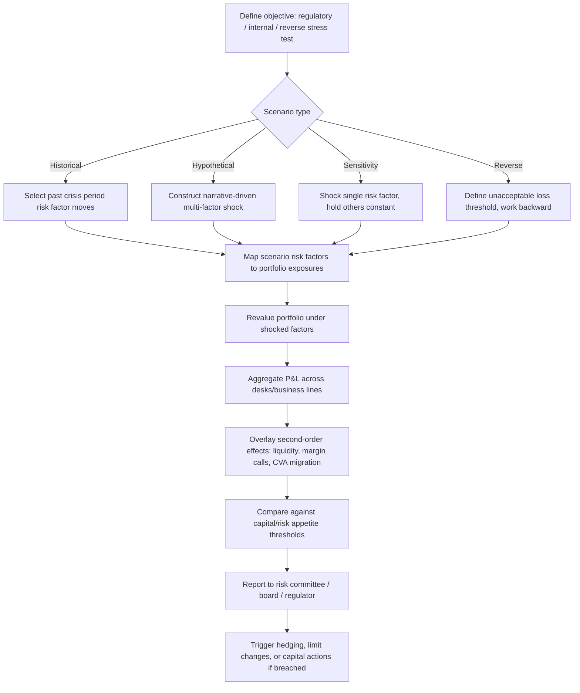

## Stress Testing and Scenario Analysis

### Overview and Purpose

Stress testing and scenario analysis complement statistical risk measures (VaR, ES) by evaluating portfolio performance under extreme but plausible market conditions that may fall outside the historical calibration window or violate the distributional assumptions used in day-to-day risk models. Where VaR/ES answer "how bad could things get at a given probability under normal-ish conditions," stress testing answers "what happens to me if a specific severe event occurs," deliberately setting aside probability estimation in favor of examining consequence.

### Why Stress Testing Is Necessary

**Key Points**

- **Tail blindness of statistical models**: VaR/ES models calibrated on historical or parametric data can systematically understate risk during regime shifts, since correlations and volatilities that were stable historically can break down suddenly (e.g., 2008 GFC, March 2020 COVID shock).
- **Correlation breakdown / flight-to-quality**: in a crisis, previously uncorrelated or negatively correlated assets often become highly correlated ("all correlations go to one" is a common trading-desk heuristic), invalidating diversification assumptions embedded in variance-covariance models.
- **Liquidity risk amplification**: stress scenarios often need to incorporate not just price shocks but also the inability to exit positions at modeled prices, and widened bid-ask spreads.
- **Regulatory mandate**: post-GFC frameworks (Dodd-Frank Act stress tests/DFAST, CCAR, EBA stress tests, Basel FRTB stressed calibration requirements) require banks to run stress tests as a core supervisory tool, not merely an internal best practice.

### Historical Scenario Analysis

Applies actual historical crisis periods' risk factor moves to today's current portfolio, holding position sizes fixed at present-day levels. Common reference scenarios include:

- Black Monday (October 1987) — equity crash
- Asian Financial Crisis (1997)
- Russian default / LTCM (1998)
- Dot-com crash (2000-2002)
- Global Financial Crisis (2007-2009)
- European Sovereign Debt Crisis (2010-2012)
- Taper Tantrum (2013)
- COVID-19 shock (March 2020)
- 2022 rate-hike / gilt crisis (UK LDI episode)

**Key Points**

- **Advantages**: grounded in actual observed events, so the plausibility of the scenario is not in question; captures genuine historical cross-asset correlation structures during stress, including second-order effects (liquidity, basis blowouts) that are hard to model synthetically.
- **Disadvantages**: backward-looking by construction — cannot anticipate a genuinely novel crisis mechanism (a new asset class, a new type of contagion channel); the exact risk factors available/tradeable during a historical event may not map cleanly onto today's portfolio composition, requiring proxy mapping.

### Hypothetical (Synthetic) Scenario Analysis

Constructs forward-looking, not-yet-observed scenarios based on narrative macroeconomic or geopolitical storylines, e.g.: a sudden 200bp central bank rate shock, a sovereign debt crisis in a specific region, a major cyberattack disrupting settlement infrastructure, a geopolitical conflict disrupting energy supply, or a sudden repricing of climate transition risk.

**Key Points**

- **Advantages**: can probe genuinely novel vulnerabilities not present in the historical record; useful for exploring portfolio-specific tail risks (concentrated exposures, emerging market linkages) that history hasn't yet tested.
- **Disadvantages**: requires significant expert judgment to construct coherent, internally consistent shocks across many risk factors simultaneously; risk of confirmation bias (designing scenarios the risk team already expects) or, conversely, scenarios so extreme they are dismissed as implausible by senior management.

### Sensitivity Analysis and Single-Factor Shocks

A simpler complementary technique: shock one risk factor at a time (e.g., "+100bp parallel yield curve shift," "-20% equity index," "+10 vol points") while holding others constant, to isolate exposure concentrations. Useful for quick risk factor decomposition but does not capture cross-factor correlation effects that real stress events exhibit — typically used as a diagnostic layer underneath full multi-factor scenario analysis, not a substitute for it.

### Reverse Stress Testing

Instead of specifying a scenario and computing the resulting loss, reverse stress testing starts from a predefined unacceptable outcome (e.g., "the loss that would breach our capital adequacy threshold" or "the loss that would trigger firm failure") and works backward to identify what combination of events could produce it.

**Key Points**

- Forces risk managers to confront scenarios "hiding in plain sight" that might otherwise be dismissed as too improbable to model forward.
- Often reveals concentration or correlation vulnerabilities not apparent from a library of standard forward scenarios.
- Required under certain regulatory regimes (e.g., UK PRA rules for banks and insurers) as a complement to conventional stress testing.
- [Inference] Reverse stress testing is inherently more qualitative and judgment-driven than forward scenario analysis, since there can be many combinations of events leading to the same catastrophic outcome, and selecting the "most plausible" path is a subjective exercise.

### Regulatory Stress Testing Frameworks

| Framework | Jurisdiction | Focus |
| --- | --- | --- |
| CCAR (Comprehensive Capital Analysis and Review) | US (Federal Reserve) | Capital planning for large bank holding companies |
| DFAST (Dodd-Frank Act Stress Test) | US | Statutory stress testing requirement |
| EBA EU-wide Stress Test | European Union | Bank solvency under adverse macro scenarios |
| Bank of England Annual Cyclical Scenario (ACS) | UK | System-wide bank resilience |
| FRTB Stressed Expected Shortfall | Basel (global) | Calibrating market risk capital partly to a stress period |
| ICAAP / ORSA stress components | EU/global (banks/insurers) | Internal capital and own risk assessment |

These frameworks typically specify both a **baseline scenario** and a **severely adverse scenario** (multi-quarter macro paths for GDP, unemployment, equity prices, interest rates, house prices, etc.), against which banks must project capital ratios, earnings, and losses using internal models, then report to supervisors.

### Stress Testing Methodology Workflow

1. **Scenario design**: select historical, hypothetical, or regulatory-prescribed scenarios; define risk factor shocks (magnitude, direction, correlation assumptions across shocked factors).
2. **Risk factor mapping**: translate macro scenario variables (GDP, rates, credit spreads, FX) into the specific risk factors that drive portfolio valuation.
3. **Revaluation**: apply shocked risk factors to the current portfolio using full or approximate repricing (similar mechanics to Monte Carlo VaR's revaluation step, but with a small number of well-defined discrete scenarios rather than thousands of random draws).
4. **Aggregation**: sum P&L impacts across business lines/desks, accounting for netting, collateral, and correlation between shocked risk factors.
5. **Second-order effects overlay**: incorporate liquidity cost, margin/collateral calls, counterparty credit risk migration, and funding cost impacts triggered by the primary shock.
6. **Reporting and governance**: results reviewed by senior risk committees/board, potentially triggering capital buffer actions, hedging, or limit reductions.

### Diagram: Stress Testing Process Flow

### Diagram: Scenario Analysis Taxonomy (svg_diagram)

<svg xmlns="http://www.w3.org/2000/svg" viewBox="0 0 760 400">
<text x="380" y="25" text-anchor="middle" font-size="16" font-weight="bold">Taxonomy of Stress Testing Approaches (svg_diagram)</text>
<rect x="300" y="45" width="160" height="40" rx="6" fill="#2c6fbb" />
<text x="380" y="70" text-anchor="middle" font-size="12" fill="white" font-weight="bold">Stress Testing</text>
<line x1="380" y1="85" x2="150" y2="130" stroke="#555" stroke-width="1.5" />
<line x1="380" y1="85" x2="380" y2="130" stroke="#555" stroke-width="1.5" />
<line x1="380" y1="85" x2="610" y2="130" stroke="#555" stroke-width="1.5" />
<rect x="60" y="130" width="180" height="40" rx="6" fill="#eaf2fb" stroke="#2c6fbb" />
<text x="150" y="155" text-anchor="middle" font-size="12">Historical Scenario</text>
<rect x="290" y="130" width="180" height="40" rx="6" fill="#eaf2fb" stroke="#2c6fbb" />
<text x="380" y="155" text-anchor="middle" font-size="12">Hypothetical Scenario</text>
<rect x="520" y="130" width="180" height="40" rx="6" fill="#eaf2fb" stroke="#2c6fbb" />
<text x="610" y="155" text-anchor="middle" font-size="12">Reverse Stress Test</text>
<line x1="150" y1="170" x2="150" y2="210" stroke="#555" stroke-width="1.5" />
<rect x="60" y="210" width="180" height="40" rx="6" fill="#fdf1e8" stroke="#e67e22" />
<text x="150" y="235" text-anchor="middle" font-size="11">e.g. GFC 2008, COVID 2020</text>
<line x1="380" y1="170" x2="380" y2="210" stroke="#555" stroke-width="1.5" />
<rect x="290" y="210" width="180" height="40" rx="6" fill="#fdf1e8" stroke="#e67e22" />
<text x="380" y="235" text-anchor="middle" font-size="11">e.g. Rate shock, geopolitical event</text>
<line x1="610" y1="170" x2="610" y2="210" stroke="#555" stroke-width="1.5" />
<rect x="520" y="210" width="180" height="40" rx="6" fill="#fdf1e8" stroke="#e67e22" />
<text x="610" y="235" text-anchor="middle" font-size="11">Start from failure, infer cause</text>
<rect x="200" y="280" width="360" height="45" rx="6" fill="#f4ecf7" stroke="#7d3c98" />
<text x="380" y="307" text-anchor="middle" font-size="12" fill="#4a235a">Sensitivity Analysis: single risk-factor shocks (diagnostic layer)</text>
</svg>

### Integration with VaR/ES and Capital Frameworks

- Under FRTB, banks must calibrate ES to include a **stressed period** component — meaning the model is not purely reactive to current low-volatility regimes but is anchored to historical stress, functionally merging statistical VaR/ES with a stress-testing philosophy.
- Stress test results often feed into **Pillar 2 capital add-ons** (in Basel's supervisory review framework) when statistical models are judged insufficient to capture idiosyncratic portfolio vulnerabilities.
- Many trading desks maintain a **stress scenario library** refreshed periodically (quarterly/annually) to reflect evolving macro risks (e.g., adding pandemic-related supply chain scenarios post-2020, or energy-crisis scenarios post-2022).

### Limitations and Practical Challenges

- **Scenario selection bias**: the set of scenarios chosen inevitably reflects current institutional knowledge and recent history; genuinely unprecedented events by definition are hard to pre-specify.
- **Behavioral/second-round effects**: stress tests often struggle to model how other market participants (including competitors and central banks) will react to the same shock, which can materially change the realized outcome (e.g., a central bank liquidity intervention dampening a shock's propagation).
- **Model consistency across scenarios**: ensuring the same pricing models and risk factor mappings are applied consistently whether running VaR, ES, or stress tests is an ongoing operational challenge, particularly for firms with heterogeneous legacy systems across business lines.
- [Inference] Firms vary considerably in how formally they govern scenario design and how frequently they refresh their scenario libraries, and this is often cited as a differentiator in supervisory assessments of stress testing maturity.

**Related Topics**

- Expected Shortfall and Tail Risk Measures
- Historical Simulation and Monte Carlo VaR
- FRTB Standardized Approach vs. Internal Models Approach
- Liquidity Risk and Liquidity-Adjusted VaR
- Counterparty Credit Risk and CVA under Stress
- Extreme Value Theory and the Peaks-Over-Threshold Method
- Capital Adequacy Frameworks (Basel III/IV Pillar 1 and Pillar 2)