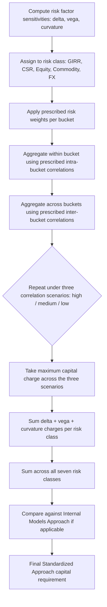

## Sensitivity Based Risk Frameworks

### Overview and Purpose

Sensitivity-based risk frameworks measure risk by decomposing portfolio exposure into a set of standardized risk factor sensitivities (the "Greeks" in derivatives terminology, generalized across asset classes) and aggregating them according to a prescribed formula, rather than through full historical or Monte Carlo revaluation. The paradigmatic modern example is the Basel FRTB **Sensitivities-Based Method (SBM)**, which forms the core of the Standardized Approach for market risk capital, but the underlying logic (delta/vega/curvature decomposition) is foundational across trading desk risk management generally.

### Core Sensitivity Measures ("The Greeks")

**Key Points**

- **Delta ($\Delta$)**: sensitivity of instrument value to a small change in the underlying risk factor (price, rate, spread): $\Delta = \frac{\partial V}{\partial S}$. For linear instruments (bonds, swaps, futures, forwards), delta captures essentially all of the risk.
- **Vega ($\nu$)**: sensitivity to implied volatility: $\nu = \frac{\partial V}{\partial \sigma}$. Relevant only for optionality; zero for linear instruments.
- **Curvature/Gamma ($\Gamma$)**: sensitivity of delta itself to the underlying: $\Gamma = \frac{\partial^2 V}{\partial S^2}$. Captures convexity/nonlinearity that a first-order delta approximation misses, particularly important for large moves.
- **Theta ($\Theta$)**: time decay, $\Theta = \frac{\partial V}{\partial t}$ — generally excluded from market risk capital sensitivity frameworks since it is deterministic, not a market risk factor.
- **Rho ($\rho$)**: sensitivity to interest rates for instruments where rates are not the primary risk driver (e.g., equity options) — often subsumed into the interest rate risk class in an SBM context.

### Delta-Normal (Variance-Covariance) Foundations

The classical sensitivity-based VaR approach — the precursor to FRTB's SBM — assumes portfolio P&L is a linear function of risk factor changes, which are themselves jointly normally distributed:

$$\Delta V \approx \sum_i \delta_i \Delta S_i$$

Portfolio variance is then:

$$\sigma_P^2 = \boldsymbol{\delta}^T \Sigma \boldsymbol{\delta}$$

where $\boldsymbol{\delta}$ is the vector of risk factor sensitivities and $\Sigma$ is the risk factor covariance matrix. VaR follows directly from the normal quantile:

$$VaR_\alpha = z_\alpha \cdot \sigma_P \cdot \sqrt{t}$$

**Key Points**

- **Advantages**: computationally very cheap (closed-form, no simulation); easy to decompose risk contributions by factor for management reporting; well understood and long-established.
- **Disadvantages**: assumes normality (understates fat tails); assumes linearity (fails for options/convex instruments unless a delta-gamma extension is used); requires estimating a potentially large covariance matrix, itself a source of estimation error.

### FRTB Sensitivities-Based Method (SBM) Architecture

The FRTB Standardized Approach (SA) restructured sensitivity-based capital calculation into a rules-based, prescribed-parameter framework designed to be more risk-sensitive than Basel II's Standardized Approach while remaining simpler and more transparent than full Internal Models.

**Risk Classes**

The SBM defines seven broad risk classes, each with its own bucket structure, risk weights, and correlation parameters prescribed by the regulator:

1. General Interest Rate Risk (GIRR)
2. Credit Spread Risk — non-securitizations (CSR)
3. Credit Spread Risk — securitizations, non-CTP
4. Credit Spread Risk — securitizations, CTP (correlation trading portfolio)
5. Equity Risk
6. Commodity Risk
7. Foreign Exchange (FX) Risk

**Three Risk Measure Components per Class**

- **Delta risk charge**: linear sensitivities to each risk factor within a bucket, aggregated using prescribed risk weights and correlation parameters (both intra-bucket and inter-bucket correlations are specified by the regulator, not estimated by the bank).
- **Vega risk charge**: sensitivities of option positions to implied volatility, aggregated similarly.
- **Curvature risk charge**: captures residual nonlinearity not captured by delta, computed by applying prescribed up/down shocks to the underlying and taking the worst-case P&L beyond what delta alone predicts:

$$CVR_k = -\left[V_k(x_k + shock) - V_k(x_k) - \delta_k \cdot shock\right] \text{ (and equivalent for the down-shock)}$$

The curvature capital charge for a bucket takes the larger of the up-shock and down-shock aggregated losses.

### Aggregation Formula (Delta/Vega Risk Charges)

Within each bucket $b$, sensitivities are weighted and aggregated using prescribed correlations $\rho_{kl}$:

$$K_b = \sqrt{\max\left(0, \sum_k WS_k^2 + \sum_{k \ne l} \rho_{kl} WS_k WS_l\right)}$$

where $WS_k = RW_k \times s_k$ is the weighted sensitivity (risk weight times the raw sensitivity). Bucket-level capital charges $K_b$ are then aggregated across buckets using a second prescribed correlation parameter $\gamma_{bc}$, and the whole process is repeated under three prescribed correlation scenarios (high, medium, low correlation) with the final capital charge being the **maximum** across the three scenarios — a deliberate conservatism designed to guard against correlation regime uncertainty.

### Worked Example: GIRR Delta Bucket

Suppose a desk has interest rate delta sensitivities (PV01-style, i.e., value change per basis point) to three tenor buckets of a single currency curve:

| Tenor | Sensitivity ($s_k$, per bp) | Risk Weight ($RW_k$) | Weighted Sensitivity ($WS_k$) |
| --- | --- | --- | --- |
| 2Y | $5,000 | 1.7% | $85 |
| 5Y | -$3,000 | 1.7% | -$51 |
| 10Y | $2,000 | 1.5% | $30 |

Assume prescribed correlations between these tenors under the medium-correlation scenario: $\rho_{2Y,5Y}=0.91$, $\rho_{5Y,10Y}=0.87$, $\rho_{2Y,10Y}=0.72$ (illustrative FRTB-style tenor correlation decay).

$$K = \sqrt{85^2 + (-51)^2 + 30^2 + 2(0.91)(85)(-51) + 2(0.72)(85)(30) + 2(0.87)(-51)(30)}$$

$$K = \sqrt{7225 + 2601 + 900 - 7891.7 + 3672 - 2660.4} = \sqrt{3846} \approx \$62.0$$

This illustrates the key mechanic: correlated sensitivities of opposite sign net down substantially (the -$51 5Y exposure offsets much of the 2Y and 10Y exposure), while the formula still preserves a conservative floor via the max-of-zero and the subsequent max-across-correlation-scenarios step at the top level.

### Comparison: Sensitivities-Based (Standardized) vs. Internal Models Approach

| Dimension | Sensitivities-Based Method (SA) | Internal Models Approach (IMA) |
| --- | --- | --- |
| Risk weights/correlations | Prescribed by regulator | Bank's own model-estimated |
| Computational approach | Formula-based aggregation of sensitivities | Full ES/VaR simulation (historical or Monte Carlo) |
| Transparency/comparability across banks | High — same formula, same parameters | Lower — model choices vary by bank |
| Risk sensitivity to actual portfolio tail behavior | Moderate (curvature add-on partially compensates) | High (captures actual empirical/simulated tails) |
| Regulatory approval required | No (always available; also acts as a floor/fallback) | Yes, per desk, subject to backtesting/P&L attribution tests |
| Purpose | Universal baseline, non-model banks, capital floor | More risk-sensitive capital for approved desks |

Under FRTB, the SA also serves as a **capital floor and fallback**: even IMA-approved banks must calculate the SA in parallel, and any trading desk that fails IMA backtesting or P&L attribution tests is required to fall back to the SA capital charge for that desk.

### Diagram: SBM Capital Calculation Flow

### Diagram: Risk Factor Decomposition Hierarchy (svg_diagram)

<svg xmlns="http://www.w3.org/2000/svg" viewBox="0 0 760 380">
<text x="380" y="25" text-anchor="middle" font-size="16" font-weight="bold">Sensitivities-Based Method: Decomposition Hierarchy (svg_diagram)</text>
<rect x="290" y="45" width="180" height="40" rx="6" fill="#2c6fbb" />
<text x="380" y="70" text-anchor="middle" font-size="12" fill="white" font-weight="bold">Total SBM Capital Charge</text>
<line x1="380" y1="85" x2="130" y2="125" stroke="#555" stroke-width="1.3" />
<line x1="380" y1="85" x2="380" y2="125" stroke="#555" stroke-width="1.3" />
<line x1="380" y1="85" x2="630" y2="125" stroke="#555" stroke-width="1.3" />
<rect x="40" y="125" width="180" height="35" rx="5" fill="#eaf2fb" stroke="#2c6fbb" />
<text x="130" y="147" text-anchor="middle" font-size="11">GIRR</text>
<rect x="290" y="125" width="180" height="35" rx="5" fill="#eaf2fb" stroke="#2c6fbb" />
<text x="380" y="147" text-anchor="middle" font-size="11">Equity / Commodity / FX / CSR</text>
<rect x="540" y="125" width="180" height="35" rx="5" fill="#eaf2fb" stroke="#2c6fbb" />
<text x="630" y="147" text-anchor="middle" font-size="11">(other risk classes)</text>
<line x1="130" y1="160" x2="130" y2="195" stroke="#555" stroke-width="1.3" />
<rect x="40" y="195" width="180" height="35" rx="5" fill="#fdf1e8" stroke="#e67e22" />
<text x="130" y="217" text-anchor="middle" font-size="11">Delta charge</text>
<line x1="130" y1="230" x2="130" y2="255" stroke="#555" stroke-width="1" />
<rect x="40" y="255" width="180" height="30" rx="5" fill="#fdf1e8" stroke="#e67e22" />
<text x="130" y="274" text-anchor="middle" font-size="10">Bucket-level aggregation</text>
<line x1="380" y1="160" x2="270" y2="195" stroke="#555" stroke-width="1.1" />
<line x1="380" y1="160" x2="380" y2="195" stroke="#555" stroke-width="1.1" />
<line x1="380" y1="160" x2="490" y2="195" stroke="#555" stroke-width="1.1" />
<rect x="220" y="195" width="120" height="35" rx="5" fill="#fdf1e8" stroke="#e67e22" />
<text x="280" y="217" text-anchor="middle" font-size="10">Delta</text>
<rect x="350" y="195" width="120" height="35" rx="5" fill="#fdf1e8" stroke="#e67e22" />
<text x="410" y="217" text-anchor="middle" font-size="10">Vega</text>
<rect x="480" y="195" width="120" height="35" rx="5" fill="#fdf1e8" stroke="#e67e22" />
<text x="540" y="217" text-anchor="middle" font-size="10">Curvature</text>
<rect x="240" y="255" width="360" height="40" rx="5" fill="#f4ecf7" stroke="#7d3c98" />
<text x="420" y="278" text-anchor="middle" font-size="10">Max across High / Medium / Low correlation scenarios</text>
</svg>

### Practical Implementation Considerations

- **Sensitivity computation infrastructure**: banks need robust, consistent, and frequently-refreshed sensitivity generation across the whole trading book — small errors or staleness in a single desk's delta/vega feed propagate directly into the capital number, making sensitivity data quality a first-order operational risk.
- **Bucketing and risk factor granularity**: the FRTB SBM prescribes specific bucket definitions (e.g., credit spread buckets by sector and rating, equity buckets by market cap/region/sector) — correctly mapping instruments to the right bucket is a significant implementation burden, especially for complex or hybrid instruments.
- **Non-Modellable Risk Factors (NMRFs) interaction**: even under the sensitivities-based standardized approach, certain illiquid risk factors may require special treatment; under the IMA, NMRFs are explicitly carved out and capitalized separately via stressed scenario add-ons.
- [Inference] Because the SA's risk weights and correlations are fixed by regulation rather than estimated from current market data, the SA capital charge can diverge noticeably from a bank's own IMA-based ES estimate during unusual periods, and firms often monitor this delta as a sanity check on both frameworks.

**Related Topics**

- Expected Shortfall and Tail Risk Measures
- Historical Simulation and Monte Carlo VaR
- FRTB Standardized Approach vs. Internal Models Approach
- Option Greeks and Delta-Gamma-Vega Hedging
- Non-Modellable Risk Factors and P&L Attribution Tests
- Interest Rate Risk in the Banking Book (IRRBB)
- Correlation and Copula Modeling in Risk Aggregation