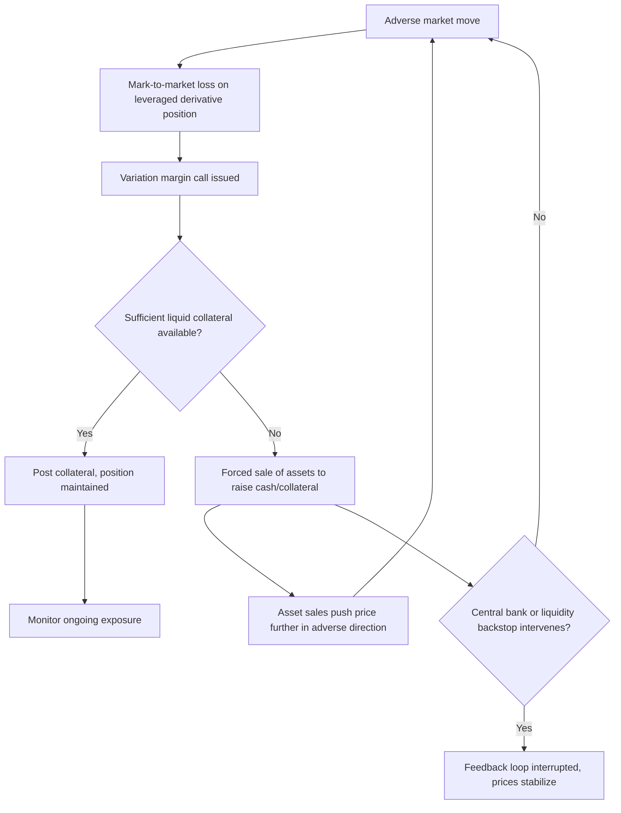

## Liquidity Risk in Derivatives Portfolios

### Overview and Definitions

Liquidity risk in derivatives portfolios encompasses two distinct but interrelated dimensions: **market (asset) liquidity risk** — the risk that a position cannot be closed out or hedged at or near its modeled/fair value due to insufficient market depth — and **funding liquidity risk** — the risk that an institution cannot meet cash or collateral obligations (margin calls, settlement payments) as they fall due. Derivatives portfolios are particularly exposed to both because they typically involve leverage, contingent cash flows, and collateral mechanics (margin) that can generate sudden, large liquidity demands unrelated to the notional size of the original trade.

### Market (Asset) Liquidity Risk

**Key Points**

- **Bid-ask spread cost**: the immediate cost of unwinding a position, which widens sharply during stress — a position priced off a tight mid-market spread in calm conditions can become dramatically more expensive to exit in a crisis.
- **Market depth and price impact**: large positions relative to typical daily trading volume move the market against the holder when liquidated ("market impact" or "slippage"), a nonlinear cost that standard VaR models calibrated on small historical position changes typically ignore.
- **Liquidity horizon**: the time realistically required to liquidate or hedge a position without materially moving the market — varies drastically by instrument, from minutes (liquid FX spot, exchange-traded futures) to months (bespoke OTC exotics, structured notes, illiquid credit derivatives).
- **Liquidity risk concentration by instrument type**: exchange-traded, standardized derivatives (listed futures/options) are generally far more liquid than bespoke OTC structured products, which may have few or no natural counterparties for an offsetting trade.

### Funding Liquidity Risk in Derivatives

**Key Points**

- **Variation margin (VM)**: daily (or intraday) cash/collateral settlement of mark-to-market gains and losses on cleared and, since post-GFC reforms, many non-cleared derivatives — a sudden adverse market move can generate large, immediate VM calls.
- **Initial margin (IM)**: collateral posted upfront to cover potential future exposure over a close-out period; IM requirements themselves can increase during stress as models (e.g., SIMM — ISDA's Standard Initial Margin Model) react to rising volatility, creating a procyclical funding drain exactly when liquidity is scarcest.
- **Wrong-way liquidity risk**: when the very market move that causes losses on a derivatives position also impairs the institution's ability to raise the cash/collateral needed to meet the resulting margin call (e.g., a rates short squeeze causing both mark-to-market losses and stress in the repo market used to fund collateral).
- **Collateral eligibility and haircuts**: not all collateral is eligible for all margin calls, and haircuts on posted collateral can increase during stress, meaning more collateral is needed for the same notional exposure.

### Case Study Pattern: The 2022 UK LDI Crisis

[Inference] This episode is widely cited in risk management literature as an illustrative example of margin-driven liquidity risk feedback loops, though specific causal attributions continue to be debated by analysts. UK pension fund Liability-Driven Investment (LDI) strategies used leveraged gilt (UK government bond) derivative and repo positions to hedge long-dated liabilities. A sharp, rapid rise in gilt yields (triggered by a fiscal policy announcement) caused mark-to-market losses on these leveraged positions, triggering variation margin calls. To meet the calls, funds were forced to sell gilts, which pushed yields higher still, triggering further margin calls — a self-reinforcing "doom loop" that required Bank of England intervention (emergency gilt purchases) to break.

This pattern — leveraged derivative exposure, margin calls, forced asset sales, further price moves, further margin calls — is the canonical structure of a margin spiral and is a central concern in modern liquidity risk frameworks for derivatives-heavy portfolios.

### Liquidity-Adjusted VaR (LVaR)

Extends standard VaR to incorporate the cost of liquidating a position within its realistic liquidation horizon, rather than assuming instantaneous, cost-free exit at mid-market prices.

**Simple spread-based adjustment**:

$$LVaR = VaR + \frac{1}{2} \times Spread \times Position\ Value \times \sqrt{\frac{Liquidation\ Horizon}{Base\ Horizon}}$$

where the spread term captures the expected cost of crossing the bid-ask spread, and the square-root scaling reflects that if a position must be worked out over several days rather than liquidated instantly, the effective holding period — and hence risk — extends accordingly.

**Key Points**

- **BCBS/FRTB liquidity horizon approach**: rather than a single VaR holding period for the whole book, FRTB assigns risk-factor-specific liquidity horizons (10, 20, 40, 60, or 120 days depending on the factor's liquidity) and requires shocks to be scaled and cascaded across these horizons — a more granular and structurally different mechanism than the simple additive LVaR formula above, but conceptually addressing the same problem: that different risk factors take different amounts of time to safely unwind.
- **Endogenous vs. exogenous liquidity**: exogenous liquidity (bid-ask spread, general market depth) is common to all market participants; endogenous liquidity risk is specific to the size of the holder's own position relative to the market — a large position causes price impact upon unwind is proportional to that specific position size, not a market-wide constant.

### Liquidity Risk Metrics and Indicators

| Metric | What It Captures |
| --- | --- |
| Bid-ask spread (current and historical stress-period) | Immediate cost of exit |
| Average daily trading volume (ADV) / position-to-ADV ratio | Time needed to liquidate without material price impact |
| Liquidity Coverage Ratio (LCR) — banking regulatory metric | High-quality liquid assets vs. 30-day stressed net cash outflows |
| Net Stable Funding Ratio (NSFR) | Structural funding stability over a 1-year horizon |
| Margin-to-NAV ratio (for funds using derivatives) | Sensitivity of the fund's liquidity needs to margin calls relative to available assets |
| Liquidity horizon buckets (FRTB-style) | Risk-factor-specific time to safely unwind exposure |

### Diagram: Margin Spiral Feedback Loop

### Diagram: Two Dimensions of Derivatives Liquidity Risk (svg_diagram)

<svg xmlns="http://www.w3.org/2000/svg" viewBox="0 0 760 360">
<text x="380" y="25" text-anchor="middle" font-size="16" font-weight="bold">Market Liquidity Risk vs Funding Liquidity Risk (svg_diagram)</text>
<rect x="50" y="60" width="300" height="260" rx="8" fill="#eaf2fb" stroke="#2c6fbb" stroke-width="1.5" />
<text x="200" y="90" text-anchor="middle" font-size="13" font-weight="bold" fill="#2c6fbb">Market (Asset) Liquidity Risk</text>
<text x="200" y="120" text-anchor="middle" font-size="11">Bid-ask spread widening</text>
<text x="200" y="150" text-anchor="middle" font-size="11">Market depth / price impact</text>
<text x="200" y="180" text-anchor="middle" font-size="11">Liquidation horizon</text>
<text x="200" y="210" text-anchor="middle" font-size="11">Instrument standardization</text>
<text x="200" y="250" text-anchor="middle" font-size="11" font-style="italic">Can I exit at fair value?</text>
<rect x="410" y="60" width="300" height="260" rx="8" fill="#fdf1e8" stroke="#e67e22" stroke-width="1.5" />
<text x="560" y="90" text-anchor="middle" font-size="13" font-weight="bold" fill="#a04000">Funding Liquidity Risk</text>
<text x="560" y="120" text-anchor="middle" font-size="11">Variation margin calls</text>
<text x="560" y="150" text-anchor="middle" font-size="11">Initial margin (SIMM) increases</text>
<text x="560" y="180" text-anchor="middle" font-size="11">Collateral haircuts</text>
<text x="560" y="210" text-anchor="middle" font-size="11">Wrong-way liquidity risk</text>
<text x="560" y="250" text-anchor="middle" font-size="11" font-style="italic">Can I meet cash/collateral calls?</text>
<line x1="350" y1="190" x2="410" y2="190" stroke="#7d3c98" stroke-width="2" marker-end="url(#arrowL)" />
<line x1="410" y1="210" x2="350" y2="210" stroke="#7d3c98" stroke-width="2" marker-end="url(#arrowL2)" />
<text x="380" y="340" text-anchor="middle" font-size="11" fill="#7d3c98">Interact via margin spirals</text>
</svg>

### Regulatory and Governance Frameworks

- **Basel III LCR/NSFR**: bank-wide funding liquidity metrics that indirectly capture derivatives-driven liquidity demands via stressed net cash outflow assumptions applied to margin and collateral flows.
- **ISDA SIMM**: standardized initial margin model for non-cleared derivatives, designed for transparency and disputes-reduction, but which itself is a source of procyclical margin (and hence funding liquidity) risk since IM requirements rise mechanically with realized volatility.
- **Central clearing (CCP) margin frameworks**: CCPs impose both initial margin (often via a VaR- or ES-based model, e.g., SPAN or proprietary equivalents) and variation margin, with additional stress-based add-ons; CCP margin methodology changes during stress periods are themselves a source of systemic liquidity demand across all clearing members simultaneously.
- **Fund-level liquidity risk management rules** (e.g., UCITS liquidity risk management requirements, SEC liquidity rule frameworks for US registered funds): require funds using derivatives to maintain liquidity buffers and stress-test redemption/margin scenarios.

### Practical Risk Management Approaches

**Key Points**

- **Liquidity buffers**: maintaining a pool of unencumbered high-quality liquid assets (HQLA) sized to cover plausible stressed margin call scenarios, not just steady-state operational needs.
- **Margin call stress testing**: explicitly modeling how much additional variation and initial margin would be required under historical or hypothetical stress scenarios (directly linking to the stress testing frameworks discussed for market risk generally), sized against available liquid resources.
- **Collateral diversification and optimization**: managing eligible collateral pools across multiple CCPs/counterparties to avoid concentration in a single collateral type or funding source that could itself become illiquid or subject to a haircut increase simultaneously.
- **Position sizing relative to market depth**: incorporating position-to-ADV ratios and liquidation horizon estimates directly into position limits, not just notional or VaR limits, so that a position judged small by VaR standards but illiquid relative to its market is still flagged.
- [Inference] Firms differ in how tightly they integrate liquidity risk metrics into the same governance and limit-setting process as market risk (VaR/ES) limits; more mature frameworks increasingly treat liquidity and market risk as jointly managed rather than siloed disciplines, though the degree of integration varies by institution and is not fully standardized across the industry.

**Related Topics**

- Expected Shortfall and Tail Risk Measures
- Stress Testing and Scenario Analysis
- Counterparty Credit Risk and CVA
- Central Clearing and CCP Margin Methodologies (SPAN, VaR/ES-based IM)
- ISDA SIMM and Non-Cleared Margin Rules
- Basel III Liquidity Coverage Ratio and Net Stable Funding Ratio
- Repo Markets and Collateral Funding Mechanics