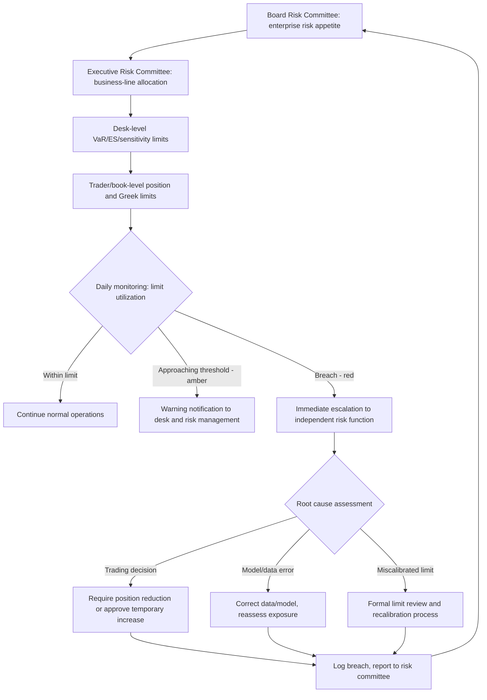

## Risk Limit Setting and Governance

### Overview and Purpose

Risk limit setting and governance is the institutional framework by which an organization translates its risk appetite into concrete, monitorable, and enforceable constraints on trading and portfolio activity. Where VaR, ES, and stress testing produce risk *measurements*, limit governance is the operational and organizational layer that turns those measurements into actionable boundaries — ensuring risk-taking stays aligned with the board-approved risk appetite, and that breaches trigger defined, timely responses rather than being discovered after the fact.

### Risk Appetite Framework (RAF)

The limit-setting process begins at the top of the organization with a **Risk Appetite Statement**, typically approved by the board, which articulates the aggregate level and types of risk the firm is willing to accept in pursuit of its strategic objectives. This cascades downward into a hierarchy of increasingly granular limits:

**Key Points**

- **Board/enterprise level**: aggregate risk appetite metrics (e.g., total VaR/ES as a percentage of capital, maximum stress-test loss as a percentage of capital, earnings-at-risk).
- **Business line/division level**: risk capital allocation and limits per business unit, reflecting strategic priorities and risk-adjusted return expectations.
- **Desk level**: VaR, ES, and sensitivity (Greeks) limits assigned to specific trading desks, calibrated to the desk's mandate and capital allocation.
- **Trader/book level**: granular position, notional, and sensitivity limits for individual trading books or even individual traders, providing the most immediate and frequently monitored constraint.

### Types of Risk Limits

| Limit Type | What It Constrains | Typical Use |
| --- | --- | --- |
| VaR/ES limits | Statistical loss estimate at a confidence level | Desk and portfolio-level aggregate risk |
| Notional limits | Gross or net notional exposure | Simple, transparent cap on position size, especially for products where VaR may understate tail risk |
| Sensitivity (Greek) limits | Delta, gamma, vega, DV01/PV01 | Granular control of specific risk factor exposures, especially options desks |
| Concentration limits | Exposure to a single name, sector, country, or counterparty | Prevents excessive reliance on correlated bets or single-point failures |
| Stress test limits | Maximum loss under a defined stress scenario | Captures tail risk not visible in VaR |
| Stop-loss limits | Cumulative realized/unrealized P&L loss over a period | Circuit breaker forcing position reduction after losses, independent of statistical risk measures |
| Liquidity limits | Position size relative to market depth (ADV ratio) or liquidation horizon | Controls market and funding liquidity risk exposure |
| Counterparty/credit limits | Exposure to a single counterparty (potential future exposure, CVA) | Controls counterparty credit risk concentration |

### Limit Calibration Methodology

**Key Points**

- **Top-down capital allocation**: enterprise risk appetite is allocated down to business lines based on strategic priorities, historical risk-adjusted returns, and diversification benefits, often using a risk-weighted capital allocation methodology.
- **Bottom-up aggregation check**: individual desk/trader limits are set with reference to what the business needs to execute its mandate, then aggregated upward to verify the sum does not exceed (or is consistent with the diversification benefit assumed in) the higher-level limit.
- **Correlation and diversification effects**: because VaR/ES exhibit subadditivity (for coherent measures) or at least partial diversification benefit, the sum of desk-level limits can exceed the enterprise-level limit by design, reflecting the expectation that not all desks will be at maximum stressed loss simultaneously — this requires careful governance to avoid systematically under-provisioning for the case where correlations do in fact spike (see stress testing's correlation breakdown concern).
- **Regular recalibration**: limits should be periodically reviewed and recalibrated against changing market volatility regimes, business strategy shifts, and capital availability — a static limit framework can become either unnecessarily restrictive or dangerously permissive as conditions evolve.

### Governance Structure and Roles

**Key Points**

- **Board of Directors / Board Risk Committee**: ultimate approval authority for the risk appetite statement and enterprise-level limits; receives periodic (typically quarterly) reporting on limit utilization and material breaches.
- **Executive/Management Risk Committee**: oversees implementation of the risk appetite framework, approves business-line limit allocations, and resolves escalated limit breach decisions.
- **Independent Risk Management function (Second Line of Defense)**: sets and monitors limits independently from the trading desks (First Line of Defense), calculates risk metrics, identifies breaches, and escalates per policy — critically, this function must have genuine independence and authority, including the ability to mandate position reduction, separate from front-office P&L incentives.
- **Front Office / Trading Desks (First Line of Defense)**: operate within assigned limits day-to-day; responsible for immediate awareness of their own limit utilization, though they do not self-monitor for compliance purposes.
- **Internal Audit (Third Line of Defense)**: periodically reviews the adequacy and adherence of the limit framework itself, independent of both the trading and risk management functions.

This is the standard **Three Lines of Defense** model widely used in financial institution risk governance, ensuring no single function both takes risk and independently validates that risk-taking.

### Limit Breach Escalation and Response

1. **Detection**: automated or end-of-day risk system flags a limit utilization above threshold (often with pre-breach "amber" warning levels below the hard "red" limit itself).
2. **Immediate notification**: escalation to the desk head, independent risk management, and potentially senior management, depending on breach severity and duration.
3. **Root cause and materiality assessment**: determine whether the breach reflects a genuine risk-taking decision, a model/data error, a temporary market-driven sensitivity spike, or a limit that is now miscalibrated relative to current market conditions.
4. **Remediation decision**: options typically include immediate position reduction/hedging to bring exposure back within limit, a time-bound temporary limit increase approved at an appropriate authority level, or a permanent limit recalibration if the breach reveals a structural issue.
5. **Documentation and reporting**: all breaches, root causes, and remediation actions are logged and reported up the governance chain, feeding into periodic risk committee and board reporting.

**Key Points**

- **Escalation authority tiers**: the level of approval required to authorize a temporary limit increase typically scales with the size/duration of the requested increase — a small, brief increase might be approved by a desk-level risk officer, while a large or open-ended increase requires escalation to senior risk committees or the board.
- **Repeated breaches as a governance signal**: a pattern of recurring breaches on the same limit is generally treated as evidence the limit itself may be miscalibrated (too tight for a genuine, sanctioned business need) rather than solely a trading discipline issue, prompting formal limit review rather than repeated ad hoc exceptions.

### Diagram: Limit Governance Hierarchy and Escalation

### Diagram: Three Lines of Defense Model (svg_diagram)

<svg xmlns="http://www.w3.org/2000/svg" viewBox="0 0 760 340">
<text x="380" y="25" text-anchor="middle" font-size="16" font-weight="bold">Three Lines of Defense: Limit Governance (svg_diagram)</text>
<rect x="40" y="60" width="200" height="220" rx="8" fill="#eaf2fb" stroke="#2c6fbb" stroke-width="1.5" />
<text x="140" y="90" text-anchor="middle" font-size="12" font-weight="bold" fill="#2c6fbb">First Line</text>
<text x="140" y="110" text-anchor="middle" font-size="11">Trading Desks</text>
<text x="140" y="140" text-anchor="middle" font-size="10">Operate within</text>
<text x="140" y="155" text-anchor="middle" font-size="10">assigned limits</text>
<text x="140" y="185" text-anchor="middle" font-size="10">Own day-to-day</text>
<text x="140" y="200" text-anchor="middle" font-size="10">risk-taking</text>
<rect x="280" y="60" width="200" height="220" rx="8" fill="#fdf1e8" stroke="#e67e22" stroke-width="1.5" />
<text x="380" y="90" text-anchor="middle" font-size="12" font-weight="bold" fill="#a04000">Second Line</text>
<text x="380" y="110" text-anchor="middle" font-size="11">Independent Risk Mgmt</text>
<text x="380" y="140" text-anchor="middle" font-size="10">Sets and monitors</text>
<text x="380" y="155" text-anchor="middle" font-size="10">limits independently</text>
<text x="380" y="185" text-anchor="middle" font-size="10">Escalates breaches,</text>
<text x="380" y="200" text-anchor="middle" font-size="10">mandates remediation</text>
<rect x="520" y="60" width="200" height="220" rx="8" fill="#f4ecf7" stroke="#7d3c98" stroke-width="1.5" />
<text x="620" y="90" text-anchor="middle" font-size="12" font-weight="bold" fill="#4a235a">Third Line</text>
<text x="620" y="110" text-anchor="middle" font-size="11">Internal Audit</text>
<text x="620" y="140" text-anchor="middle" font-size="10">Reviews adequacy of</text>
<text x="620" y="155" text-anchor="middle" font-size="10">the limit framework</text>
<text x="620" y="185" text-anchor="middle" font-size="10">Independent of both</text>
<text x="620" y="200" text-anchor="middle" font-size="10">First and Second Line</text>
<line x1="240" y1="170" x2="280" y2="170" stroke="#555" stroke-width="1.5" marker-end="url(#a1)" />
<line x1="480" y1="170" x2="520" y2="170" stroke="#555" stroke-width="1.5" marker-end="url(#a1)" />
<text x="380" y="310" text-anchor="middle" font-size="11" fill="#555">Board Risk Committee oversees all three lines</text>
</svg>

### Regulatory Expectations

- **Basel Committee guidance / BCBS 239**: principles for effective risk data aggregation and risk reporting emphasize that limit frameworks must be supported by accurate, timely, and complete risk data — a limit is only as reliable as the data feeding its calculation.
- **FRTB governance requirements**: for IMA-approved desks, ongoing eligibility depends partly on demonstrating robust internal limit and governance structures around model use, not just the model's statistical backtesting performance.
- **SR 11-7 (US Federal Reserve model risk management guidance) and equivalents**: while primarily about model validation, such guidance intersects with limit governance where limits themselves rely on model outputs (VaR, ES, sensitivities) that must be independently validated.
- [Inference] Supervisory expectations around limit governance have generally increased in granularity and documentation requirements since the GFC, though specific supervisory emphasis varies by jurisdiction and by the size/complexity designation of the institution.

### Practical Governance Challenges

**Key Points**

- **Limit gaming and boundary-testing**: traders may structure positions specifically to stay just under a limit threshold while still taking on the intended risk exposure (e.g., splitting a large position to avoid triggering a single-line-item concentration limit) — governance frameworks need periodic independent review to detect such patterns, not just automated real-time monitoring.
- **Data latency and intraday risk**: end-of-day limit monitoring can miss significant intraday risk-taking and unwinding that never appears in the official end-of-day snapshot; more sophisticated frameworks incorporate real-time or near-real-time limit monitoring for higher-risk desks.
- **New product/model onboarding lag**: a new instrument type may not yet have well-calibrated risk weights, correlations, or even a properly integrated sensitivity feed, creating a period where limits may not accurately reflect true risk — new product approval processes typically require sign-off from risk management specifically addressing this gap before trading can begin at scale.
- **Balancing rigidity and flexibility**: overly rigid limits without any temporary-increase mechanism can force poorly-timed, value-destructive position unwinds during transient volatility spikes; overly flexible exception processes can undermine the credibility and enforceability of the entire limit framework — striking this balance is an ongoing governance judgment call rather than a fixed rule.

**Related Topics**

- Expected Shortfall and Tail Risk Measures
- Stress Testing and Scenario Analysis
- Sensitivity Based Risk Frameworks
- Liquidity Risk in Derivatives Portfolios
- Model Risk Management and Validation Frameworks
- Three Lines of Defense and Enterprise Risk Governance
- Counterparty Credit Risk Limits and Wrong-Way Risk