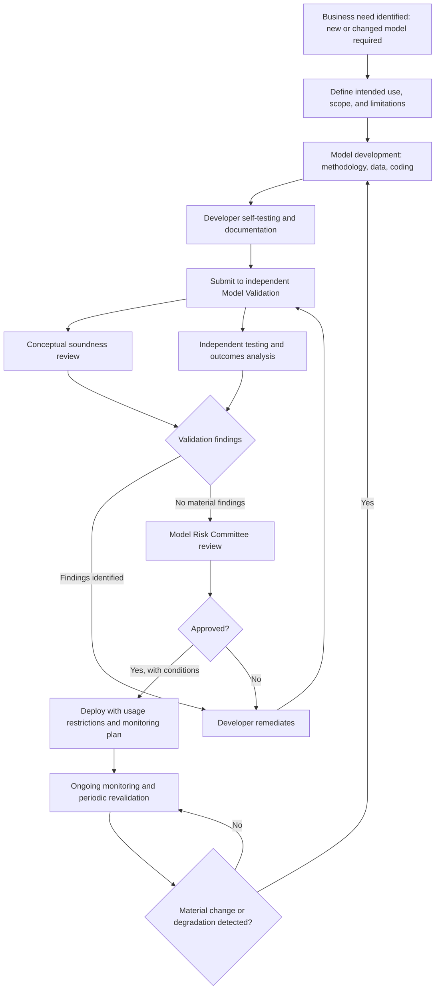

## Model Development Governance

### Overview and Purpose

Model development governance is the set of organizational policies, processes, and controls governing how quantitative models are conceived, built, tested, approved, and released for use within a financial institution. It sits upstream of model validation (which independently reviews a model after or during development) and is a core pillar of broader Model Risk Management (MRM) frameworks, most prominently codified in supervisory guidance such as the US Federal Reserve/OCC's SR 11-7 and the UK PRA's SS1/23.

### Model Risk Management Lifecycle

**Key Points**

- **Model definition and inventory**: a "model" is generally defined broadly as any quantitative method, system, or approach that applies statistical, economic, financial, or mathematical theories, techniques, and assumptions to process input data into quantitative estimates — this definition is intentionally wide, capturing not just pricing/risk models but spreadsheets, rating systems, and increasingly machine learning pipelines. Every model in use must be captured in a firm-wide model inventory with a unique identifier, owner, and risk tier.
- **Model risk tiering**: models are classified (e.g., high/medium/low materiality) based on factors such as financial impact, complexity, use in regulatory capital calculations, and reliance in critical business decisions — the tier determines the intensity of governance controls applied (validation depth, revalidation frequency, approval authority level).
- **Three lines of defense applied to models**: model developers and owners (First Line) build and use models; independent Model Validation (Second Line) reviews and challenges them; Internal Audit (Third Line) periodically assesses whether the overall MRM framework itself is functioning as designed.

### Model Development Standards

**Key Points**

- **Business requirements and use-case definition**: before development begins, the intended use, scope, and limitations of the model must be documented — a model built for one purpose (e.g., regulatory capital) being repurposed for another (e.g., pricing) without revalidation is a common source of model risk.
- **Conceptual soundness**: the theoretical basis for the model — the underlying assumptions, mathematical/statistical techniques, and their appropriateness for the intended application — must be documented and justified, distinguishing established, well-tested methodology from novel or judgmental approaches requiring extra scrutiny.
- **Data quality and lineage**: input data must be assessed for completeness, accuracy, relevance to the modeled phenomenon, and appropriate time period coverage; data lineage (where the data originates, how it is transformed before reaching the model) must be documented and auditable.
- **Model documentation standards**: development documentation typically must cover methodology, assumptions, limitations, data sources, testing performed, and known weaknesses — sufficiently detailed that someone other than the original developer could understand, reproduce, and assess the model's behavior.
- **Version control and change management**: formal versioning of model code, parameters, and documentation, with a defined process for classifying changes (e.g., minor recalibration vs. major methodology change) that determines what level of re-approval is required.

### Independent Model Validation

While development governance concerns how a model is built, validation is the independent (Second Line) function that reviews it before and periodically after deployment. Validation typically covers three pillars:

1. **Conceptual soundness review**: assessing whether the model's theoretical basis, assumptions, and design choices are appropriate for the intended use, including comparison against alternative approaches and industry practice.
2. **Ongoing monitoring**: periodic checks (backtesting, benchmarking, sensitivity analysis) confirming the model continues to perform as expected as market conditions or the underlying population change over time.
3. **Outcomes analysis**: comparing model outputs/predictions against actual realized outcomes (e.g., comparing VaR predictions against realized P&L via backtesting, or comparing predicted default rates against actual defaults for a credit model).

**Key Points**

- **Independence requirement**: validators must be organizationally and, ideally, managerially separate from model developers, with validation findings reported through a distinct escalation channel not subject to override by the development team or the business line that benefits from the model's use.
- **Effective challenge**: validation is expected to provide genuine, substantive challenge to model choices — not a rubber-stamp review — including the ability to require remediation or restrict/limit model use pending fixes.
- **Model limitations and compensating controls**: no model perfectly represents reality; validation explicitly documents known limitations and assesses whether compensating controls (management overlays, conservative add-ons, usage restrictions) adequately address the resulting risk.

### Model Approval and Sign-off Process

1. **Development completion and self-testing**: developer performs initial testing (unit tests, backtesting, sensitivity analysis) and compiles development documentation.
2. **Independent validation review**: validation team performs conceptual soundness review, independent testing, and outcomes analysis, documenting findings and any required remediation.
3. **Findings remediation**: developer addresses validation findings; validation confirms remediation is adequate (or escalates unresolved disagreements).
4. **Model risk committee approval**: for higher-tier models, a formal model risk committee (often chaired by a Chief Model Risk Officer or equivalent) reviews the validation report and approves the model for use, potentially with usage restrictions or conditions.
5. **Deployment with defined use limitations**: model is released into production with explicit statement of approved use cases, along with any monitoring requirements or usage restrictions flagged during validation.
6. **Periodic revalidation**: models are revalidated on a schedule proportional to their risk tier (e.g., annually for high-tier models), or triggered earlier by a material market regime change, a significant model performance degradation, or a material change to the model's underlying methodology or use.

### Diagram: Model Development and Approval Lifecycle

### Diagram: Model Risk Governance Structure (svg_diagram)

<svg xmlns="http://www.w3.org/2000/svg" viewBox="0 0 760 360">
<text x="380" y="25" text-anchor="middle" font-size="16" font-weight="bold">Model Risk Management Governance Structure (svg_diagram)</text>
<rect x="290" y="45" width="180" height="40" rx="6" fill="#2c6fbb" />
<text x="380" y="70" text-anchor="middle" font-size="12" fill="white" font-weight="bold">Model Risk Committee</text>
<line x1="380" y1="85" x2="150" y2="130" stroke="#555" stroke-width="1.4" />
<line x1="380" y1="85" x2="380" y2="130" stroke="#555" stroke-width="1.4" />
<line x1="380" y1="85" x2="610" y2="130" stroke="#555" stroke-width="1.4" />
<rect x="60" y="130" width="180" height="50" rx="6" fill="#eaf2fb" stroke="#2c6fbb" />
<text x="150" y="150" text-anchor="middle" font-size="11" font-weight="bold">First Line</text>
<text x="150" y="167" text-anchor="middle" font-size="10">Model Developers / Owners</text>
<rect x="290" y="130" width="180" height="50" rx="6" fill="#fdf1e8" stroke="#e67e22" />
<text x="380" y="150" text-anchor="middle" font-size="11" font-weight="bold">Second Line</text>
<text x="380" y="167" text-anchor="middle" font-size="10">Independent Model Validation</text>
<rect x="520" y="130" width="180" height="50" rx="6" fill="#f4ecf7" stroke="#7d3c98" />
<text x="610" y="150" text-anchor="middle" font-size="11" font-weight="bold">Third Line</text>
<text x="610" y="167" text-anchor="middle" font-size="10">Internal Audit</text>
<line x1="150" y1="180" x2="150" y2="215" stroke="#555" stroke-width="1.2" />
<rect x="60" y="215" width="180" height="35" rx="5" fill="#ffffff" stroke="#2c6fbb" />
<text x="150" y="237" text-anchor="middle" font-size="10">Build, document, self-test</text>
<line x1="380" y1="180" x2="380" y2="215" stroke="#555" stroke-width="1.2" />
<rect x="290" y="215" width="180" height="35" rx="5" fill="#ffffff" stroke="#e67e22" />
<text x="380" y="237" text-anchor="middle" font-size="10">Review, challenge, monitor</text>
<line x1="610" y1="180" x2="610" y2="215" stroke="#555" stroke-width="1.2" />
<rect x="520" y="215" width="180" height="35" rx="5" fill="#ffffff" stroke="#7d3c98" />
<text x="610" y="237" text-anchor="middle" font-size="10">Audit the MRM framework</text>
<rect x="220" y="280" width="320" height="45" rx="6" fill="#eafaf1" stroke="#27ae60" />
<text x="380" y="307" text-anchor="middle" font-size="11" fill="#1e6b3f">Model Inventory: single source of truth, risk-tiered</text>
</svg>

### Special Considerations for Machine Learning and Complex Models

**Key Points**

- **Explainability and interpretability**: complex ML models (gradient boosting, neural networks) pose additional governance challenges because their decision logic is harder to interpret than traditional parametric models — governance frameworks increasingly require explainability tooling (e.g., SHAP values, partial dependence analysis) as part of the validation evidence package.
- **Training/validation/test data governance**: ML-specific concerns include out-of-sample and out-of-time testing rigor, guarding against data leakage between training and test sets, and ongoing monitoring for feature drift (input data distribution changing over time) and concept drift (the underlying relationship between inputs and outputs changing).
- **Champion-challenger frameworks**: running a new ("challenger") model in parallel with the existing ("champion") production model before full replacement, comparing live performance before committing to a change — a common risk-mitigation pattern for higher-tier model replacements generally, and particularly emphasized for ML model governance.
- [Inference] Regulatory guidance on ML/AI model governance is still evolving relative to the long-established SR 11-7-style framework for traditional quantitative models, and institutions vary in how they adapt existing model risk frameworks (versus building parallel AI-specific governance structures) to cover these newer model types.

### Common Governance Failure Modes

- **Model risk concentration**: over-reliance on a single model or vendor methodology across many use cases, such that a single flaw propagates broadly — mitigated by diversity of approach and independent benchmarking against alternative models.
- **Validation-development independence erosion**: informal pressure (time constraints, business urgency) can erode the practical independence of validation review even when it exists on paper — a recognized governance risk requiring active monitoring by senior risk management and audit.
- **Inventory gaps ("shadow models")**: end-user-developed tools (spreadsheets, ad hoc scripts) used in material decisions but never formally captured in the model inventory or subjected to governance — a persistent practical challenge, particularly in smaller or less mature risk functions.
- **Stale revalidation amid changing conditions**: a model validated as sound under one market regime may degrade materially under a different one; governance frameworks need trigger-based (not just calendar-based) revalidation to catch this promptly.

**Related Topics**

- Model Validation Techniques: Backtesting, Benchmarking, and Outcomes Analysis
- SR 11-7 and Global Model Risk Management Regulatory Frameworks
- Machine Learning Model Governance and Explainability
- Expected Shortfall and Tail Risk Measures
- Risk Limit Setting and Governance
- Model Risk Capital and Reserving for Model Uncertainty
- Data Governance and Lineage in Quantitative Finance