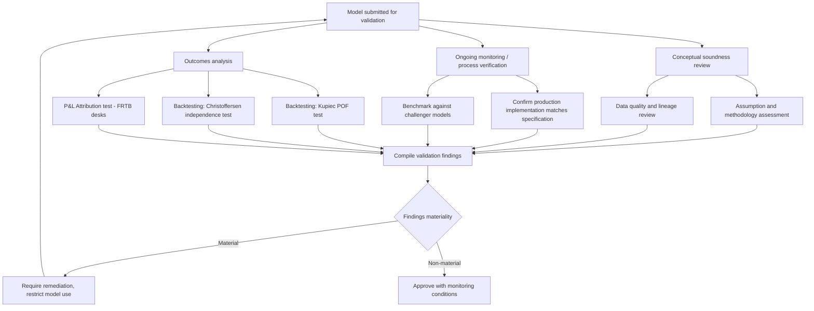

## Independent Model Validation Standards

### Overview and Regulatory Basis

Independent Model Validation Standards define the requirements, scope, and rigor expected of the Second Line of Defense function responsible for challenging and confirming (or rejecting) the soundness of quantitative models before and during their use. The foundational reference framework globally is the US Federal Reserve/OCC's **SR 11-7** ("Guidance on Model Risk Management," 2011), with substantially similar principles reflected in the UK PRA's **SS1/23**, the ECB's guide on internal models, and equivalent supervisory guidance in other jurisdictions. Validation is distinct from model development testing: it must be performed by staff who are independent of, and not incentivized by, the model's development or use.

### The Three Core Elements of Validation (per SR 11-7)

**Key Points**

- **Evaluation of conceptual soundness**: assessing the quality of model design, theoretical basis, and construction — including evaluation of the developer's testing (in-sample, out-of-sample, sensitivity analysis) and whether the chosen methodology, assumptions, and data are appropriate for the model's intended use.
- **Ongoing monitoring**: verifying that a model is implemented correctly, is being used and is performing as intended, and that assumptions remain appropriate given actual portfolio composition and market conditions — including process verification (checking the model as actually implemented in production systems matches its specification) and benchmarking against alternative models or data sources.
- **Outcomes analysis**: comparing model outputs to actual, subsequent, real-world outcomes — the most direct and often most powerful validation tool, since it tests the model's actual predictive performance rather than relying solely on theoretical soundness arguments. Backtesting is the primary outcomes analysis technique for market risk models (VaR/ES).

### Validation Independence Requirements

**Key Points**

- **Organizational separation**: validators must not report into the same management chain as model developers or the business line that owns/benefits from the model, to avoid conflicts of interest that could compromise objective challenge.
- **Compensation structure independence**: validator compensation and performance evaluation should not be tied to the business outcomes the model supports (e.g., a validator should not be incentivized by the trading desk's P&L or a model's approval speed).
- **Authority to restrict model use**: an effective validation function must have genuine authority — not merely advisory influence — to restrict, limit, or require additional controls (conservative overlays, usage caps) on a model, and its findings must be escalated through channels the development/business side cannot unilaterally override.
- **Validator competence and resourcing**: validators must possess technical skills commensurate with the model's complexity; a firm using increasingly sophisticated (e.g., machine learning) models must correspondingly invest in validators capable of genuinely challenging those techniques, not simply following a checklist designed for simpler parametric models.

### Backtesting as Outcomes Analysis: VaR/ES Model Validation

Backtesting compares a model's predicted risk (VaR at a given confidence level) against subsequently realized P&L, counting exceptions (days when actual loss exceeds predicted VaR).

**Kupiec's Proportion of Failures (POF) Test**

Tests whether the observed exception rate is statistically consistent with the expected rate under the model's stated confidence level. For $n$ observations and $x$ exceptions, the likelihood ratio test statistic is:

$$LR_{POF} = -2\ln\left[\frac{(1-p)^{n-x}p^x}{(1-\hat{p})^{n-x}\hat{p}^x}\right]$$

where $p = 1-\alpha$ is the expected exception rate and $\hat{p} = x/n$ is the observed rate. Under the null hypothesis that the model is correctly calibrated, $LR_{POF}$ is asymptotically chi-squared distributed with 1 degree of freedom.

**Christoffersen's Independence Test**

Extends Kupiec's test by additionally checking whether exceptions cluster in time (violation clustering suggests the model is slow to adapt to changing volatility, even if the overall exception count is statistically acceptable), using a Markov chain approach to test whether the probability of an exception on day $t$ depends on whether an exception occurred on day $t-1$.

**Basel Traffic-Light Approach**

Basel's supervisory backtesting framework classifies the number of VaR exceptions over a rolling 250-business-day window into three zones, each with an associated capital multiplier consequence:

| Zone | Exceptions (250-day window, 99% VaR) | Capital Multiplier Consequence |
| --- | --- | --- |
| Green | 0-4 | No increase — model performing as expected |
| Yellow | 5-9 | Scaling factor increase (graduated), possible supervisory review |
| Red | 10+ | Significant scaling factor increase, mandatory model review/remediation |

### P&L Attribution Test (FRTB-Specific)

Under FRTB, IMA-approved trading desks must additionally pass a **P&L Attribution (PLA) test**, which compares the desk's front-office (actual, "hypothetical") P&L against the risk-management model's ("risk-theoretical") P&L computed using the same risk factors. Two statistical metrics are assessed per desk:

- **Correlation** between hypothetical and risk-theoretical P&L
- **Kolmogorov-Smirnov (KS) test statistic** or the mean/variance ratio, comparing the distributions of the two P&L series

Desks are classified into a traffic-light zone (green/amber/red) based on these metrics; desks in the red zone lose IMA eligibility and fall back to the Standardized Approach capital charge, while amber-zone desks face capital add-ons. [Inference] The PLA test's dual metric structure has been the subject of ongoing industry discussion regarding calibration thresholds, as some argue the specific statistical cutoffs can produce false positives/negatives depending on the risk factor mix of a given desk, though final calibration is a matter of jurisdiction-specific regulatory implementation.

### Model Benchmarking Techniques

**Key Points**

- **Challenger model comparison**: running an alternative, independently-built model against the same inputs and comparing outputs — divergence between the production model and a reasonable alternative is a signal warranting further investigation, not necessarily proof of a flaw in either model.
- **Vendor/industry benchmark comparison**: comparing model outputs against third-party vendor models or published industry data where available (e.g., comparing internal credit risk PDs against external rating agency default statistics).
- **Sensitivity and stress testing of the model itself**: testing how model outputs change under extreme or edge-case inputs, to identify potential instability, non-monotonic behavior, or breakdown regions outside the model's intended operating range.

### Diagram: Validation Testing Framework

### Diagram: Backtesting Exception Zones (svg_diagram)

<svg xmlns="http://www.w3.org/2000/svg" viewBox="0 0 760 320">
<text x="380" y="25" text-anchor="middle" font-size="16" font-weight="bold">Basel Traffic-Light Backtesting Zones (svg_diagram)</text>
<line x1="80" y1="260" x2="720" y2="260" stroke="black" stroke-width="1.5" />
<text x="400" y="295" text-anchor="middle" font-size="12">Number of VaR Exceptions (250-day window)</text>
<rect x="80" y="200" width="256" height="60" fill="#27ae60" fill-opacity="0.75" />
<text x="208" y="235" text-anchor="middle" font-size="13" fill="white" font-weight="bold">GREEN: 0-4</text>
<rect x="336" y="200" width="192" height="60" fill="#f1c40f" fill-opacity="0.8" />
<text x="432" y="235" text-anchor="middle" font-size="13" font-weight="bold">YELLOW: 5-9</text>
<rect x="528" y="200" width="192" height="60" fill="#c0392b" fill-opacity="0.8" />
<text x="624" y="235" text-anchor="middle" font-size="13" fill="white" font-weight="bold">RED: 10+</text>
<text x="208" y="180" text-anchor="middle" font-size="11">No capital add-on</text>
<text x="432" y="180" text-anchor="middle" font-size="11">Graduated multiplier increase</text>
<text x="624" y="180" text-anchor="middle" font-size="11">Mandatory review + high add-on</text>
<line x1="80" y1="260" x2="80" y2="270" stroke="black" />
<text x="80" y="285" text-anchor="middle" font-size="10">0</text>
<line x1="336" y1="260" x2="336" y2="270" stroke="black" />
<text x="336" y="285" text-anchor="middle" font-size="10">5</text>
<line x1="528" y1="260" x2="528" y2="270" stroke="black" />
<text x="528" y="285" text-anchor="middle" font-size="10">10</text>
</svg>

### Documentation and Reporting Standards

**Key Points**

- **Validation reports**: must document scope, methodology applied, findings (including severity/materiality classification), management's response, and the validator's overall conclusion/rating on the model — sufficiently detailed for a model risk committee or regulator to understand the basis for approval or restriction.
- **Finding severity classification**: typically tiered (e.g., high/medium/low) based on potential financial or regulatory impact, with corresponding required remediation timelines and escalation requirements for high-severity findings.
- **Issue tracking and remediation follow-up**: validation findings must be tracked to closure in a formal issue-management system, with independent confirmation that remediation genuinely resolves the identified issue rather than merely being marked closed by the development team.
- **Revalidation triggers**: standards typically specify both calendar-based revalidation (e.g., annual for high-tier models) and event-based triggers (material market regime shift, significant methodology change, sustained performance degradation identified through ongoing monitoring).

### Common Validation Challenges

- **Model complexity outpacing validator capability**: as models incorporate more sophisticated techniques (machine learning, complex Monte Carlo frameworks), validation teams must continuously build corresponding technical expertise or risk providing only superficial challenge.
- **Balancing independence with practical engagement**: validators need sufficient engagement with developers to understand a model's nuances, while maintaining sufficient distance to provide genuine independent challenge — an ongoing organizational tension rather than a solved problem.
- **Validating models with limited historical data**: for new products, new markets, or genuinely novel risk factors, outcomes analysis (the most powerful validation tool) has little historical data to work with, forcing greater reliance on conceptual soundness review and expert judgment, which is inherently less rigorous.
- [Inference] The relative weight placed on conceptual soundness versus outcomes analysis in practice often depends on how much historical performance data is available; more mature, well-established models tend to lean more heavily on backtesting/outcomes evidence, while newer or bespoke models rely more on qualitative conceptual review, though the appropriate balance remains partly a matter of institutional judgment and evolving practice.

**Related Topics**

- Model Development Governance
- Expected Shortfall and Tail Risk Measures
- Historical Simulation and Monte Carlo VaR
- FRTB P&L Attribution Test and Standardized Approach Fallback
- Machine Learning Model Governance and Explainability
- Stress Testing and Scenario Analysis
- Model Risk Capital and Reserving for Model Uncertainty