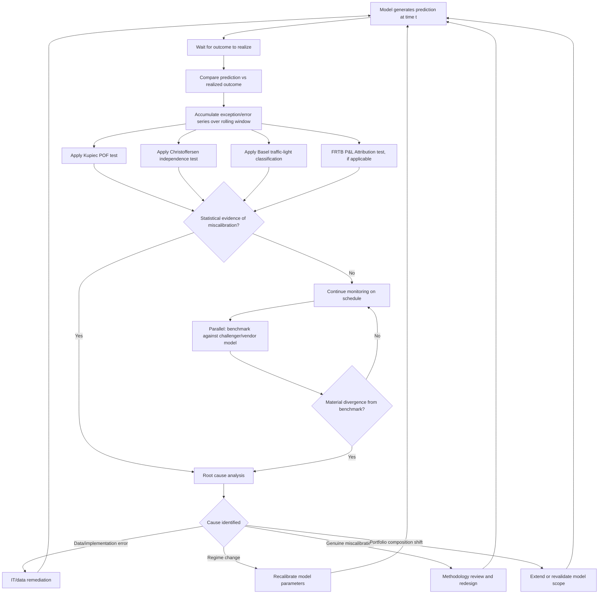

## Backtesting and Benchmarking Models

### Overview and Purpose

Backtesting and benchmarking are the two principal empirical validation techniques used to assess whether a quantitative model performs as intended once deployed. Backtesting compares a model's predictions against subsequently realized outcomes over time, while benchmarking compares a model's outputs against an independent reference — an alternative model, a vendor solution, or external market/industry data — at a point in time. Both fall under the "outcomes analysis" and "ongoing monitoring" pillars of the broader model validation framework, and both are indispensable because conceptual soundness review alone cannot detect certain classes of model failure (subtle calibration drift, implementation bugs, or degradation as market conditions evolve away from the calibration period).

### Backtesting Fundamentals

**Key Points**

- **Core logic**: generate model predictions at time $t$, wait for the outcome to be realized, then compare prediction to realization — repeated over many periods to build a statistically meaningful sample.
- **Clean vs. dirty P&L in market risk backtesting**: "clean" P&L strips out the effect of intraday trading, fees, and non-market-risk P&L components (e.g., new deal margin) to isolate the pure market-risk-driven price change the VaR model is meant to predict; "dirty" (actual) P&L includes all trading activity. Regulatory backtesting (e.g., Basel, FRTB) generally requires both hypothetical (clean) and actual (dirty) P&L backtests to be run, since divergent results between the two can itself be diagnostic (e.g., a model failing on dirty P&L but not clean P&L points to trading activity, not model miscalibration, as the driver).
- **Sample size and statistical power**: backtesting statistical tests (Kupiec, Christoffersen) require a reasonably long observation window to have meaningful power — a 99% VaR model backtested over only 50 days would rarely have any exceptions even if miscalibrated, making the test uninformative; standard practice uses rolling 250-day (roughly one-year) windows as a regulatory minimum.

### VaR/ES Backtesting Statistical Tests

**Kupiec Proportion of Failures (POF) Test**

Tests whether the observed exception frequency matches the model's stated confidence level, using the likelihood ratio:

$$LR_{POF} = -2\ln\left[\frac{(1-p)^{n-x}p^x}{(1-\hat p)^{n-x}\hat p^x}\right] \sim \chi^2_1$$

where $p$ is the model's stated exception probability ($1-\alpha$), $\hat p = x/n$ is the observed exception rate, $n$ is the number of observations, and $x$ is the number of exceptions.

**Christoffersen Independence and Conditional Coverage Tests**

Extends Kupiec by testing whether exceptions are independently distributed over time (rather than clustering), using a first-order Markov chain framework on the exception indicator sequence. The **conditional coverage test** combines the unconditional coverage (Kupiec-style) and independence tests into a single joint likelihood ratio statistic, distributed $\chi^2_2$ under the null.

**Traffic-Light Approach (Basel)**

Classifies the count of exceptions over a rolling 250-day window into green (0-4), yellow (5-9), and red (10+) zones, with each zone carrying an escalating capital multiplier consequence and supervisory response — this framework is deliberately simple and transparent for supervisory comparability across institutions, even though it has less statistical power than the formal likelihood ratio tests.

### Worked Example: Kupiec Test Calculation

Suppose a 99% VaR model ($p=0.01$) is backtested over $n=250$ days and produces $x=6$ exceptions ($\hat p = 6/250 = 0.024$).

$$LR_{POF} = -2\ln\left[\frac{(0.99)^{244}(0.01)^6}{(0.976)^{244}(0.024)^6}\right]$$

Computing the log-likelihood components:

- $\ln(0.99^{244}) = 244 \times \ln(0.99) \approx -2.454$
- $\ln(0.01^6) = 6 \times \ln(0.01) \approx -27.631$
- $\ln(0.976^{244}) = 244 \times \ln(0.976) \approx -6.005$
- $\ln(0.024^6) = 6 \times \ln(0.024) \approx -22.492$

$$LR_{POF} = -2[(-2.454 - 27.631) - (-6.005 - 22.492)] = -2[(-30.085) - (-28.497)] = -2(-1.588) = 3.176$$

Since the critical value for $\chi^2_1$ at 95% confidence is 3.841, and $3.176 < 3.841$, we fail to reject the null hypothesis that the model is correctly calibrated at the 95% test confidence level — 6 exceptions in 250 days, while above the expected 2.5, is not statistically significant evidence of miscalibration given sample size constraints. This illustrates a key practical point: backtesting statistical tests generally have limited power to detect moderate miscalibration over standard sample windows.

### P&L Attribution Testing (FRTB Context)

For FRTB Internal Models Approach desks, backtesting is supplemented by the **P&L Attribution (PLA) test**, comparing front-office ("hypothetical") P&L against the risk model's ("risk-theoretical") P&L computed from the same risk factor set, using both a correlation metric and a distributional similarity metric (e.g., Kolmogorov-Smirnov statistic). Persistent, material divergence between the two P&L series indicates the risk model is missing material risk factors that the front-office pricing model captures (or vice versa), triggering desk-level IMA eligibility consequences.

### Benchmarking Techniques

**Key Points**

- **Challenger model benchmarking**: an independently constructed alternative model (potentially using different methodology, e.g., comparing a parametric VaR model against a historical simulation VaR model on the same portfolio) is run in parallel; material, persistent divergence between the two signals a need for deeper investigation into which model (if either) is better specified.
- **Vendor/third-party benchmarking**: comparing internal model outputs against commercially available vendor models or industry consensus data (e.g., comparing internal option pricing against a recognized vendor analytics library, or comparing internal credit PDs against rating agency published default statistics).
- **Peer/industry benchmarking**: where available (e.g., through industry consortia or regulatory-published aggregate statistics), comparing a model's risk estimates or parameter calibrations against anonymized peer institution data — most relevant for widely-used risk types (e.g., interest rate risk) where cross-institution comparison is meaningful.
- **Static (point-in-time) vs. dynamic (rolling) benchmarking**: static benchmarking is a one-time comparison exercise (e.g., during initial model validation); dynamic benchmarking is run on an ongoing, scheduled basis (e.g., quarterly) as part of continuous monitoring, better positioned to catch gradual model drift.

### Distinguishing Backtesting Failure Causes

**Key Points**

- **Genuine model miscalibration**: the model's underlying assumptions (distribution, volatility estimate, correlation structure) are systematically wrong relative to realized market behavior.
- **Regime change**: the model was well-calibrated for the historical/training period but market dynamics have shifted (e.g., a volatility regime change) — the model may not be "wrong" in a fundamental sense but is stale relative to current conditions.
- **Implementation/data error**: the model logic itself is sound, but a bug in code, a data feed error, or an incorrect parameter mapping is causing incorrect outputs — a data quality/IT issue rather than a genuine model risk issue.
- **Portfolio composition shift**: the portfolio has changed materially (new instrument types, different risk factor exposures) in ways the model wasn't originally calibrated or validated for, even though the model's core methodology remains sound for its originally intended scope.

Distinguishing between these root causes is critical because the appropriate remediation differs sharply: a data error requires an IT fix, while genuine miscalibration requires methodology change, and regime change may only require recalibration rather than a fundamental model redesign.

### Diagram: Backtesting and Benchmarking Workflow

### Diagram: Backtesting vs Benchmarking Comparison (svg_diagram)

<svg xmlns="http://www.w3.org/2000/svg" viewBox="0 0 760 340">
<text x="380" y="25" text-anchor="middle" font-size="16" font-weight="bold">Backtesting vs Benchmarking (svg_diagram)</text>
<rect x="50" y="60" width="300" height="250" rx="8" fill="#eaf2fb" stroke="#2c6fbb" stroke-width="1.5" />
<text x="200" y="90" text-anchor="middle" font-size="13" font-weight="bold" fill="#2c6fbb">Backtesting</text>
<text x="200" y="120" text-anchor="middle" font-size="11">Compares prediction vs</text>
<text x="200" y="138" text-anchor="middle" font-size="11">realized outcome over TIME</text>
<text x="200" y="170" text-anchor="middle" font-size="11">Kupiec POF test</text>
<text x="200" y="195" text-anchor="middle" font-size="11">Christoffersen independence</text>
<text x="200" y="220" text-anchor="middle" font-size="11">Basel traffic-light zones</text>
<text x="200" y="245" text-anchor="middle" font-size="11">FRTB P&amp;L Attribution</text>
<text x="200" y="280" text-anchor="middle" font-size="11" font-style="italic">Requires waiting for outcomes</text>
<rect x="410" y="60" width="300" height="250" rx="8" fill="#fdf1e8" stroke="#e67e22" stroke-width="1.5" />
<text x="560" y="90" text-anchor="middle" font-size="13" font-weight="bold" fill="#a04000">Benchmarking</text>
<text x="560" y="120" text-anchor="middle" font-size="11">Compares model output vs</text>
<text x="560" y="138" text-anchor="middle" font-size="11">independent reference at a POINT IN TIME</text>
<text x="560" y="170" text-anchor="middle" font-size="11">Challenger model comparison</text>
<text x="560" y="195" text-anchor="middle" font-size="11">Vendor/third-party comparison</text>
<text x="560" y="220" text-anchor="middle" font-size="11">Peer/industry comparison</text>
<text x="560" y="245" text-anchor="middle" font-size="11">Static or rolling/dynamic</text>
<text x="560" y="280" text-anchor="middle" font-size="11" font-style="italic">Can be run immediately</text>
</svg>

### Regulatory Reporting and Governance Implications

- **Escalation on zone changes**: a shift from green to yellow (or yellow to red) zone status typically triggers mandatory formal reporting to the model risk committee and, for regulatory capital models, to supervisors — the zone classification is not merely an internal diagnostic but has direct capital and regulatory standing consequences.
- **Backtesting exception investigation requirement**: supervisory guidance generally expects every individual exception (not just aggregate zone status) to be investigated and documented, with the specific cause identified and recorded, contributing to a cumulative institutional record of model performance over time.
- **Benchmarking as a complement, not substitute, for backtesting**: because benchmarking against a challenger model doesn't validate against ground truth (both models could be wrong in the same direction), regulatory frameworks treat it as a useful diagnostic and early-warning tool rather than a replacement for outcomes-based backtesting against realized market data.

### Practical Implementation Challenges

- **Clean P&L calculation complexity**: constructing a genuinely "clean" hypothetical P&L series (stripping out all non-market-risk effects) is operationally nontrivial, requiring careful separation of new trade impact, fees, and funding costs from pure market-risk-driven revaluation — errors here can produce spurious backtesting exceptions unrelated to actual model quality.
- **Multiple testing and desk-level granularity**: FRTB-style desk-level backtesting/PLA testing across potentially dozens of trading desks raises multiple-hypothesis-testing considerations — running many statistical tests increases the chance some will show false-positive failures purely by chance, a consideration [Inference] some institutions address by applying corrected significance thresholds or holistic pattern review rather than treating each desk-level test result in complete isolation, though specific practice varies.
- **Benchmarking data availability for bespoke models**: for highly customized or proprietary models (structured product pricing, bespoke credit models), suitable independent benchmarks (vendor or peer data) may simply not exist, forcing greater reliance on internally-built challenger models, which are less independent than a true third-party comparison.

**Related Topics**

- Independent Model Validation Standards
- Model Development Governance
- Expected Shortfall and Tail Risk Measures
- Historical Simulation and Monte Carlo VaR
- FRTB P&L Attribution Test and Standardized Approach Fallback
- Sensitivity Based Risk Frameworks
- Model Risk Capital and Reserving for Model Uncertainty