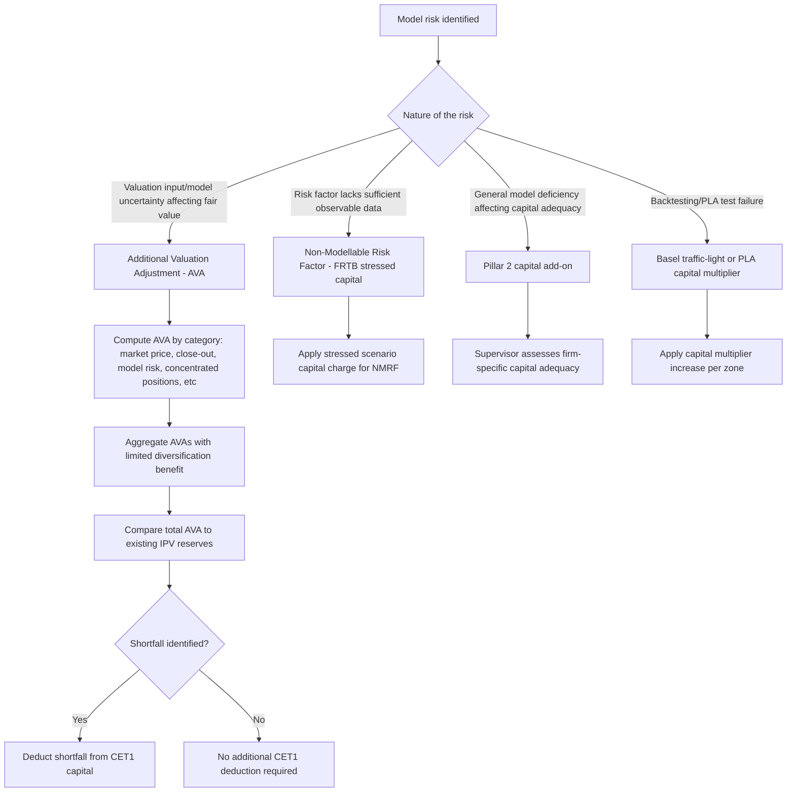

## Model Risk Capital and Reserves

### Overview and Purpose

Model Risk Capital and Reserves refers to the quantitative and accounting mechanisms institutions use to hold capital or valuation adjustments against the risk that a model produces materially incorrect outputs — whether through parameter uncertainty, methodology limitations, calibration error, or use outside its validated scope. This sits at the intersection of model risk management (which identifies and governs model weaknesses) and prudential/accounting frameworks (which require those weaknesses to be quantified and reflected in reported capital and fair value).

### Two Distinct Regimes: Capital vs. Reserves

**Key Points**

- **Model risk capital**: additional regulatory or economic capital held against the possibility that a model underestimates risk (e.g., an add-on multiplier applied to VaR/ES output, or a Pillar 2 capital charge specifically for identified model deficiencies) — this is a prudential/solvency concept, feeding into overall capital adequacy ratios.
- **Valuation reserves / Additional Valuation Adjustments (AVA)**: reductions to the fair value of a position (or portfolio) recorded on the balance sheet to reflect valuation uncertainty stemming from model limitations, parameter uncertainty, or market data quality issues — this is an accounting/fair-value concept, directly reducing reported P&L and capital through the valuation itself rather than via a separate capital add-on.

Though conceptually distinct, both mechanisms exist because "the model's point estimate" is rarely treated as sufficiently reliable on its own for either prudential capital purposes or fair, conservative financial reporting.

### Prudential Valuation and Additional Valuation Adjustments (AVA)

Under frameworks such as the EU's Capital Requirements Regulation (CRR) prudential valuation rules, institutions must calculate AVAs across several defined categories to arrive at a "prudent value" that is deducted from Common Equity Tier 1 (CET1) capital where it falls below the accounting fair value.

**Key AVA Categories**

- **Market price uncertainty AVA**: reflects uncertainty in observed or modeled market prices/inputs (e.g., bid-ask spread uncertainty, uncertainty in illiquid market data points).
- **Close-out costs AVA**: cost of exiting a position at the bid or offer rather than the mid-market price used for accounting fair value.
- **Model risk AVA**: specifically addresses the risk that the valuation model itself (as opposed to its inputs) is a source of error — arising from the existence of alternative, equally justifiable modeling approaches or model calibration choices that would produce a materially different valuation.
- **Unearned credit spreads AVA**: relevant for derivatives valuation reflecting counterparty credit risk (related to CVA).
- **Investing and funding costs AVA**: reflects funding cost uncertainty (relevant to FVA-type adjustments).
- **Concentrated positions AVA**: additional adjustment for positions large relative to market liquidity, where an orderly exit would require a price concession beyond what standard market price uncertainty captures.
- **Future administrative costs AVA** and **early termination AVA**: address ongoing costs of managing a position and the cost of unwinding positions with early-termination triggers, respectively.

**Aggregation**: individual AVA categories are typically summed with limited diversification benefit recognized (regulatory frameworks are often deliberately conservative here, aggregating a large fraction of the total AVAs across categories rather than assuming full offsetting benefits), producing a total AVA that is then compared against available Independent Price Verification (IPV) reserves already taken in the accounting fair value, with any shortfall deducted directly from CET1 capital.

### Model Risk Capital Add-Ons (Pillar 2 / Internal Economic Capital)

**Key Points**

- **Model risk multiplier approach**: some frameworks apply a scaling multiplier to VaR/ES output specifically tied to identified model deficiencies or backtesting performance (distinct from, though sometimes overlapping conceptually with, the Basel traffic-light backtesting multiplier for general market risk models).
- **Pillar 2 add-ons**: supervisors may require firm-specific additional capital under Pillar 2 of the Basel framework where a firm's internal model risk management is judged insufficient, or where specific known model weaknesses are not otherwise capitalized under Pillar 1 — this is inherently judgment-based and varies by supervisory assessment of the individual institution.
- **Conservative overlays as an interim capital-equivalent measure**: pending full model remediation, an institution may apply a management-judgment overlay (a conservative add-on to model output) as a temporary compensating control — validated and governed distinctly from the underlying model, but serving a similar risk-mitigating function to formal capital add-ons.

### Sources of Model Risk Requiring Capital/Reserve Treatment

**Key Points**

- **Parameter uncertainty**: even a conceptually correct model relies on estimated parameters (volatility, correlation, mean-reversion speed) that carry statistical estimation error — particularly significant for parameters estimated from limited historical data or for illiquid risk factors.
- **Model selection/methodology uncertainty**: for many valuation problems, multiple defensible modeling approaches exist (e.g., different stochastic volatility models for exotic option pricing) that can produce materially different valuations from the same market inputs — the "model risk AVA" category specifically targets this source.
- **Extrapolation and out-of-range use**: models calibrated on data within a certain range (moneyness, tenor, strike) may be used to price or risk-manage instruments outside that calibrated range, introducing extrapolation risk that is often poorly quantified by the model's own stated confidence intervals.
- **Non-Modellable Risk Factors (NMRFs) under FRTB**: risk factors lacking sufficient real, observable price data are explicitly excluded from a bank's regular ES model and instead capitalized via a separate, more conservative stressed capital add-on — a direct, formalized link between data/model limitation and capital consequence.

### Diagram: Model Risk Capital and Reserve Framework

### Diagram: AVA Categories Waterfall (svg_diagram)

<svg xmlns="http://www.w3.org/2000/svg" viewBox="0 0 760 380">
<text x="380" y="25" text-anchor="middle" font-size="16" font-weight="bold">Additional Valuation Adjustment Categories (svg_diagram)</text>
<rect x="40" y="55" width="150" height="45" rx="5" fill="#eaf2fb" stroke="#2c6fbb" />
<text x="115" y="82" text-anchor="middle" font-size="10">Market Price Uncertainty</text>
<rect x="200" y="55" width="150" height="45" rx="5" fill="#eaf2fb" stroke="#2c6fbb" />
<text x="275" y="82" text-anchor="middle" font-size="10">Close-out Costs</text>
<rect x="360" y="55" width="150" height="45" rx="5" fill="#fdf1e8" stroke="#e67e22" />
<text x="435" y="82" text-anchor="middle" font-size="10">Model Risk</text>
<rect x="520" y="55" width="150" height="45" rx="5" fill="#eaf2fb" stroke="#2c6fbb" />
<text x="595" y="82" text-anchor="middle" font-size="10">Concentrated Positions</text>
<rect x="40" y="115" width="150" height="45" rx="5" fill="#eaf2fb" stroke="#2c6fbb" />
<text x="115" y="142" text-anchor="middle" font-size="10">Unearned Credit Spreads</text>
<rect x="200" y="115" width="150" height="45" rx="5" fill="#eaf2fb" stroke="#2c6fbb" />
<text x="275" y="135" text-anchor="middle" font-size="10">Investing / Funding</text>
<text x="275" y="148" text-anchor="middle" font-size="10">Costs</text>
<rect x="360" y="115" width="150" height="45" rx="5" fill="#eaf2fb" stroke="#2c6fbb" />
<text x="435" y="142" text-anchor="middle" font-size="10">Future Admin Costs</text>
<rect x="520" y="115" width="150" height="45" rx="5" fill="#eaf2fb" stroke="#2c6fbb" />
<text x="595" y="142" text-anchor="middle" font-size="10">Early Termination</text>
<line x1="115" y1="160" x2="380" y2="200" stroke="#555" stroke-width="1" />
<line x1="595" y1="160" x2="380" y2="200" stroke="#555" stroke-width="1" />
<line x1="380" y1="100" x2="380" y2="200" stroke="#555" stroke-width="1" />
<rect x="230" y="200" width="300" height="45" rx="6" fill="#f4ecf7" stroke="#7d3c98" />
<text x="380" y="227" text-anchor="middle" font-size="12" font-weight="bold" fill="#4a235a">Total AVA (limited diversification)</text>
<line x1="380" y1="245" x2="380" y2="280" stroke="#555" stroke-width="1.5" />
<rect x="230" y="280" width="300" height="45" rx="6" fill="#fdecea" stroke="#c0392b" />
<text x="380" y="300" text-anchor="middle" font-size="11">Compare vs existing IPV reserves</text>
<text x="380" y="316" text-anchor="middle" font-size="11" font-weight="bold" fill="#922b21">Shortfall deducted from CET1</text>
</svg>

### Interaction with Model Validation and Governance

- **Validation as the trigger mechanism**: model risk capital add-ons and AVAs are typically informed directly by validation findings — a validation report identifying material model limitations or a range of plausible alternative valuations feeds quantitatively into the AVA/capital calculation, linking the qualitative governance process to a concrete balance sheet or capital impact.
- **Ongoing recalibration**: AVA and model risk capital calculations are typically reassessed on a regular cycle (often quarterly for AVAs under prudential valuation rules) as market conditions, model performance, and portfolio composition evolve, rather than being a one-time assessment at model approval.
- **Independent Price Verification (IPV) linkage**: IPV processes (independently verifying trader marks against external/market-observed data) generate reserves that interact directly with the AVA framework — accounting reserves already taken via IPV are netted against required AVAs to determine any incremental CET1 deduction.

### Practical and Industry Considerations

**Key Points**

- **Quantifying "model uncertainty" objectively is inherently difficult**: unlike market price uncertainty (which can often be estimated from observable bid-ask spreads or historical price dispersion), model risk itself requires judgment about the plausible range of alternative modeling approaches — a less directly observable quantity, making model risk AVA calculation methodologically more contested than other AVA categories.
- **Capital impact can influence model development incentives**: because AVAs and model risk capital directly reduce CET1 or increase capital requirements, there can be organizational incentive tension between model developers/business lines (who may prefer simpler treatment implying lower reserves) and the model risk/finance functions responsible for conservative reserve calculation — a governance consideration closely tied to the independence principles discussed in model validation standards.
- **Emerging model types and capital treatment lag**: [Inference] as institutions increasingly deploy machine learning models in valuation-adjacent processes, the application of existing AVA/model risk capital frameworks — originally designed around traditional parametric derivative pricing models — to these newer model types is an area of evolving industry and supervisory practice, without full standardization yet observed across jurisdictions.

**Related Topics**

- Independent Model Validation Standards
- Model Development Governance
- Expected Shortfall and Tail Risk Measures
- Sensitivity Based Risk Frameworks (FRTB Non-Modellable Risk Factors)
- Counterparty Credit Risk, CVA, and Funding Valuation Adjustments (FVA)
- Basel III/IV Capital Adequacy Frameworks (CET1, Pillar 1 and Pillar 2)
- Independent Price Verification and Fair Value Hierarchy