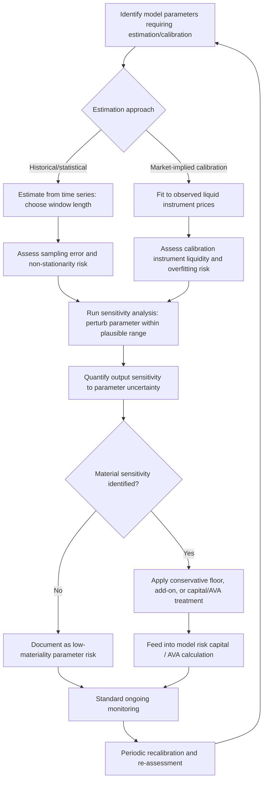

## Parameter Uncertainty and Calibration Risk

### Overview and Definitions

Parameter uncertainty and calibration risk refer to the model risk arising not from a flawed model structure or methodology, but from imprecision, instability, or error in the parameter values fed into an otherwise conceptually sound model. Even a theoretically correct model produces materially wrong outputs if its inputs — volatilities, correlations, mean-reversion speeds, recovery rates, default intensities — are poorly estimated, unstable over time, or calibrated using an inappropriate technique. This is a distinct source of model risk from the "model risk AVA" concept (which primarily addresses uncertainty from competing valid *methodologies*), though the two interact closely and are sometimes treated jointly in practice.

### Statistical Estimation vs. Market Calibration

**Key Points**

- **Historical/statistical estimation**: parameters (e.g., historical volatility, correlation matrices for VaR) are estimated from time series of observed market data using standard statistical techniques (sample variance, sample correlation, GARCH/EWMA models). Subject to sampling error that shrinks with more data, but also subject to the risk that the historical sample period is not representative of future conditions.
- **Market (risk-neutral) calibration**: parameters (e.g., implied volatility surfaces, implied correlation, model parameters for options pricing models like Heston or SABR) are inferred by fitting a model to currently observed market prices of liquid instruments, then used to price or risk-manage less liquid, related instruments. Calibration quality depends heavily on the liquidity and quality of the instruments used for fitting, and on whether the model's functional form is flexible enough to match the calibration instruments without overfitting.
- **Blended approaches**: some frameworks combine market-implied parameters for liquid risk factors with historical/statistical estimates for illiquid ones, introducing internal consistency challenges (mixing risk-neutral and real-world measures, or combining parameters estimated over different time horizons or under different assumptions).

### Sources of Parameter Uncertainty

**Key Points**

- **Sampling error**: any parameter estimated from a finite historical sample carries statistical estimation error — this shrinks with sample size but never disappears, and is particularly acute for correlation and tail-related parameters, which require large samples to estimate precisely (correlation estimates from short windows are notoriously noisy).
- **Non-stationarity**: financial time series often exhibit changing statistical properties over time (volatility clustering, regime shifts, structural breaks) — a parameter estimated as a stable "true" constant may in fact be drawn from a shifting underlying process, meaning the estimation window choice itself introduces a form of model risk.
- **Illiquid or sparse calibration instruments**: for risk factors where few liquid market instruments exist to calibrate against (e.g., long-dated volatility, exotic correlation structures, credit spreads for infrequently-traded names), calibrated parameters can be highly sensitive to small pricing changes in the few available instruments, or require extrapolation/interpolation techniques that introduce additional, hard-to-quantify uncertainty.
- **Overfitting in flexible models**: models with many free parameters (e.g., local volatility surfaces, some stochastic volatility extensions) can be calibrated to fit current market prices almost exactly, but this exact fit can come at the cost of poor out-of-sample stability — small input changes causing large, erratic parameter re-calibrations day to day.

### Calibration Instability and Parameter Stickiness

A key practical manifestation of calibration risk is **parameter instability**: day-to-day recalibration of a model to fresh market data producing large, sometimes non-intuitive swings in fitted parameters, even when the underlying market hasn't moved dramatically. This is particularly associated with:

- **Local volatility models**: known to produce unstable, hard-to-interpret local volatility surfaces that can change shape significantly with small shifts in the underlying implied volatility surface, especially in regions with sparse quoted strikes/tenors.
- **Stochastic volatility model recalibration (Heston, SABR)**: parameters like vol-of-vol or mean-reversion speed can trade off against each other in the calibration optimization (multiple parameter combinations fitting the observed surface almost equally well), leading to unstable day-to-day parameter estimates even though pricing/hedging output may be more stable.
- **Correlation matrix recalibration**: especially for large portfolios, small changes in a subset of pairwise correlations can materially change aggregate portfolio risk metrics (VaR/ES) via the quadratic form aggregation, and correlation estimates are often the least statistically robust parameters in a risk model.

**Key Points**

- **Hedging implications of parameter instability**: if a model's calibrated parameters are unstable, the model-implied hedge ratios (Greeks) derived from those parameters will also be unstable, potentially generating spurious hedge rebalancing trades ("hedge slippage" or noise trading) that erode P&L without any genuine change in underlying market risk.
- **Distinguishing genuine market-driven repricing from calibration noise**: a key validation and monitoring task is determining whether a parameter change reflects a genuine, economically meaningful shift in market conditions, or is merely calibration algorithm noise/instability — this distinction matters for both risk reporting interpretation and P&L attribution.

### Quantifying and Managing Parameter Uncertainty

**Key Points**

- **Confidence intervals and standard errors on estimated parameters**: where parameters are estimated via standard statistical methods (e.g., maximum likelihood, GMM), the associated standard errors provide a direct, quantifiable measure of estimation uncertainty — though this is less straightforward for parameters calibrated via numerical optimization against market prices rather than classical statistical estimation.
- **Sensitivity analysis on model outputs to parameter perturbation**: systematically varying key parameters within a plausible range and observing the resulting change in model output (price, risk metric) — a direct way to quantify how much model risk stems from a given parameter's uncertainty, independent of formal statistical confidence intervals.
- **Bayesian and ensemble approaches**: treating parameters as random variables with a prior distribution (Bayesian) or averaging outputs across multiple plausible parameter sets/models (ensemble) rather than relying on a single point-estimate calibration — [Inference] adoption of these more sophisticated uncertainty-quantification techniques varies significantly across institutions and use cases, with simpler point-estimate-plus-sensitivity-analysis approaches remaining more common in day-to-day risk management practice than full Bayesian parameter uncertainty frameworks.
- **Conservative parameter floors/add-ons**: applying a deliberately conservative adjustment to a calibrated or estimated parameter (e.g., a volatility floor, a correlation stress add-on) as a simple, transparent, and easily governed compensating control for known parameter uncertainty — commonly used in practice precisely because it is easier to validate and explain than more complex uncertainty-quantification techniques.

### Worked Example: Correlation Parameter Sensitivity

Consider a two-asset portfolio with weighted sensitivities $WS_1 = \$100$ and $WS_2 = \$100$, where portfolio risk under a simple two-factor aggregation is:

$$K = \sqrt{WS_1^2 + WS_2^2 + 2\rho \cdot WS_1 \cdot WS_2}$$

Under three plausible correlation estimates reflecting genuine parameter uncertainty:

| Correlation Estimate | K (portfolio risk) | % Change vs. base case |
| --- | --- | --- |
| $\rho = 0.30$ (long historical window) | $\sqrt{10000+10000+6000} = \$160.0$ | Base case |
| $\rho = 0.60$ (recent 3-month window) | $\sqrt{10000+10000+12000} = \$178.9$ | +11.8% |
| $\rho = 0.90$ (stressed/crisis assumption) | $\sqrt{10000+10000+18000} = \$195.0$ | +21.9% |

This illustrates how a single, seemingly narrow parameter choice (a pairwise correlation) can shift an aggregate risk metric by more than 20% depending on the estimation window or regime assumption — precisely the kind of parameter uncertainty that model risk capital, AVA, and stress testing frameworks are designed to capture and compensate for.

### Diagram: Calibration Risk Assessment Workflow

### Diagram: Sources of Parameter Uncertainty (svg_diagram)

<svg xmlns="http://www.w3.org/2000/svg" viewBox="0 0 760 340">
<text x="380" y="25" text-anchor="middle" font-size="16" font-weight="bold">Sources of Parameter Uncertainty (svg_diagram)</text>
<rect x="290" y="45" width="180" height="40" rx="6" fill="#2c6fbb" />
<text x="380" y="70" text-anchor="middle" font-size="12" fill="white" font-weight="bold">Parameter Uncertainty</text>
<line x1="380" y1="85" x2="130" y2="130" stroke="#555" stroke-width="1.3" />
<line x1="380" y1="85" x2="380" y2="130" stroke="#555" stroke-width="1.3" />
<line x1="380" y1="85" x2="630" y2="130" stroke="#555" stroke-width="1.3" />
<rect x="40" y="130" width="180" height="45" rx="5" fill="#eaf2fb" stroke="#2c6fbb" />
<text x="130" y="150" text-anchor="middle" font-size="11" font-weight="bold">Sampling Error</text>
<text x="130" y="167" text-anchor="middle" font-size="10">Finite historical data</text>
<rect x="290" y="130" width="180" height="45" rx="5" fill="#fdf1e8" stroke="#e67e22" />
<text x="380" y="150" text-anchor="middle" font-size="11" font-weight="bold">Non-Stationarity</text>
<text x="380" y="167" text-anchor="middle" font-size="10">Regime shifts over time</text>
<rect x="540" y="130" width="180" height="45" rx="5" fill="#f4ecf7" stroke="#7d3c98" />
<text x="630" y="150" text-anchor="middle" font-size="11" font-weight="bold">Illiquid Calibration</text>
<text x="630" y="167" text-anchor="middle" font-size="10">Sparse market instruments</text>
<line x1="130" y1="175" x2="130" y2="210" stroke="#555" stroke-width="1" />
<rect x="40" y="210" width="180" height="45" rx="5" fill="#eafaf1" stroke="#27ae60" />
<text x="130" y="235" text-anchor="middle" font-size="10">Consequence: noisy</text>
<text x="130" y="250" text-anchor="middle" font-size="10">correlation/volatility estimates</text>
<line x1="380" y1="175" x2="380" y2="210" stroke="#555" stroke-width="1" />
<rect x="290" y="210" width="180" height="45" rx="5" fill="#eafaf1" stroke="#27ae60" />
<text x="380" y="235" text-anchor="middle" font-size="10">Consequence: stale</text>
<text x="380" y="250" text-anchor="middle" font-size="10">parameters vs current regime</text>
<line x1="630" y1="175" x2="630" y2="210" stroke="#555" stroke-width="1" />
<rect x="540" y="210" width="180" height="45" rx="5" fill="#eafaf1" stroke="#27ae60" />
<text x="630" y="235" text-anchor="middle" font-size="10">Consequence: unstable</text>
<text x="630" y="250" text-anchor="middle" font-size="10">day-to-day recalibration</text>
<rect x="220" y="280" width="320" height="40" rx="6" fill="#fdecea" stroke="#c0392b" />
<text x="380" y="305" text-anchor="middle" font-size="11" fill="#922b21">All feed into hedge instability and mispriced risk</text>
</svg>

### Governance and Validation Interaction

**Key Points**

- **Validation scope over parameter estimation methodology**: independent model validation should explicitly review the parameter estimation/calibration methodology as part of conceptual soundness review — not just the model's mathematical structure — including the choice of estimation window, the calibration instrument set, and the optimization technique used.
- **Ongoing monitoring for parameter drift**: monitoring frameworks should track calibrated/estimated parameters over time, flagging unusual jumps or persistent trends that may indicate either genuine regime change (requiring model/parameter update) or calibration instability (requiring methodology review).
- **Documentation of parameter choice rationale**: given that reasonable alternative parameter choices (different estimation windows, different calibration instrument sets) can produce materially different outputs, governance frameworks typically require explicit documentation of why a particular estimation approach was chosen over plausible alternatives.
- [Inference] The degree to which institutions formally quantify parameter uncertainty (via statistical confidence intervals, Bayesian methods) versus rely on simpler conservative overlays and periodic expert review appears to vary considerably by institution size, model materiality tier, and the specific asset class involved, with more resource-intensive quantification techniques generally reserved for higher-materiality models.

**Related Topics**

- Model Risk Capital and Reserves
- Independent Model Validation Standards
- Backtesting and Benchmarking Models
- Sensitivity Based Risk Frameworks
- Stress Testing and Scenario Analysis
- Historical Simulation and Monte Carlo VaR
- Correlation and Copula Modeling in Risk Aggregation