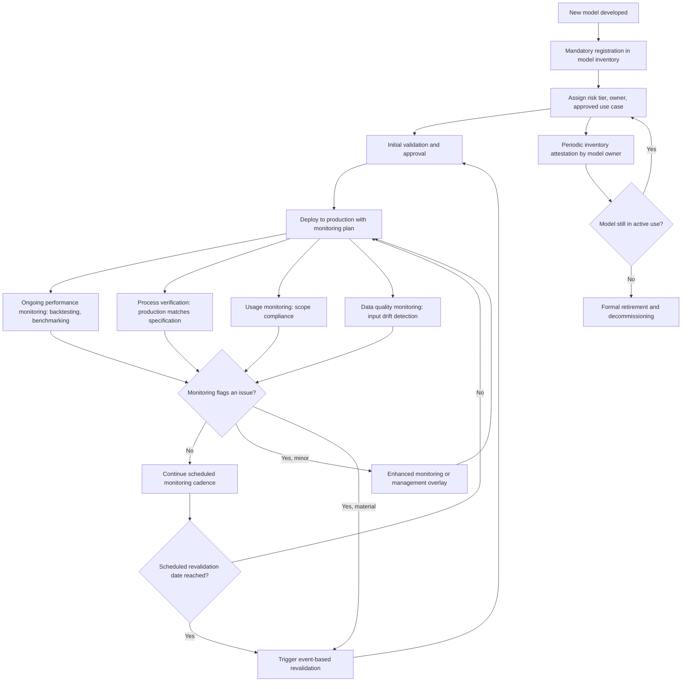

## Model Inventory and Ongoing Monitoring

### Overview and Purpose

Model inventory and ongoing monitoring form the operational backbone of a Model Risk Management (MRM) framework, providing the systematic record-keeping and continuous performance surveillance needed to ensure that every model in use is known, governed, and behaving as expected throughout its lifecycle. A model inventory is the authoritative, firm-wide registry of every model subject to MRM policy; ongoing monitoring is the continuous (as opposed to point-in-time validation) process of tracking model performance, usage, and environmental changes that might signal a model no longer performs as originally validated.

### Model Inventory: Scope and Structure

**Key Points**

- **Model definition breadth**: consistent with SR 11-7-style guidance, "model" is defined broadly to include any quantitative method applying statistical, economic, financial, or mathematical techniques to transform inputs into quantitative outputs used in decision-making — this deliberately captures not only core pricing/risk models but also rating systems, allocation methodologies, and increasingly machine learning pipelines and even sophisticated spreadsheets used in material processes.
- **Core inventory attributes**: each model entry typically records a unique identifier, model name and version, owner and developer, business purpose and approved use cases, risk/materiality tier, validation status and date of last/next validation, key assumptions and limitations, and any usage restrictions imposed by validation or governance.
- **Model risk tiering criteria**: materiality classification (e.g., high/medium/low) typically considers financial impact (size of exposure/decisions the model informs), complexity, regulatory capital usage, degree of automation/reliance without human override, and the potential for reputational or customer harm — tiering directly drives the intensity of validation, monitoring frequency, and approval authority required.
- **Model lineage and interdependency mapping**: many models consume the outputs of other models as inputs (e.g., a portfolio VaR model relying on a separate volatility forecasting model) — inventory systems increasingly aim to map these dependencies explicitly, since a flaw in an upstream "feeder" model can propagate silently into every downstream model consuming its output.

### Inventory Governance and Maintenance

**Key Points**

- **Model registration triggers**: any new model development, whether initiated by risk, finance, front office, or another function, should trigger mandatory registration in the inventory before or concurrent with development — governance frameworks typically require sign-off at model development kickoff specifically confirming inventory registration has occurred.
- **Retirement and decommissioning tracking**: models no longer in use should be formally retired from active status (not merely stopped being used informally), with retirement decisions documented and dependent downstream processes confirmed to have migrated to a replacement or alternative approach.
- **Periodic inventory attestation**: many frameworks require business line owners to periodically (e.g., annually) formally attest to the completeness and accuracy of their portion of the model inventory, as a control against inventory gaps.
- **"Shadow model" / end-user computing (EUC) risk**: a persistent practical governance challenge is the existence of models built and used outside formal development processes — spreadsheets, ad hoc scripts, or informal tools built by business users for material decisions but never captured in the central inventory or subjected to independent validation. EUC risk management programs (separate but related to core MRM) are often specifically designed to identify and remediate this gap.

### Ongoing Monitoring: Core Components

Where validation at approval time is a point-in-time assessment, ongoing monitoring is the continuous or periodic surveillance function verifying a model continues to perform as validated, given that market conditions, portfolio composition, and data characteristics evolve after deployment.

**Key Points**

- **Performance monitoring (outcomes-based)**: continued backtesting, benchmarking, and outcomes analysis on a defined schedule (not just at initial validation), tracking whether the model's predictive accuracy or risk estimates remain within acceptable tolerance over time — directly connects to the backtesting/benchmarking techniques used at initial validation, now applied as a recurring process.
- **Process/implementation verification**: periodic confirmation that the model as actually running in production matches its approved specification — guarding against configuration drift, unauthorized parameter changes, or IT system changes that inadvertently alter model behavior without a formal model change process being triggered.
- **Usage monitoring**: tracking whether a model is being used consistent with its approved scope and limitations — a model approved for one portfolio type or one product line being informally extended to a new use case without revalidation is a common and significant source of model risk.
- **Data quality monitoring**: ongoing checks on input data completeness, accuracy, and consistency with the data characteristics the model was originally validated against — including monitoring for feature/input drift (the statistical distribution of inputs shifting over time) which can degrade model performance even absent any change to the model itself.

### Monitoring Metrics and Thresholds

| Monitoring Dimension | Example Metric | Trigger for Escalation |
| --- | --- | --- |
| Statistical performance | Backtesting exception count (Kupiec/Christoffersen) | Zone change (green→yellow→red) |
| Model stability | Parameter drift over time, calibration instability | Material, unexplained parameter jump |
| Data quality | Missing data rate, outlier frequency in inputs | Threshold breach on data completeness/accuracy |
| Usage scope | Portfolio composition vs. originally validated scope | New instrument type or exposure outside validated range |
| Benchmark divergence | Difference vs. challenger/vendor model output | Persistent, material divergence beyond tolerance |
| Model degradation (ML-specific) | Feature drift statistics, prediction accuracy decay | Statistically significant drift or accuracy decline |

### Triggered vs. Scheduled Revalidation

**Key Points**

- **Calendar-based (scheduled) revalidation**: performed on a fixed cycle proportional to model risk tier (e.g., annually for high-tier models, less frequently for lower-tier models) — provides a baseline assurance cadence independent of any specific observed issue.
- **Event-triggered revalidation**: initiated ahead of the scheduled cycle in response to specific triggers identified through ongoing monitoring — material market regime change, sustained backtesting performance degradation, significant portfolio composition shift, or a material methodology/data source change.
- **Materiality-scaled response**: not every monitoring flag requires a full formal revalidation — governance frameworks typically define a graduated response (e.g., enhanced monitoring frequency, management overlay, targeted partial review, or full revalidation) proportional to the severity and persistence of the observed issue.

### Diagram: Model Inventory and Monitoring Lifecycle

### Diagram: Model Inventory Record Structure (svg_diagram)

<svg xmlns="http://www.w3.org/2000/svg" viewBox="0 0 760 360">
<text x="380" y="25" text-anchor="middle" font-size="16" font-weight="bold">Model Inventory Record: Core Attributes (svg_diagram)</text>
<rect x="280" y="45" width="200" height="40" rx="6" fill="#2c6fbb" />
<text x="380" y="70" text-anchor="middle" font-size="12" fill="white" font-weight="bold">Model Inventory Entry</text>
<line x1="380" y1="85" x2="150" y2="120" stroke="#555" stroke-width="1.2" />
<line x1="380" y1="85" x2="380" y2="120" stroke="#555" stroke-width="1.2" />
<line x1="380" y1="85" x2="610" y2="120" stroke="#555" stroke-width="1.2" />
<rect x="60" y="120" width="180" height="40" rx="5" fill="#eaf2fb" stroke="#2c6fbb" />
<text x="150" y="145" text-anchor="middle" font-size="11">ID, Name, Version</text>
<rect x="290" y="120" width="180" height="40" rx="5" fill="#eaf2fb" stroke="#2c6fbb" />
<text x="380" y="145" text-anchor="middle" font-size="11">Owner and Developer</text>
<rect x="520" y="120" width="180" height="40" rx="5" fill="#eaf2fb" stroke="#2c6fbb" />
<text x="610" y="145" text-anchor="middle" font-size="11">Approved Use Case</text>
<rect x="60" y="180" width="180" height="40" rx="5" fill="#fdf1e8" stroke="#e67e22" />
<text x="150" y="205" text-anchor="middle" font-size="11">Risk/Materiality Tier</text>
<rect x="290" y="180" width="180" height="40" rx="5" fill="#fdf1e8" stroke="#e67e22" />
<text x="380" y="205" text-anchor="middle" font-size="11">Validation Status/Dates</text>
<rect x="520" y="180" width="180" height="40" rx="5" fill="#fdf1e8" stroke="#e67e22" />
<text x="610" y="205" text-anchor="middle" font-size="11">Usage Restrictions</text>
<rect x="60" y="240" width="180" height="40" rx="5" fill="#f4ecf7" stroke="#7d3c98" />
<text x="150" y="265" text-anchor="middle" font-size="11">Key Assumptions/Limits</text>
<rect x="290" y="240" width="180" height="40" rx="5" fill="#f4ecf7" stroke="#7d3c98" />
<text x="380" y="265" text-anchor="middle" font-size="11">Upstream/Downstream Links</text>
<rect x="520" y="240" width="180" height="40" rx="5" fill="#f4ecf7" stroke="#7d3c98" />
<text x="610" y="265" text-anchor="middle" font-size="11">Retirement Status</text>
<rect x="220" y="300" width="320" height="40" rx="6" fill="#eafaf1" stroke="#27ae60" />
<text x="380" y="325" text-anchor="middle" font-size="11" fill="#1e6b3f">Single source of truth across all Three Lines of Defense</text>
</svg>

### Machine Learning-Specific Monitoring Considerations

**Key Points**

- **Feature drift and concept drift monitoring**: ML models require ongoing statistical monitoring of input feature distributions (feature drift, e.g., via population stability index or similar metrics) and of the underlying input-output relationship (concept drift), since these models can silently degrade in ways that traditional parametric model monitoring (focused primarily on parameter stability and backtesting) may not fully capture.
- **Champion-challenger monitoring in production**: maintaining a challenger model running in parallel/shadow mode against the live champion model, continuously comparing performance, provides an ongoing monitoring mechanism specifically suited to catching gradual ML model degradation before a full formal revalidation cycle would otherwise detect it.
- **Explainability monitoring**: tracking whether the relative importance of input features (e.g., via SHAP value distributions) remains stable over time — a shift in which features are driving model outputs can itself be an early indicator of concept drift, even before aggregate accuracy metrics show clear degradation.

### Common Inventory and Monitoring Failure Modes

- **Inventory incompleteness**: models used in genuinely material decisions but never registered (shadow models, EUC tools) represent ungoverned model risk that neither validation nor monitoring frameworks can address, since they are invisible to the process entirely.
- **Monitoring metric proliferation without materiality filtering**: tracking a very large number of monitoring metrics across many models can generate alert fatigue, where genuinely significant signals are missed amid routine noise — mature frameworks typically apply materiality-based filtering and clear escalation thresholds rather than treating every metric fluctuation as requiring investigation.
- **Static monitoring thresholds in changing environments**: monitoring thresholds calibrated during a stable period may become either too lax (missing genuine degradation) or too strict (generating false alarms) as market volatility regimes shift — [Inference] this suggests monitoring frameworks benefit from periodic threshold recalibration alongside model revalidation, though the specific cadence and methodology for doing so varies across institutions and is an area of ongoing practice refinement.
- **Siloed monitoring across business lines**: inconsistent monitoring standards, metrics, or escalation processes applied by different business lines to their respective models can undermine firm-wide model risk aggregation and comparability, a challenge that centralized model risk governance functions are typically tasked with addressing.

**Related Topics**

- Model Development Governance
- Independent Model Validation Standards
- Backtesting and Benchmarking Models
- Model Risk Capital and Reserves
- Parameter Uncertainty and Calibration Risk
- Machine Learning Model Governance and Explainability
- Data Governance and Lineage in Quantitative Finance