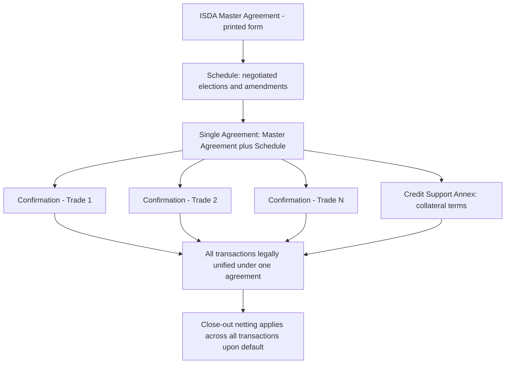

## The ISDA Master Agreement Structure

### Overview and Purpose

The ISDA Master Agreement, published by the International Swaps and Derivatives Association, is the standard legal contract framework governing over-the-counter (OTC) derivatives transactions between two counterparties. Rather than negotiating a full bespoke contract for every individual trade, parties execute a single Master Agreement once, under which all subsequent derivative transactions between them are documented via brief individual Confirmations — the Master Agreement's terms govern all such transactions collectively, single-agreement style, dramatically reducing negotiation friction and providing crucial legal certainty, particularly around close-out netting.

### The Single Agreement Concept

**Key Points**

- **Legal unity across all transactions**: a foundational feature of the ISDA structure is that the Master Agreement, the Schedule, all Confirmations, and the Credit Support Annex (where applicable) together constitute a single, unified legal agreement between the parties — not a collection of separate contracts. This is explicit in the Master Agreement's text and is critical to the enforceability of close-out netting.
- **Why single-agreement status matters**: without this construct, in an insolvency scenario a bankruptcy administrator could potentially "cherry-pick" — enforcing transactions favorable to the insolvent party's estate while disclaiming (walking away from) unfavorable ones. Single-agreement status means all transactions must be netted together and treated as one net obligation, preventing this selective enforcement.

### Core Architecture: The Four Components

**1. The Printed Form (Master Agreement)**

The standard, largely unmodified boilerplate document published by ISDA (the 1992 and 2002 versions are the most widely used), containing:

- General definitions and interpretive provisions
- Payment and calculation obligations
- Representations made by each party
- Events of Default and Termination Events
- Early termination and close-out netting mechanics
- General boilerplate (notices, governing law placeholder, assignment restrictions, etc.)

**2. The Schedule**

The negotiated document that amends, supplements, and elects among options presented in the printed form — this is where the substantive party-specific negotiation occurs. Key Schedule elections include:

- Which Termination Events apply (e.g., whether Credit Event Upon Merger applies)
- Threshold amounts for Cross Default
- Specified Entities and Specified Transactions
- Governing law (typically English law or New York law) and jurisdiction
- Additional Termination Events specific to the relationship (e.g., rating downgrade triggers)
- Payment netting elections and calculation agent designation

**3. Confirmations**

Short-form documents (often just a few pages) executed for each individual transaction, specifying the economic terms (notional, rate, tenor, payment dates, underlying) — Confirmations incorporate the Master Agreement and Schedule by reference and are legally deemed part of the single agreement, not standalone contracts.

**4. The Credit Support Annex (CSA)**

A separate but integrated document governing collateral posting between the parties to mitigate counterparty credit risk — specifies eligible collateral types, thresholds, minimum transfer amounts, valuation methodology, and (for the 1994/1995 CSA under New York law vs. the English law CSA) different legal mechanics (title transfer vs. security interest).

### Diagram: ISDA Documentation Architecture

### Events of Default

The Master Agreement defines specific Events of Default which, if occurring with respect to either party, permit the Non-defaulting Party to designate an Early Termination Date and close out all outstanding transactions:

**Key Points**

- **Failure to Pay or Deliver**: failure to make a payment or delivery when due, subject to a specified grace period.
- **Breach of Agreement**: failure to comply with other obligations under the agreement (excluding payment/delivery, which has its own category), subject to a cure period.
- **Credit Support Default**: failure to comply with obligations under the Credit Support Annex (e.g., failure to post required collateral).
- **Misrepresentation**: a representation made under the agreement proves to have been incorrect or misleading when made.
- **Default Under Specified Transaction**: default under another specified derivative or financial transaction between the same parties (or specified affiliates), extending default consequences beyond just the ISDA-documented trades.
- **Cross Default**: default by a party (or specified entity, often including parent/affiliates) under other specified indebtedness above a negotiated threshold amount — links the derivatives relationship to the counterparty's broader creditworthiness.
- **Bankruptcy**: the classic insolvency-related default, covering a range of bankruptcy, insolvency, and analogous proceedings.
- **Merger Without Assumption**: a party merges into another entity that does not assume the obligations under the agreement.

### Termination Events

Distinct from Events of Default, Termination Events are typically no-fault circumstances (though some carry fault-like characteristics) that also permit early termination but with generally more balanced consequences between the parties:

**Key Points**

- **Illegality**: it becomes unlawful for a party to perform its obligations (e.g., due to a change in law).
- **Force Majeure Event** (2002 ISDA specifically): an event beyond a party's control prevents performance, with specific waiting periods before termination rights arise.
- **Tax Event**: a change in tax law causes a party to be required to make additional (gross-up) payments or suffer withholding it wouldn't otherwise have suffered.
- **Tax Event Upon Merger**: a tax event arising specifically from a merger involving one of the parties.
- **Credit Event Upon Merger** (optional election): a merger materially weakens the creditworthiness of the surviving entity.
- **Additional Termination Events (ATEs)**: bespoke, Schedule-negotiated events specific to the particular counterparty relationship (e.g., a rating downgrade below a specified threshold, a decline in net asset value for a fund counterparty).

### Close-Out Netting Mechanics

Upon designation of an Early Termination Date (following an Event of Default or Termination Event), all outstanding transactions under the single agreement are terminated and their values are netted into a single payment obligation:

1. **Valuation of each terminated transaction**: determined per the agreed methodology (Market Quotation, Loss, or, under the 2002 ISDA, the more flexible Close-out Amount standard).
2. **Aggregation**: individual transaction values (gains and losses) are summed into a single net amount.
3. **Single net payment**: only one party owes the other a single net sum — this is the critical risk-reducing feature, since it means counterparty exposure is calculated on a net, not gross, basis.

**1992 vs. 2002 ISDA Close-Out Methodology**: the 1992 ISDA offered a choice between "Market Quotation" (obtaining actual dealer quotes for replacement transactions) and "Loss" (a more flexible, self-calculated measure) as the close-out valuation method; the 2002 ISDA replaced both with a single, more flexible "Close-out Amount" standard, giving the Determining Party more discretion while still requiring commercially reasonable procedures — a change partly motivated by difficulties obtaining reliable dealer quotations during periods of market stress (as observed during various crisis episodes).

### 1992 vs. 2002 ISDA: Key Differences

| Feature | 1992 ISDA | 2002 ISDA |
| --- | --- | --- |
| Close-out valuation | Market Quotation or Loss (elected) | Close-out Amount (single standard) |
| Grace period for Failure to Pay | 3 Local Business Days (default) | 1 Local Business Day (default, shortened) |
| Force Majeure | Not a distinct Termination Event | Added as a distinct Termination Event |
| Set-off provisions | Not included in printed form | Optional set-off provision included |
| Interest on unpaid amounts | Simpler default rate provisions | More detailed default rate/interest mechanics |

[Inference] The shortened grace periods and the Close-out Amount standard in the 2002 version are generally understood in market commentary to reflect lessons learned from stressed market conditions in the years following the 1992 version's widespread adoption, though the precise weighting of different drafting motivations is a matter of legal/historical interpretation rather than a single documented rationale.

### Diagram: Early Termination and Close-Out Process (svg_diagram)

<svg xmlns="http://www.w3.org/2000/svg" viewBox="0 0 780 320">
<text x="390" y="25" text-anchor="middle" font-size="16" font-weight="bold">Early Termination and Close-Out Netting Flow (svg_diagram)</text>
<rect x="40" y="55" width="180" height="45" rx="6" fill="#eaf2fb" stroke="#2c6fbb" />
<text x="130" y="83" text-anchor="middle" font-size="11">Event of Default or Termination Event occurs</text>
<line x1="220" y1="77" x2="270" y2="77" stroke="#555" stroke-width="1.5" marker-end="url(#a3)" />
<rect x="270" y="55" width="180" height="45" rx="6" fill="#fdf1e8" stroke="#e67e22" />
<text x="360" y="83" text-anchor="middle" font-size="11">Early Termination Date designated</text>
<line x1="450" y1="77" x2="500" y2="77" stroke="#555" stroke-width="1.5" marker-end="url(#a3)" />
<rect x="500" y="55" width="230" height="45" rx="6" fill="#f4ecf7" stroke="#7d3c98" />
<text x="615" y="83" text-anchor="middle" font-size="11">All outstanding transactions terminated</text>
<line x1="615" y1="100" x2="615" y2="140" stroke="#555" stroke-width="1.5" marker-end="url(#a3)" />
<rect x="500" y="140" width="230" height="45" rx="6" fill="#f4ecf7" stroke="#7d3c98" />
<text x="615" y="168" text-anchor="middle" font-size="11">Value each transaction (Close-out Amount)</text>
<line x1="500" y1="163" x2="450" y2="163" stroke="#555" stroke-width="1.5" marker-end="url(#a3)" />
<rect x="270" y="140" width="180" height="45" rx="6" fill="#eafaf1" stroke="#27ae60" />
<text x="360" y="168" text-anchor="middle" font-size="11">Aggregate all values into single net amount</text>
<line x1="270" y1="163" x2="220" y2="163" stroke="#555" stroke-width="1.5" marker-end="url(#a3)" />
<rect x="40" y="140" width="180" height="45" rx="6" fill="#fdecea" stroke="#c0392b" />
<text x="130" y="168" text-anchor="middle" font-size="11">Single net payment obligation determined</text>
<line x1="130" y1="185" x2="130" y2="230" stroke="#555" stroke-width="1.5" marker-end="url(#a3)" />
<rect x="40" y="230" width="690" height="50" rx="6" fill="#2c6fbb" />
<text x="385" y="260" text-anchor="middle" font-size="12" fill="white" font-weight="bold">One party owes the other a single net sum — gross exposure eliminated</text>
</svg>

### Regulatory and Risk Management Significance

**Key Points**

- **Netting enforceability and regulatory capital**: for close-out netting to be recognized for regulatory capital purposes (reducing counterparty credit risk capital requirements to a net rather than gross exposure basis), the netting arrangement must be legally enforceable in the relevant jurisdictions — ISDA obtains and maintains netting opinions across numerous jurisdictions specifically to support this regulatory recognition.
- **Interaction with central clearing**: for derivatives subject to mandatory central clearing (post-GFC reforms), the bilateral ISDA Master Agreement framework is complemented (and for cleared trades, effectively superseded at the individual transaction level) by CCP rulebooks, though the bilateral ISDA framework remains essential for non-cleared derivatives.
- **CSA and margin regulatory interaction**: the Credit Support Annex framework was substantially built upon by post-GFC non-cleared margin rules (requiring both variation and initial margin for non-cleared derivatives above certain thresholds), with ISDA publishing updated CSA templates (including the 2016 Variation Margin CSA) to align with these regulatory requirements — see also ISDA SIMM as the standardized initial margin calculation methodology referenced in this broader documentation ecosystem.
- **Protocol mechanism for mass amendment**: ISDA Protocols allow large numbers of market participants to simultaneously amend their existing bilateral Master Agreements to reflect a common change (e.g., regulatory reform implementation, benchmark rate transition such as LIBOR-to-SOFR fallback provisions) without requiring individually renegotiated bilateral amendments — a critical efficiency mechanism given the scale of outstanding bilateral ISDA relationships across the market.

### Practical Considerations in Negotiation and Use

- **Threshold and Minimum Transfer Amount negotiation in the CSA**: reflects each counterparty's credit assessment of the other — tighter (lower) thresholds mean more frequent, smaller collateral calls providing closer real-time credit risk mitigation, at the cost of increased operational burden.
- **Governing law selection consequences**: the choice between English law and New York law (the two dominant governing law choices for ISDA documentation) carries genuine legal substantive differences in areas such as the treatment of certain termination and set-off provisions, and interacts with the netting opinion coverage relevant to the counterparties' jurisdictions.
- **Specified Entity and Specified Transaction scope**: careful negotiation of which affiliated entities' defaults trigger consequences under the agreement (via Cross Default or Default Under Specified Transaction) is a key risk-allocation decision, particularly for counterparties with complex corporate group structures.

**Related Topics**

- Credit Support Annex (CSA) and Collateral Mechanics
- Counterparty Credit Risk and Central Clearing
- ISDA SIMM and Non-Cleared Margin Rules
- Liquidity Risk in Derivatives Portfolios
- Benchmark Rate Transition (LIBOR to SOFR/RFR Fallbacks)
- Close-Out Netting and Regulatory Capital Treatment
- Counterparty Credit Risk Limits and Wrong-Way Risk