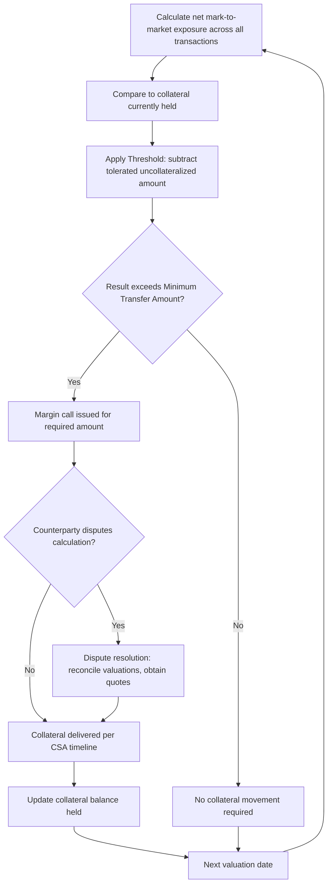

## Credit Support Annexes and Collateral Terms

### Overview and Purpose

The Credit Support Annex (CSA) is the ISDA-published document governing the exchange of collateral between two counterparties to an ISDA Master Agreement, designed to mitigate counterparty credit risk arising from uncollateralized (or partially collateralized) mark-to-market exposure on outstanding derivatives. Collateral posted under a CSA reduces the net exposure a party has to its counterparty's default, and post-Global Financial Crisis reforms have made robust CSA-based collateralization effectively mandatory for the vast majority of the OTC derivatives market. The CSA is legally integrated into the single agreement structure alongside the Master Agreement, Schedule, and Confirmations.

### CSA Legal Structures: Title Transfer vs. Security Interest

**Key Points**

- **New York Law CSA (1994/1995, Title Transfer)**: collateral is transferred outright — full legal and beneficial ownership passes to the collateral-taker, who has an obligation to return equivalent (not necessarily identical) collateral upon the collateral-giver's exposure declining or the position closing out. The collateral-taker can freely use, rehypothecate, or reinvest the collateral it holds.
- **English Law CSA (1995, Security Interest)**: collateral is posted as security, with the collateral-giver retaining underlying ownership subject to the collateral-taker's security interest — the collateral-taker's rights are more constrained (a security interest rather than full title), though rehypothecation rights are typically granted explicitly within the document.
- **Practical convergence**: while the underlying legal mechanics differ (property law consequences upon insolvency of the collateral-taker are meaningfully different between the two structures), in practice both structures achieve broadly similar economic and operational effects in normal market conditions, with the distinction becoming most legally significant in an insolvency scenario.

### Key CSA Terms and Parameters

**Key Points**

- **Threshold**: the amount of uncollateralized exposure a party is willing to tolerate before requiring collateral — a Threshold of zero means collateral is called for any positive exposure; a positive Threshold allows a specified amount of exposure to remain uncollateralized, often calibrated to the counterparty's credit rating (higher-rated counterparties may negotiate higher Thresholds).
- **Minimum Transfer Amount (MTA)**: the minimum size of a collateral call/return below which no transfer is required, even if the Threshold has technically been breached — an operational efficiency mechanism preventing frequent, small, costly transfers.
- **Independent Amount (IA) / Initial Margin**: additional collateral required upfront, independent of current mark-to-market exposure, intended to cover potential future exposure that could arise before a defaulting counterparty's positions can be closed out and re-hedged — conceptually analogous to (and, under post-GFC non-cleared margin rules, now largely standardized via) Initial Margin.
- **Eligible Collateral and Valuation Percentage (Haircuts)**: the CSA specifies which asset types are acceptable as collateral (cash in specified currencies, government bonds, sometimes equities or other securities) and the haircut (Valuation Percentage) applied to non-cash collateral to account for potential price volatility and liquidation risk of that collateral type.
- **Base Currency**: the currency in which exposure is calculated and collateral calls are denominated, even if collateral itself is posted in different eligible currencies.
- **Calculation Agent and Valuation Date/Time**: specifies who calculates exposure and required collateral (often one party, sometimes with dispute resolution mechanics), and the timing convention for valuation (typically daily).

### Collateral Call Mechanics

1. **Exposure calculation**: mark-to-market value of all transactions under the agreement is calculated (net, given single-agreement status) as of the valuation date.
2. **Compare to existing collateral held**: current exposure is compared against collateral already posted/held.
3. **Threshold and MTA application**: the required collateral movement is calculated net of the Threshold, and only actioned if it exceeds the Minimum Transfer Amount.
4. **Margin call issued**: the party owed additional collateral issues a call, specifying the amount and (within CSA-specified timelines) the required delivery.
5. **Dispute resolution**: if the counterparty disputes the calculated exposure or collateral amount, the CSA specifies a reconciliation and dispute resolution process (often involving obtaining independent quotations for disputed transaction valuations).
6. **Return of excess collateral**: conversely, if exposure has declined, the party holding excess collateral is obligated to return it subject to the same Threshold/MTA mechanics.

### Worked Example: Threshold and MTA Calculation

Suppose Party A has a Threshold of $5 million to Party B, an MTA of $500,000, and currently holds no collateral from Party B. Party A's current mark-to-market exposure to Party B is $7.2 million.

- Uncollateralized exposure allowed by Threshold: $5,000,000
- Required collateral before MTA check: $7{,}200{,}000 - 5{,}000{,}000 = \$2{,}200{,}000$
- Since $2.2 million exceeds the $500,000 MTA, a call for $2.2 million is triggered.

If instead the exposure were $5.3 million: required collateral would be $5{,}300{,}000 - 5{,}000{,}000 = \$300{,}000$, which is below the $500,000 MTA, so **no call is made** despite technically exceeding the Threshold — collateral will only be called once the cumulative shortfall (including this amount) crosses the MTA threshold on a subsequent valuation date.

### Post-GFC Non-Cleared Margin Rules

Following the Global Financial Crisis, BCBS-IOSCO published a framework (implemented via jurisdiction-specific rules, e.g., US Prudential/CFTC rules, EU EMIR, etc.) mandating both Variation Margin (VM) and Initial Margin (IM) for non-centrally-cleared derivatives, phased in over several years based on counterparty size (Average Aggregate Notional Amount, AANA).

**Key Points**

- **Variation Margin (VM)**: mandatory daily exchange of collateral reflecting mark-to-market changes — the rules generally require zero Threshold for VM between in-scope counterparties (unlike the more negotiable Thresholds common in legacy bilateral CSAs), and restrict eligible collateral types more tightly than some legacy CSAs allowed.
- **Initial Margin (IM)**: mandatory posting of margin calculated via a standardized model — most commonly **ISDA SIMM** (Standard Initial Margin Model) — or a regulatory-prescribed schedule-based approach, segregated with a third-party custodian (rather than held directly by the counterparty) to protect against the collateral-taker's own insolvency.
- **Segregation requirement for IM**: unlike VM (which under title-transfer CSAs can be rehypothecated), regulatory IM must generally be held in a segregated account with an independent custodian, specifically to ensure it remains available to the posting party (or is protected from commingling with the collateral-taker's own assets) in the event of the collateral-taker's default.
- **2016 ISDA Variation Margin CSA**: ISDA published updated CSA templates specifically designed to align legacy bilateral collateral documentation with the new VM regulatory requirements (zero thresholds, restricted eligible collateral, standardized rounding/timing conventions).

### Diagram: CSA Collateral Call Workflow

### Diagram: VM vs IM Structural Comparison (svg_diagram)

<svg xmlns="http://www.w3.org/2000/svg" viewBox="0 0 760 340">
<text x="380" y="25" text-anchor="middle" font-size="16" font-weight="bold">Variation Margin vs Initial Margin (svg_diagram)</text>
<rect x="50" y="60" width="300" height="250" rx="8" fill="#eaf2fb" stroke="#2c6fbb" stroke-width="1.5" />
<text x="200" y="90" text-anchor="middle" font-size="13" font-weight="bold" fill="#2c6fbb">Variation Margin (VM)</text>
<text x="200" y="120" text-anchor="middle" font-size="11">Covers current mark-to-market</text>
<text x="200" y="138" text-anchor="middle" font-size="11">exposure, exchanged daily</text>
<text x="200" y="168" text-anchor="middle" font-size="11">Generally zero Threshold</text>
<text x="200" y="186" text-anchor="middle" font-size="11">under regulatory rules</text>
<text x="200" y="216" text-anchor="middle" font-size="11">Can be rehypothecated</text>
<text x="200" y="234" text-anchor="middle" font-size="11">(title transfer CSA)</text>
<text x="200" y="270" text-anchor="middle" font-size="11" font-style="italic">Held directly by collateral-taker</text>
<rect x="410" y="60" width="300" height="250" rx="8" fill="#fdf1e8" stroke="#e67e22" stroke-width="1.5" />
<text x="560" y="90" text-anchor="middle" font-size="13" font-weight="bold" fill="#a04000">Initial Margin (IM)</text>
<text x="560" y="120" text-anchor="middle" font-size="11">Covers potential future exposure</text>
<text x="560" y="138" text-anchor="middle" font-size="11">during close-out period</text>
<text x="560" y="168" text-anchor="middle" font-size="11">Calculated via ISDA SIMM</text>
<text x="560" y="186" text-anchor="middle" font-size="11">or schedule-based approach</text>
<text x="560" y="216" text-anchor="middle" font-size="11">Must be segregated with</text>
<text x="560" y="234" text-anchor="middle" font-size="11">independent third-party custodian</text>
<text x="560" y="270" text-anchor="middle" font-size="11" font-style="italic">Protects against collateral-taker default</text>
</svg>

### Risk Management and Operational Considerations

**Key Points**

- **Collateral disputes as an operational risk indicator**: a rising frequency or size of collateral disputes between counterparties can itself be a signal of valuation model divergence, data quality issues, or genuine disagreement about position economics — firms typically track dispute metrics as part of ongoing counterparty and operational risk monitoring.
- **Collateral optimization**: with multiple CSAs across many counterparties and (for cleared trades) CCP margin requirements simultaneously, institutions run collateral optimization processes to determine the most cost-efficient allocation of available eligible collateral across competing margin obligations, given different haircuts and funding costs associated with different collateral types.
- **Funding Valuation Adjustment (FVA) linkage**: the cost of funding collateral (particularly Independent Amount/Initial Margin, which ties up capital or requires borrowing eligible securities) is a direct input into FVA calculations in derivatives valuation — CSA terms are therefore not just a credit risk mitigant but a direct driver of derivatives pricing economics.
- **Wrong-way risk in collateral arrangements**: if the value of posted non-cash collateral is positively correlated with the credit risk of the party posting it (e.g., a company posting its own affiliate's bonds as collateral), the collateral's protective value can be undermined precisely when it's most needed — CSA eligible collateral schedules are typically designed to avoid or limit this concentration.
- [Inference] The operational complexity of managing IM segregation, eligible collateral schedules, and daily VM calls across a large derivatives book is substantial, and institutions vary in the degree to which they have automated versus manually managed aspects of this collateral management workflow, an area that has seen continued industry investment in operational technology.

### Regulatory and Market Structure Interaction

- **Interaction with central clearing**: for centrally cleared derivatives, CCP-specific margin rules (both IM, often via VaR/ES-based methodologies like SPAN, and VM) apply instead of a bilateral CSA — the bilateral CSA framework remains most relevant for the shrinking (but still substantial) population of non-centrally-cleared OTC derivatives.
- **Phase-in scope under non-cleared margin rules**: mandatory VM/IM requirements apply based on counterparties' Average Aggregate Notional Amount (AANA) of non-cleared derivatives, with smaller counterparties phased in later or, in some cases, remaining below the threshold requiring only bilaterally-negotiated (non-mandatory) collateral terms.
- **Netting and collateral interaction in capital calculations**: the combination of enforceable close-out netting (from the Master Agreement) and effective collateralization (from the CSA) together determine a bank's regulatory counterparty credit risk capital charge — both legal enforceability and the operational robustness of the margining process matter for regulatory capital recognition.

**Related Topics**

- The ISDA Master Agreement Structure
- Counterparty Credit Risk and Central Clearing
- ISDA SIMM and Non-Cleared Margin Rules
- Liquidity Risk in Derivatives Portfolios
- Funding Valuation Adjustment (FVA) and CVA/DVA
- Central Clearing and CCP Margin Methodologies
- Close-Out Netting and Regulatory Capital Treatment