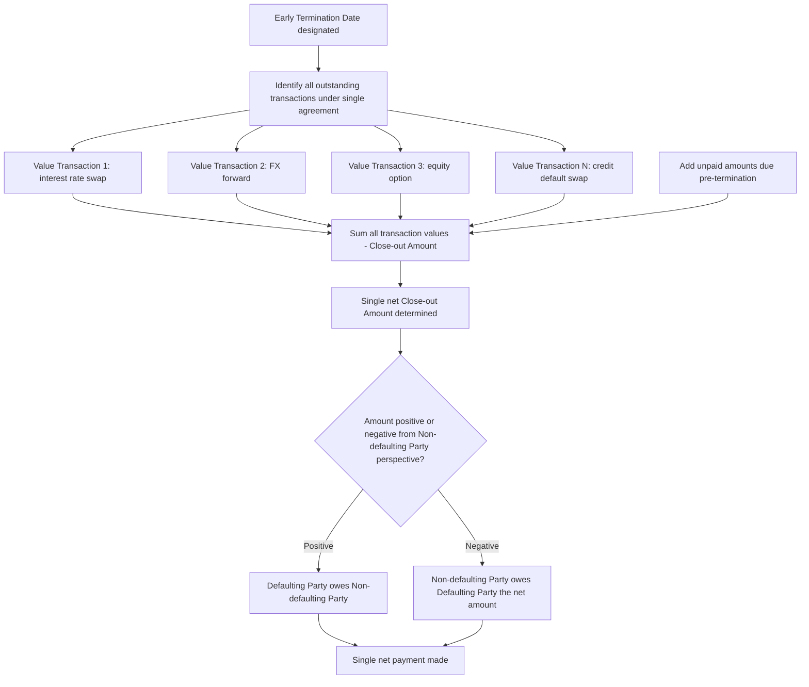

## Netting and Close Out Provisions

### Overview and Purpose

Netting and close-out provisions are the legal and mechanical core of the ISDA Master Agreement's risk-reducing function, converting a portfolio of gross bilateral derivative exposures into a single net obligation, both on an ongoing settlement basis and, critically, upon early termination following a default or other termination event. These provisions are what transform the Master Agreement from a mere administrative convenience into the primary legal tool for counterparty credit risk mitigation in OTC derivatives markets, and their legal enforceability directly determines whether institutions can recognize netting benefits for regulatory capital purposes.

### Types of Netting

**Key Points**

- **Payment netting**: on any given day, if both parties owe each other payments in the same currency under the same transaction (or, if elected, across multiple transactions), only the net difference is actually paid — reduces daily settlement/operational risk and Herstatt (settlement) risk but does not itself reduce credit exposure calculation for risk purposes, since it applies only to actual cash flows due on a specific date, not to the mark-to-market value of open positions.
- **Close-out netting**: upon early termination (following an Event of Default or Termination Event), all outstanding transactions under the single agreement are terminated, valued, and aggregated into one net termination amount — this is the netting type most critical to counterparty credit risk mitigation and regulatory capital treatment, since it determines the actual net amount at risk if a counterparty defaults with multiple open transactions.
- **Multi-branch/cross-affiliate netting**: more complex netting arrangements (where permitted by the Schedule and by applicable law) can extend netting across multiple branches of the same legal entity or, via separate cross-affiliate netting agreements, across different legal entities within a corporate group — subject to materially more complex legal enforceability analysis than netting between two direct counterparty entities under a single Master Agreement.
- **Set-off**: a related but distinct concept, allowing a party to offset amounts owed under the ISDA agreement against amounts owed under entirely separate agreements or obligations between the same parties — the 2002 ISDA includes an optional set-off provision in the printed form itself, whereas broader set-off is more commonly addressed via separate negotiated provisions or general law.

### Why Close-Out Netting Enforceability Matters

**Key Points**

- **Insolvency "cherry-picking" prevention**: without enforceable close-out netting, an insolvency administrator for a defaulted counterparty could theoretically enforce transactions that are in-the-money for the insolvent estate (demanding payment) while disclaiming transactions that are out-of-the-money (walking away from obligations to pay), leaving the solvent counterparty with only gross favorable exposure reduced and no offset for its own gains — enforceable netting prevents this selective treatment by legally unifying all transactions into a single net obligation.
- **Regulatory capital impact**: under Basel capital frameworks, counterparty credit risk exposure (and the associated capital requirement) can be calculated on a net basis only where the netting arrangement is legally enforceable in all relevant jurisdictions — without this recognition, exposure must be calculated on a gross, transaction-by-transaction basis, dramatically increasing capital requirements for a portfolio containing offsetting positions.
- **Netting opinions**: ISDA commissions and maintains legal opinions (updated periodically) from law firms in numerous jurisdictions worldwide, confirming whether close-out netting under the ISDA Master Agreement would be upheld under that jurisdiction's insolvency law — banks generally rely on these opinions (often via ISDA membership access) to determine which counterparty jurisdictions support netting recognition for capital purposes.

### The Close-Out Process: Step by Step

1. **Trigger identification**: an Event of Default or Termination Event occurs with respect to one or both parties (see the ISDA Master Agreement Structure topic for the full list of triggers).
2. **Early Termination Date designation**: the Non-defaulting Party (for an Event of Default) or the relevant party/parties (for a Termination Event) serves notice designating an Early Termination Date, on or after which all outstanding Transactions are terminated — some circumstances (e.g., certain bankruptcy-related defaults under the 2002 ISDA) can trigger Automatic Early Termination if elected in the Schedule, without requiring a notice.
3. **Valuation of terminated transactions**: each terminated transaction is valued as of (or as soon as reasonably practicable after) the Early Termination Date, using the agreement's specified close-out valuation methodology.
4. **Aggregation into a single net amount**: individual transaction valuations (some positive, some negative, from the perspective of the calculating/determining party) are summed into a single Close-out Amount (2002 ISDA) or Settlement Amount (1992 ISDA terminology).
5. **Unpaid amounts adjustment**: any amounts that were due but unpaid prior to the Early Termination Date are added to or netted against the aggregated termination value.
6. **Single net payment determined and due**: the final calculation yields a single amount owed by one party to the other, payable per the agreement's timing provisions.

### Close-Out Valuation Methodologies

**Market Quotation (1992 ISDA option)**: the Determining Party (typically the Non-defaulting Party) obtains firm quotations from multiple reference market-makers for replacement transactions that would preserve the economic terms of each terminated transaction, with the methodology specifying how to handle situations where insufficient quotations can be obtained.

**Loss (1992 ISDA option)**: a more flexible, self-calculated measure of the Determining Party's total losses and costs (or gains) in connection with the termination, including loss of bargain and hedging/funding costs, calculated in good faith using commercially reasonable procedures — used as either an elected alternative to Market Quotation or as a fallback where Market Quotation cannot be obtained.

**Close-out Amount (2002 ISDA)**: replaced both 1992 alternatives with a single, unified standard requiring the Determining Party to calculate its losses or gains using commercially reasonable procedures to produce a commercially reasonable result — explicitly permitting reference to a range of information sources (dealer quotations, relevant market data, internal models) rather than mandating a specific quotation process, providing more flexibility particularly in stressed or illiquid market conditions where obtaining firm dealer quotations may be impractical.

### Worked Example: Close-Out Netting Calculation

Suppose Party A (Non-defaulting Party) and Party B (Defaulting Party) have four outstanding transactions at the time of default, with the following termination values calculated from Party A's perspective (positive = A is owed, negative = A owes):

| Transaction | Termination Value (Party A's perspective) |
| --- | --- |
| Interest rate swap | +$4,200,000 |
| FX forward | -$1,800,000 |
| Equity option | +$900,000 |
| Credit default swap | -$2,500,000 |
| Unpaid amounts due to Party A pre-termination | +$300,000 |

**Net Close-out Amount** = $4{,}200{,}000 - 1{,}800{,}000 + 900{,}000 - 2{,}500{,}000 + 300{,}000 = \$1{,}100{,}000$

Party B owes Party A a single net payment of $1,100,000, regardless of the gross exposures on individual transactions. Without enforceable close-out netting, Party A's estate risk could instead be framed as: Party A must still pay the $1.8M and $2.5M it owes on the losing transactions (total $4.3M owed by A) while only having an unsecured claim in Party B's insolvency for the $5.1M it is owed on the winning transactions plus unpaid amounts — a starkly worse economic outcome illustrating precisely why netting enforceability is so consequential.

### Diagram: Close-Out Netting Value Aggregation

### Diagram: With vs Without Netting Enforceability (svg_diagram)

<svg xmlns="http://www.w3.org/2000/svg" viewBox="0 0 780 340">
<text x="390" y="25" text-anchor="middle" font-size="16" font-weight="bold">Netting Enforceable vs Unenforceable Outcomes (svg_diagram)</text>
<rect x="40" y="55" width="330" height="260" rx="8" fill="#eafaf1" stroke="#27ae60" stroke-width="1.5" />
<text x="205" y="85" text-anchor="middle" font-size="13" font-weight="bold" fill="#1e6b3f">Netting Enforceable</text>
<text x="205" y="115" text-anchor="middle" font-size="11">All transactions treated as</text>
<text x="205" y="132" text-anchor="middle" font-size="11">one single agreement</text>
<text x="205" y="162" text-anchor="middle" font-size="11">Gains and losses offset</text>
<text x="205" y="179" text-anchor="middle" font-size="11">automatically</text>
<text x="205" y="209" text-anchor="middle" font-size="11">Single net payment obligation</text>
<text x="205" y="245" text-anchor="middle" font-size="11" font-weight="bold" fill="#1e6b3f">Exposure = Net Value</text>
<text x="205" y="270" text-anchor="middle" font-size="11">Lower capital requirement</text>
<rect x="410" y="55" width="330" height="260" rx="8" fill="#fdecea" stroke="#c0392b" stroke-width="1.5" />
<text x="575" y="85" text-anchor="middle" font-size="13" font-weight="bold" fill="#922b21">Netting Unenforceable</text>
<text x="575" y="115" text-anchor="middle" font-size="11">Administrator may cherry-pick</text>
<text x="575" y="132" text-anchor="middle" font-size="11">favorable vs unfavorable trades</text>
<text x="575" y="162" text-anchor="middle" font-size="11">Solvent party must pay in full</text>
<text x="575" y="179" text-anchor="middle" font-size="11">on losing transactions</text>
<text x="575" y="209" text-anchor="middle" font-size="11">Only unsecured claim on</text>
<text x="575" y="226" text-anchor="middle" font-size="11">winning transactions</text>
<text x="575" y="255" text-anchor="middle" font-size="11" font-weight="bold" fill="#922b21">Exposure = Gross Value</text>
<text x="575" y="280" text-anchor="middle" font-size="11">Higher capital requirement</text>
</svg>

### Interaction with Collateral and Regulatory Capital

**Key Points**

- **Netting plus collateral together determine capital treatment**: regulatory counterparty credit risk exposure calculations (e.g., under the Basel Standardized Approach for Counterparty Credit Risk, SA-CCR) recognize both the netting benefit (calculating exposure on a net rather than gross basis across a netting set) and collateral held (further reducing the net exposure), meaning the legal enforceability of both the Master Agreement's netting provisions and the CSA together drive the ultimate capital number.
- **Netting sets**: for capital and exposure calculation purposes, a "netting set" is defined as the group of transactions with a single counterparty subject to a legally enforceable netting arrangement — transactions with the same counterparty but under a separate, non-netted agreement (or in a jurisdiction where netting isn't recognized) must be treated as a separate netting set (or on a gross basis) for capital purposes.
- **Cross-product netting limitations**: netting benefits generally apply within the scope of a single Master Agreement's transactions; netting across fundamentally different product types documented under different master agreements (e.g., an ISDA-documented derivative versus a repo documented under a separate Global Master Repurchase Agreement) generally requires a separate cross-product netting agreement and corresponding legal analysis to be recognized.

### Practical and Jurisdictional Considerations

**Key Points**

- **Jurisdiction-specific enforceability risk**: even with a well-drafted Master Agreement, netting enforceability ultimately depends on the insolvency law of the jurisdiction governing the counterparty's insolvency proceeding — institutions must track which counterparty jurisdictions have supportive netting legislation/case law (informed by ISDA netting opinions) and treat exposures to counterparties in jurisdictions lacking clear netting enforceability more conservatively.
- **Automatic Early Termination election consequences**: electing Automatic Early Termination (common for counterparties in certain jurisdictions where a stay on termination rights might otherwise apply upon insolvency filing) changes the mechanical trigger point for the Early Termination Date, which can affect the valuation date used for close-out and therefore the resulting termination amount — a technical drafting choice with real economic consequences in a live default scenario.
- **Dispute risk in stressed markets**: the Close-out Amount standard's flexibility (2002 ISDA), while designed to address illiquidity in obtaining firm quotations, can itself become a source of dispute between parties regarding whether the Determining Party's calculation was genuinely "commercially reasonable" — [Inference] this tension between valuation flexibility and dispute risk is a recognized feature of the close-out framework, and the resolution of specific disputes has depended significantly on the particular facts and expert evidence presented in individual cases rather than a single settled market consensus on methodology.

**Related Topics**

- The ISDA Master Agreement Structure
- Credit Support Annexes and Collateral Terms
- Counterparty Credit Risk and Central Clearing
- SA-CCR and Regulatory Capital for Counterparty Credit Risk
- Liquidity Risk in Derivatives Portfolios
- ISDA SIMM and Non-Cleared Margin Rules
- Bankruptcy and Insolvency Treatment of Derivatives Contracts