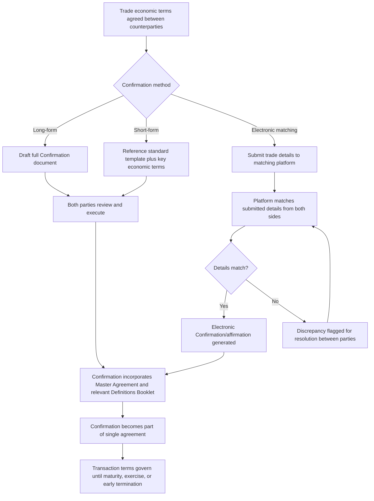

## Confirmations and Trade Documentation

### Overview and Purpose

A Confirmation is the document that records the specific economic and legal terms of an individual derivative transaction executed under an ISDA Master Agreement. Where the Master Agreement and Schedule establish the general legal terms governing the entire counterparty relationship, the Confirmation captures what was actually agreed for a single trade — notional, rate, tenor, dates, and any transaction-specific elections. Confirmations, together with the Master Agreement and Schedule, form the single agreement between the parties; a Confirmation is not itself a standalone contract but rather evidence of a Transaction entered into under, and incorporating by reference, the terms of the pre-existing Master Agreement.

### Legal Status and the Single Agreement Framework

**Key Points**

- **Incorporation by reference**: a Confirmation typically states expressly that it supplements, forms part of, and is subject to the ISDA Master Agreement between the parties, incorporating that agreement's general terms without needing to restate them — this keeps individual trade documentation short and efficient.
- **Confirmation as evidence, not the contract itself**: under the ISDA framework, the Transaction is generally considered to arise from the parties' oral or electronic agreement on the economic terms at the point of execution; the Confirmation serves as the formal written record and evidentiary confirmation of those terms, though its precise legal weight and the resolution of any discrepancy between the oral agreement and the written Confirmation is governed by the Master Agreement's provisions and general contract law principles.
- **Precedence and discrepancy resolution**: the Master Agreement typically specifies how conflicts between the printed form, the Schedule, and Confirmation terms are resolved — generally, the Confirmation's specific terms govern for that transaction's economic details, while the Schedule/Master Agreement's general terms continue to govern all transactions collectively, including default/termination consequences.

### Core Elements of a Confirmation

**Key Points**

- **Trade identification**: trade date, effective date, and reference to the parties and the governing Master Agreement.
- **Economic terms specific to the transaction type**: for an interest rate swap — notional amount, fixed rate, floating rate index and spread, payment frequency, day count convention, business day convention; for an FX forward — currency pair, notional amounts in each currency, forward rate, settlement date; for an option — underlying, strike, expiration date, exercise style, premium.
- **Calculation Agent designation**: identifies which party (or a third party) is responsible for calculating amounts due under the transaction where discretion or calculation is required (e.g., determining a floating rate reset, or valuing an option at exercise) — often the same as the Calculation Agent designated in the Schedule for the relationship generally, but can be transaction-specific.
- **Settlement terms**: physical vs. cash settlement election (particularly relevant for options and certain credit/commodity derivatives), settlement currency, and settlement date conventions.
- **Governing definitions booklet reference**: incorporation of the relevant ISDA definitions booklet applicable to the product type (e.g., the 2006 ISDA Definitions for interest rate derivatives, the 1998 FX and Currency Option Definitions, the 2014 ISDA Credit Derivatives Definitions) — these definitional booklets provide standardized, product-specific technical definitions (e.g., what constitutes a "Credit Event" for CDS purposes) that Confirmations reference rather than redefine from scratch each time.

### Standardized Product Definitions Booklets

A key efficiency feature of the ISDA documentation architecture is the existence of separate, periodically updated definitions booklets for each major derivative product category, which Confirmations incorporate by reference:

| Definitions Booklet | Product Coverage |
| --- | --- |
| 2006 ISDA Definitions | Interest rate derivatives (swaps, swaptions, caps/floors) |
| 2002 ISDA Equity Derivatives Definitions | Equity swaps, equity options, equity forwards |
| 2014 ISDA Credit Derivatives Definitions | Credit default swaps (single-name, index, tranche) |
| 1998 FX and Currency Option Definitions | FX forwards, FX options |
| 2005 ISDA Commodity Definitions | Commodity swaps and options |

**Key Points**

- **Why standardized definitions matter**: without these booklets, every Confirmation would need to fully define potentially ambiguous technical terms (what constitutes a "Business Day," how a floating rate is determined if the reference index is disrupted, what triggers a "Credit Event") — standardization reduces negotiation friction, reduces documentation risk, and provides consistent, market-tested definitions that have often been refined over years of industry experience (including litigation and disputed cases).
- **Periodic updates and protocol adoption**: as market practice evolves (e.g., the transition away from LIBOR to alternative reference rates), ISDA publishes updated definitions or supplements, and Protocols allow the market to adopt updated definitional language across large numbers of existing Confirmations simultaneously rather than requiring bilateral amendment of each individual trade.

### Confirmation Execution Methods

**Key Points**

- **Long-form Confirmations**: traditional, fully drafted paper (or PDF) Confirmations, individually reviewed and signed/executed by both parties — historically standard, particularly for complex, bespoke, or infrequently-traded structures where careful bespoke drafting review is warranted.
- **Short-form / matched Confirmations**: abbreviated confirmations relying heavily on incorporation of standard definitions and templates, used for high-volume, standardized transaction types where full bespoke drafting for every trade would be operationally impractical.
- **Electronic matching and affirmation platforms**: for high-volume standardized derivatives, electronic platforms (e.g., MarkitSERV/IHS Markit, and various venue-integrated affirmation services) automatically match trade details submitted by both counterparties and generate an electronic Confirmation, or at minimum an electronic affirmation of trade economics, without requiring a traditional signed paper document — this has become the dominant confirmation method for liquid, standardized OTC products, driven partly by post-GFC regulatory timely-confirmation requirements.
- **Deemed/electronic confirmation for cleared trades**: where trades are executed for central clearing, the CCP's own trade registration and matching process effectively serves much of the confirmation function for the cleared leg, with the bilateral ISDA Confirmation framework being most directly relevant to the non-cleared portion of the market (or to the original bilateral trade prior to clearing, where applicable).

### Diagram: Confirmation Documentation Flow

### Diagram: Confirmation's Place in the Documentation Hierarchy (svg_diagram)

<svg xmlns="http://www.w3.org/2000/svg" viewBox="0 0 760 340">
<text x="380" y="25" text-anchor="middle" font-size="16" font-weight="bold">Confirmation Within the ISDA Documentation Hierarchy (svg_diagram)</text>
<rect x="280" y="50" width="200" height="45" rx="6" fill="#2c6fbb" />
<text x="380" y="78" text-anchor="middle" font-size="12" fill="white" font-weight="bold">Master Agreement + Schedule</text>
<text x="380" y="105" text-anchor="middle" font-size="10" fill="#2c6fbb">General terms: default, netting, governing law</text>
<line x1="380" y1="115" x2="380" y2="150" stroke="#555" stroke-width="1.5" marker-end="url(#a4)" />
<rect x="230" y="150" width="300" height="45" rx="6" fill="#fdf1e8" stroke="#e67e22" />
<text x="380" y="178" text-anchor="middle" font-size="12" font-weight="bold" fill="#a04000">Definitions Booklet (product-specific)</text>
<text x="380" y="205" text-anchor="middle" font-size="10" fill="#a04000">Standardized technical terms by product type</text>
<line x1="380" y1="215" x2="380" y2="250" stroke="#555" stroke-width="1.5" marker-end="url(#a4)" />
<rect x="180" y="250" width="400" height="45" rx="6" fill="#f4ecf7" stroke="#7d3c98" />
<text x="380" y="278" text-anchor="middle" font-size="12" font-weight="bold" fill="#4a235a">Confirmation: trade-specific economic terms</text>
<text x="380" y="308" text-anchor="middle" font-size="10" fill="#4a235a">Notional, rate, dates, settlement — unique per Transaction</text>
</svg>

### Regulatory Requirements Around Confirmation Timing

**Key Points**

- **Timely confirmation requirements**: post-GFC derivatives market reforms (e.g., under EMIR in the EU, and Dodd-Frank-related rules in the US) impose specific regulatory deadlines for confirming OTC derivative trades (varying by product type and whether electronically confirmable), reflecting supervisory concern that unconfirmed trades represent a form of operational and legal risk — a trade with disputed or unconfirmed terms is harder to value, risk-manage, and, in a default scenario, close out with certainty.
- **Backlogs and operational risk**: prior to these reforms, the industry experienced significant confirmation backlogs (particularly for credit derivatives during periods of high trading volume), which regulators identified as a systemic operational risk concern, contributing to the push toward electronic matching and affirmation infrastructure.
- **Trade reporting linkage**: regulatory trade reporting obligations (to trade repositories under EMIR, swap data repositories under Dodd-Frank) generally rely on accurate, timely-confirmed trade economic data, creating a direct operational linkage between the confirmation process and separate regulatory reporting compliance obligations.

### Practical and Risk Management Considerations

- **Confirmation as a control point for trade economics accuracy**: because the Confirmation is the authoritative record of a transaction's specific terms, discrepancies between a firm's internal trade capture systems (used for risk management, valuation, and P&L) and the executed Confirmation represent a significant operational and legal risk — reconciliation between internal systems and executed Confirmations is a standard operational control.
- **Novation and amendment documentation**: where a transaction is subsequently novated (transferred to a new counterparty) or amended, this requires additional documentation (a Novation Agreement, typically also governed by an ISDA-published Novation Protocol/Agreement template, or an amendment letter) that itself references and modifies the original Confirmation.
- **Interaction with benchmark transition**: the large-scale transition away from LIBOR to alternative reference rates required extensive amendment of outstanding Confirmations' floating rate provisions — addressed at scale primarily through ISDA's IBOR Fallbacks Protocol, allowing adhering parties to incorporate updated fallback language into existing Confirmations without bilateral renegotiation of each individual trade, illustrating the broader Protocol mechanism's importance for managing large-scale documentation change across the market.
- [Inference] The relative balance between long-form bespoke Confirmations and electronic matching/short-form approaches across different product types continues to evolve as electronic trading and matching infrastructure expands to cover increasingly complex or previously less-standardized product types, though highly bespoke structured transactions are likely to continue requiring more traditional long-form documentation for the foreseeable future.

**Related Topics**

- The ISDA Master Agreement Structure
- Netting and Close Out Provisions
- Credit Support Annexes and Collateral Terms
- Benchmark Rate Transition (LIBOR to SOFR/RFR Fallbacks)
- Counterparty Credit Risk and Central Clearing
- Trade Reporting and Regulatory Data Requirements (EMIR, Dodd-Frank)
- ISDA Protocols and Market-Wide Documentation Amendment Mechanisms