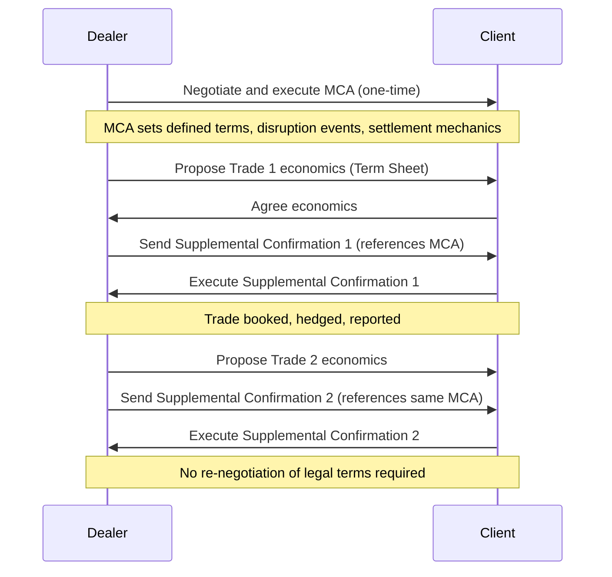

## Master Confirmation Agreements for Structured Trades

### Overview

A Master Confirmation Agreement (MCA) is a standardized legal template negotiated once between two derivatives counterparties to govern the economic and legal terms of a recurring series of similar structured trades. Instead of negotiating full bespoke confirmations for every trade, the parties agree on a master template that captures common structural mechanics, defined terms, and boilerplate provisions. Each subsequent transaction is then executed via a short-form confirmation that references the MCA and specifies only the trade-specific economic terms (notional, strike, dates, underlier).

MCAs sit within the broader ISDA documentation architecture:

- **ISDA Master Agreement** — governs the overall relationship, events of default, termination events, and close-out mechanics between the two parties
- **Schedule to the ISDA Master Agreement** — customizes the master agreement's elections
- **Credit Support Annex (CSA)** — governs collateral posting
- **Master Confirmation Agreement** — governs the recurring product-specific terms for a defined trade type (e.g., a series of equity variance swaps, autocallables, or accreted forward trades)
- **Trade Confirmation / Supplemental Confirmation** — the individual, trade-specific document executed under the MCA

### Purpose and Rationale

**Key Points**

- Reduces negotiation friction and legal cost when a trading relationship anticipates repeated issuance of structurally similar products
- Standardizes definitions, adjustment mechanics, and disruption event language across a product line, reducing basis risk between economically similar trades documented differently
- Speeds trade execution — dealers and structuring desks can turn around a new tranche of a note or swap program in hours rather than days
- Common in structured products businesses with high trade velocity: equity derivatives structuring desks, repeated issuance programs (e.g., structured notes, CLNs), and dealer-to-dealer flow in variance swaps, dividend swaps, and correlation products
- Reduces legal risk of inconsistent terms across a book of similar trades, which matters for portfolio-level hedging and risk aggregation

### Typical Use Cases

- **Equity derivatives**: variance swaps, volatility swaps, dividend swaps, total return swaps (TRS) on baskets or indices, autocallable/barrier note hedges
- **Structured notes issuance programs**: where a bank issues a series of principal-protected or market-linked notes and needs standardized swap documentation for the internal hedge legs
- **Repo and securities lending master frameworks**: analogous concept via the Global Master Repurchase Agreement (GMRA) or Master Securities Loan Agreement (MSLA), though these are distinct document families from ISDA-based MCAs
- **Commodity and FX structured trades**: recurring barrier options, digital options, or accumulator structures traded frequently between the same counterparties

### Core Components of an MCA

**Preamble and Scope**

- Identifies the parties, the governing ISDA Master Agreement and CSA it incorporates by reference, and the product type(s) covered
- Defines the "Type of Transaction" the MCA applies to (e.g., "Share Variance Swap Transactions")

**Defined Terms**

- Product-specific definitions not found in standard ISDA definitional booklets (e.g., the 2002 ISDA Equity Derivatives Definitions), including custom terms for the specific structure
- Calculation methodologies: how variance, realized volatility, or barrier observation is computed
- Valuation Date, Trade Date, Effective Date, Termination Date conventions

**Disruption Events and Adjustments**

- Market Disruption Events (trading suspensions, exchange closures, price source disruptions)
- Corporate action adjustment methodology (dividends, stock splits, mergers, nationalization, insolvency)
- Additional Disruption Events specific to structured payoffs: Change in Law, Hedging Disruption, Increased Cost of Hedging, Loss of Stock Borrow — critical for barrier and autocallable structures where the dealer's hedge cost directly affects payoff economics

**Settlement Mechanics**

- Cash vs. physical settlement elections
- Settlement currency, valuation methodology (official close, VWAP, dealer poll)
- Rounding conventions and business day adjustments

**Representations and Agreements**

- Non-reliance representations (each party is acting for its own account, not relying on the other as a fiduciary or advisor)
- "Additional Representations" specific to structured products, such as investor-suitability language when the counterparty is a distributor placing notes with retail investors
- Hedging party's rights to hedge and unwind hedge positions without restriction

**Form of Supplemental Confirmation**

- An annex template (often labeled "Exhibit A" or "Schedule 1") that becomes the actual trade confirmation
- Lists only the variable, trade-specific fields to be populated: Trade Date, Notional Amount, Initial Level, Strike, Barrier Level(s), Observation Dates, Maturity Date, Underlier(s)

### Relationship to ISDA Definitional Booklets

MCAs typically incorporate by reference one or more ISDA definitional booklets rather than redefining every term from scratch:

- 2002 ISDA Equity Derivatives Definitions
- 2006 ISDA Definitions (rates)
- 2005 ISDA Commodity Definitions
- ISDA 2021 Interest Rate Derivatives Definitions (post-IBOR transition)

The MCA then specifies **elections** and **overrides** within those definitions and adds bespoke product mechanics the standard booklet does not cover (this is especially true for exotic structured payoffs like autocallables, where the barrier/knockout mechanics are custom-drafted).

### Illustrative Document Hierarchy (svg_diagram)

<svg xmlns="http://www.w3.org/2000/svg" viewBox="0 0 760 460" font-family="Helvetica, Arial, sans-serif">
<rect x="0" y="0" width="760" height="460" fill="#ffffff" />
<text x="380" y="28" text-anchor="middle" font-size="16" font-weight="bold" fill="#1a1a1a">Derivatives Documentation Hierarchy (svg_diagram)</text>
<rect x="220" y="50" width="320" height="55" rx="6" fill="#dbe9ff" stroke="#2c5aa0" stroke-width="1.5" />
<text x="380" y="72" text-anchor="middle" font-size="13" font-weight="bold" fill="#1a1a1a">ISDA Master Agreement</text>
<text x="380" y="90" text-anchor="middle" font-size="11" fill="#333">Governs overall relationship, defaults, close-out</text>
<rect x="220" y="130" width="320" height="55" rx="6" fill="#dbe9ff" stroke="#2c5aa0" stroke-width="1.5" />
<text x="380" y="152" text-anchor="middle" font-size="13" font-weight="bold" fill="#1a1a1a">Schedule + Credit Support Annex</text>
<text x="380" y="170" text-anchor="middle" font-size="11" fill="#333">Elections, thresholds, collateral terms</text>
<rect x="180" y="210" width="400" height="60" rx="6" fill="#fde9c8" stroke="#b8860b" stroke-width="1.5" />
<text x="380" y="234" text-anchor="middle" font-size="13" font-weight="bold" fill="#1a1a1a">Master Confirmation Agreement</text>
<text x="380" y="252" text-anchor="middle" font-size="11" fill="#333">Product-level defined terms, disruption events, mechanics</text>
<rect x="60" y="320" width="200" height="70" rx="6" fill="#e6f4ea" stroke="#2e7d32" stroke-width="1.5" />
<text x="160" y="345" text-anchor="middle" font-size="12" font-weight="bold" fill="#1a1a1a">Supplemental Confirmation #1</text>
<text x="160" y="363" text-anchor="middle" font-size="10" fill="#333">Trade Date, Notional, Strike</text>
<text x="160" y="378" text-anchor="middle" font-size="10" fill="#333">e.g., Variance Swap Tranche A</text>
<rect x="280" y="320" width="200" height="70" rx="6" fill="#e6f4ea" stroke="#2e7d32" stroke-width="1.5" />
<text x="380" y="345" text-anchor="middle" font-size="12" font-weight="bold" fill="#1a1a1a">Supplemental Confirmation #2</text>
<text x="380" y="363" text-anchor="middle" font-size="10" fill="#333">Trade Date, Notional, Strike</text>
<text x="380" y="378" text-anchor="middle" font-size="10" fill="#333">e.g., Variance Swap Tranche B</text>
<rect x="500" y="320" width="200" height="70" rx="6" fill="#e6f4ea" stroke="#2e7d32" stroke-width="1.5" />
<text x="600" y="345" text-anchor="middle" font-size="12" font-weight="bold" fill="#1a1a1a">Supplemental Confirmation #3</text>
<text x="600" y="363" text-anchor="middle" font-size="10" fill="#333">Trade Date, Notional, Strike</text>
<text x="600" y="378" text-anchor="middle" font-size="10" fill="#333">e.g., Variance Swap Tranche C</text>
<line x1="380" y1="105" x2="380" y2="130" stroke="#555" stroke-width="1.5" marker-end="url(#arrow)" />
<line x1="380" y1="185" x2="380" y2="210" stroke="#555" stroke-width="1.5" marker-end="url(#arrow)" />
<line x1="300" y1="270" x2="160" y2="320" stroke="#555" stroke-width="1.5" marker-end="url(#arrow)" />
<line x1="380" y1="270" x2="380" y2="320" stroke="#555" stroke-width="1.5" marker-end="url(#arrow)" />
<line x1="460" y1="270" x2="600" y2="320" stroke="#555" stroke-width="1.5" marker-end="url(#arrow)" />
</svg>

### Negotiation Points and Risk Considerations

- **Disruption event allocation**: which party bears the risk and calculation burden when a Market Disruption Event or Hedging Disruption occurs — heavily negotiated because it shifts economic risk in stressed markets
- **Calculation Agent designation**: typically the dealer, raising conflict-of-interest considerations that are sometimes mitigated by requiring "commercially reasonable manner" and "good faith" determination standards, or third-party calculation agent provisions in more balanced negotiations
- **Amendment mechanics**: how the MCA itself can be amended and whether amendments apply retroactively to outstanding Supplemental Confirmations
- **Termination and fallback language**: what happens if the MCA product type becomes unworkable (e.g., discontinuation of a reference rate or index) — increasingly relevant post-LIBOR transition
- **Netting and set-off**: whether trades under the MCA net against other trades under the same ISDA Master Agreement for close-out purposes — governed by the master agreement, but MCA drafting must not create inconsistency
- **Regulatory reporting fields**: MCAs increasingly need to accommodate data fields required under Dodd-Frank/EMIR trade reporting regimes (UPI, UTI generation), since Supplemental Confirmations feed downstream reporting systems

[Inference] The degree of negotiation leverage on disruption-event allocation typically correlates with the relative sophistication and trading volume of the non-dealer counterparty; large asset managers or other dealers can negotiate more balanced terms than smaller distributors, though this varies by relationship and is not a fixed rule.

### Worked Example: Equity Variance Swap MCA

**Example**

A dealer and a hedge fund execute an MCA for "Share and Index Variance Swap Transactions." The MCA defines:

- Realized Variance calculation formula: 

  $$\text{Realized Variance} = \frac{252}{N} \sum_{i=1}^{N} \left(\ln\frac{S_i}{S_{i-1}}\right)^2 \times 10000$$
- Vega Notional to Variance Notional conversion: $\text{Variance Notional} = \dfrac{\text{Vega Notional}}{2 \times \text{Strike}}$
- Market Disruption Events referencing the 2002 ISDA Equity Derivatives Definitions with bespoke amendments for disrupted-day averaging
- Settlement: cash settlement in USD, two business days after the Valuation Date

Six months later, the desk executes a new tranche referencing the Nasdaq-100 Index. Rather than drafting a full confirmation, the trader sends a two-page Supplemental Confirmation populating: Trade Date, Index, Notional, Variance Strike, Valuation Date, and Cap Level (if any) — all other terms flow automatically from the MCA.

### Regulatory and Documentation Context

**Key Points**

- Structured trades documented under MCAs are still subject to the same swap dealer / security-based swap dealer regulatory framework as bespoke confirmations (Dodd-Frank Title VII in the US, EMIR/MiFID II in the EU)
- Portfolio reconciliation and dispute resolution procedures under regulatory margin rules apply at the trade level regardless of MCA usage
- For notes-issuance hedge programs, the MCA governing the internal dealer-to-dealer or dealer-to-SPV hedge swap must be kept economically consistent with the note's prospectus/pricing supplement terms — a documentation basis mismatch here is a recognized operational risk in structured note desks

[Unverified] Specific internal escalation thresholds for MCA-Supplemental Confirmation economic mismatches vary by institution and are not standardized across the industry.

### Common Pitfalls

- Drafting a Supplemental Confirmation that silently overrides an MCA term without an explicit "notwithstanding" clause, creating ambiguity over which document controls
- Failing to update the MCA's disruption-event and adjustment language after a major definitional booklet update (e.g., ISDA's periodic revisions to equity or commodity definitions), leaving legacy trades on outdated mechanics
- Assuming Supplemental Confirmations are immaterial "admin" documents — in a dispute, courts and arbitrators read the MCA and Supplemental Confirmation together as a single integrated contract, so inconsistencies are litigated, not waived

### Illustrative Trade Lifecycle

### Related Topics

- ISDA Master Agreement structure and close-out netting mechanics
- Credit Support Annex (CSA) and variation/initial margin documentation
- ISDA Equity Derivatives Definitions (2002 booklet) and disruption event taxonomy
- Structured notes issuance documentation (prospectus, pricing supplement, indenture)
- Calculation Agent discretion and dispute resolution provisions
- Basis risk between hedge documentation and issued note terms
- Impact of benchmark reform (IBOR transition) on legacy MCA fallback language
- Dodd-Frank / EMIR trade reporting fields (UPI, UTI) in confirmation templates