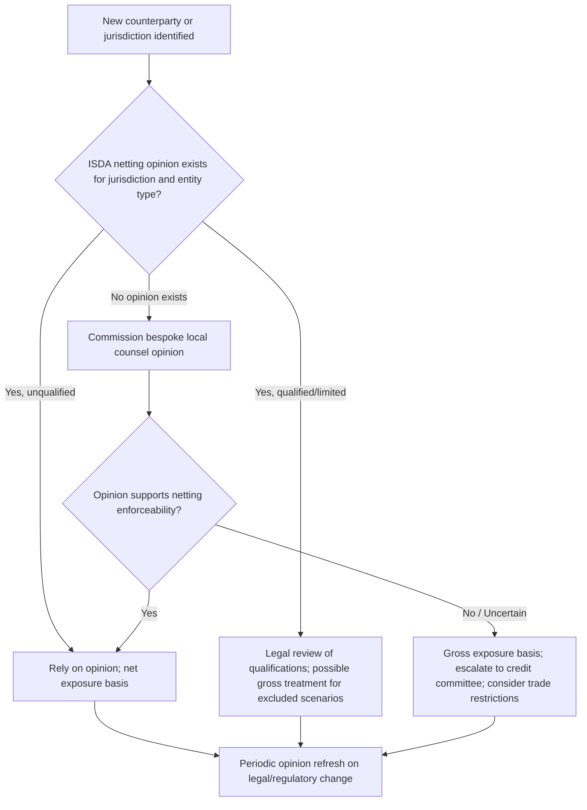

## Legal Opinions and Enforceability

### Overview

Legal opinions and enforceability analysis form the risk-management backbone of derivatives documentation. Before a dealer trades with a new counterparty type, enters a new jurisdiction, or relies on a netting or collateral arrangement to reduce regulatory capital, it must obtain a **legal opinion** confirming that the relevant contractual mechanics — particularly close-out netting and collateral enforcement — will hold up in a counterparty insolvency. These opinions are not academic exercises: under Basel capital rules, a bank can only recognize the risk-reducing effect of netting and collateral for regulatory capital purposes if it holds a satisfactory legal opinion supporting enforceability in every relevant jurisdiction.

### Why Enforceability Matters

**Key Points**

- Derivatives portfolios between two counterparties can run to hundreds of individual trades under a single ISDA Master Agreement; without enforceable **close-out netting**, an insolvency administrator could "cherry-pick" — enforcing trades in the money for the estate while disclaiming trades out of the money — massively increasing the surviving party's credit exposure
- Without netting enforceability, exposure is measured on a **gross** basis rather than **net** basis, which directly increases regulatory capital requirements and internal credit limit usage
- Collateral (margin) arrangements under a Credit Support Annex are similarly only capital-efficient if the security interest or title transfer is enforceable and will survive insolvency, preference, or fraudulent-transfer challenges in the counterparty's jurisdiction
- Cross-border trades multiply this risk: the governing law of the ISDA Master Agreement (usually English or New York law) does not automatically determine how a counterparty's home-jurisdiction insolvency regime will treat netting and collateral

### Types of Legal Opinions in Derivatives

**Netting Opinions**

- Confirm that close-out netting provisions in the ISDA Master Agreement will be enforced under the insolvency law of the counterparty's jurisdiction of incorporation
- ISDA commissions and publishes jurisdiction-specific **netting opinions** annually, covering dozens of jurisdictions, which member firms can rely on (subject to their own internal legal review) rather than commissioning bespoke opinions for every counterparty
- Typically address: (1) whether netting survives insolvency, bankruptcy, or analogous proceedings; (2) whether netting is effective against government entities, insurance companies, or other special counterparty types with distinct insolvency regimes; (3) whether the opinion covers both close-out netting and payment netting

**Collateral / Credit Support Opinions**

- Confirm the enforceability of security interests (pledge, charge) or title transfer collateral arrangements under the Credit Support Annex
- Address perfection requirements (filings, registrations) needed to make a security interest effective against third parties, not just between the two counterparties
- Address whether collateral will be subject to automatic stay, clawback, or preference risk in an insolvency proceeding

**Capacity and Authority Opinions**

- Confirm the counterparty had legal capacity to enter into derivatives transactions (relevant for municipalities, pension funds, sovereigns, and some corporates historically restricted from speculative derivatives use — a lesson embedded in documentation practice after cases like the UK local authority swaps litigation)
- Confirm the signatories had actual authority to bind the entity (board resolutions, powers of attorney, incumbency certificates)

**General Enforceability Opinions**

- Standard "4/6/10" style corporate opinions confirming the ISDA documentation constitutes a legal, valid, binding, and enforceable obligation of the counterparty under the chosen governing law, subject to customary qualifications (bankruptcy, equitable principles, public policy)

### Standard Qualifications and Assumptions in Opinions

Legal opinions are never unconditional. Standard qualifications include:

- **Bankruptcy/insolvency carve-out**: enforceability is "subject to applicable bankruptcy, insolvency, reorganization, and similar laws affecting creditors' rights generally" — an explicit acknowledgment that insolvency law may override contract terms
- **Equitable remedies qualification**: specific performance and injunctive relief may not be available; only monetary damages may be assured
- **Public policy / illegality**: courts retain discretion to refuse enforcement of provisions violating public policy
- **Assumptions**: opinions typically assume documents were properly executed, signatories had authority, no fraud occurred, and factual matters certified by the client (e.g., in an officer's certificate) are true — the opinion does not independently verify these facts

[Inference] The degree to which a dealer's internal credit and legal risk committees require jurisdiction-specific bespoke opinions versus relying on ISDA's published netting opinions typically depends on transaction size, counterparty type, and whether the jurisdiction is already covered by an existing ISDA opinion; smaller or well-covered jurisdictions rely more heavily on the standard ISDA opinion library.

### The ISDA Netting Opinion Framework

**Example**

A US dealer wants to trade with a corporate counterparty incorporated in Brazil. Before booking material notional, the dealer's legal and credit risk functions check:

1. Does ISDA publish a current netting opinion for Brazil covering the counterparty type (corporate, not bank or insurance company)?
2. Does the opinion confirm close-out netting survives Brazilian insolvency proceedings (recuperação judicial / falência)?
3. Are there carve-outs — e.g., government entities or regulated financial institutions may be treated differently than ordinary corporates?
4. If the opinion is qualified or absent for this counterparty type, the credit function may require the trade to be measured on a **gross** exposure basis, apply a higher capital charge, or decline the trade

This process is repeated (or at minimum, checked against the current opinion library) for every new jurisdiction and periodically refreshed as opinions are updated for legal reform (e.g., after a jurisdiction adopts a new insolvency code).

### Enforceability Risk Factors by Category

| Risk Category | What It Threatens | Typical Mitigant |
| --- | --- | --- |
| Insolvency cherry-picking | Close-out netting | Jurisdiction netting opinion; ISDA Master Agreement single-agreement concept |
| Collateral clawback / preference | Recovery via CSA collateral | Perfection opinion; timing safe harbors under local law |
| Ultra vires / capacity | Whole contract validity | Capacity and authority opinion; board resolutions |
| Governing law conflict | Choice-of-law enforcement | Governing law and jurisdiction opinion; conflict-of-laws analysis |
| Special resolution regimes | Bail-in / stay powers over derivatives | ISDA Resolution Stay Protocol adherence |

### Resolution Stay Protocols and Special Regimes

Post-2008 financial reform introduced statutory resolution regimes (e.g., Dodd-Frank Orderly Liquidation Authority in the US, the EU Bank Recovery and Resolution Directive) giving regulators temporary stay powers over derivatives close-out rights when a global systemically important bank enters resolution.

**Key Points**

- The **ISDA Resolution Stay Jurisdictional Modular Protocol (2015, updated versions since)** contractually extends cross-border recognition of these statutory stays into ISDA Master Agreements, so that a counterparty cannot exercise close-out rights based purely on the entry of the other party into resolution, in jurisdictions where the statute alone would not otherwise bind a foreign counterparty
- Legal opinions covering resolution-stay enforceability have become a distinct opinion category alongside traditional netting and collateral opinions
- [Unverified] The precise scope of protocol adherence required for a given counterparty pairing depends on each party's regulatory classification (G-SIB, subsidiary of a G-SIB, etc.) and is subject to periodic ISDA protocol updates; institutions should confirm current adherence status rather than relying on a static list.

### Illustrative Legal Opinion Reliance Chain (svg_diagram)

<svg xmlns="http://www.w3.org/2000/svg" viewBox="0 0 760 420" font-family="Helvetica, Arial, sans-serif">
<rect x="0" y="0" width="760" height="420" fill="#ffffff" />
<text x="380" y="26" text-anchor="middle" font-size="15" font-weight="bold" fill="#1a1a1a">Legal Opinion Reliance Chain (svg_diagram)</text>
<rect x="40" y="55" width="220" height="65" rx="6" fill="#dbe9ff" stroke="#2c5aa0" stroke-width="1.5" />
<text x="150" y="80" text-anchor="middle" font-size="12" font-weight="bold" fill="#1a1a1a">ISDA Master Agreement</text>
<text x="150" y="98" text-anchor="middle" font-size="10" fill="#333">Close-out netting clause executed</text>
<rect x="290" y="55" width="220" height="65" rx="6" fill="#dbe9ff" stroke="#2c5aa0" stroke-width="1.5" />
<text x="400" y="80" text-anchor="middle" font-size="12" font-weight="bold" fill="#1a1a1a">Counterparty Jurisdiction</text>
<text x="400" y="98" text-anchor="middle" font-size="10" fill="#333">Insolvency law of incorporation</text>
<rect x="540" y="55" width="180" height="65" rx="6" fill="#dbe9ff" stroke="#2c5aa0" stroke-width="1.5" />
<text x="630" y="80" text-anchor="middle" font-size="12" font-weight="bold" fill="#1a1a1a">Counterparty Type</text>
<text x="630" y="98" text-anchor="middle" font-size="10" fill="#333">Corporate / Bank / Sovereign</text>
<rect x="230" y="165" width="300" height="60" rx="6" fill="#fde9c8" stroke="#b8860b" stroke-width="1.5" />
<text x="380" y="188" text-anchor="middle" font-size="12" font-weight="bold" fill="#1a1a1a">ISDA Netting Opinion Library</text>
<text x="380" y="206" text-anchor="middle" font-size="10" fill="#333">Jurisdiction + entity-type specific analysis</text>
<rect x="70" y="270" width="220" height="60" rx="6" fill="#e6f4ea" stroke="#2e7d32" stroke-width="1.5" />
<text x="180" y="293" text-anchor="middle" font-size="11" font-weight="bold" fill="#1a1a1a">Netting Confirmed</text>
<text x="180" y="311" text-anchor="middle" font-size="10" fill="#333">Net exposure measurement, lower capital</text>
<rect x="470" y="270" width="220" height="60" rx="6" fill="#fbe0e0" stroke="#a33" stroke-width="1.5" />
<text x="580" y="293" text-anchor="middle" font-size="11" font-weight="bold" fill="#1a1a1a">Netting Not Confirmed</text>
<text x="580" y="311" text-anchor="middle" font-size="10" fill="#333">Gross exposure, higher capital, limit constraints</text>
<rect x="230" y="355" width="300" height="50" rx="6" fill="#eee" stroke="#666" stroke-width="1.5" />
<text x="380" y="384" text-anchor="middle" font-size="11" font-weight="bold" fill="#1a1a1a">Credit Risk / Capital Determination</text>
<line x1="150" y1="120" x2="330" y2="165" stroke="#555" stroke-width="1.5" marker-end="url(#arrow2)" />
<line x1="400" y1="120" x2="400" y2="165" stroke="#555" stroke-width="1.5" marker-end="url(#arrow2)" />
<line x1="630" y1="120" x2="450" y2="165" stroke="#555" stroke-width="1.5" marker-end="url(#arrow2)" />
<line x1="330" y1="225" x2="200" y2="270" stroke="#555" stroke-width="1.5" marker-end="url(#arrow2)" />
<line x1="440" y1="225" x2="570" y2="270" stroke="#555" stroke-width="1.5" marker-end="url(#arrow2)" />
<line x1="180" y1="330" x2="330" y2="355" stroke="#555" stroke-width="1.5" marker-end="url(#arrow2)" />
<line x1="580" y1="330" x2="440" y2="355" stroke="#555" stroke-width="1.5" marker-end="url(#arrow2)" />
</svg>

### Enforceability Considerations for Structured Products Specifically

- **Complex payoff enforceability**: courts have occasionally scrutinized whether highly structured or leveraged payoffs (e.g., embedded barrier options in retail-distributed notes) were properly disclosed and whether the counterparty had capacity/suitability to enter into them — this is a distinct risk from netting/collateral enforceability but often assessed alongside it in structured note documentation review
- **SPV-issued structured notes**: when a bankruptcy-remote special purpose vehicle issues notes and enters a hedge swap with a dealer, legal opinions must separately confirm: (1) the SPV's bankruptcy-remoteness (non-consolidation opinion), (2) true sale opinions if assets were transferred into the SPV, and (3) standard netting/enforceability opinions on the hedge swap itself
- **Non-petition and limited recourse clauses**: structured product documentation commonly includes clauses preventing noteholders/swap counterparties from petitioning the SPV into insolvency and limiting recourse to the SPV's specific assets — legal opinions confirm these clauses are enforceable under the SPV's jurisdiction of formation

### Practical Workflow for a Derivatives Legal/Credit Function

### Common Pitfalls

- Treating an ISDA published netting opinion as automatically applicable to every counterparty in that jurisdiction — opinions are often entity-type specific (e.g., a corporate opinion may not extend to insurance companies or government entities in the same country)
- Failing to refresh opinions after a jurisdiction's insolvency law is amended or reformed, relying on stale legal analysis
- Overlooking resolution-stay protocol adherence status changes for counterparties that undergo restructuring, merger, or reclassification as G-SIBs
- Conflating "governing law enforceability" (e.g., the ISDA is governed by English law) with "insolvency-forum enforceability" (whether a court in the counterparty's home jurisdiction will actually respect that governing law and the netting provisions during an insolvency)

[Unverified] Specific current jurisdiction coverage and qualification details within the ISDA netting opinion library change periodically as opinions are updated or new jurisdictions are added; practitioners should consult the current ISDA opinion library rather than relying on a fixed list.

### Related Topics

- ISDA Master Agreement single-agreement and close-out netting mechanics
- Credit Support Annex collateral perfection and title transfer vs. security interest structures
- ISDA Resolution Stay Protocols and cross-border recognition of statutory bail-in powers
- Bankruptcy-remoteness and non-consolidation opinions for SPV structured note issuers
- True sale opinions in securitization and structured finance
- Basel capital treatment of netting and collateral for counterparty credit risk (SA-CCR)
- Suitability and capacity doctrines in structured product mis-selling litigation
- Governing law and jurisdiction clauses in cross-border derivatives contracts