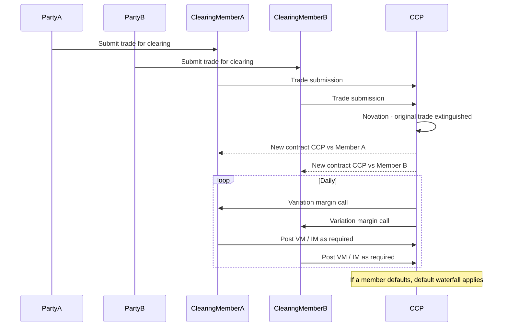

## Central Counterparties and Clearing Mechanics

### Overview

A Central Counterparty (CCP) is a financial market infrastructure that interposes itself between the two original parties to a trade, becoming the buyer to every seller and the seller to every buyer through a process called **novation**. This transforms a bilateral counterparty credit risk relationship into two separate exposures to the CCP itself, which manages the resulting risk through margining, default fund contributions, and a loss-mutualization waterfall. Central clearing became a regulatory mandate for standardized OTC derivatives following the 2008 financial crisis and the G20's 2009 Pittsburgh Summit commitments, implemented through Dodd-Frank Title VII in the US and EMIR in the EU.

### Core Mechanics: Novation

**Key Points**

- When two counterparties execute a trade intended for clearing, they submit it to the CCP, which **novates** the trade — the original bilateral contract is extinguished and replaced by two new contracts: Counterparty A vs. CCP, and Counterparty B vs. CCP
- After novation, neither original counterparty has direct credit exposure to the other; each faces only the CCP
- This concentrates counterparty risk at the CCP, making the CCP's own risk management, capital adequacy, and default management procedures systemically critical — a rationale behind the "too big to fail" concerns raised about major CCPs like LCH, CME Clearing, ICE Clear, and Eurex Clearing
- Clearing members (typically large banks/dealers) connect directly to the CCP; buy-side clients access clearing indirectly through a clearing member under a **client clearing** arrangement

### Margining Framework

**Initial Margin (IM)**

- Collateral collected upfront to cover potential future exposure if a clearing member defaults and the CCP needs to liquidate or hedge the defaulted portfolio before it can be closed out
- Calculated using CCP-specific risk models — commonly **SPAN** (Standard Portfolio Analysis of Risk, historically used by many futures/options CCPs) or more modern **VaR-based** or **Expected Shortfall-based** methodologies (e.g., LCH's PAIRS methodology for SwapClear, CME's SPAN 2/HVaR frameworks)
- Sized to cover a defined confidence level (commonly 99% or 99.5%) over a defined margin period of risk (MPOR) — typically 5 days for cleared interest rate swaps, reflecting the assumed time to liquidate or hedge a defaulted portfolio
- $$\text{IM} \approx z_{\alpha} \times \sigma_{\text{portfolio}} \times \sqrt{\text{MPOR}}$$

  where $z_{\alpha}$ is the confidence-level quantile and $\sigma_{\text{portfolio}}$ is the portfolio's estimated volatility over the margin period — a simplified illustrative approximation; actual CCP models use full historical simulation or filtered historical simulation rather than a simple parametric formula

**Variation Margin (VM)**

- Collected or paid daily (increasingly intraday at major CCPs during volatile periods) to settle the mark-to-market change in value of open positions
- Ensures gains and losses are realized regularly rather than accumulating, limiting the size of any single-day default exposure
- Unlike IM, VM is generally not segregated in the same way — it represents actual settlement of gains/losses, not just risk-buffer collateral

**Default Fund / Guaranty Fund Contributions**

- Each clearing member contributes to a mutualized default fund sized to cover losses exceeding a defaulting member's own IM and default fund contribution, under extreme but plausible stress scenarios (commonly modeled as "Cover 1" or "Cover 2" — surviving a default by the largest, or two largest, clearing members under stress)
- This is the second layer of the CCP's financial resources, mutualizing tail risk across surviving members

### The Default Waterfall

**Key Points**

The sequence in which a CCP applies financial resources to cover losses from a clearing member default, typically in this order:

1. **Defaulting member's initial margin** — used first
2. **Defaulting member's default fund contribution** — used next
3. **CCP's own capital ("skin in the game")** — a defined tranche of the CCP's own funds, contributed before mutualized resources to align CCP incentives with prudent risk management
4. **Non-defaulting members' default fund contributions** — mutualized loss absorption ("mutualization")
5. **Further assessments / cash calls** — CCPs can typically call for additional default fund contributions from surviving members up to a contractually defined cap
6. **Recovery tools** — variation margin gains haircutting (VMGH), forced allocation, or other loss-allocation tools set out in the CCP's rulebook, used only in extreme tail scenarios
7. **Resolution** — if recovery tools are exhausted, statutory CCP resolution regimes (e.g., under EU CCP Recovery and Resolution Regulation) may apply

[Inference] The specific ordering and named terminology for steps 5–7 vary meaningfully by CCP rulebook and jurisdiction; the general waterfall concept (defaulter pays first, mutualized resources second, CCP capital interposed, then tail-risk tools) is standard, but exact mechanics should be verified against the specific CCP's rulebook for any operational or risk-modeling purpose.

### Illustrative Default Waterfall (svg_diagram)

<svg xmlns="http://www.w3.org/2000/svg" viewBox="0 0 760 420" font-family="Helvetica, Arial, sans-serif">
<rect x="0" y="0" width="760" height="420" fill="#ffffff" />
<text x="380" y="26" text-anchor="middle" font-size="15" font-weight="bold" fill="#1a1a1a">CCP Default Waterfall (svg_diagram)</text>
<rect x="180" y="45" width="400" height="40" rx="4" fill="#dbe9ff" stroke="#2c5aa0" stroke-width="1.5" />
<text x="380" y="70" text-anchor="middle" font-size="12" font-weight="bold" fill="#1a1a1a">1. Defaulting Member's Initial Margin</text>
<rect x="180" y="95" width="400" height="40" rx="4" fill="#dbe9ff" stroke="#2c5aa0" stroke-width="1.5" />
<text x="380" y="120" text-anchor="middle" font-size="12" font-weight="bold" fill="#1a1a1a">2. Defaulting Member's Default Fund Contribution</text>
<rect x="180" y="145" width="400" height="40" rx="4" fill="#fde9c8" stroke="#b8860b" stroke-width="1.5" />
<text x="380" y="170" text-anchor="middle" font-size="12" font-weight="bold" fill="#1a1a1a">3. CCP's Own Capital ("Skin in the Game")</text>
<rect x="180" y="195" width="400" height="40" rx="4" fill="#fbe0e0" stroke="#a33" stroke-width="1.5" />
<text x="380" y="220" text-anchor="middle" font-size="12" font-weight="bold" fill="#1a1a1a">4. Non-Defaulting Members' Default Fund (Mutualized)</text>
<rect x="180" y="245" width="400" height="40" rx="4" fill="#fbe0e0" stroke="#a33" stroke-width="1.5" />
<text x="380" y="270" text-anchor="middle" font-size="12" font-weight="bold" fill="#1a1a1a">5. Assessments / Cash Calls (capped)</text>
<rect x="180" y="295" width="400" height="40" rx="4" fill="#e6d9f0" stroke="#6a3d9a" stroke-width="1.5" />
<text x="380" y="320" text-anchor="middle" font-size="12" font-weight="bold" fill="#1a1a1a">6. Recovery Tools (VMGH, Forced Allocation)</text>
<rect x="180" y="345" width="400" height="40" rx="4" fill="#eee" stroke="#666" stroke-width="1.5" />
<text x="380" y="370" text-anchor="middle" font-size="12" font-weight="bold" fill="#1a1a1a">7. Statutory Resolution</text>

<text x="600" y="70" font-size="10" fill="#333">Defaulter pays</text>

<text x="600" y="170" font-size="10" fill="#333">CCP-funded</text>

<text x="600" y="270" font-size="10" fill="#333">Mutualized (survivors)</text>

<text x="600" y="370" font-size="10" fill="#333">Extreme tail</text>

</svg>

### Client Clearing Structures

**Key Points**

- Buy-side firms (asset managers, pension funds, hedge funds) typically access CCPs indirectly via a **clearing member** (a bank/dealer with direct CCP membership), under a client clearing agreement
- Two principal legal structures for client clearing exist depending on jurisdiction/regulation:
  - **Agency model**: the clearing member acts as agent, and the client has a direct legal relationship with the CCP (common under the US CFTC's cleared swaps framework)
  - **Principal-to-principal model**: the clearing member acts as principal both to the client and to the CCP, with two separate back-to-back contracts (common in Europe under EMIR)
- Client asset segregation requirements (e.g., **LSOC** — Legally Segregated, Operationally Commingled — in the US futures/cleared swaps context, or individual/omnibus client segregation under EMIR) determine how client collateral is protected if the clearing member itself defaults
- Segregation model choice has direct implications for portability: whether a client's cleared positions and associated margin can be transferred ("ported") to a backup clearing member if their primary clearing member defaults, without being caught up in that clearing member's own insolvency proceeding

### Products Typically Subject to Mandatory Clearing

- Standardized interest rate swaps (fixed-float, basis swaps) in major currencies (USD, EUR, GBP, JPY)
- Index credit default swaps (CDX, iTraxx) for standardized tranches/indices
- Certain FX products in some jurisdictions (though FX forwards/swaps have notable clearing mandate exemptions in several regimes)
- Standardized commodity derivatives in some markets

**Key Points**

- Highly structured, bespoke, or exotic derivatives (barrier options, autocallables, variance swaps, correlation products) are generally **not** subject to mandatory clearing, since CCPs require standardized, liquid, and reliably-priceable products to manage margin and default risk effectively — this is a key reason structured products largely remain in the bilateral (uncleared) market, subject instead to the Uncleared Margin Rules (UMR) regime for initial and variation margin
- The distinction between cleared-eligible and non-clearable products is a central structuring consideration: dealers must maintain both cleared infrastructure for standardized hedges and bilateral CSA/UMR infrastructure for the structured/exotic overlay trades

### Interaction With Structured Products Businesses

**Example**

A dealer sells a client an equity-linked autocallable note and needs to hedge the embedded option exposure. The dealer may:

1. Execute the bespoke barrier option hedge bilaterally (non-clearable, subject to bilateral CSA and UMR)
2. Simultaneously execute a cleared interest rate swap to hedge the note's underlying funding/rate exposure (mandatorily cleared through a CCP like LCH SwapClear)

This means a single structured product hedging program can straddle both cleared and bilateral infrastructure, requiring the desk to manage margin, funding, and legal documentation across both frameworks simultaneously — a recognized source of operational complexity and funding basis risk (since IM/VM funding costs differ between cleared and bilateral trades).

### Clearing Workflow Overview

### Regulatory Context

**Key Points**

- Dodd-Frank Title VII (US) and EMIR (EU) mandate clearing for specified classes of standardized OTC derivatives, determined through regulatory "clearing determination" processes assessing product standardization and liquidity
- CCPs themselves are regulated as systemically important financial market utilities, subject to prudential oversight (e.g., CFTC/SEC oversight of US CCPs (DCOs), ESMA oversight of EU CCPs) and international standards under the **CPMI-IOSCO Principles for Financial Market Infrastructures (PFMI)**
- Basel III capital rules impose distinct (generally lower) capital charges on cleared exposures versus bilateral exposures, reflecting the risk-mitigating effect of novation, margining, and mutualized loss absorption — a significant driver of the post-crisis migration toward clearing wherever products are clearing-eligible

[Unverified] Specific CCP margin methodology parameters (confidence levels, margin period of risk, model type) and default fund sizing approaches vary by CCP and are periodically revised; current parameters should be confirmed against the specific CCP's published rulebook and risk methodology documents rather than assumed from general description.

### Common Pitfalls

- Assuming novation eliminates all counterparty risk — it replaces bilateral counterparty risk with CCP concentration risk, which is different in character (mutualized, systemically concentrated) rather than eliminated
- Confusing client clearing segregation models (agency vs. principal-to-principal, LSOC vs. omnibus) when assessing portability and asset protection in a clearing member default — the practical protection differs materially by model and jurisdiction
- Treating cleared and bilateral (UMR) margin regimes as interchangeable for funding purposes — IM posted to a CCP and IM posted under bilateral UMR CSAs have different eligibility, rehypothecation, and funding cost characteristics
- Overlooking that mandatory clearing determinations are product- and sometimes counterparty-type-specific (e.g., certain end-user exemptions exist for non-financial corporates hedging commercial risk) — not a blanket rule applying to every derivatives user

### Related Topics

- Uncleared Margin Rules (UMR) and bilateral initial margin (SIMM methodology)
- SPAN and Value-at-Risk based initial margin models
- Client clearing legal structures: agency vs. principal-to-principal models
- LSOC and omnibus/individual client asset segregation regimes
- CCP recovery and resolution frameworks (EU CCP RRR)
- CPMI-IOSCO Principles for Financial Market Infrastructures (PFMI)
- Basel III capital treatment of cleared vs. bilateral counterparty exposures
- Portability of client positions in a clearing member default scenario