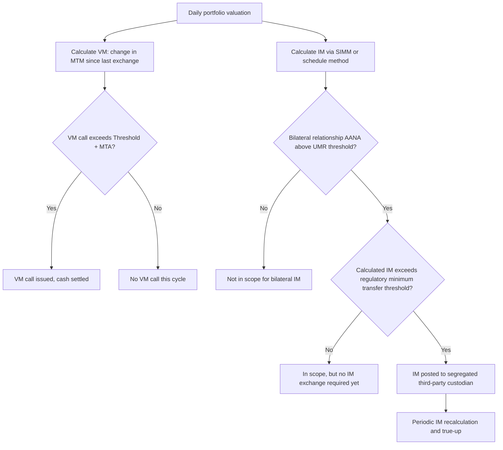

## Initial and Variation Margin Requirements

### Overview

Initial Margin (IM) and Variation Margin (VM) are the two collateral mechanisms that secure derivatives exposures against counterparty default, applying across both centrally cleared and bilateral (uncleared) derivatives markets. While the previous topic addressed margining within a CCP's default waterfall, this topic focuses on margin requirements more broadly — including the post-crisis regulatory framework for **bilateral** uncleared derivatives, commonly referred to as the Uncleared Margin Rules (UMR), which extended IM/VM discipline into the OTC market segment where most structured products trade.

### Conceptual Distinction: IM vs. VM

**Key Points**

- **Variation Margin (VM)** settles the realized mark-to-market change in a portfolio's value since the last margin exchange — it transfers actual gains/losses between counterparties, keeping current exposure close to zero
- **Initial Margin (IM)** is a risk buffer, not a settlement of current value — it covers the *potential future exposure* that could arise between the last VM exchange and the completion of a close-out/hedge-replacement process if a counterparty defaults
- VM addresses **current exposure**; IM addresses **potential future exposure** over the margin period of risk (MPOR)
- Both are distinct from the default fund/guaranty fund contributions used in cleared markets (previous topic), which mutualize losses across a CCP's membership — bilateral IM is not mutualized; it is bilaterally posted and (under UMR) segregated at a third-party custodian

### Variation Margin Mechanics

**Key Points**

- Calculated as the change in mark-to-market value of the portfolio since the previous VM calculation date, typically daily
- Under the 2016 ISDA Variation Margin CSA (developed to implement UMR's VM requirements), VM is generally required to be exchanged in cash, reflecting regulatory preference for VM to closely track actual settlement of value rather than being satisfied with other collateral types
- $$\text{VM Call} = MTM_{t} - MTM_{t-1} - (\text{previously posted collateral adjustments})$$
- Threshold and Minimum Transfer Amount (MTA) provisions in the CSA can create small unmargined exposure windows — a Threshold permits a defined level of uncollateralized exposure before any VM call is triggered, and an MTA avoids the operational burden of transferring immaterial amounts

### Initial Margin Mechanics

**Bilateral IM Under UMR**

- Phased in globally since 2016 under the BCBS-IOSCO "Margin requirements for non-centrally cleared derivatives" framework, UMR requires both counterparties in an in-scope relationship to post IM to each other, calculated to cover potential future exposure over a defined MPOR (typically 10 business days for bilateral trades, longer than the 5-day MPOR common in cleared IRS)
- Unlike cleared IM (held by the CCP), bilateral IM under UMR must be held at a **third-party custodian** under a segregated custodial arrangement, preventing either counterparty from rehypothecating or otherwise using the other's posted IM — this segregation requirement is a defining structural feature of UMR
- IM is calculated using either:
  - **ISDA SIMM (Standard Initial Margin Model)** — a standardized, industry-maintained sensitivity-based methodology using risk-factor sensitivities (delta, vega, curvature) mapped to prescribed risk weights and correlations, widely adopted for its calculation speed and reduced dispute potential relative to full historical simulation
  - **Schedule-based (grid) approach** — a simpler, more conservative percentage-of-notional grid by asset class, used by smaller entities not implementing SIMM
- SIMM must be recalibrated periodically (governed by ISDA's SIMM governance framework) to reflect updated market volatility and correlation data, with new versions requiring model validation and re-implementation by adopting firms

**UMR Phase-In and Scope**

- UMR was phased in across six waves ("Phase 1" through "Phase 6") based on Aggregate Average Notional Amount (AANA) of non-centrally cleared derivatives, with the largest dealers captured first (2016) and progressively smaller buy-side entities captured in later phases (the final phase, Phase 6, applied to entities with AANA above a lower threshold, completing global phase-in by September 2022)
- A key structural feature: IM only needs to be posted once a counterparty pair's calculated IM amount exceeds a **regulatory minimum transfer threshold** (commonly $50 million, though the exact figure is jurisdiction-dependent) — many buy-side relationships remain "in scope" for UMR documentation purposes without ever actually exchanging IM, because their calculated exposure stays below this threshold
- [Unverified] Exact AANA thresholds and phase-in dates should be confirmed against current BCBS-IOSCO and local regulator (CFTC, ESMA, FCA, etc.) publications, since implementation details and thresholds have been subject to periodic regulatory adjustment across jurisdictions.

### Illustrative Margin Timeline (svg_diagram)

<svg xmlns="http://www.w3.org/2000/svg" viewBox="0 0 760 380" font-family="Helvetica, Arial, sans-serif">
<rect x="0" y="0" width="760" height="380" fill="#ffffff" />
<text x="380" y="26" text-anchor="middle" font-size="15" font-weight="bold" fill="#1a1a1a">IM vs VM Exposure Coverage (svg_diagram)</text>
<line x1="60" y1="200" x2="700" y2="200" stroke="#333" stroke-width="1.5" />
<text x="700" y="220" font-size="11" fill="#333">Time</text>
<line x1="150" y1="120" x2="150" y2="280" stroke="#999" stroke-dasharray="4,3" />
<text x="150" y="300" text-anchor="middle" font-size="11" fill="#333">Last VM exchange (t)</text>
<line x1="450" y1="120" x2="450" y2="280" stroke="#c0392b" stroke-dasharray="4,3" />
<text x="450" y="300" text-anchor="middle" font-size="11" fill="#c0392b">Counterparty default</text>
<line x1="580" y1="120" x2="580" y2="280" stroke="#2e7d32" stroke-dasharray="4,3" />
<text x="580" y="300" text-anchor="middle" font-size="11" fill="#2e7d32">Close-out complete (t + MPOR)</text>
<rect x="150" y="150" width="300" height="20" fill="#dbe9ff" stroke="#2c5aa0" />
<text x="300" y="145" text-anchor="middle" font-size="11" fill="#1a1a1a">Current exposure covered by VM up to (t)</text>
<rect x="450" y="175" width="130" height="20" fill="#fde9c8" stroke="#b8860b" />
<text x="515" y="245" text-anchor="middle" font-size="11" fill="#1a1a1a">Potential future exposure</text>
<text x="515" y="260" text-anchor="middle" font-size="11" fill="#1a1a1a">during MPOR — covered by IM</text>
<circle cx="150" cy="200" r="5" fill="#2c5aa0" />
<circle cx="450" cy="200" r="5" fill="#c0392b" />
<circle cx="580" cy="200" r="5" fill="#2e7d32" />
</svg>

### SIMM Calculation Structure

**Example**

Under ISDA SIMM, a portfolio's IM is built up through the following conceptual steps:

1. Decompose each trade into risk-factor **sensitivities** (e.g., delta to interest rate curve points, vega to implied volatility, curvature for gamma-type risk)
2. Apply prescribed **risk weights** to each sensitivity by risk class (interest rate, credit, equity, commodity, FX)
3. Aggregate within each risk class using prescribed **correlation parameters** between risk factors/buckets
4. Aggregate across risk classes using prescribed **cross-risk-class correlations**
5. Sum the resulting margin amounts (delta margin + vega margin + curvature margin) to produce the total SIMM requirement for the portfolio

$$\text{IM}_{\text{SIMM}} = \sqrt{\sum_{i,j} \rho_{ij} \, WS_i \, WS_j}$$

where $WS_i$ is the weighted sensitivity for risk factor $i$ and $\rho_{ij}$ is the prescribed correlation between risk factors $i$ and $j$, aggregated within and across risk classes per the SIMM methodology documentation.

For a structured products desk hedging an equity autocallable book, SIMM calculation requires computing delta, vega, and curvature sensitivities to the underlying equity/index, which can be considerably more complex than for a plain-vanilla swap book, given the non-linear, path-dependent nature of the hedge positions — [Inference] this complexity is a commonly cited operational reason structured/exotic derivatives desks report higher SIMM implementation and dispute-management costs relative to linear-product desks, though the specific cost impact varies by firm and is not independently quantified here.

### Eligible Collateral and Haircuts

**Key Points**

- VM under the 2016 CSA is generally restricted to cash in eligible currencies to minimize valuation/haircut disputes on a frequently-exchanged flow
- IM eligible collateral is typically broader — high-quality government securities, certain corporate bonds, and in some cases equities — subject to regulatory-prescribed or negotiated **haircuts** reflecting the collateral's price volatility and liquidity
- Concentration limits are commonly applied to prevent over-reliance on a single collateral type or issuer within posted IM
- Segregation and custodial arrangements for bilateral IM (via tri-party or third-party custodians) must satisfy both counterparties' legal enforceability requirements — connecting back to the netting/collateral legal opinion framework covered in the "Legal Opinions and Enforceability" material, since IM segregation structures require their own enforceability analysis in the custodian's jurisdiction

### Margin Requirements Workflow

### Interaction With Structured Products

- **Funding cost impact**: posting IM ties up high-quality collateral that could otherwise be deployed elsewhere, creating a funding cost that structured products desks must factor into pricing bespoke hedges — this "IM funding cost" is now a standard component of derivatives pricing/valuation adjustments (alongside CVA, FVA, and other XVAs)
- **Dispute risk on exotic sensitivities**: SIMM disputes are more likely on structured/exotic trades where sensitivity calculation methodology (particularly for curvature/gamma risk on barrier or digital payoffs) is less standardized across counterparties' internal models
- **Threshold and MTA negotiation**: dealers structuring bespoke trades with buy-side counterparties negotiate CSA thresholds and MTAs as part of the overall economics of a relationship — tighter (lower) thresholds reduce credit risk but increase operational margin-call frequency and funding cost

### Common Pitfalls

- Assuming all bilateral derivatives relationships are subject to IM exchange under UMR — many relationships are documentation-in-scope but never cross the regulatory minimum transfer threshold in practice
- Confusing SIMM (a standardized calculation methodology) with the regulatory requirement itself (UMR) — SIMM is one permitted calculation approach; the schedule-based grid approach remains available, particularly for smaller entities
- Treating VM and IM as interchangeable in a funding/liquidity analysis — VM is typically cash and settles actual gains/losses (net funding-neutral over time in a two-way relationship), while IM is a one-way risk buffer that ties up collateral for as long as the relationship remains open, creating a persistent funding cost
- Overlooking that IM segregation and custodial enforceability require their own jurisdiction-specific legal analysis, distinct from the netting opinions covering the underlying ISDA Master Agreement

[Unverified] Specific SIMM version numbers, calibration dates, and precise regulatory minimum transfer thresholds by jurisdiction change periodically through ISDA governance and regulatory action; current parameters should be verified against the latest ISDA SIMM documentation and applicable regulatory texts rather than assumed static.

### Related Topics

- ISDA SIMM governance, versioning, and model validation requirements
- CCP margin models (SPAN, VaR-based) contrasted with bilateral SIMM
- XVA framework: CVA, FVA, MVA (Margin Valuation Adjustment), and KVA
- 2016 ISDA Variation Margin CSA and Initial Margin CSA documentation
- Third-party custodial segregation structures for bilateral initial margin
- Legal opinions and enforceability of collateral segregation arrangements
- Central Counterparties and clearing mechanics (cleared margin comparison)
- Threshold and Minimum Transfer Amount negotiation in CSA drafting