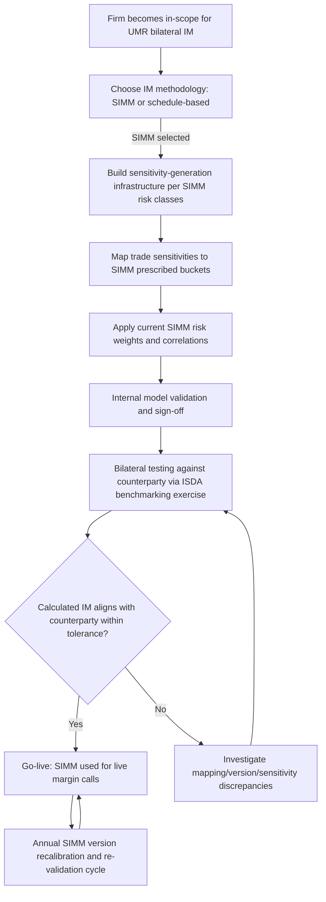

## The ISDA Standard Initial Margin Model

### Overview

The ISDA Standard Initial Margin Model (SIMM) is a standardized, industry-governed methodology for calculating bilateral initial margin (IM) on non-centrally cleared derivatives under the Uncleared Margin Rules (UMR). Developed by ISDA in coordination with member firms and regulators, SIMM was designed to replace each firm's potentially divergent internal IM models with a single, transparent, sensitivity-based calculation that both counterparties can independently replicate — substantially reducing margin call disputes relative to a world where each dealer used its own proprietary model.

### Rationale for a Standardized Model

**Key Points**

- Prior to SIMM, regulators permitted firms to use internal models to calculate bilateral IM, similar to how banks use internal models for regulatory capital — but internal models calculated by two different counterparties on the same portfolio can produce materially different IM figures, since each model uses proprietary risk factors, correlations, and historical calibration windows
- A mismatch in calculated IM between two counterparties creates operational disputes and undermines the reliability of IM as a risk mitigant — if both parties can't agree on the amount to post, the collateral one actually receives may fall short of true potential future exposure
- SIMM addresses this by giving both counterparties the same prescribed methodology, risk weights, and correlation parameters, so that (absent differences in trade population or input sensitivities) both sides should independently arrive at closely aligned IM figures
- Regulators formally recognize SIMM (alongside the simpler schedule-based/grid approach) as an acceptable methodology for satisfying bilateral IM requirements under the BCBS-IOSCO uncleared margin framework

### Methodology Structure

**Sensitivity-Based Approach**

SIMM calculates IM from risk-factor **sensitivities** rather than full portfolio revaluation under thousands of historical or simulated scenarios (as many internal VaR models do). This makes SIMM computationally lighter and more transparent, at the cost of some model precision for highly non-linear or path-dependent payoffs.

**Key Points**

- Each trade is decomposed into standardized sensitivity measures:
  - **Delta**: sensitivity to a linear move in the underlying risk factor (interest rate curve point, credit spread, equity price, FX rate, commodity price)
  - **Vega**: sensitivity to a change in implied volatility of the underlying
  - **Curvature**: captures convexity/gamma-type risk not captured by delta alone, particularly important for options and other non-linear payoffs
- Sensitivities are calculated by each firm's own pricing models (SIMM prescribes the *aggregation* methodology, not the underlying pricing model used to generate the raw sensitivity), which introduces a residual source of potential inter-dealer disagreement if pricing models differ

**Risk Class Structure**

SIMM organizes sensitivities into defined risk classes, each with its own prescribed risk weights and correlation parameters:

- Interest Rate
- Credit (Qualifying and Non-Qualifying)
- Equity
- Commodity
- FX

**Aggregation Formula**

Within each risk class, weighted sensitivities are aggregated using prescribed correlations between risk factor buckets:

$$K = \sqrt{\sum_{i} WS_i^2 + \sum_{i \neq j} \rho_{ij} \, WS_i \, WS_j}$$

where $WS_i$ is the weighted sensitivity to risk factor $i$ (raw sensitivity multiplied by the prescribed risk weight) and $\rho_{ij}$ is the prescribed correlation parameter between risk factors $i$ and $j$ within the same bucket or risk class.

The margin components for delta, vega, and curvature risk are calculated separately within each risk class, then aggregated across risk classes using prescribed cross-risk-class correlations, and finally summed to produce the total SIMM IM requirement for the portfolio:

$$\text{IM}_{\text{SIMM}} = \text{DeltaMargin} + \text{VegaMargin} + \text{CurvatureMargin}$$

each computed through its own within-class and cross-class aggregation per the published SIMM methodology.

### Illustrative SIMM Calculation Flow (svg_diagram)

<svg xmlns="http://www.w3.org/2000/svg" viewBox="0 0 760 460" font-family="Helvetica, Arial, sans-serif">
<rect x="0" y="0" width="760" height="460" fill="#ffffff" />
<text x="380" y="26" text-anchor="middle" font-size="15" font-weight="bold" fill="#1a1a1a">SIMM Calculation Flow (svg_diagram)</text>
<rect x="280" y="45" width="200" height="50" rx="6" fill="#dbe9ff" stroke="#2c5aa0" stroke-width="1.5" />
<text x="380" y="75" text-anchor="middle" font-size="12" font-weight="bold" fill="#1a1a1a">Trade Portfolio</text>
<rect x="280" y="120" width="200" height="55" rx="6" fill="#dbe9ff" stroke="#2c5aa0" stroke-width="1.5" />
<text x="380" y="142" text-anchor="middle" font-size="12" font-weight="bold" fill="#1a1a1a">Compute Sensitivities</text>
<text x="380" y="160" text-anchor="middle" font-size="10" fill="#333">Delta, Vega, Curvature</text>
<rect x="40" y="210" width="150" height="50" rx="6" fill="#fde9c8" stroke="#b8860b" stroke-width="1.5" />
<text x="115" y="240" text-anchor="middle" font-size="11" font-weight="bold" fill="#1a1a1a">Interest Rate</text>
<rect x="210" y="210" width="150" height="50" rx="6" fill="#fde9c8" stroke="#b8860b" stroke-width="1.5" />
<text x="285" y="240" text-anchor="middle" font-size="11" font-weight="bold" fill="#1a1a1a">Credit</text>
<rect x="380" y="210" width="150" height="50" rx="6" fill="#fde9c8" stroke="#b8860b" stroke-width="1.5" />
<text x="455" y="240" text-anchor="middle" font-size="11" font-weight="bold" fill="#1a1a1a">Equity</text>
<rect x="550" y="210" width="90" height="50" rx="6" fill="#fde9c8" stroke="#b8860b" stroke-width="1.5" />
<text x="595" y="235" text-anchor="middle" font-size="10" font-weight="bold" fill="#1a1a1a">Commodity</text>
<text x="595" y="250" text-anchor="middle" font-size="10" font-weight="bold" fill="#1a1a1a">/ FX</text>
<rect x="150" y="295" width="460" height="55" rx="6" fill="#e6f4ea" stroke="#2e7d32" stroke-width="1.5" />
<text x="380" y="317" text-anchor="middle" font-size="12" font-weight="bold" fill="#1a1a1a">Apply Risk Weights + Within-Class Correlations</text>
<text x="380" y="335" text-anchor="middle" font-size="10" fill="#333">Produces per-risk-class margin (delta, vega, curvature)</text>
<rect x="200" y="385" width="360" height="55" rx="6" fill="#e6d9f0" stroke="#6a3d9a" stroke-width="1.5" />
<text x="380" y="407" text-anchor="middle" font-size="12" font-weight="bold" fill="#1a1a1a">Cross-Risk-Class Aggregation</text>
<text x="380" y="425" text-anchor="middle" font-size="10" fill="#333">Total SIMM Initial Margin</text>
<line x1="380" y1="95" x2="380" y2="120" stroke="#555" stroke-width="1.5" marker-end="url(#arrow4)" />
<line x1="380" y1="175" x2="115" y2="210" stroke="#555" stroke-width="1.5" marker-end="url(#arrow4)" />
<line x1="380" y1="175" x2="285" y2="210" stroke="#555" stroke-width="1.5" marker-end="url(#arrow4)" />
<line x1="380" y1="175" x2="455" y2="210" stroke="#555" stroke-width="1.5" marker-end="url(#arrow4)" />
<line x1="380" y1="175" x2="595" y2="210" stroke="#555" stroke-width="1.5" marker-end="url(#arrow4)" />
<line x1="115" y1="260" x2="300" y2="295" stroke="#555" stroke-width="1.5" marker-end="url(#arrow4)" />
<line x1="285" y1="260" x2="340" y2="295" stroke="#555" stroke-width="1.5" marker-end="url(#arrow4)" />
<line x1="455" y1="260" x2="420" y2="295" stroke="#555" stroke-width="1.5" marker-end="url(#arrow4)" />
<line x1="595" y1="260" x2="460" y2="295" stroke="#555" stroke-width="1.5" marker-end="url(#arrow4)" />
<line x1="380" y1="350" x2="380" y2="385" stroke="#555" stroke-width="1.5" marker-end="url(#arrow4)" />
</svg>

### Worked Simplified Example

**Example**

Consider a simplified single-risk-class illustration for an interest rate swap book with two risk factor sensitivities in the same currency bucket:

- Weighted sensitivity to the 5-year tenor: $WS_1 = 12$
- Weighted sensitivity to the 10-year tenor: $WS_2 = -8$
- Prescribed intra-bucket correlation between these tenors: $\rho = 0.98$ (illustrative — actual SIMM tenor correlations are published in the methodology and vary by currency/bucket)

$$K = \sqrt{12^2 + (-8)^2 + 2 \times 0.98 \times 12 \times (-8)} = \sqrt{144 + 64 - 188.16} = \sqrt{19.84} \approx 4.45$$

This illustrates how offsetting positions (a positive sensitivity to one tenor, negative to a correlated tenor) produce partial netting benefit within SIMM — the aggregated margin ($\approx 4.45$) is much smaller than the sum of the absolute sensitivities ($12 + 8 = 20$), because the two risk factors are highly correlated and largely offset each other's potential future exposure. [Unverified] Actual published SIMM risk weights and correlation parameters for specific currencies/tenors should be sourced from the current ISDA SIMM methodology document rather than the illustrative figures used here.

### Governance and Versioning

**Key Points**

- SIMM is governed by ISDA through a formal governance framework involving industry working groups, with **annual recalibration** to update risk weights and correlations based on updated historical market data (typically incorporating stressed periods to ensure adequacy through varying market regimes)
- Each new SIMM version requires **model validation** by adopting firms (often requiring internal model risk management sign-off and, in some jurisdictions, regulatory review) before implementation
- Version transitions require coordinated adoption dates across the industry, since both counterparties to a bilateral relationship must use the same SIMM version for their calculated IM figures to remain aligned — a mismatch in version adoption timing is itself a recognized source of temporary calculation discrepancy around version transition dates
- ISDA maintains a **SIMM dispute resolution / benchmarking exercise** process where participating firms can compare their calculated IM against industry benchmarks for standardized test portfolios, helping identify implementation errors before they manifest as live margin call disputes

[Unverified] The specific current SIMM version number, its effective date, and the precise annual recalibration cycle timing should be confirmed against ISDA's published SIMM documentation, since this framework is updated on a recurring basis and any version-specific detail stated from general knowledge may be outdated by the time this content is read.

### SIMM and Structured/Exotic Products

**Key Points**

- SIMM's curvature risk measure is the primary mechanism for capturing gamma/convexity exposure from non-linear payoffs (options, barriers, autocallables), but it uses a simplified parametric approach (typically based on shifting implied volatility and repricing) rather than full path-dependent Monte Carlo revaluation
- For highly path-dependent structured payoffs (autocallables with multiple observation dates, cliquets, worst-of baskets), the sensitivity inputs feeding SIMM depend heavily on the originating firm's own pricing model — since two counterparties' internal models for the same exotic structure can diverge more than for vanilla products, SIMM disputes are more likely on structured/exotic books than on plain vanilla rate or FX portfolios
- Some SIMM risk classes (e.g., equity, commodity) have historically had less granular bucket structures than interest rate risk, which can matter for basket or multi-underlier structured payoffs where sensitivities must be mapped into the prescribed bucket taxonomy — mapping methodology choices here are a source of potential inter-dealer disagreement
- [Inference] Structured products desks are commonly reported (in industry commentary) as bearing disproportionately higher SIMM implementation and ongoing dispute-management costs relative to linear-product desks, given the sensitivity-mapping and model-divergence issues noted above; this is a directional industry observation rather than an independently verified quantified finding here.

### SIMM Implementation Workflow for a Firm

### Common Pitfalls

- Assuming SIMM produces identical IM figures between counterparties in practice — while designed to minimize divergence, differences in underlying pricing-model sensitivities, bucket-mapping choices, and version-adoption timing can still produce material discrepancies requiring reconciliation
- Treating SIMM as a full risk model — it is a standardized margin *aggregation* methodology applied to sensitivities the firm itself calculates; errors in the underlying sensitivity calculation (e.g., an incorrect Greek from a mispriced exotic) will flow directly into an incorrect SIMM output without SIMM itself "catching" the error
- Overlooking the annual recalibration cycle — firms that fail to validate and adopt a new SIMM version on the industry-coordinated timeline risk calculating IM on a stale version, creating both regulatory compliance and counterparty reconciliation issues
- Underestimating the sensitivity-mapping complexity for multi-underlier or path-dependent structured trades, which is a disproportionate source of implementation effort relative to notional traded compared to vanilla rate or FX books

### Related Topics

- Initial and Variation Margin Requirements (UMR framework overview)
- BCBS-IOSCO margin requirements for non-centrally cleared derivatives
- Schedule-based (grid) IM calculation as a SIMM alternative
- Third-party custodial segregation for bilateral initial margin
- Model risk management and validation standards for margin/pricing models
- XVA framework: Margin Valuation Adjustment (MVA) as the funding cost of posted IM
- Central Counterparty margin models (SPAN, VaR-based) contrasted with SIMM
- ISDA SIMM benchmarking and dispute-resolution testing processes