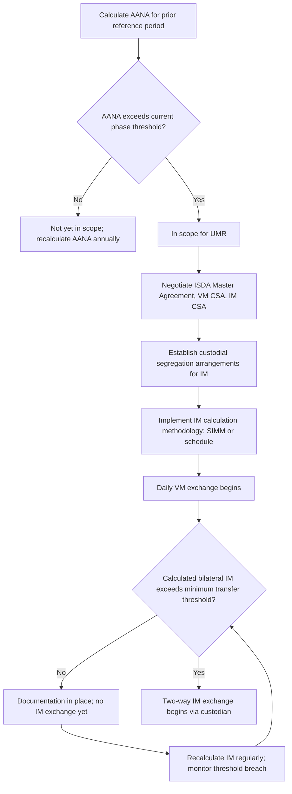

## Uncleared Margin Rules

### Overview

The Uncleared Margin Rules (UMR) are the global regulatory framework requiring counterparties to non-centrally cleared (bilateral OTC) derivatives to exchange Initial Margin (IM) and Variation Margin (VM). Developed by the Basel Committee on Banking Supervision and the International Organization of Securities Commissions (BCBS-IOSCO) following the 2008 financial crisis, UMR extends the collateralization discipline of central clearing into the bilateral market segment where standardization is not feasible — which includes most bespoke and exotic structured products. UMR is implemented locally through jurisdiction-specific rules (US: CFTC/prudential regulators; EU: EMIR technical standards; UK: post-Brexit onshored equivalents; and similar frameworks in Japan, Canada, Australia, and other G20 members), each broadly aligned with the BCBS-IOSCO framework but with jurisdiction-specific technical details.

### Regulatory Origin and Objectives

**Key Points**

- UMR responds directly to a core 2008 crisis lesson: large, undercollateralized bilateral derivatives exposures (notably AIG's uncollateralized CDS book) created systemic risk that propagated through the financial system when counterparties could not absorb mark-to-market losses on uncollateralized positions
- The G20's 2009 Pittsburgh commitments addressed OTC derivatives reform through two complementary tracks: (1) mandatory central clearing for standardized products (covered under "Central Counterparties and Clearing Mechanics"), and (2) margin requirements for products that remain bilateral because they are not standardized enough to clear — this is UMR's specific mandate
- By requiring both IM and VM on bilateral trades, UMR aims to ensure that even non-clearable, bespoke derivatives carry collateralization broadly comparable in risk-mitigating effect to cleared trades, reducing the incentive to structure trades as non-standard purely to avoid margin discipline

### Scope: Who Is Captured

**Key Points**

- UMR applies to "covered entities" — broadly, financial firms (banks, broker-dealers, asset managers, insurance companies, and certain investment funds) whose derivatives activity exceeds defined notional thresholds
- Scope is determined by **Aggregate Average Notional Amount (AANA)** of non-centrally cleared derivatives, measured typically as a group-wide average over a specified reference period (commonly March, April, and June of the prior year in most implementations)
- Phase-in occurred across six waves from 2016 (Phase 1, the largest global dealers) through September 2022 (Phase 6, capturing the widest population of smaller in-scope entities) — progressively lowering the AANA threshold required to be captured
- Certain entities and products are commonly exempted or carved out depending on jurisdiction: physically-settled FX forwards and swaps are frequently excluded from IM requirements (though generally still subject to VM requirements and to risk management/documentation standards); non-financial end-users hedging genuine commercial risk often benefit from clearing and/or margin exemptions in various jurisdictions
- [Unverified] Exact current AANA thresholds, phase dates, and product/entity exemptions differ by jurisdiction and are subject to periodic regulatory revision; current compliance scoping should be verified against the applicable local regulator's current rules (CFTC, PRA/FCA, ESMA technical standards, JFSA, etc.) rather than treated as fixed.

### The Two Core Requirements

**Variation Margin**

- Mandatory VM exchange between in-scope counterparties, generally daily, using the 2016 ISDA Variation Margin CSA (or jurisdiction-equivalent documentation) as the standard legal framework
- VM requirements under UMR applied earlier and more broadly than IM requirements — most in-scope relationships were required to exchange VM well before the later IM phases took effect, since VM implementation was considered lower-complexity than building IM infrastructure

**Initial Margin**

- Two-way IM exchange (both counterparties post to each other) once a relationship's calculated IM exceeds the regulatory minimum transfer threshold (commonly cited around $50 million, though jurisdiction-specific)
- Calculated via ISDA SIMM or a schedule-based (grid) approach — covered in depth under "The ISDA Standard Initial Margin Model"
- Must be held at a third-party custodian under a segregated arrangement — neither counterparty may rehypothecate the other's posted IM, a structural safeguard distinguishing bilateral IM from ordinary collateral arrangements

### Illustrative UMR Documentation Stack (svg_diagram)

<svg xmlns="http://www.w3.org/2000/svg" viewBox="0 0 760 400" font-family="Helvetica, Arial, sans-serif">
<rect x="0" y="0" width="760" height="400" fill="#ffffff" />
<text x="380" y="26" text-anchor="middle" font-size="15" font-weight="bold" fill="#1a1a1a">UMR Documentation Stack (svg_diagram)</text>
<rect x="220" y="50" width="320" height="50" rx="6" fill="#dbe9ff" stroke="#2c5aa0" stroke-width="1.5" />
<text x="380" y="80" text-anchor="middle" font-size="12" font-weight="bold" fill="#1a1a1a">ISDA Master Agreement</text>
<rect x="220" y="120" width="320" height="50" rx="6" fill="#fde9c8" stroke="#b8860b" stroke-width="1.5" />
<text x="380" y="150" text-anchor="middle" font-size="12" font-weight="bold" fill="#1a1a1a">2016 ISDA Variation Margin CSA</text>
<rect x="220" y="190" width="320" height="50" rx="6" fill="#fbe0e0" stroke="#a33" stroke-width="1.5" />
<text x="380" y="220" text-anchor="middle" font-size="12" font-weight="bold" fill="#1a1a1a">ISDA Initial Margin CSA (Security Interest)</text>
<rect x="80" y="270" width="280" height="55" rx="6" fill="#e6f4ea" stroke="#2e7d32" stroke-width="1.5" />
<text x="220" y="292" text-anchor="middle" font-size="11" font-weight="bold" fill="#1a1a1a">Account Control Agreement</text>
<text x="220" y="310" text-anchor="middle" font-size="10" fill="#333">Custodian A (Party A's IM)</text>
<rect x="400" y="270" width="280" height="55" rx="6" fill="#e6f4ea" stroke="#2e7d32" stroke-width="1.5" />
<text x="540" y="292" text-anchor="middle" font-size="11" font-weight="bold" fill="#1a1a1a">Account Control Agreement</text>
<text x="540" y="310" text-anchor="middle" font-size="10" fill="#333">Custodian B (Party B's IM)</text>
<line x1="380" y1="100" x2="380" y2="120" stroke="#555" stroke-width="1.5" marker-end="url(#arrow5)" />
<line x1="380" y1="170" x2="380" y2="190" stroke="#555" stroke-width="1.5" marker-end="url(#arrow5)" />
<line x1="330" y1="240" x2="220" y2="270" stroke="#555" stroke-width="1.5" marker-end="url(#arrow5)" />
<line x1="430" y1="240" x2="540" y2="270" stroke="#555" stroke-width="1.5" marker-end="url(#arrow5)" />
</svg>

### Custodial Segregation Structures

**Key Points**

- Bilateral IM must be posted to a custodian independent of both counterparties (a "third-party custodian" model), typically documented via a tri-party or account control agreement establishing a segregated securities account
- Two structural variants are common: a **tri-party arrangement** (the custodian actively manages eligibility, valuation, and haircut calculations across multiple client relationships using standardized collateral schedules) or a **third-party custodian model** with a bilaterally negotiated account control agreement (more manual, more customizable, historically favored by larger dealers with bespoke collateral eligibility needs)
- The IM CSA (distinct from the VM CSA) typically takes a **security interest** form (a pledge) rather than title transfer, since title transfer of IM would defeat the segregation/non-rehypothecation purpose central to UMR's design
- Enforceability of this segregation in the posting party's and custodian's relevant jurisdictions requires its own legal opinion — connecting directly to the legal opinions and enforceability framework covered earlier in this chapter, since a custodial segregation structure that fails in insolvency would undermine the entire IM safeguard

### UMR Compliance Workflow

### Practical Impact on Structured Products Desks

**Key Points**

- Most bespoke structured product hedges (exotic barrier options, correlation swaps, autocallable hedges) are, by their nature, non-clearable and therefore fall squarely within UMR's bilateral scope rather than benefiting from cleared-market margin efficiencies
- UMR compliance for a structured products business requires: (1) SIMM or schedule-based sensitivity infrastructure for exotic payoffs, (2) custodial relationships and account control agreements for IM segregation, (3) VM CSA documentation with each in-scope counterparty, and (4) ongoing AANA monitoring since a counterparty's or the firm's own trading volume can shift its phase-in status over time
- The **funding cost of posted IM** (formalized in derivatives pricing as MVA — Margin Valuation Adjustment) has become a direct input into structured trade pricing, since IM is now a genuine cost of doing bilateral business that must be recovered in the trade's economics
- Smaller buy-side counterparties newly captured in later UMR phases (Phase 5/6) often faced a choice between building UMR-compliant custodial infrastructure or restructuring their trading relationships to stay below relevant thresholds (e.g., reducing gross notional, migrating eligible trades to cleared alternatives where possible) — a documented industry trend as later phases approached implementation

[Inference] Given the operational burden of custodial IM segregation relative to trading volume, smaller Phase 5/6 entities were commonly reported in industry commentary as more likely to restructure activity to remain below the minimum transfer threshold rather than build full IM exchange infrastructure; this reflects general industry commentary rather than a specific verified statistic cited here.

### Common Pitfalls

- Assuming clearing-eligible products are automatically exempt from UMR — UMR applies specifically to *non-cleared* trades; if a firm's derivatives include both cleared and bilateral legs (common in structured hedging programs), only the bilateral leg falls under UMR
- Miscalculating AANA by excluding intra-group trades or failing to aggregate correctly across a corporate group, potentially causing incorrect phase-in scoping
- Treating the VM CSA and IM CSA as a single document — they are typically separate legal agreements with different collateral eligibility, custodial, and enforcement mechanics, reflecting VM's settlement function versus IM's segregated-buffer function
- Overlooking that a counterparty relationship can move in and out of "IM exchange required" status as calculated exposure fluctuates around the minimum transfer threshold, requiring ongoing monitoring rather than a one-time compliance determination

[Unverified] Specific current-phase thresholds, exact custodial market practice conventions, and jurisdiction-by-jurisdiction implementation nuances change periodically; current UMR compliance obligations should be confirmed against the applicable regulator's current published rules.

### Related Topics

- The ISDA Standard Initial Margin Model (SIMM) calculation methodology
- Initial and Variation Margin Requirements (general IM/VM mechanics)
- Central Counterparties and clearing mechanics (cleared vs. bilateral margin contrast)
- Legal opinions and enforceability of custodial segregation arrangements
- 2016 ISDA Variation Margin CSA and Initial Margin CSA (Security Interest) documentation
- XVA framework: Margin Valuation Adjustment (MVA) as the funding cost of IM
- Tri-party collateral management versus bilateral third-party custodian models
- AANA calculation methodology and cross-jurisdictional phase-in timelines