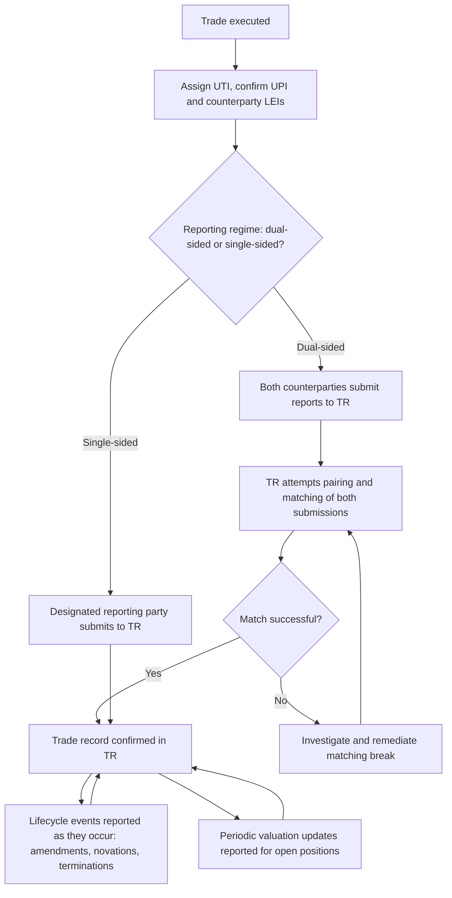

## Trade Repositories and Reporting Obligations

### Overview

Trade repositories (TRs) are centralized market infrastructures that collect, maintain, and make available data on derivatives transactions, forming the regulatory transparency pillar of the G20's post-2008 OTC derivatives reform agenda. Alongside central clearing (systemic risk reduction) and margin requirements (counterparty risk mitigation), mandatory trade reporting to TRs was designed to give regulators visibility into aggregate derivatives exposures across the financial system — visibility that was largely absent before the crisis, when regulators could not readily assess concentrations of risk like AIG's uncollateralized CDS exposure until it was too late.

### Regulatory Origin and Objectives

**Key Points**

- The G20's 2009 Pittsburgh Summit commitments specifically required that all standardized OTC derivatives be reported to trade repositories, alongside clearing and margin mandates, to ensure regulators had comprehensive data on outstanding derivatives risk across the system
- Trade reporting serves multiple regulatory purposes: systemic risk monitoring (aggregate exposure concentrations by product, currency, and counterparty type), market abuse surveillance, and supporting orderly resolution planning by giving resolution authorities visibility into a failing firm's derivatives book
- Reporting regimes are implemented at jurisdictional level with broadly similar objectives but differing technical specifications: Dodd-Frank Title VII in the US (CFTC and SEC swap data reporting rules), EMIR in the EU (and its UK post-Brexit equivalent, UK EMIR), and comparable regimes in Japan (JFSA), Canada, Australia (ASIC), Hong Kong, Singapore (MAS), and other G20 members

### What Gets Reported

**Key Points**

- Reportable data typically spans the full trade lifecycle: **execution** (new trade details), **lifecycle events** (amendments, novations, partial terminations, compressions), and **valuation** (periodic mark-to-market updates, particularly for open positions)
- Core reportable fields generally include: counterparty identifiers, product taxonomy classification, notional amount, currency, price/rate, effective and maturity dates, and clearing status
- Both counterparties to a bilateral trade are frequently required to report (dual-sided reporting, as under EMIR), though some jurisdictions have moved toward single-sided reporting (one party, typically the dealer/swap dealer, reports on behalf of both) to reduce duplicative reporting burden and pairing/matching complexity — [Unverified] the specific reporting-side obligations differ by jurisdiction and by counterparty type (e.g., non-financial counterparties may have reduced or delegated reporting obligations) and should be confirmed against the applicable current rule set for a given relationship
- Structured and exotic derivatives (autocallables, barrier options, variance swaps, correlation products) must be reported using available product taxonomy codes even where the specific payoff structure predates or exceeds the granularity of standard taxonomy classifications — a recognized practical challenge for less-standardized structured trades

### Key Identifiers in Trade Reporting

**Unique Transaction Identifier (UTI)**

- A unique code assigned to each reportable trade, intended to allow regulators to identify the same trade even when reported by both counterparties independently (in dual-sided regimes) and to track a trade through its full lifecycle of amendments and events
- UTI generation methodology (which counterparty generates the UTI, and using what convention) is governed by industry protocols (CPMI-IOSCO UTI Technical Guidance) to standardize the process across jurisdictions and avoid duplicate or conflicting identifiers for the same economic trade

**Unique Product Identifier (UPI)**

- A standardized code classifying the specific derivative product type, intended to allow regulators to aggregate exposure data by product category across the global market
- Maintained through a governance framework (the ISDA-supported UPI system operated via DSB — the Derivatives Service Bureau) that assigns UPI codes based on defined product taxonomies across asset classes

**Legal Entity Identifier (LEI)**

- A 20-character alphanumeric code uniquely identifying each legal entity party to a reportable transaction, issued by accredited Local Operating Units under the Global LEI System overseen by the Regulatory Oversight Committee (ROC)
- LEIs are now a near-universal prerequisite for participating in reportable derivatives activity — a counterparty without a valid, current LEI is typically unable to be properly reported and, in practice, often cannot transact in the relevant market until one is obtained and renewed

### Illustrative Reporting Data Flow (svg_diagram)

<svg xmlns="http://www.w3.org/2000/svg" viewBox="0 0 760 420" font-family="Helvetica, Arial, sans-serif">
<rect x="0" y="0" width="760" height="420" fill="#ffffff" />
<text x="380" y="26" text-anchor="middle" font-size="15" font-weight="bold" fill="#1a1a1a">Trade Reporting Data Flow (svg_diagram)</text>
<rect x="40" y="60" width="180" height="55" rx="6" fill="#dbe9ff" stroke="#2c5aa0" stroke-width="1.5" />
<text x="130" y="92" text-anchor="middle" font-size="12" font-weight="bold" fill="#1a1a1a">Counterparty A</text>
<rect x="540" y="60" width="180" height="55" rx="6" fill="#dbe9ff" stroke="#2c5aa0" stroke-width="1.5" />
<text x="630" y="92" text-anchor="middle" font-size="12" font-weight="bold" fill="#1a1a1a">Counterparty B</text>
<rect x="290" y="60" width="180" height="55" rx="6" fill="#fde9c8" stroke="#b8860b" stroke-width="1.5" />
<text x="380" y="82" text-anchor="middle" font-size="12" font-weight="bold" fill="#1a1a1a">Trade Execution</text>
<text x="380" y="100" text-anchor="middle" font-size="10" fill="#333">UTI + UPI + LEI assigned</text>
<rect x="100" y="170" width="200" height="50" rx="6" fill="#e6f4ea" stroke="#2e7d32" stroke-width="1.5" />
<text x="200" y="200" text-anchor="middle" font-size="11" font-weight="bold" fill="#1a1a1a">Report submission A</text>
<rect x="460" y="170" width="200" height="50" rx="6" fill="#e6f4ea" stroke="#2e7d32" stroke-width="1.5" />
<text x="560" y="200" text-anchor="middle" font-size="11" font-weight="bold" fill="#1a1a1a">Report submission B</text>
<rect x="220" y="260" width="320" height="60" rx="6" fill="#fbe0e0" stroke="#a33" stroke-width="1.5" />
<text x="380" y="284" text-anchor="middle" font-size="12" font-weight="bold" fill="#1a1a1a">Trade Repository (TR)</text>
<text x="380" y="302" text-anchor="middle" font-size="10" fill="#333">Pairing / matching of both submissions</text>
<rect x="220" y="350" width="320" height="55" rx="6" fill="#e6d9f0" stroke="#6a3d9a" stroke-width="1.5" />
<text x="380" y="373" text-anchor="middle" font-size="12" font-weight="bold" fill="#1a1a1a">Regulators</text>
<text x="380" y="391" text-anchor="middle" font-size="10" fill="#333">Systemic risk monitoring, surveillance</text>
<line x1="130" y1="115" x2="200" y2="170" stroke="#555" stroke-width="1.5" marker-end="url(#arrow6)" />
<line x1="630" y1="115" x2="560" y2="170" stroke="#555" stroke-width="1.5" marker-end="url(#arrow6)" />
<line x1="200" y1="220" x2="320" y2="260" stroke="#555" stroke-width="1.5" marker-end="url(#arrow6)" />
<line x1="560" y1="220" x2="440" y2="260" stroke="#555" stroke-width="1.5" marker-end="url(#arrow6)" />
<line x1="380" y1="320" x2="380" y2="350" stroke="#555" stroke-width="1.5" marker-end="url(#arrow6)" />
</svg>

### Data Matching, Reconciliation, and Quality

**Key Points**

- In dual-sided reporting regimes, TRs (or delegated reconciliation services) attempt to **pair** and **match** the two counterparties' independent submissions of the same trade, checking for consistency across key economic fields (notional, price, dates)
- Mismatches ("pairing breaks" or "matching breaks") are common in practice due to timing differences, differing internal system representations of the same trade, or genuine data errors — regulators in several jurisdictions have imposed specific data quality and reconciliation requirements (and, in some cases, enforcement actions) targeting persistently poor matching rates
- Regulatory reporting rule updates (e.g., the CFTC's rewrite rules, EMIR Refit, and later EMIR 3.0-style technical standard updates) have periodically expanded reportable field granularity and tightened data quality/validation requirements, reflecting regulators' finding that early-generation reporting data was often incomplete or inconsistent enough to limit its systemic risk-monitoring usefulness
- [Unverified] The specific current field-level requirements and validation rules under any given jurisdiction's reporting rewrite are subject to ongoing regulatory revision; current technical reporting specifications should be sourced from the applicable regulator's current rule text and technical standards rather than assumed static.

### Reporting Workflow

### Structured Products Reporting Considerations

**Key Points**

- Bespoke structured trades (autocallables, exotic barrier structures, correlation baskets) often stress the standard product taxonomy used for UPI classification, since the taxonomy is built around more standardized product archetypes — firms must apply judgment (governed by internal reporting policy and DSB taxonomy guidance) to classify genuinely novel payoffs correctly
- Multi-leg or embedded structures (e.g., a note-issuance hedge swap that itself contains multiple economic components) raise questions about whether to report as a single composite instrument or decompose into multiple reportable legs — a documentation and operational design choice with downstream implications for regulator data aggregation
- Valuation reporting for exotic structures requires reporting a mark-to-market figure derived from the same proprietary pricing models used for internal risk management and margin (SIMM sensitivity generation, CSA valuation) — creating an operational dependency between the structuring desk's pricing infrastructure and the firm's regulatory reporting pipeline
- Lifecycle event reporting is particularly relevant for structured products with embedded optionality that triggers economic events over the trade's life (e.g., an autocall event triggering early redemption) — these must be captured and reported as lifecycle events distinct from the original trade report

### Common Pitfalls

- Treating trade reporting as a downstream, purely administrative process disconnected from trade structuring — in practice, reporting infrastructure constraints (taxonomy granularity, UPI availability for novel structures) can influence how a structuring desk documents and even designs new products
- Under-reporting or mis-timing lifecycle events for structured trades with embedded triggers (autocalls, knock-ins, knock-outs), since these economically material events must be captured in ongoing reporting, not just at initial trade execution
- Assuming LEI renewal is a one-time administrative task — LEIs require periodic renewal, and a lapsed LEI can create reporting and, in some jurisdictions, trading eligibility issues
- Overlooking jurisdiction-specific differences in dual-sided versus single-sided reporting obligations when structuring cross-border trades, potentially resulting in duplicate, missing, or inconsistent regulatory reports for the same economic transaction

[Unverified] Specific current UPI/UTI generation protocols, DSB taxonomy versions, and jurisdictional reporting rewrite implementation timelines are subject to ongoing revision by ISDA, CPMI-IOSCO, and local regulators; practitioners should consult current technical guidance rather than treat any specific version or timeline described here as fixed.

### Related Topics

- Central Counterparties and clearing mechanics (clearing status as a reportable field)
- Uncleared Margin Rules and their interaction with reportable trade population
- Global LEI System governance and Local Operating Unit issuance process
- Derivatives Service Bureau (DSB) and UPI taxonomy governance
- CPMI-IOSCO UTI Technical Guidance
- EMIR Refit and CFTC swap data reporting "rewrite" rule changes
- Product taxonomy challenges for bespoke and exotic structured payoffs
- Regulatory use of trade repository data for systemic risk surveillance and resolution planning