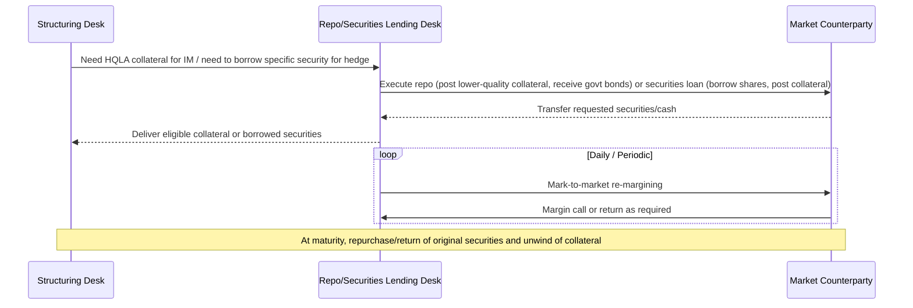

## Repo Securities Lending and Collateral Funding

### Overview

Repurchase agreements (repo), securities lending, and collateral funding markets are the mechanisms through which market participants source, transform, and finance the collateral needed to support derivatives margining, structured product hedging, and general balance sheet funding. While the previous topics addressed *what* collateral must be posted (IM, VM) and *how much* (SIMM, CCP margin models), this topic addresses *where that collateral comes from* and how it is transformed — a function that has become increasingly central to derivatives operations since UMR and central clearing dramatically increased the aggregate demand for high-quality liquid collateral across the market.

### Core Instruments

**Repurchase Agreements (Repo)**

- A repo is economically a collateralized loan structured legally as a sale-and-repurchase: Party A sells securities to Party B for cash, with a simultaneous agreement to repurchase the same (or equivalent) securities at a specified future date for a specified price
- The difference between the sale price and repurchase price represents the **repo rate** — the implicit interest cost of the cash borrowing
- **Reverse repo** is the mirror transaction from the cash lender's perspective (Party B lending cash, receiving securities as collateral)
- Legally documented in most markets under the **Global Master Repurchase Agreement (GMRA)**, a distinct master agreement framework from the ISDA Master Agreement, though sharing conceptually similar close-out netting and default provisions adapted for the repo product
- $$\text{Repurchase Price} = \text{Purchase Price} \times \left(1 + r \times \frac{t}{360}\right)$$

  where $r$ is the repo rate and $t$ is the term in days (day-count convention varies by market)

**Securities Lending**

- A securities loan involves the temporary transfer of securities from a lender to a borrower, typically against collateral (cash or other securities) of greater value than the loaned securities (an **overcollateralization** or "haircut" margin)
- Documented under the **Master Securities Loan Agreement (MSLA)** or, in some markets, the **Global Master Securities Lending Agreement (GMSLA)**
- Common motivations for borrowing: covering short sales, meeting settlement obligations (avoiding fails), and — critically for structured products desks — obtaining specific securities needed to hedge a position (e.g., borrowing shares to hedge a delta-one or convertible arbitrage position, or to cover a short leg required by an exotic derivative's hedging strategy)
- The lender typically earns a lending fee; if cash collateral is used, the lender pays a **rebate rate** to the borrower on the cash collateral (with the lending fee embedded in the spread between the rebate rate and prevailing money market rates)

### Collateral Transformation and Its Role in Derivatives Margining

**Key Points**

- **Collateral transformation** (sometimes called collateral upgrade/downgrade trading) refers to using repo or securities lending markets to convert one type of asset into a different type of eligible collateral — for example, upgrading lower-quality corporate bonds into high-quality government securities eligible for posting as IM under UMR or CCP margin requirements
- This function became substantially more important after UMR and mandatory clearing sharply increased aggregate demand for high-quality liquid assets (HQLA) as eligible margin collateral, while many market participants' natural asset holdings (equities, corporate bonds, less-liquid fixed income) are not always directly eligible or attract punitive haircuts
- A structured products desk holding equity or corporate bond assets on its balance sheet, but needing to post government-bond-quality IM against a bilateral UMR relationship, can use the repo market to borrow eligible government securities against its less-liquid holdings — effectively "renting" better collateral quality for the margin period
- This linkage means repo and securities lending market liquidity and pricing directly affect the practical cost (and in stressed conditions, the feasibility) of meeting margin obligations — a connection made starkly visible during episodes of repo market stress (e.g., the September 2019 US repo rate spike) where collateral scarcity temporarily drove repo rates sharply higher

### Illustrative Collateral Transformation Chain (svg_diagram)

<svg xmlns="http://www.w3.org/2000/svg" viewBox="0 0 760 380" font-family="Helvetica, Arial, sans-serif">
<rect x="0" y="0" width="760" height="380" fill="#ffffff" />
<text x="380" y="26" text-anchor="middle" font-size="15" font-weight="bold" fill="#1a1a1a">Collateral Transformation Chain (svg_diagram)</text>
<rect x="40" y="60" width="200" height="60" rx="6" fill="#dbe9ff" stroke="#2c5aa0" stroke-width="1.5" />
<text x="140" y="85" text-anchor="middle" font-size="12" font-weight="bold" fill="#1a1a1a">Structured Products Desk</text>
<text x="140" y="103" text-anchor="middle" font-size="10" fill="#333">Holds equities / corporate bonds</text>
<rect x="290" y="60" width="200" height="60" rx="6" fill="#fde9c8" stroke="#b8860b" stroke-width="1.5" />
<text x="390" y="85" text-anchor="middle" font-size="12" font-weight="bold" fill="#1a1a1a">Repo Market</text>
<text x="390" y="103" text-anchor="middle" font-size="10" fill="#333">Post lower-quality collateral</text>
<rect x="540" y="60" width="180" height="60" rx="6" fill="#e6f4ea" stroke="#2e7d32" stroke-width="1.5" />
<text x="630" y="85" text-anchor="middle" font-size="12" font-weight="bold" fill="#1a1a1a">Receive Govt. Bonds</text>
<text x="630" y="103" text-anchor="middle" font-size="10" fill="#333">HQLA / IM-eligible</text>
<rect x="290" y="180" width="200" height="60" rx="6" fill="#fbe0e0" stroke="#a33" stroke-width="1.5" />
<text x="390" y="205" text-anchor="middle" font-size="12" font-weight="bold" fill="#1a1a1a">Post Govt. Bonds</text>
<text x="390" y="223" text-anchor="middle" font-size="10" fill="#333">as Initial Margin / VM</text>
<rect x="290" y="290" width="200" height="55" rx="6" fill="#e6d9f0" stroke="#6a3d9a" stroke-width="1.5" />
<text x="390" y="313" text-anchor="middle" font-size="12" font-weight="bold" fill="#1a1a1a">CCP or Bilateral Custodian</text>
<text x="390" y="330" text-anchor="middle" font-size="10" fill="#333">Margin satisfied</text>
<line x1="240" y1="90" x2="290" y2="90" stroke="#555" stroke-width="1.5" marker-end="url(#arrow7)" />
<line x1="490" y1="90" x2="540" y2="90" stroke="#555" stroke-width="1.5" marker-end="url(#arrow7)" />
<line x1="630" y1="120" x2="450" y2="180" stroke="#555" stroke-width="1.5" marker-end="url(#arrow7)" />
<line x1="390" y1="240" x2="390" y2="290" stroke="#555" stroke-width="1.5" marker-end="url(#arrow7)" />
</svg>

### Legal and Documentation Framework

**Key Points**

- **GMRA** (repo): governs close-out netting, margin maintenance, events of default, and substitution of collateral during the term of a repo — the same netting-enforceability legal opinion concerns discussed under "Legal Opinions and Enforceability" apply to GMRA relationships, and ISDA-style jurisdiction netting opinions have GMRA/securities-financing analogues published by relevant industry bodies (e.g., the International Capital Market Association, ICMA, for GMRA)
- **GMSLA/MSLA** (securities lending): governs the mechanics of the loan, collateral margining, corporate action pass-through (manufactured dividends), and recall rights (the lender's right to call back loaned securities, subject to notice periods)
- Both frameworks include **margin maintenance** provisions analogous to VM in derivatives — since the value of both the loaned/sold security and the posted collateral fluctuate over the life of the transaction, periodic re-margining keeps the effective collateralization ratio within agreed bounds
- [Unverified] Specific margin maintenance mechanics, haircut schedules, and standard market documentation terms vary by market, asset class, and counterparty relationship; current market-standard terms should be confirmed against current ICMA/ISLA (International Securities Lending Association) published guidance rather than assumed universal.

### Interaction With Structured Products Hedging

**Example**

A dealer sells a client a total return swap (TRS) referencing a basket of equities. To hedge, the dealer's trading desk buys the underlying equity basket outright. To fund that equity purchase efficiently, the desk may repo out the newly-purchased equities (borrowing cash against them in the repo market) rather than funding the position entirely from the firm's general balance sheet — the repo rate on those specific equities (which can trade "special" if in high demand for shorting or lending, meaning a lower or even negative repo rate reflecting collateral scarcity) directly affects the economics and pricing of the TRS structure itself, since the dealer's funding cost is a direct pricing input.

**Key Points**

- "Specialness" in repo (where a specific security's repo rate trades meaningfully below the general collateral rate due to high demand to borrow that specific security) directly affects funding economics for equity-linked structured products, dividend arbitrage strategies, and convertible bond hedging — desks structuring these products must account for repo specialness risk over the life of the trade, not just at inception
- Securities lending revenue is also a consideration for structured note issuers or funds holding the underlying reference assets — lending out held securities can generate incremental yield that may factor into overall structure economics, subject to the lender's own risk tolerance for counterparty and recall risk

### Repo/Securities Lending Workflow

### Systemic and Operational Considerations

**Key Points**

- Aggregate collateral demand from clearing and UMR has structurally increased reliance on repo and securities lending markets across the industry, making these markets a recognized channel through which stress in one part of the financial system (e.g., a collateral scarcity event) can transmit to derivatives margining capability elsewhere
- Central bank standing repo facilities (introduced or expanded in several major markets following repo market stress episodes) function as a backstop liquidity source, reflecting regulatory recognition of repo market centrality to overall financial system functioning
- Haircuts on repo and securities lending collateral are themselves subject to regulatory guidance (e.g., minimum haircut floors proposed in various post-crisis reform discussions) intended to prevent excessive leverage being built through collateral chains, though [Unverified] the specific current regulatory haircut floor requirements, where applicable, vary by jurisdiction and asset class and should be verified against current rules
- Collateral chains (where the same underlying collateral is re-used/re-hypothecated across multiple transactions) create interconnectedness that regulators monitor for systemic risk purposes, distinct from the non-rehypothecation requirements specifically imposed on segregated bilateral IM under UMR

### Common Pitfalls

- Assuming repo and securities lending markets have unlimited depth and stable pricing — collateral scarcity for specific securities (specialness) or systemic stress (as in September 2019) can cause sharp, hard-to-forecast rate spikes that materially affect funding costs for structured hedging programs
- Confusing GMRA/GMSLA netting and enforceability analysis with ISDA Master Agreement netting opinions — these are legally distinct document frameworks requiring their own jurisdiction-specific enforceability opinions, even though the underlying legal concepts (close-out netting, margining) are conceptually similar
- Overlooking that collateral obtained via repo for IM posting purposes is itself subject to re-margining and potential recall/substitution requirements over the life of the derivatives relationship it supports, adding an additional layer of operational and rollover risk
- Treating securities lending revenue as a stable, unconditional yield enhancement without accounting for recall risk, counterparty credit risk on posted collateral, and reinvestment risk if cash collateral is received and reinvested

### Related Topics

- Uncleared Margin Rules and third-party custodial segregation of eligible collateral
- The ISDA Standard Initial Margin Model and eligible collateral/haircut schedules
- Central Counterparties and clearing mechanics (CCP collateral eligibility)
- Global Master Repurchase Agreement (GMRA) documentation and netting opinions
- Global Master Securities Lending Agreement (GMSLA) and Master Securities Loan Agreement (MSLA)
- Legal opinions and enforceability of securities financing master agreements
- Repo market stress episodes and central bank standing repo facilities
- Funding Valuation Adjustment (FVA) and its relationship to collateral funding costs