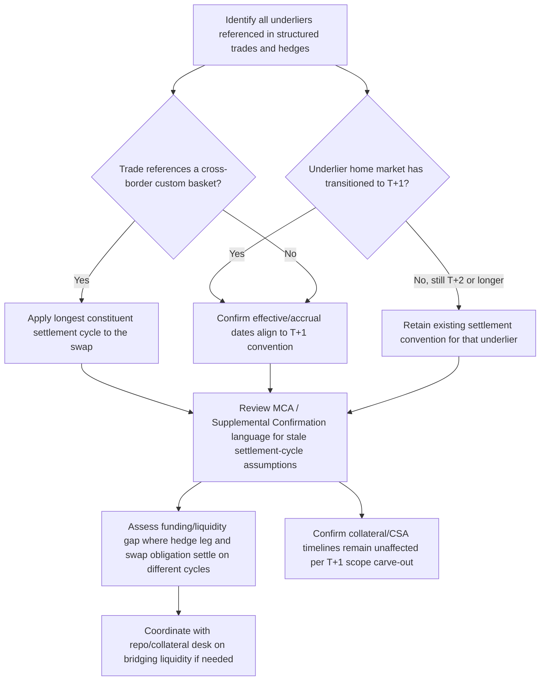

## Evolving Settlement Cycles and Continuous Trading

### Overview

Settlement cycle compression — the industry-wide shift from T+2 (trade date plus two business days) to T+1 (trade date plus one business day) and, in discussion for some markets, toward even shorter or continuous/atomic settlement — is a structural market infrastructure change with direct consequences for derivatives documentation, margining, and structured product hedging. Because equity derivatives, structured notes, and swap hedges are priced and settled with reference to the settlement conventions of their underlying securities, a change in the underlying cash-market settlement cycle propagates directly into the mechanics, timing, and cost structure of the derivatives built on top of those markets.

### The T+1 Transition: Timeline and Scope

**Key Points**

- The SEC proposed reducing the US settlement cycle from T+2 to T+1 in February 2022, and confirmed the transition would take effect by May 28, 2024. T+1 went live for the United States on May 28, 2024, and for Canada and Mexico on May 27, 2024. [SS&C Technologies](https://www.ssctech.com/blog/otc-derivatives-moving-to-t1-settlement-cycle)[SS&C Technologies](https://www.ssctech.com/blog/otc-derivatives-moving-to-t1-settlement-cycle)
- The principal regulatory goal was to reduce credit, market, and liquidity risk arising from unsettled securities trades, shrinking the window during which counterparties are exposed to unsettled-trade risk and price movement in the underlying securities. [White & Case LLP](https://www.whitecase.com/insight-alert/t1-settlement-cycle-take-effect-may-28-2024)
- The amended SEC rule directly applies to registered broker-dealers and investment advisers, generally prohibiting broker-dealers from entering into contracts for the purchase or sale of securities that provide for settlement later than T+1, unless the parties expressly agree otherwise. [J.P. Morgan](https://www.jpmorgan.com/insights/securities-services/regulatory-solutions/us-t-plus-1securities-services-markets-faq)
- Other jurisdictions are following on their own timelines rather than in immediate lockstep with North America: the UK's Accelerated Settlement Taskforce set a pre-settlement activity deadline of December 31, 2026, with a full T+1 transition date of October 11, 2027, and the EU's T+1 Industry Committee published its high-level implementation report in mid-2025. The European Commission's February 2025 legislative proposal likewise set 11 October 2027 as the EU's T+1 transition date, aligned with ESMA's November 2024 recommendation, and Switzerland and Liechtenstein are targeting the same October 2027 date to stay aligned with the EU and UK. [Bank of America](https://business.bofa.com/en-us/content/preparing-for-t1-settlement.html)[sec](https://www.sec.gov/Archives/edgar/data/0001114446/000161052025000027/ubs-20241231.htm)
- This creates a **multi-year period of cross-jurisdictional settlement misalignment**: US/Canada/Mexico on T+1 since 2024, most of Europe and the UK not transitioning until October 2027, and other markets globally on their own separate timelines — a structural complexity for any derivatives book referencing cross-border baskets or multi-market underliers.

### Direct Impact on OTC Derivatives

**Key Points**

- The T+1 transition affects OTC derivatives products including variance/volatility swaps, OTC options, and basket swaps, since these products are structured to align with the payment and settlement schedules of their underlying securities. [SS&C Technologies](https://www.ssctech.com/blog/otc-derivatives-moving-to-t1-settlement-cycle)
- For an equity swap entered into after the transition, the effective date and accrual start date shift to T+1, reflecting the new settlement convention of the underlying securities. [SS&C Technologies](https://www.ssctech.com/blog/otc-derivatives-moving-to-t1-settlement-cycle)
- For custom baskets containing securities from multiple markets with different settlement cycles (e.g., a US name settling T+1 alongside a non-US/non-Canada/non-Mexico name still settling T+2 or longer), standard market practice applies the longest settlement cycle among the basket's constituents to the swap as a whole — meaning a single non-T+1 name in an otherwise US basket can force the entire swap's settlement convention to remain at T+2 or longer. [J.P. Morgan](https://www.jpmorgan.com/insights/securities-services/regulatory-solutions/us-t-plus-1securities-services-markets-faq)
- Underliers traded outside the markets that moved to T+1 (US, Canada, Mexico) are not affected by the T+1 change, even where the swap referencing them is denominated or financed in USD — meaning currency of denomination does not determine which settlement convention applies; the underlying security's home market does. [J.P. Morgan](https://www.jpmorgan.com/insights/securities-services/regulatory-solutions/us-t-plus-1securities-services-markets-faq)
- Collateral pledges are explicitly out of scope for the T+1 accelerated settlement changes — collateral delivery and return periods, and existing timings for release of excess collateral and substitutions, are unaffected by the T+1 transition. This is a meaningful clarification for derivatives operations teams: margin/CSA mechanics under UMR and CCP frameworks (covered in the preceding topics) run on their own contractually defined timelines independent of the underlying cash-securities settlement cycle change. [Bank of America](https://business.bofa.com/en-us/content/preparing-for-t1-settlement.html)

### Illustrative Cross-Market Settlement Misalignment (svg_diagram)

<svg xmlns="http://www.w3.org/2000/svg" viewBox="0 0 760 380" font-family="Helvetica, Arial, sans-serif">
<rect x="0" y="0" width="760" height="380" fill="#ffffff" />
<text x="380" y="26" text-anchor="middle" font-size="15" font-weight="bold" fill="#1a1a1a">Cross-Market Settlement Timeline (svg_diagram)</text>
<rect x="40" y="60" width="300" height="55" rx="6" fill="#e6f4ea" stroke="#2e7d32" stroke-width="1.5" />
<text x="190" y="82" text-anchor="middle" font-size="12" font-weight="bold" fill="#1a1a1a">US / Canada / Mexico</text>
<text x="190" y="100" text-anchor="middle" font-size="10" fill="#333">T+1 since May 2024</text>
<rect x="420" y="60" width="300" height="55" rx="6" fill="#fde9c8" stroke="#b8860b" stroke-width="1.5" />
<text x="570" y="82" text-anchor="middle" font-size="12" font-weight="bold" fill="#1a1a1a">EU / UK / Switzerland</text>
<text x="570" y="100" text-anchor="middle" font-size="10" fill="#333">T+2 until October 2027</text>
<rect x="150" y="170" width="460" height="70" rx="6" fill="#fbe0e0" stroke="#a33" stroke-width="1.5" />
<text x="380" y="196" text-anchor="middle" font-size="12" font-weight="bold" fill="#1a1a1a">Cross-Border Custom Basket Swap</text>
<text x="380" y="214" text-anchor="middle" font-size="10" fill="#333">Contains both US (T+1) and EU (T+2) names</text>
<text x="380" y="230" text-anchor="middle" font-size="10" fill="#333">Swap settlement = longest constituent cycle (T+2)</text>
<rect x="200" y="280" width="360" height="55" rx="6" fill="#e6d9f0" stroke="#6a3d9a" stroke-width="1.5" />
<text x="380" y="303" text-anchor="middle" font-size="12" font-weight="bold" fill="#1a1a1a">Collateral / Margin Timelines</text>
<text x="380" y="321" text-anchor="middle" font-size="10" fill="#333">Unaffected — governed by CSA, not cash settlement cycle</text>
<line x1="190" y1="115" x2="300" y2="170" stroke="#555" stroke-width="1.5" marker-end="url(#arrow8)" />
<line x1="570" y1="115" x2="460" y2="170" stroke="#555" stroke-width="1.5" marker-end="url(#arrow8)" />
<line x1="380" y1="240" x2="380" y2="280" stroke="#999" stroke-width="1.5" stroke-dasharray="4,3" />
</svg>

### Operational and Liquidity Implications

**Key Points**

- Funds and firms with significant holdings in securities that remain outside the T+1 regime face potential operational and settlement risk, including the need to maintain more cash and liquid securities to bridge the mismatch — creating cash drag on portfolios — and potential increases in custodial overdraft charges to facilitate settlement of redemptions or other obligations on a T+1 basis while underlying assets settle later. [sec](https://www.sec.gov/Archives/edgar/data/822977/000119312525166458/d939538d485bpos.htm)
- This liquidity/funding friction is directly relevant to structured products desks that hedge with cross-border baskets: a hedge leg settling T+1 against a note or swap obligation still running on a T+2 convention (or vice versa) creates a funding gap that must be bridged with short-term liquidity, adding a cost that interacts with the collateral funding and repo/securities lending considerations discussed in the previous topic
- FX settlement timing considerations arise where a derivatives hedge or structured note involves non-USD underliers or cross-currency settlement — the T+1 compression narrows the window available to execute and settle related FX transactions, a specific area the industry T+1 guidance addressed for market participants managing multi-currency hedging programs
- The **Vencure/allocation, confirmation, and affirmation (ACA) process** — the operational chain by which asset managers allocate trades to underlying funds and confirm/affirm them with counterparties before settlement — faces materially compressed timelines under T+1, since same-day (rather than next-day) affirmation becomes operationally necessary in many cases

### Documentation and Confirmation Impact for Structured Trades

**Key Points**

- Master Confirmation Agreements and Supplemental Confirmations (see "Master Confirmation Agreements for Structured Trades") referencing standard settlement conventions by market must be reviewed and, where necessary, amended to reflect the correct settlement cycle for each underlier's home market — particularly important for MCA templates drafted before a given market's T+1 transition, which may contain stale settlement-cycle assumptions
- Trade confirmation timing itself is compressed: less time exists between execution and required settlement to identify and resolve confirmation discrepancies, increasing the operational premium on straight-through processing and automated confirmation matching for structured trades with bespoke, manually-negotiated terms
- Legacy MCAs and ISDA definitional booklet references that hardcode settlement-cycle assumptions (e.g., referencing "the second Business Day following" as a fixed convention) require amendment protocols to transition cleanly — ISDA, alongside SIFMA and CCMA, published market-wide guidance and a booklet specifically addressing these OTC derivatives documentation impacts ahead of the May 2024 US transition

### Continuous / Atomic Settlement: The Longer-Term Direction

**Key Points**

- Beyond T+1, industry and technology discussions (including distributed-ledger-based settlement pilots) have explored **T+0 (same-day)** and **atomic settlement** (simultaneous, instantaneous delivery-versus-payment using DLT/blockchain rails) as a longer-term direction for securities and, eventually, derivatives-related settlement
- [Inference] Full continuous or atomic settlement for OTC derivatives specifically remains considerably further off than for cash equities, given the added complexity of margining, netting, and the bespoke bilateral nature of many structured trades relative to standardized cash securities; the search results available for this topic focus specifically on the T+1 cash-securities transition rather than confirming a settled industry timeline for derivatives-specific atomic settlement, so this forward-looking characterization should be treated as a reasoned inference rather than a confirmed roadmap.
- [Unverified] Specific pilot programs, DLT settlement infrastructure providers, and any formal regulatory timeline for continuous/atomic settlement of derivatives specifically were not confirmed in the sources reviewed for this topic; practitioners should consult current ISDA, DTCC, and relevant central bank publications for the latest developments in this area, since this is an actively evolving domain.

### Settlement Cycle Transition Workflow for a Structured Products Desk

### Common Pitfalls

- Assuming T+1 applies uniformly across all markets and all instrument types — the settlement cycle change applies specifically to securities traded in the impacted markets (US, Canada, Mexico), and underliers traded elsewhere are unaffected regardless of the currency in which a related swap is financed. [J.P. Morgan](https://www.jpmorgan.com/insights/securities-services/regulatory-solutions/us-t-plus-1securities-services-markets-faq)
- Overlooking that collateral/margin posting timelines under CSAs and CCP rules are explicitly unaffected by the T+1 transition — collateral delivery, return periods, and substitution timings remain governed by existing CSA/margin mechanics, not the accelerated cash-securities settlement cycle. [Bank of America](https://business.bofa.com/en-us/content/preparing-for-t1-settlement.html)
- Failing to update legacy MCA and confirmation templates that hardcode settlement-cycle assumptions tied to the prior T+2 convention for now-T+1 markets
- Underestimating cross-jurisdictional misalignment risk during the multi-year period (2024 through at least 2027 for the EU/UK) where different major markets operate on different settlement cycles simultaneously, particularly for globally diversified custom baskets

### Related Topics

- Master Confirmation Agreements for Structured Trades (settlement convention drafting)
- Central Counterparties and clearing mechanics (unaffected margin/collateral timelines)
- Repo, Securities Lending, and Collateral Funding (bridging settlement-cycle funding gaps)
- Uncleared Margin Rules and CSA-defined collateral timelines
- FX settlement conventions and their interaction with equity/derivatives settlement compression
- DLT-based atomic settlement pilots and their potential future application to derivatives
- Allocation, confirmation, and affirmation (ACA) process compression under T+1
- Global settlement cycle harmonization efforts (EU, UK, Switzerland 2027 T+1 transition)