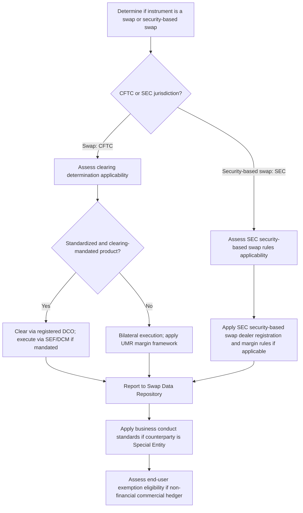

## Dodd Frank Title VII Derivatives Provisions

### Overview

Title VII of the Dodd-Frank Wall Street Reform and Consumer Protection Act (2010) is the primary US statutory framework regulating the over-the-counter derivatives market following the 2008 financial crisis. It implements the G20's Pittsburgh Summit commitments domestically, establishing mandatory clearing, trade execution, margin, and reporting requirements for swaps, and creating new categories of regulated market participants (swap dealers, major swap participants) subject to registration, capital, and business conduct obligations. Title VII divides regulatory jurisdiction between the Commodity Futures Trading Commission (CFTC), which regulates "swaps," and the Securities and Exchange Commission (SEC), which regulates "security-based swaps" — a jurisdictional split that has significant practical consequences for how different derivatives products are documented and regulated.

### Jurisdictional Split: CFTC vs. SEC

**Key Points**

- **Swaps** (CFTC jurisdiction): interest rate swaps, most commodity derivatives, broad-based index credit default swaps, broad-based equity index swaps, and most FX derivatives
- **Security-based swaps** (SEC jurisdiction): single-name credit default swaps, narrow-based security index swaps, and equity swaps referencing individual securities or narrow-based indices
- **Mixed swaps**: instruments with characteristics of both categories, subject to joint CFTC-SEC regulation in specified circumstances
- This split has direct consequences for structured products desks: an equity derivative referencing a single stock or a narrow basket falls under SEC security-based swap rules, while a broad-based equity index derivative falls under CFTC swap rules — meaning economically similar structured payoffs can face different registration, margin, and reporting regimes purely based on how the reference index is constructed
- [Inference] This jurisdictional distinction is a recognized structuring consideration when designing basket or index-linked structured products, since basket composition (broad-based vs. narrow-based) can determine which regulator's rules and registration requirements apply; the specific "narrow-based" index test thresholds are defined in CFTC/SEC joint rulemaking and should be verified against current rule text for any specific basket design rather than assumed from general description.

### Core Regulatory Pillars Under Title VII

**Mandatory Clearing**

- Requires standardized swaps (as determined through CFTC/SEC clearing determinations) to be cleared through a registered Derivatives Clearing Organization (DCO) or clearing agency — the US implementation of the central clearing mandate covered under "Central Counterparties and Clearing Mechanics"
- Clearing determinations are made product-by-product based on standardization and liquidity criteria, with certain end-user exemptions available for non-financial entities hedging commercial risk

**Trade Execution Requirements**

- Swaps subject to the clearing mandate and made available to trade must generally be executed on a registered **Swap Execution Facility (SEF)** or Designated Contract Market (DCM), rather than purely bilaterally — introducing a transparency and competitive-execution requirement for the most standardized, liquid swap products
- SEFs must provide impartial access and pre-trade price transparency (e.g., through order books or request-for-quote systems), a structural change from the historically opaque bilateral OTC market

**Margin Requirements**

- Implements the Uncleared Margin Rules (UMR) framework for non-centrally cleared swaps within US jurisdiction, requiring exchange of Initial and Variation Margin between covered swap entities — covered in depth under "Uncleared Margin Rules" and "Initial and Variation Margin Requirements"
- Prudentially regulated swap dealers (banks) are subject to margin rules set by their prudential regulators (Federal Reserve, OCC, FDIC, etc.), while non-bank swap dealers are subject to CFTC margin rules — another jurisdictional split relevant to documentation and compliance

**Trade Reporting**

- Requires swap data to be reported to registered **Swap Data Repositories (SDRs)** — the US implementation of the trade repository framework covered under "Trade Repositories and Reporting Obligations"
- CFTC's swap data reporting rules have undergone a substantial "rewrite" to expand reportable field granularity and improve data quality, reflecting the CFTC's finding that early-generation reporting data had gaps limiting its systemic risk-monitoring value

### Registered Entity Categories

**Swap Dealers (SDs)**

- Entities that hold themselves out as dealers in swaps, regularly enter into swaps as an ordinary course of business for their own account, or engage in activity causing them to be commonly known as a dealer or market maker in swaps
- Registration triggers a comprehensive regulatory regime: capital requirements, margin requirements, business conduct standards, recordkeeping, and reporting obligations
- A de minimis threshold exists below which an entity's swap dealing activity does not trigger mandatory SD registration, though this threshold has been the subject of periodic regulatory review and adjustment

**Major Swap Participants (MSPs)**

- A category for entities with substantial swap positions creating major counterparty exposure, even if they do not deal in swaps as a business — intended to capture systemically significant swap users who are not dealers
- [Unverified] In practice, very few entities have registered as MSPs relative to the number of registered swap dealers, reflecting the way most large derivatives users' activity has been structured or has fallen below relevant thresholds; current registrant counts and threshold specifics should be verified against current CFTC registrant data rather than assumed from general description.

**Security-Based Swap Dealers and Major Security-Based Swap Participants**

- The SEC-jurisdiction analogues to swap dealers and MSPs, subject to a parallel but separately promulgated registration and regulatory regime under SEC rules

### Illustrative Title VII Regulatory Architecture (svg_diagram)

<svg xmlns="http://www.w3.org/2000/svg" viewBox="0 0 760 460" font-family="Helvetica, Arial, sans-serif">
<rect x="0" y="0" width="760" height="460" fill="#ffffff" />
<text x="380" y="26" text-anchor="middle" font-size="15" font-weight="bold" fill="#1a1a1a">Dodd-Frank Title VII Architecture (svg_diagram)</text>
<rect x="220" y="45" width="320" height="45" rx="6" fill="#dbe9ff" stroke="#2c5aa0" stroke-width="1.5" />
<text x="380" y="72" text-anchor="middle" font-size="12" font-weight="bold" fill="#1a1a1a">Dodd-Frank Title VII</text>
<rect x="60" y="115" width="300" height="55" rx="6" fill="#fde9c8" stroke="#b8860b" stroke-width="1.5" />
<text x="210" y="138" text-anchor="middle" font-size="12" font-weight="bold" fill="#1a1a1a">CFTC Jurisdiction</text>
<text x="210" y="156" text-anchor="middle" font-size="10" fill="#333">Swaps: IRS, broad-based index, most FX/commodity</text>
<rect x="400" y="115" width="300" height="55" rx="6" fill="#fbe0e0" stroke="#a33" stroke-width="1.5" />
<text x="550" y="138" text-anchor="middle" font-size="12" font-weight="bold" fill="#1a1a1a">SEC Jurisdiction</text>
<text x="550" y="156" text-anchor="middle" font-size="10" fill="#333">Security-based swaps: single-name CDS, narrow index</text>
<rect x="40" y="205" width="150" height="55" rx="6" fill="#e6f4ea" stroke="#2e7d32" stroke-width="1.5" />
<text x="115" y="228" text-anchor="middle" font-size="11" font-weight="bold" fill="#1a1a1a">Mandatory Clearing</text>
<text x="115" y="245" text-anchor="middle" font-size="10" fill="#333">via registered DCO</text>
<rect x="210" y="205" width="150" height="55" rx="6" fill="#e6f4ea" stroke="#2e7d32" stroke-width="1.5" />
<text x="285" y="228" text-anchor="middle" font-size="11" font-weight="bold" fill="#1a1a1a">Trade Execution</text>
<text x="285" y="245" text-anchor="middle" font-size="10" fill="#333">SEF / DCM</text>
<rect x="380" y="205" width="150" height="55" rx="6" fill="#e6f4ea" stroke="#2e7d32" stroke-width="1.5" />
<text x="455" y="228" text-anchor="middle" font-size="11" font-weight="bold" fill="#1a1a1a">Margin Rules</text>
<text x="455" y="245" text-anchor="middle" font-size="10" fill="#333">Cleared + Uncleared (UMR)</text>
<rect x="550" y="205" width="150" height="55" rx="6" fill="#e6f4ea" stroke="#2e7d32" stroke-width="1.5" />
<text x="625" y="228" text-anchor="middle" font-size="11" font-weight="bold" fill="#1a1a1a">Trade Reporting</text>
<text x="625" y="245" text-anchor="middle" font-size="10" fill="#333">Swap Data Repository (SDR)</text>
<rect x="150" y="295" width="200" height="55" rx="6" fill="#e6d9f0" stroke="#6a3d9a" stroke-width="1.5" />
<text x="250" y="318" text-anchor="middle" font-size="11" font-weight="bold" fill="#1a1a1a">Swap Dealer (SD)</text>
<text x="250" y="335" text-anchor="middle" font-size="10" fill="#333">Registration + capital + conduct</text>
<rect x="400" y="295" width="200" height="55" rx="6" fill="#e6d9f0" stroke="#6a3d9a" stroke-width="1.5" />
<text x="500" y="318" text-anchor="middle" font-size="11" font-weight="bold" fill="#1a1a1a">Major Swap Participant</text>
<text x="500" y="335" text-anchor="middle" font-size="10" fill="#333">Large exposure, non-dealer</text>
<rect x="230" y="385" width="300" height="50" rx="6" fill="#eee" stroke="#666" stroke-width="1.5" />
<text x="380" y="414" text-anchor="middle" font-size="11" font-weight="bold" fill="#1a1a1a">Business Conduct Standards + Recordkeeping</text>
<line x1="380" y1="90" x2="210" y2="115" stroke="#555" stroke-width="1.5" marker-end="url(#arrow9)" />
<line x1="380" y1="90" x2="550" y2="115" stroke="#555" stroke-width="1.5" marker-end="url(#arrow9)" />
<line x1="150" y1="170" x2="115" y2="205" stroke="#555" stroke-width="1.5" marker-end="url(#arrow9)" />
<line x1="200" y1="170" x2="285" y2="205" stroke="#555" stroke-width="1.5" marker-end="url(#arrow9)" />
<line x1="300" y1="170" x2="455" y2="205" stroke="#555" stroke-width="1.5" marker-end="url(#arrow9)" />
<line x1="500" y1="170" x2="625" y2="205" stroke="#555" stroke-width="1.5" marker-end="url(#arrow9)" />
<line x1="285" y1="260" x2="250" y2="295" stroke="#555" stroke-width="1.5" marker-end="url(#arrow9)" />
<line x1="455" y1="260" x2="500" y2="295" stroke="#555" stroke-width="1.5" marker-end="url(#arrow9)" />
<line x1="250" y1="350" x2="330" y2="385" stroke="#555" stroke-width="1.5" marker-end="url(#arrow9)" />
<line x1="500" y1="350" x2="430" y2="385" stroke="#555" stroke-width="1.5" marker-end="url(#arrow9)" />
</svg>

### Business Conduct Standards

**Key Points**

- Title VII imposes external and internal business conduct standards on registered swap dealers, including: fair dealing requirements, disclosure obligations regarding material risks and characteristics of a swap, suitability-related communications with certain counterparty categories (notably "Special Entities" — municipalities, pension plans, endowments), and prohibitions on fraud and manipulation
- These standards are particularly relevant to structured products desks distributing complex swap-based structures to Special Entities, since heightened disclosure and, in some contexts, a duty to act in the Special Entity's best interest when acting as an advisor apply — echoing the suitability concerns discussed in the "Dispute Resolution in Derivatives Contracts" material regarding structured product mis-selling risk
- Recordkeeping requirements mandate that swap dealers maintain detailed records of communications, trade data, and business conduct compliance, supporting both regulatory examination and, in the event of a dispute, evidentiary reconstruction of the transaction's negotiation and disclosure history

### End-User Exemptions

**Key Points**

- Non-financial entities using swaps to hedge or mitigate commercial risk can qualify for an exemption from the mandatory clearing requirement (though generally not from reporting requirements), reflecting a policy choice to avoid imposing full clearing infrastructure burden on genuine commercial hedgers (e.g., an airline hedging jet fuel costs, a manufacturer hedging FX exposure on foreign sales)
- This exemption interacts with structured products distribution: a corporate end-user entering into a bespoke hedging swap tied to a structured note or financing arrangement may rely on the end-user exemption for clearing purposes while still being subject to reporting and, depending on structure, margin requirements
- [Unverified] The precise qualifying conditions for the end-user clearing exemption (including notification and reporting requirements to satisfy the exemption) are defined in CFTC rules and should be confirmed against current rule text for any specific end-user's qualification analysis, since exemption criteria and related interpretive guidance have been subject to periodic regulatory clarification.

### Interaction With Structured Products Documentation

- **MCA and confirmation drafting**: swap dealer status triggers specific business conduct and disclosure requirements that must be reflected in Master Confirmation Agreements and trade confirmations distributed to counterparties, particularly Special Entities
- **Clearing eligibility drives product design**: since only standardized swaps are subject to mandatory clearing, structuring desks deliberately design bespoke, non-standardized structured payoffs (autocallables, exotic barriers) that fall into the bilateral, UMR-governed segment rather than the cleared segment — a direct link between Title VII's clearing determination framework and the persistence of a large bilateral structured products market
- **Cross-border application**: Title VII's extraterritorial reach provisions (governing when non-US persons transacting with US persons, or non-US swap dealers with sufficient US nexus, become subject to Title VII requirements) are a recurring consideration for global structured products desks executing hedges with non-US counterparties or through non-US booking entities

### Title VII Compliance Workflow

### Common Pitfalls

- Assuming a single unified "derivatives regulator" governs all US swap activity — the CFTC/SEC jurisdictional split based on swap vs. security-based swap classification creates materially different registration, margin, and execution requirements for economically similar products
- Overlooking that clearing-ineligible, bespoke structured products are not thereby exempt from Title VII entirely — reporting, and generally margin (via UMR), requirements still apply even to trades outside the mandatory clearing and trade execution regime
- Failing to apply enhanced business conduct and disclosure standards when distributing structured swaps to Special Entities (municipalities, pension plans, endowments), which carry heightened regulatory scrutiny
- Misjudging extraterritorial application of Title VII requirements for cross-border structured hedging programs involving non-US booking entities or counterparties

[Unverified] Specific current de minimis thresholds for swap dealer registration, clearing determination product lists, and end-user exemption qualifying conditions are subject to ongoing CFTC and SEC rulemaking and interpretive guidance; current compliance obligations should be verified against the applicable current rule text rather than treated as fixed.

### Related Topics

- Central Counterparties and clearing mechanics (US DCO implementation)
- Uncleared Margin Rules and Initial/Variation Margin Requirements (US prudential and CFTC margin rules)
- Trade Repositories and Reporting Obligations (Swap Data Repository framework)
- Dispute Resolution in Derivatives Contracts (Special Entity suitability and disclosure standards)
- EMIR as the EU parallel framework to Dodd-Frank Title VII
- Swap Execution Facility (SEF) and Designated Contract Market (DCM) trade execution rules
- Extraterritorial application of US derivatives regulation to cross-border structured hedging
- CFTC swap data reporting "rewrite" rules and data quality initiatives