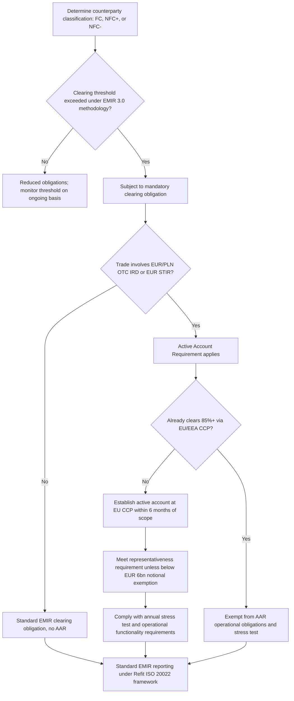

## The European Market Infrastructure Regulation

### Overview

The European Market Infrastructure Regulation (EMIR) is the EU's foundational legislative framework for OTC derivatives, implementing the G20's post-2008 reform commitments in parallel with (and broadly analogous to) Dodd-Frank Title VII in the US. EMIR establishes mandatory clearing, risk mitigation (margin) requirements for uncleared trades, trade reporting to trade repositories, and a supervisory regime for CCPs operating in or serving the EU. It has been amended substantially since its original 2012 adoption — most significantly through **EMIR Refit** (reporting simplification, effective April 2024) and, most recently, **EMIR 3.0** (Regulation (EU) 2024/2987), which introduced the Active Account Requirement (AAR) as a strategic response to EU reliance on non-EU CCPs for euro-denominated clearing.

### Core Pillars of EMIR

**Key Points**

- **Mandatory clearing**: standardized OTC derivatives meeting EU clearing determination criteria must be cleared through an authorized CCP, paralleling the CCP mechanics covered under "Central Counterparties and Clearing Mechanics"
- **Risk mitigation techniques for uncleared trades**: EMIR's bilateral margin requirements (IM and VM) implement the EU leg of the global UMR framework discussed under "Uncleared Margin Rules," alongside other risk mitigation obligations such as timely confirmation, portfolio reconciliation, and portfolio compression
- **Trade reporting**: all derivatives (cleared and uncleared) must be reported to a registered EU Trade Repository, implementing the reporting pillar discussed under "Trade Repositories and Reporting Obligations" — EMIR Refit substantially overhauled this reporting framework, moving to a 203-field ISO 20022-based reporting standard effective April 2024, distinct from and preceding the EMIR 3.0 clearing-focused reforms
- **CCP authorization and supervision**: EMIR establishes the framework under which CCPs (both EU-based and, via the separate third-country CCP recognition regime, non-EU CCPs serving EU clients) are authorized and supervised, with the European Securities and Markets Authority (ESMA) playing a central coordinating supervisory role

### Counterparty Classification Under EMIR

**Key Points**

- **Financial Counterparties (FCs)**: credit institutions, investment firms, insurance companies, pension funds, UCITS funds, Alternative Investment Funds (AIFs), and clearing members — subject to the full EMIR obligations once relevant clearing thresholds are exceeded
- **Non-Financial Counterparties (NFCs)**: corporates and other entities, further split into **NFC+** (exceeding the clearing threshold, subject to mandatory clearing and margin requirements) and **NFC-** (below threshold, benefiting from reduced obligations, reflecting the commercial-hedging end-user exemption philosophy analogous to the Dodd-Frank end-user exemption)
- EMIR 3.0 revised the clearing threshold calculation methodology itself, meaning entities should reassess their FC/NFC+ status against the updated calculation logic rather than assuming continuity with pre-EMIR 3.0 threshold determinations

### EMIR 3.0 and the Active Account Requirement (AAR)

**Key Points**

- EMIR 3.0 (Regulation (EU) 2024/2987) entered into force on 24 December 2024, with its central feature — the Active Account Requirement — designed to reduce EU market participants' systemic reliance on non-EU CCPs, particularly for euro-denominated clearing that has been heavily concentrated at LCH in London following Brexit, a concentration EU regulators and the ECB identified as a financial stability concern given the scale of the euro derivatives market cleared outside the EU.
- The AAR requires in-scope EU counterparties subject to EMIR's clearing obligation, and exceeding the relevant clearing threshold, to establish and operationalize an **active account** at an authorized EU CCP (principally Eurex Clearing and other EU-based CCPs) for specified systemically relevant product categories: OTC interest rate derivatives (IRD) denominated in EUR or PLN, and short-term interest rate derivatives (STIR) denominated in EUR.
- Counterparties already in scope as of EMIR 3.0's entry into force were required to establish and operationalize their active account within six months — by 25 June 2025 — and this applicability date, rather than the regulation's entry-into-force date, anchors the subsequent compliance deadlines.
- Beyond simply opening the account, in-scope counterparties face a **representativeness requirement** — an obligation to clear a representative number of trades within the AAR product categories through that EU active account, not merely maintain a dormant account — with entities holding less than €6 billion in aggregate outstanding notional across the relevant categories exempted from the representativeness obligation specifically (though still required to open an account if otherwise in scope).
- Counterparties that already clear at least 85% of their in-scope derivative contracts through an EU/EEA CCP are exempt from certain operational obligations and the associated annual stress-testing requirement, recognizing that firms already substantially EU-concentrated face limited incremental systemic-risk benefit from further requirements.
- Operational conditions require ensuring permanent functionality of the active account (including capacity to significantly scale up clearing volume) and undergoing at least an annual stress test to confirm the account can absorb a substantial increase in clearing activity if EU regulators or market conditions required rapid migration away from non-EU CCPs.
- Regulatory Technical Standards (RTS) implementing the detailed operational conditions, representativeness methodology, and reporting templates were developed through ESMA consultation (closing 27 January 2025) and ESMA's Final Report (published 19 June 2025), with the RTS effective 26 February 2026 and ESMA's reporting templates and instructions released 13 April 2026 — reflecting a phased, multi-year technical implementation even though the core AAR obligation applied from mid-2025.
- The AAR carries its own dedicated compliance reporting stream (under Article 7b), separate from standard EMIR trade reporting and the annual clearing-threshold notification, running on a six-month reporting cycle.

[Unverified] Given the still-developing implementation timeline (RTS effective February 2026, reporting templates issued April 2026), specific operational details, thresholds, and reporting mechanics of the AAR may continue to be refined by ESMA and the European Commission; current compliance obligations should be verified against the latest ESMA publications and Commission implementing measures rather than treated as final and static.

### Illustrative EMIR 3.0 Active Account Structure (svg_diagram)

<svg xmlns="http://www.w3.org/2000/svg" viewBox="0 0 760 420" font-family="Helvetica, Arial, sans-serif">
<rect x="0" y="0" width="760" height="420" fill="#ffffff" />
<text x="380" y="26" text-anchor="middle" font-size="15" font-weight="bold" fill="#1a1a1a">EMIR 3.0 Active Account Requirement (svg_diagram)</text>
<rect x="240" y="45" width="280" height="50" rx="6" fill="#dbe9ff" stroke="#2c5aa0" stroke-width="1.5" />
<text x="380" y="75" text-anchor="middle" font-size="12" font-weight="bold" fill="#1a1a1a">EU In-Scope Counterparty</text>
<rect x="60" y="130" width="280" height="65" rx="6" fill="#fde9c8" stroke="#b8860b" stroke-width="1.5" />
<text x="200" y="153" text-anchor="middle" font-size="12" font-weight="bold" fill="#1a1a1a">Non-EU CCP</text>
<text x="200" y="171" text-anchor="middle" font-size="10" fill="#333">e.g., LCH London</text>
<text x="200" y="187" text-anchor="middle" font-size="10" fill="#333">Bulk of existing EUR clearing</text>
<rect x="420" y="130" width="280" height="65" rx="6" fill="#e6f4ea" stroke="#2e7d32" stroke-width="1.5" />
<text x="560" y="153" text-anchor="middle" font-size="12" font-weight="bold" fill="#1a1a1a">EU Active Account</text>
<text x="560" y="171" text-anchor="middle" font-size="10" fill="#333">e.g., Eurex Clearing</text>
<text x="560" y="187" text-anchor="middle" font-size="10" fill="#333">Representative volume required</text>
<rect x="150" y="230" width="460" height="55" rx="6" fill="#fbe0e0" stroke="#a33" stroke-width="1.5" />
<text x="380" y="252" text-anchor="middle" font-size="12" font-weight="bold" fill="#1a1a1a">AAR Product Scope</text>
<text x="380" y="270" text-anchor="middle" font-size="10" fill="#333">EUR/PLN OTC IRD, EUR STIR</text>
<rect x="150" y="315" width="460" height="65" rx="6" fill="#e6d9f0" stroke="#6a3d9a" stroke-width="1.5" />
<text x="380" y="338" text-anchor="middle" font-size="12" font-weight="bold" fill="#1a1a1a">Operational Requirements</text>
<text x="380" y="356" text-anchor="middle" font-size="10" fill="#333">Permanent functionality, annual stress test</text>
<text x="380" y="372" text-anchor="middle" font-size="10" fill="#333">(unless ≥85% already EU-cleared)</text>
<line x1="380" y1="95" x2="200" y2="130" stroke="#555" stroke-width="1.5" marker-end="url(#arrow10)" />
<line x1="380" y1="95" x2="560" y2="130" stroke="#555" stroke-width="1.5" marker-end="url(#arrow10)" />
<line x1="380" y1="195" x2="380" y2="230" stroke="#555" stroke-width="1.5" marker-end="url(#arrow10)" />
<line x1="380" y1="285" x2="380" y2="315" stroke="#555" stroke-width="1.5" marker-end="url(#arrow10)" />
</svg>

### EMIR Refit and Reporting Reform

**Key Points**

- EMIR Refit is distinct from, and predates, EMIR 3.0 — it focused specifically on harmonizing and simplifying the derivatives trade reporting framework, introducing a 203-field ISO 20022-based reporting standard that became effective in April 2024
- This reporting overhaul aligns with the broader trade repository and UTI/UPI/LEI identifier framework discussed under "Trade Repositories and Reporting Obligations," and firms operating under EMIR must ensure their reporting infrastructure reflects the Refit-era field specifications distinct from any further EMIR 3.0-driven reporting changes (such as the separate AAR compliance reporting stream)

### Other EMIR 3.0 Changes Beyond the Active Account Requirement

**Key Points**

- EMIR 3.0 introduced a revised methodology for calculating the clearing threshold applicable to both Financial and Non-Financial Counterparties, meaning firms should not assume their pre-EMIR 3.0 FC/NFC+ classification automatically carries forward unchanged
- From 24 December 2024, clearing members and firms providing client clearing services are required to disclose to clients specified information about the CCPs through which clearing services are offered — a transparency measure aimed at helping clients understand their CCP concentration and associated risk, though detailed technical standards for this disclosure were not due for a further 12 months, leaving affected entities to rely on existing EU disclosure guidance in the interim
- EMIR 3.0 also introduced measures related to initial margin model authorization and validation for EU CCPs, reinforcing supervisory oversight of CCP risk models — connecting to the margin methodology discussion under "The ISDA Standard Initial Margin Model" and "Central Counterparties and Clearing Mechanics," though EMIR 3.0's specific margin model authorization provisions apply to CCP-level model governance rather than the bilateral SIMM framework used for uncleared trades

### Interaction With Structured Products and Cross-Border Hedging

**Key Points**

- A structured products desk with EU-domiciled entities or EU counterparties in scope for EMIR's clearing obligation must now factor the Active Account Requirement into hedging execution decisions for in-scope EUR/PLN interest rate products — even where a desk's historical practice was to clear such hedges at a non-EU CCP for liquidity or pricing reasons, the AAR's representativeness requirement mandates a minimum volume through an EU active account
- Firms should assess increased margin needs and operational complexity from maintaining parallel clearing relationships across an EU CCP and a non-EU CCP (such as managing separate margin calls, settlement cycles, and default fund contributions across two CCP relationships) as a direct cost implication of AAR compliance
- The interaction between EMIR's clearing/AAR framework and the bilateral UMR margin regime (for structured, non-clearable trades) means a EU-domiciled structuring desk may simultaneously be managing: (1) EU active account compliance for standardized EUR rate hedges, (2) bilateral SIMM-based IM for bespoke structured trade legs, and (3) EMIR trade reporting across both categories — a multi-framework compliance burden distinct from, though structurally analogous to, the CFTC/SEC dual-track compliance discussed under Dodd-Frank Title VII

### EMIR Compliance Workflow

### Common Pitfalls

- Assuming EMIR 3.0 and EMIR Refit are the same reform — Refit addressed reporting field harmonization (effective April 2024), while EMIR 3.0 addresses clearing obligations, thresholds, and the Active Account Requirement (entering into force December 2024, with AAR applicable from June 2025) — they are distinct, sequential reform packages
- Treating the Active Account Requirement as satisfied merely by opening an account at an EU CCP — the representativeness requirement mandates an ongoing minimum clearing volume through that account, not a dormant relationship
- Overlooking that firms already clearing predominantly through EU/EEA CCPs may qualify for exemption from certain AAR operational obligations (the 85% threshold), potentially avoiding unnecessary parallel-infrastructure investment
- Failing to reassess FC/NFC+ classification under EMIR 3.0's revised clearing threshold calculation methodology, risking incorrect assumptions about which obligations currently apply

[Unverified] Given the ongoing, multi-year phased implementation of EMIR 3.0 technical standards (RTS effective February 2026, reporting templates from April 2026, and continuing ESMA guidance), specific compliance mechanics should be verified against the most current ESMA and European Commission publications rather than treated as settled, since aspects of this framework remain under active regulatory development.

### Related Topics

- Central Counterparties and Clearing Mechanics (CCP authorization and default waterfall)
- Uncleared Margin Rules (EU bilateral margin implementation)
- Trade Repositories and Reporting Obligations (EMIR Refit ISO 20022 reporting)
- Dodd Frank Title VII Derivatives Provisions (comparative US framework)
- Third-country CCP recognition and equivalence determinations
- ESMA supervisory role and Regulatory Technical Standards process
- Clearing threshold calculation methodology for Financial and Non-Financial Counterparties
- Evolving Settlement Cycles and Continuous Trading (parallel EU T+1 transition timeline)