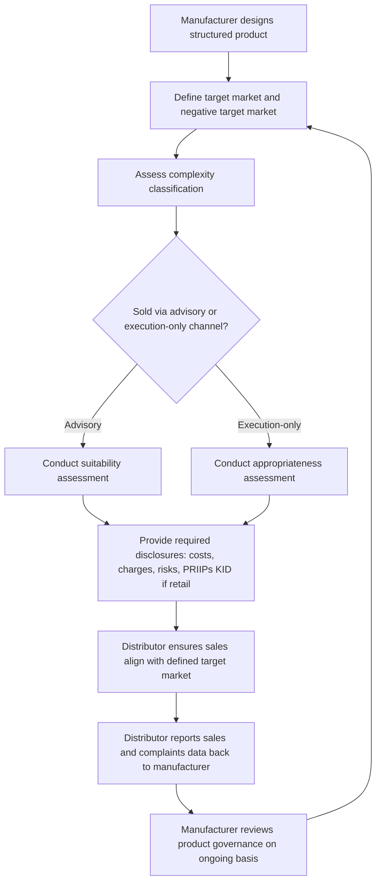

## MiFID II and Market Transparency Rules

### Overview

The Markets in Financial Instruments Directive II (MiFID II), together with its accompanying regulation MiFIR (Markets in Financial Instruments Regulation), is the EU's comprehensive framework governing investment firm conduct, market structure, and transparency across financial instruments, including derivatives. Effective from January 2018, MiFID II/MiFIR extended pre- and post-trade transparency obligations beyond equities into the non-equity space (including bonds and derivatives) for the first time, introduced a new venue category specifically for derivatives trading, and imposed enhanced investor protection, best execution, and product governance requirements directly relevant to structured products distribution.

### Relationship to EMIR and Dodd-Frank

**Key Points**

- Where EMIR (covered separately) addresses clearing, bilateral margin, and trade reporting for derivatives risk mitigation, MiFID II/MiFIR addresses **market structure and conduct**: where and how derivatives are traded, what pre/post-trade information must be published, and how firms must treat clients when distributing derivatives and structured products
- MiFID II's derivatives trading obligation (DTO) is the EU analogue to the Dodd-Frank Title VII trade execution requirement (SEF/DCM trading), mandating that sufficiently liquid, clearing-eligible derivatives be traded on a regulated venue rather than purely bilaterally
- The three frameworks are complementary rather than overlapping: EMIR governs risk mitigation and clearing, MiFID II/MiFIR governs venue trading and transparency, and both interact with the trade reporting infrastructure discussed under "Trade Repositories and Reporting Obligations" (though MiFIR transparency reporting and EMIR trade reporting are distinct regimes with different purposes and, in some respects, different data requirements)

### Trading Venue Categories Under MiFID II

**Key Points**

- **Regulated Markets (RMs)**: traditional exchanges
- **Multilateral Trading Facilities (MTFs)**: multilateral venues bringing together buying and selling interests in financial instruments, historically used for both equities and, increasingly, standardized derivatives
- **Organised Trading Facilities (OTFs)**: a venue category created specifically by MiFID II for non-equity instruments, including bonds and derivatives, allowing discretionary execution (unlike RMs/MTFs, which must operate on non-discretionary rules) — reflecting recognition that derivatives and bond markets often require more flexible, dealer-intermediated execution models than equity markets
- The Derivatives Trading Obligation (DTO) requires that derivatives subject to both the EMIR clearing obligation and a MiFIR liquidity determination be traded on one of these venue types (RM, MTF, or OTF), or an equivalent third-country venue — paralleling the SEF/DCM requirement under Dodd-Frank Title VII, though the specific product scope and liquidity determination methodology differ between the US and EU regimes

### Pre-Trade and Post-Trade Transparency

**Pre-Trade Transparency**

- Trading venues must make current bid/offer prices and market depth available to the public before a transaction occurs, for instruments subject to the transparency regime
- **Waivers** are available in defined circumstances (large-in-scale orders, illiquid instruments, order management facility waivers) recognizing that full pre-trade transparency for large or illiquid derivatives positions could create adverse market impact or information leakage risk for the executing party — a particularly relevant consideration for large structured product hedge executions

**Post-Trade Transparency**

- Completed transactions must be reported to the public (via an Approved Publication Arrangement, APA) as close to real-time as possible, disclosing price and volume information
- **Deferred publication** regimes allow delayed reporting for large-in-scale transactions or trades in instruments without a liquid market, mitigating the market impact and information leakage risk that immediate publication of a very large derivatives trade could create — again a direct consideration for structured products desks executing sizeable bespoke hedges, since immediate full disclosure of a large hedge trade could move the market against the remaining unhedged portion of a position

[Inference] The availability and duration of large-in-scale and deferred publication mechanisms is particularly consequential for structured products desks that must execute substantial delta or vega hedges around new issuance, since premature market disclosure of hedge flow could increase the cost of completing the hedge; the specific current thresholds and deferral periods for particular instrument classes are set out in MiFIR Regulatory Technical Standards and should be verified against current ESMA technical standards rather than assumed from general description, since these parameters have been subject to periodic recalibration.

### Illustrative MiFID II Trading and Transparency Framework (svg_diagram)

<svg xmlns="http://www.w3.org/2000/svg" viewBox="0 0 760 440" font-family="Helvetica, Arial, sans-serif">
<rect x="0" y="0" width="760" height="440" fill="#ffffff" />
<text x="380" y="26" text-anchor="middle" font-size="15" font-weight="bold" fill="#1a1a1a">MiFID II / MiFIR Framework (svg_diagram)</text>
<rect x="220" y="45" width="320" height="45" rx="6" fill="#dbe9ff" stroke="#2c5aa0" stroke-width="1.5" />
<text x="380" y="72" text-anchor="middle" font-size="12" font-weight="bold" fill="#1a1a1a">MiFID II / MiFIR</text>
<rect x="40" y="115" width="220" height="60" rx="6" fill="#fde9c8" stroke="#b8860b" stroke-width="1.5" />
<text x="150" y="138" text-anchor="middle" font-size="12" font-weight="bold" fill="#1a1a1a">Trading Venues</text>
<text x="150" y="156" text-anchor="middle" font-size="10" fill="#333">RM / MTF / OTF</text>
<rect x="280" y="115" width="220" height="60" rx="6" fill="#fbe0e0" stroke="#a33" stroke-width="1.5" />
<text x="390" y="138" text-anchor="middle" font-size="12" font-weight="bold" fill="#1a1a1a">Transparency Regime</text>
<text x="390" y="156" text-anchor="middle" font-size="10" fill="#333">Pre-trade / Post-trade</text>
<rect x="520" y="115" width="200" height="60" rx="6" fill="#e6f4ea" stroke="#2e7d32" stroke-width="1.5" />
<text x="620" y="138" text-anchor="middle" font-size="12" font-weight="bold" fill="#1a1a1a">Conduct Rules</text>
<text x="620" y="156" text-anchor="middle" font-size="10" fill="#333">Best exec, suitability, governance</text>
<rect x="60" y="215" width="180" height="55" rx="6" fill="#e6d9f0" stroke="#6a3d9a" stroke-width="1.5" />
<text x="150" y="238" text-anchor="middle" font-size="11" font-weight="bold" fill="#1a1a1a">Derivatives Trading Obligation</text>
<text x="150" y="255" text-anchor="middle" font-size="10" fill="#333">Liquid, cleared derivatives</text>
<rect x="280" y="215" width="220" height="55" rx="6" fill="#eee" stroke="#666" stroke-width="1.5" />
<text x="390" y="238" text-anchor="middle" font-size="11" font-weight="bold" fill="#1a1a1a">Waivers / Deferred Publication</text>
<text x="390" y="255" text-anchor="middle" font-size="10" fill="#333">Large-in-scale, illiquid instruments</text>
<rect x="540" y="215" width="180" height="55" rx="6" fill="#eee" stroke="#666" stroke-width="1.5" />
<text x="630" y="238" text-anchor="middle" font-size="11" font-weight="bold" fill="#1a1a1a">Product Governance</text>
<text x="630" y="255" text-anchor="middle" font-size="10" fill="#333">Target market, POG</text>
<rect x="220" y="310" width="320" height="55" rx="6" fill="#dbe9ff" stroke="#2c5aa0" stroke-width="1.5" />
<text x="380" y="332" text-anchor="middle" font-size="12" font-weight="bold" fill="#1a1a1a">Structured Products Distribution</text>
<text x="380" y="350" text-anchor="middle" font-size="10" fill="#333">Suitability, appropriateness, disclosure</text>
<line x1="380" y1="90" x2="150" y2="115" stroke="#555" stroke-width="1.5" marker-end="url(#arrow11)" />
<line x1="380" y1="90" x2="390" y2="115" stroke="#555" stroke-width="1.5" marker-end="url(#arrow11)" />
<line x1="380" y1="90" x2="620" y2="115" stroke="#555" stroke-width="1.5" marker-end="url(#arrow11)" />
<line x1="150" y1="175" x2="150" y2="215" stroke="#555" stroke-width="1.5" marker-end="url(#arrow11)" />
<line x1="390" y1="175" x2="390" y2="215" stroke="#555" stroke-width="1.5" marker-end="url(#arrow11)" />
<line x1="620" y1="175" x2="630" y2="215" stroke="#555" stroke-width="1.5" marker-end="url(#arrow11)" />
<line x1="390" y1="270" x2="380" y2="310" stroke="#555" stroke-width="1.5" marker-end="url(#arrow11)" />
<line x1="630" y1="270" x2="450" y2="310" stroke="#555" stroke-width="1.5" marker-end="url(#arrow11)" />
</svg>

### Investor Protection and Client Classification

**Key Points**

- MiFID II classifies clients into **Eligible Counterparties**, **Professional Clients**, and **Retail Clients**, with progressively enhanced protections (disclosure, suitability, appropriateness testing) as client sophistication decreases
- **Suitability** assessments (required for advisory and portfolio management services) evaluate whether a specific product matches a client's knowledge, financial situation, and investment objectives — directly relevant to structured note and complex derivative distribution to retail or less-sophisticated professional clients
- **Appropriateness** assessments (required for non-advised sales of complex products) test whether the client has sufficient knowledge and experience to understand the risks involved, without assessing broader suitability to their objectives — this is the relevant test for many execution-only structured product sales
- These MiFID II conduct requirements connect directly to the mis-selling and suitability litigation risk discussed under "Dispute Resolution in Derivatives Contracts" — a structured note distributed without adequate suitability/appropriateness assessment, or with inadequate risk disclosure, creates both MiFID II regulatory liability and potential civil claim exposure

### Product Governance (POG) Requirements

**Key Points**

- MiFID II's product governance regime requires **manufacturers** (typically the structuring bank) to define a **target market** for each product — the type of client for whom the product is designed, considering knowledge, experience, financial situation, risk tolerance, and objectives — and to identify a **negative target market** of clients for whom the product is clearly unsuitable
- **Distributors** (which may be the same entity as the manufacturer, or a separate distribution partner) must ensure the product is actually distributed within its defined target market, and must feed back sales and complaints information to the manufacturer to support ongoing product governance review
- This framework is particularly consequential for structured products: an autocallable note or complex barrier structure carries specific risk characteristics (capital-at-risk, complexity, potential for early redemption) that must be explicitly reflected in the target market definition, and manufacturers must periodically review whether actual distribution patterns match the intended target market
- [Unverified] Specific current ESMA guidelines on product governance target market granularity (e.g., how narrowly "knowledge and experience" categories must be defined for complex structured products) have evolved through ESMA Q&A and guidance since MiFID II's original implementation; current practice should be verified against the latest ESMA product governance guidelines rather than the original 2018 framework alone.

### Best Execution

**Key Points**

- MiFID II imposes a best execution obligation requiring firms to take "all sufficient steps" (a standard strengthened from MiFID I's "all reasonable steps") to obtain the best possible result for clients when executing orders, considering price, costs, speed, likelihood of execution and settlement, size, and other relevant factors
- For OTC and bespoke derivatives without a continuously quoted public market price (common for structured products), demonstrating best execution requires firms to establish and document a methodology for fair valuation and execution quality assessment, since there is no simple "best available quoted price" benchmark to reference as there might be for a listed instrument
- Firms must publish periodic reports on execution quality and their top execution venues, though the specific format and frequency of these disclosures has been subject to periodic regulatory adjustment as part of the broader MiFID II review process

### Structured Products-Specific Implications

**Key Points**

- **Complexity classification**: MiFID II's appropriateness test regime treats certain structured products as inherently "complex" instruments requiring enhanced pre-sale assessment, distinguishing them from simpler, more transparent instruments where appropriateness testing may be waived under specified conditions
- **PRIIPs interaction**: structured products sold to retail investors in the EU are also subject to the PRIIPs (Packaged Retail and Insurance-based Investment Products) Regulation's Key Information Document (KID) requirement, which operates alongside MiFID II's suitability/appropriateness and product governance framework — a manufacturer must satisfy both regimes' distinct but related disclosure and governance obligations for the same retail-distributed structured note
- **Cost and charges disclosure**: MiFID II requires detailed disclosure of all costs and charges associated with a product or service, including implicit costs embedded in structured product pricing (such as the structuring margin built into a note's issue price) — a transparency requirement that has driven greater standardization in how dealers document and disclose the economics of structured product issuance
- **Inducements**: MiFID II restricts and requires disclosure of inducements (payments or benefits) received by distributors from manufacturers, directly relevant to bank distribution networks selling proprietary or third-party structured notes, since distribution fee arrangements must be transparently disclosed to the end client

### MiFID II Structured Product Distribution Workflow

### Common Pitfalls

- Confusing EMIR trade reporting with MiFIR transparency reporting — these are distinct regimes with different purposes (systemic risk monitoring for EMIR vs. market transparency for MiFIR) and, in some cases, different data specifications, requiring separate compliance workstreams even though both apply to the same underlying derivatives trade
- Assuming appropriateness testing satisfies suitability requirements — appropriateness only tests client knowledge/experience, not whether the product actually fits the client's broader financial objectives and risk tolerance, which is the suitability standard applicable in advisory contexts
- Treating product governance as a one-time exercise at product launch — the target market and distribution alignment must be reviewed on an ongoing basis, incorporating actual sales pattern and complaints feedback from distributors
- Overlooking the interaction between MiFID II conduct rules and PRIIPs KID disclosure requirements for retail-distributed structured products, since both regimes impose overlapping but distinct disclosure obligations that must be satisfied together

[Unverified] Specific current large-in-scale thresholds, deferred publication periods, and product governance guidance details are subject to ongoing ESMA technical standard updates and the broader MiFID II/MiFIR review process; current compliance specifications should be verified against the latest ESMA publications and Delegated Regulations rather than treated as fixed from the original 2018 implementation.

### Related Topics

- The European Market Infrastructure Regulation (EMIR clearing and reporting, distinct from MiFID II conduct/transparency)
- Dodd Frank Title VII Derivatives Provisions (comparative US trade execution framework — SEF/DCM)
- Dispute Resolution in Derivatives Contracts (mis-selling and suitability litigation risk)
- PRIIPs Regulation and Key Information Document (KID) requirements for retail structured products
- Master Confirmation Agreements for Structured Trades (disclosure and representation provisions)
- Best execution methodology for OTC and bespoke derivatives without continuous public pricing
- Product governance target market definition for complex structured payoffs
- Trade Repositories and Reporting Obligations (contrast with MiFIR transparency reporting)