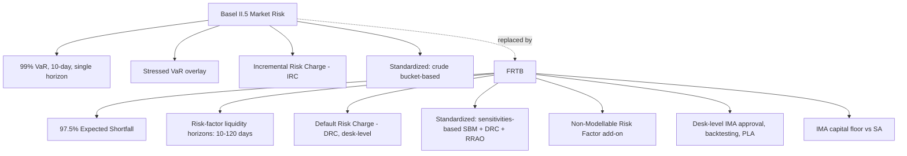

## Basel Capital Framework for Trading Book Exposures

### Overview and Regulatory Lineage

The Basel Capital Framework for trading book exposures governs how banks calculate regulatory capital against market risk — the risk of loss from movements in prices, rates, spreads, volatilities, and correlations affecting positions held for trading or hedging trading activity. The current framework is the **Fundamental Review of the Trading Book (FRTB)**, finalized by the Basel Committee on Banking Supervision (BCBS) in January 2016 (BCBS 352) and revised in January 2019 (BCBS 457, "Minimum capital requirements for market risk").

FRTB replaced the Basel II.5 market risk framework (2009), which relied on Value-at-Risk (VaR) plus incremental charges bolted on after the 2007–2008 crisis exposed severe gaps — most notably the failure to capture credit-spread risk migration in the trading book and the inadequacy of a single 99% VaR confidence interval to capture tail risk.

FRTB is intended to address shortcomings in the Basel II.5 framework and applies to banks' wholesale trading activities. Three structural problems motivated the redesign: [icmagroup](https://icmagroup.org/market-practice-and-regulatory-policy/Secondary-Markets/secondary-markets-regulation/fundamental-review-of-the-trading-book-frtb)

- **Boundary arbitrage** between the trading book and banking book, where capital treatment differences created incentives to book the same economic exposure wherever capital was cheaper
- **Underestimation of tail risk** by VaR, which does not capture losses beyond its confidence threshold
- **Inconsistent capital outcomes** across banks using internal models for economically similar portfolios

Global implementation has been repeatedly delayed. The framework was originally scheduled for domestic implementation on January 1, 2019, with reporting from December 31, 2019, but BCBS's oversight body announced a delay until 2022 in December 2017. Jurisdictional timelines have since diverged further: [icmagroup](https://icmagroup.org/market-practice-and-regulatory-policy/Secondary-Markets/secondary-markets-regulation/fundamental-review-of-the-trading-book-frtb)

- **EU**: The European Commission adopted a delegated act postponing FRTB own-funds requirements by one year, to January 1, 2026, under CRR III/CRD VI. [europa](https://finance.ec.europa.eu/news/banking-package-questions-and-answers-2024-07-24_sl)
- **UK**: The PRA published final Basel 3.1 policy in January 2026, with the general regime effective January 1, 2027, and FRTB internal-model use for market risk capital effective January 1, 2028. [lexisnexis](https://www.lexisnexis.co.uk/legal/news/afme-welcomes-pra-final-rules-on-basel-3-1-implementation-in-uk)
- **US**: The "Basel III Endgame" proposal (including FRTB-aligned market risk provisions) has faced significant industry pushback and re-proposal; as of this writing, US federal banking agencies have not finalized a market risk final rule on a confirmed date. [Unverified — treat any specific US effective date as provisional; verify against current Federal Reserve/OCC/FDIC releases before relying on it operationally.]
- **Other jurisdictions** (Japan, Hong Kong, Singapore, Australia, Canada) have each set domestic timelines, generally clustering in the 2023–2026 range with some further slippage.

[Inference] Given this fragmented rollout, any production-relevant capital calculation must be pinned to the specific jurisdiction and rule version in force for the entity in question rather than treated as a single global standard.

### Trading Book / Banking Book Boundary

FRTB tightened the boundary test that determines whether a position is capitalized under market risk (trading book) or credit risk (banking book) rules:

- **Presumptive lists**: Certain instruments (e.g., correlation trading positions, positions resulting from market-making) are presumptively trading book; others (e.g., real estate holdings, unlisted equity investments) are presumptively banking book.
- **Trading intent test**: A position must be held with trading intent — intended for short-term resale, or to profit from actual or expected short-term price movements, or to lock in arbitrage profit.
- **Switching restriction**: Reclassifying an instrument between books after initial designation is permitted only in "extraordinary circumstances" and requires supervisory approval, with any resulting capital reduction disclosed. This closes the pre-crisis practice of moving deteriorating positions to the banking book to avoid mark-to-market capital charges.

### The Standardized Approach (SA)

FRTB's Standardized Approach is a sensitivities-based framework — a significant departure from the simpler, cruder Basel II.5 standardized rules. It is mandatory for all banks (as a floor and fallback) and is the default for banks without internal model approval.

**Three components are aggregated:**

$$SA_{capital} = SBM + DRC + RRAO$$

where:

- **SBM (Sensitivities-Based Method)**: Capital charge derived from delta, vega, and curvature risk sensitivities across seven prescribed risk classes: General Interest Rate Risk (GIRR), Credit Spread Risk (non-securitization), Credit Spread Risk (securitization, non-CTP), Credit Spread Risk (CTP — correlation trading portfolio), Equity Risk, Commodity Risk, and Foreign Exchange Risk.
- **DRC (Default Risk Charge)**: A jump-to-default charge capturing the risk of issuer default, calculated separately from spread-widening risk, since spread risk (captured in SBM) does not fully capture discontinuous default losses.
- **RRAO (Residual Risk Add-On)**: A blunt add-on for instruments with residual risks not well captured by the sensitivities framework — exotic underlyings, gap risk, correlation risk, behavioral risk (e.g., prepayment).

**SBM Mechanics**: For each risk class, sensitivities are computed per risk factor, weighted by prescribed risk weights, and aggregated within and across "buckets" using prescribed correlation parameters. The framework requires calculating the charge under three correlation scenarios — "low," "medium," and "high" correlation — and taking the **maximum** across scenarios:

$$SBM_{charge} = \max(K_{low}, K_{medium}, K_{high})$$

This max-of-three-scenarios design is intended to be robust to correlation breakdown during stress, when historical correlation assumptions often invert.

Within a bucket, weighted sensitivities are aggregated as:

$$K_b = \sqrt{\sum_k WS_k^2 + \sum_{k \neq l} \rho_{kl} WS_k WS_l}$$

where $WS_k$ is the weighted sensitivity to risk factor $k$ and $\rho_{kl}$ is the prescribed correlation between risk factors $k$ and $l$ within the bucket. Cross-bucket aggregation applies a further set of prescribed correlation parameters $\gamma_{bc}$.

**Practical Example**: A bank holds a $50mm notional 5-year interest rate swap (receive fixed). Under GIRR:

1. Compute delta sensitivity to each tenor point on the relevant yield curve (a "bucket" is each currency).
2. Apply the prescribed risk weight per tenor (e.g., ~1.7%–2.4% depending on tenor, per the BCBS calibration table for GIRR).
3. Aggregate weighted sensitivities within the currency bucket using prescribed intra-bucket correlations across tenors.
4. Aggregate across currency buckets (if multi-currency) using cross-bucket correlations.
5. Repeat this process independently for delta, vega, and curvature risk, then sum per BCBS's prescribed aggregation formula.

### The Internal Models Approach (IMA)

IMA permits banks with supervisory approval to use internal risk models for capital calculation, subject to substantially stricter qualification than under Basel II.5.

**Core methodology — Expected Shortfall (ES)**: FRTB replaced 99% VaR with 97.5% Expected Shortfall as the primary risk metric.

$$ES_{97.5\%} = E[Loss \mid Loss > VaR_{97.5\%}]$$

ES averages losses in the tail beyond the threshold rather than reporting only the threshold value itself, which better captures tail risk shape — two portfolios with identical VaR can have very different expected shortfall if their loss distributions have different tail thickness. [Inference — this is the standard rationale cited by BCBS and widely repeated in industry literature; it is a design intent, not an empirically guaranteed property for every portfolio.]

**Liquidity horizons**: Unlike the single 10-day horizon under Basel II.5 VaR, IMA applies risk-factor-specific liquidity horizons (10, 20, 40, 60, or 120 days) reflecting how quickly a position in that risk factor could be closed out or hedged without materially moving the market. This is implemented via a liquidity-horizon-scaled ES calculation that combines shocks across different horizon buckets.

**Non-Modellable Risk Factors (NMRF)**: A risk factor is modellable only if it has sufficient observable, real transaction data (a minimum number of "real price" observations within a defined lookback window, with no more than a specified gap between observations, per BCBS's Risk Factor Eligibility Test). Risk factors failing this test are NMRF and must be capitalized separately via a stressed scenario capital add-on rather than through the ES model — typically punitive relative to modellable treatment, which creates strong incentive for banks to source better market data or avoid trading instruments referencing illiquid factors. Banks must have enough data history to model risk factors, which can be a challenge for complex or illiquid assets, and this data requirement is one of the framework's central operational challenges. [scribd](https://www.scribd.com/document/792555772/FRTB)

**Trading desk-level approval**: IMA approval is granted (or revoked) at the level of individual trading desks, not bank-wide. Each desk must pass:

- **Backtesting**: Comparing actual P&L against VaR-predicted losses at 99% and 97.5% confidence over a rolling 12-month window; exceedances beyond specified thresholds move the desk into a "red zone," triggering a fallback to the Standardized Approach for that desk.
- **P&L Attribution (PLA) test**: Comparing risk-theoretical P&L (from the model) against hypothetical P&L (from actual, full daily repricing) using two statistical tests on the Spearman correlation and a Kolmogorov-Smirnov-type distribution comparison. Desks failing PLA are moved to "amber" (capital add-on) or "red" (must use SA) zones.

**Capital floor**: Regardless of IMA eligibility, aggregate IMA-based capital cannot fall below a percentage of what SA would produce for the same book — an output floor intended to prevent internal models from systematically understating risk relative to the standardized baseline and to preserve comparability across banks. [Inference — exact floor calibration is jurisdiction-dependent and subject to the broader Basel III output floor phase-in; confirm the applicable percentage against the specific implementing regulation.]

### Default Risk Charge (DRC) Detail

DRC captures jump-to-default risk separate from credit spread (migration/widening) risk captured elsewhere. It uses a simplified, more conservative structure than the banking book's IRB approach:

- Loss-given-default is regulator-prescribed by seniority (not modeled).
- Default correlations across obligors within a sector/region bucket are prescribed, not estimated.
- A Monte Carlo or closed-form simulation approach is used to derive a loss distribution at a 99.9% confidence level over a one-year horizon, then scaled to the appropriate capital horizon.
- Hedge recognition is restricted: only substantially matched, same-obligor hedges receive close-to-full offset; proxy or index hedges receive only partial recognition, reflecting basis risk.

### Illustrative Comparison: Basel II.5 vs FRTB

### Capital Charge Aggregation Diagram (svg_diagram)

<svg xmlns="http://www.w3.org/2000/svg" viewBox="0 0 760 460">
<text x="380" y="24" text-anchor="middle" font-size="16" font-weight="bold" fill="#111">FRTB Standardized Approach Aggregation (svg_diagram)</text>
<rect x="30" y="60" width="200" height="90" rx="6" fill="#eef4fb" stroke="#2f6fb0" />
<text x="130" y="90" text-anchor="middle" font-size="13" font-weight="bold">SBM</text>
<text x="130" y="110" text-anchor="middle" font-size="11">Delta + Vega + Curvature</text>
<text x="130" y="126" text-anchor="middle" font-size="11">max(low, medium, high) corr.</text>
<rect x="280" y="60" width="200" height="90" rx="6" fill="#fbf0e8" stroke="#c07a2f" />
<text x="380" y="90" text-anchor="middle" font-size="13" font-weight="bold">DRC</text>
<text x="380" y="110" text-anchor="middle" font-size="11">Jump-to-default</text>
<text x="380" y="126" text-anchor="middle" font-size="11">99.9% / 1yr, prescribed LGD &amp; corr.</text>
<rect x="530" y="60" width="200" height="90" rx="6" fill="#f1ebfa" stroke="#7a4fc0" />
<text x="630" y="90" text-anchor="middle" font-size="13" font-weight="bold">RRAO</text>
<text x="630" y="110" text-anchor="middle" font-size="11">Exotic / gap / correlation</text>
<text x="630" y="126" text-anchor="middle" font-size="11">residual risk not in SBM</text>
<line x1="130" y1="150" x2="330" y2="230" stroke="#333" marker-end="url(#arrow)" />
<line x1="380" y1="150" x2="360" y2="230" stroke="#333" marker-end="url(#arrow)" />
<line x1="630" y1="150" x2="400" y2="230" stroke="#333" marker-end="url(#arrow)" />
<rect x="270" y="230" width="220" height="60" rx="6" fill="#eafaf0" stroke="#2f9e57" />
<text x="380" y="265" text-anchor="middle" font-size="13" font-weight="bold">SA Capital = SBM + DRC + RRAO</text>
<line x1="380" y1="290" x2="380" y2="330" stroke="#333" marker-end="url(#arrow)" />
<rect x="230" y="330" width="300" height="80" rx="6" fill="#fdf3f3" stroke="#c0392b" />
<text x="380" y="358" text-anchor="middle" font-size="12" font-weight="bold">Compared against IMA output</text>
<text x="380" y="378" text-anchor="middle" font-size="11">Output floor: aggregate IMA capital</text>
<text x="380" y="394" text-anchor="middle" font-size="11">cannot fall below % of SA</text>
</svg>

### Operational and Implementation Challenges

FRTB imposes stringent data requirements, particularly for Non-Modellable Risk Factors, since banks must have sufficient data history to model risk factors — a significant challenge for complex or illiquid assets. Broader industry-reported challenges include: [scribd](https://www.scribd.com/document/792555772/FRTB)

- **Increased capital levels**: The expected shortfall method tends to generate higher capital requirements than VaR, particularly for portfolios with significant tail risk, prompting some banks to reassess risk appetite and trading book strategy. [scribd](https://www.scribd.com/document/792555772/FRTB)
- **IT and infrastructure cost**: Desk-level sensitivity computation across delta/vega/curvature for every prescribed risk factor bucket is computationally intensive; many banks re-architected risk engines around FRTB requirements.
- **Desk structure incentives**: Because IMA approval is desk-by-desk, banks have had to reconsider trading desk boundaries to concentrate well-modellable risk in IMA-eligible desks and isolate NMRF-heavy exposures.
- **Cross-jurisdictional divergence**: With the EU, UK, and other jurisdictions on different effective dates and, in some cases, different calibrations (e.g., UK "Basel 3.1" is not a verbatim copy of the BCBS text), multinational banks must run parallel calculation logic per legal entity/jurisdiction. [Inference]

### Interaction with Other Basel III Elements

- **Leverage ratio**: Trading book exposures also feed into the non-risk-based leverage ratio exposure measure, independent of the market-risk capital calculation above.
- **Output floor**: The Basel III aggregate output floor (limiting total RWA reduction from internal models bank-wide, generally phased toward 72.5% of standardized RWA) operates as a bank-wide constraint layered on top of, not a replacement for, the FRTB-specific IMA-vs-SA floor described above.
- **CVA capital**: Credit Valuation Adjustment risk capital (BA-CVA / SA-CVA) is calculated under a related but distinct Basel framework and is not part of the market risk (FRTB) capital charge itself, though both apply to the trading book/derivatives portfolio and are often implemented by the same desks and systems.

**Related Topics / Next Steps**

- Credit Valuation Adjustment (CVA) Capital Framework — BA-CVA and SA-CVA
- Counterparty Credit Risk: SA-CCR
- Basel III Output Floor and RWA Constraints
- Non-Modellable Risk Factor (NMRF) Data Sourcing and the Risk Factor Eligibility Test
- P&L Attribution Testing: Statistical Methodology
- Correlation Trading Portfolio (CTP) Capital Treatment
- Jurisdictional Divergence: EU CRR III vs UK Basel 3.1 vs US Basel III Endgame