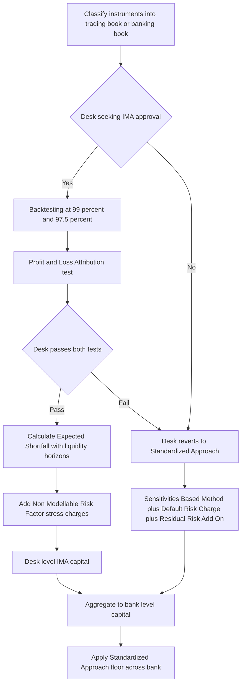

## The Fundamental Review of the Trading Book

### Overview

The Fundamental Review of the Trading Book (FRTB) is the Basel Committee on Banking Supervision's (BCBS) framework for calculating regulatory market risk capital, developed in response to shortcomings in the pre-crisis Value-at-Risk (VaR)-based regime exposed during the 2008 financial crisis. FRTB replaces the previous market risk framework (Basel 2.5) with a revised **boundary between the trading book and banking book**, a new **standardized approach (SA)**, and a substantially more rigorous **internal models approach (IMA)** built around **Expected Shortfall (ES)** rather than VaR.

---

### Motivation and Key Deficiencies Addressed

**Key Points**

- **VaR's failure to capture tail risk**: pre-crisis VaR-based capital (typically 99% 10-day VaR) systematically understated losses in extreme tail scenarios, since VaR is a quantile measure that says nothing about the severity of losses beyond the threshold.
- **Procyclicality**: VaR-based capital tended to fall during calm periods (understating risk right before stress) and spike sharply during crises, amplifying rather than dampening systemic stress.
- **Trading book / banking book arbitrage**: banks had significant discretion to classify instruments into whichever book (trading vs. banking) minimized capital charges, exploiting differences in risk-weighting between the two regimes.
- **Inconsistent capital across desks/models**: the pre-FRTB internal models approach allowed significant variation in modeling choices across banks and even across desks within the same bank, undermining comparability of reported capital.
- **Liquidity horizon mismatch**: the original VaR framework used a uniform (typically 10-day) liquidity horizon for all risk factors, ignoring the fact that different asset classes and instruments have materially different real-world liquidation timeframes.

---

### The Revised Trading Book / Banking Book Boundary

**Key Points**

- FRTB introduces more **prescriptive, less discretionary criteria** for classifying instruments into the trading book versus the banking book, since capital treatment differs substantially between the two.
- **Presumptive lists** specify instrument types presumed to belong to the trading book (e.g., instruments held for market-making, most correlation trading positions) or the banking book (e.g., most unlisted equity investments, retail and SME loans), with supervisory approval required to deviate from the presumption.
- **Switching restrictions**: reclassifying an instrument between books after initial designation is heavily restricted and requires supervisory approval, specifically to prevent regulatory capital arbitrage via opportunistic reclassification.

---

### The Standardized Approach (SA)

**Key Points**

- The revised SA is a **sensitivities-based method (SBM)** combined with two supplementary charges, replacing the older, simpler standardized approach.
- **Three components of the SA**:
  1. **Sensitivities-Based Method (SBM)**: capital is calculated from the position's sensitivities (delta, vega, curvature) to a prescribed set of risk factors, aggregated using prescribed risk weights and correlation parameters across risk classes (interest rate, credit spread, equity, FX, commodity) and within each class, under multiple prescribed correlation scenarios (low, medium, high correlation) with the maximum charge taken across scenarios.
  2. **Default Risk Charge (DRC)**: a separate, non-diversifiable capital charge for jump-to-default risk, calculated similarly to a simplified incremental default risk model, distinguishing between non-securitization, securitization (non-CTP), and correlation trading portfolio (CTP) exposures.
  3. **Residual Risk Add-On (RRAO)**: a simple, punitive add-on for instruments with risks not well captured by the sensitivities-based method (e.g., exotic underlyings, gap risk, correlation risk, behavioral/prepayment risk), calculated as a percentage of notional.
- **Delta, Vega, and Curvature risk**: within the SBM, delta captures first-order sensitivity to risk factor levels, vega captures sensitivity to implied volatility, and **curvature risk** is a distinctive FRTB innovation capturing the second-order (convexity) risk not adequately captured by delta alone, calculated via prescribed up/down shocks to each risk factor and comparing the resulting P&L to the delta-implied P&L.
- The SA is intended to be usable as a **credible fallback** and a **floor/benchmark** even for banks approved to use internal models, and it must now be calculated by *all* banks (not just those without model approval), including as an input to the capital floor under the IMA.

---

### The Internal Models Approach (IMA)

**Key Points**

- **Expected Shortfall replaces VaR**: the IMA capital measure moves from 99% VaR to **97.5% Expected Shortfall (ES)**, chosen because ES captures the average of losses beyond the quantile threshold (tail severity), addressing VaR's blindness to the magnitude of extreme losses, while a 97.5% ES is calibrated to be broadly comparable in overall capital magnitude to a 99% VaR under normal distributional assumptions.

$$\text{ES}_\alpha = \mathbb{E}\left[L \mid L > \text{VaR}_\alpha\right]$$

- **Desk-level model approval**: unlike the prior regime's often bank-wide model approval, FRTB IMA approval is granted (and can be revoked) **at the individual trading desk level**, based on each desk passing rigorous backtesting and profit-and-loss attribution (PLA) tests. A desk that fails these tests reverts to the standardized approach for capital purposes.
- **Backtesting requirements**: each desk's model must be backtested against both actual and hypothetical P&L at both 99% and 97.5% confidence levels, with the number of exceptions determining a regulatory "traffic light" zone (green/amber/red) analogous to the prior VaR backtesting regime.
- **Profit and Loss Attribution (PLA) test**: a newer, more stringent requirement comparing the desk's **risk-management P&L** (from the front-office pricing model) against its **risk-theoretical P&L** (from the regulatory risk model using the same risk factors); excessive divergence between the two indicates the regulatory model is not adequately capturing the desk's actual risk factors, triggering desk-level IMA disqualification.
- **Non-Modellable Risk Factors (NMRFs)**: risk factors that fail a prescribed **liquidity/data sufficiency test** (based on the number of "real" price observations over a lookback period) cannot be included in the modellable ES calculation and must instead receive a separate, typically punitive **stress scenario capital charge**, calculated as a stressed expected shortfall specific to that risk factor, added on top of the modellable ES component. This creates strong incentives for banks to source and maintain robust market data to keep risk factors "modellable."
- **Liquidity horizons**: rather than a uniform 10-day horizon, FRTB IMA (and to a lesser extent the SA) applies **risk-factor-specific liquidity horizons** (ranging from 10 to 120 days depending on asset class and risk factor type), scaling risk factor shocks by the square root of the relevant horizon, better reflecting the actual time required to hedge or exit different types of exposure in stressed conditions.

---

### FRTB Capital Calculation Workflow

---

### The Standardized Approach as a Floor

**Key Points**

- Even banks with desk-level IMA approval must calculate the **SA capital charge for the entire trading book** and compare it to aggregate IMA-based capital; regulators may apply the SA as an explicit **capital floor**, meaning a bank's total market risk capital cannot fall below a specified percentage of what the SA would require.
- This dual-calculation requirement significantly increases the **computational and infrastructure burden** on banks, since institutions with IMA approval must nonetheless maintain the systems and data needed to compute full SA sensitivities across the entire trading book on an ongoing basis, not just for desks using the standardized approach by default.

---

### Implementation Timeline and Jurisdictional Divergence

**Key Points**

- FRTB was finalized by the Basel Committee in January 2019 (following an initial 2016 publication and subsequent revisions), with a global implementation target that has been repeatedly delayed and staggered across jurisdictions.
- Implementation timing and specific technical details have diverged by jurisdiction (EU via CRR3, UK, US, and other jurisdictions each adopting their own transposition timelines and, in some cases, technical modifications), meaning banks operating across multiple jurisdictions must manage **basis risk between regulatory regimes** rather than a single global standard applying uniformly.

**Given the ongoing and jurisdiction-specific nature of FRTB implementation timelines, current status should be verified against the latest regulatory publications from the relevant jurisdiction(s), as specific effective dates continue to evolve.**

---

### Impact on Trading Desks and Infrastructure

**Key Points**

- **Increased capital for exotic and less liquid products**: the combination of curvature risk, the Residual Risk Add-On, and NMRF stress charges tends to significantly increase capital requirements for exotic derivatives, structured products, and less liquid credit and securitized instruments relative to the prior regime.
- **Desk structuring incentives**: because IMA approval and capital floors operate at the desk level, banks have strong incentives to organize trading desks to maximize the proportion of business eligible for (and passing) IMA treatment, and to manage risk factor liquidity/data sourcing proactively to minimize NMRF charges.
- **Data infrastructure demands**: the NMRF test, PLA test, and risk-factor-specific liquidity horizons collectively require substantially more granular historical price/transaction data and more sophisticated risk-factor eligibility tracking than the prior VaR regime, driving significant technology and data-governance investment across the industry.

---

### Practical Pitfalls

- **Underestimating NMRF capital impact**: risk factors that appear liquid in normal conditions but fail to meet the prescriptive real-price-observation threshold can generate outsized stress capital charges, a common source of unexpectedly high FRTB capital for structured and exotic books.
- **Treating desk-level PLA as a one-time hurdle**: PLA testing is an ongoing, recurring requirement — a desk can lose IMA eligibility after initially passing if its risk-management and risk-theoretical P&L diverge in later periods, requiring continuous monitoring rather than a one-off certification mindset.
- **Ignoring the SA floor's binding effect**: banks sometimes focus disproportionately on optimizing IMA-eligible desks' capital while underappreciating that the aggregate SA floor can bind regardless of individual desk-level IMA efficiency, limiting the total capital benefit achievable through IMA approval.
- **Assuming uniform global implementation**: given jurisdictional divergence in timelines and technical specifications, applying a single assumed FRTB ruleset across a multi-jurisdictional trading book without accounting for local variations can materially misstate regulatory capital.

---

**Next Steps**

- Expected Shortfall vs. Value-at-Risk: Statistical and Regulatory Properties
- Non-Modellable Risk Factors and the NMRF Eligibility Test
- Profit and Loss Attribution (PLA) Test Mechanics
- Default Risk Charge Modeling under FRTB
- CRR3 and Jurisdictional Implementation of FRTB
- Capital Optimization and Desk Structuring under FRTB