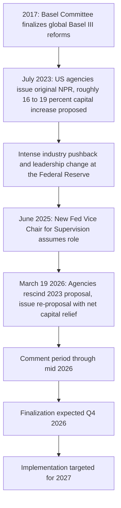

## The Basel III Endgame and Evolving Capital Requirements

### Overview

The "Basel III Endgame" (sometimes called "Basel IV") refers to the final phase of the Basel Committee's post-crisis capital reforms — the 2017 Basel III finalization package covering credit risk, operational risk, credit valuation adjustment (CVA) risk, and market risk (via FRTB). In the United States, its implementation has been a multi-year, highly contested rulemaking saga that has shifted substantially in direction, and the framework's specific calibration remains a live, evolving policy matter as of this writing.

---

### The 2017 Basel Committee Reforms (Global Basel III Finalization)

**Key Points**

- Revised the **standardized approach for credit risk (SA-CR)**, reducing reliance on external credit ratings and introducing more granular risk-weighting based on loan-to-value ratios (for real estate) and other risk drivers.
- Introduced an **output floor**, requiring internal-model-based risk-weighted assets (RWAs) to be no lower than a specified percentage (72.5% at full phase-in) of what the standardized approach would produce, directly limiting the capital benefit banks can achieve via internal models.
- Replaced the **Advanced Measurement Approaches (AMA)** for operational risk with a single **Standardized Approach**, removing banks' ability to use internal loss models for this risk category.
- Incorporated the **Fundamental Review of the Trading Book (FRTB)** as the market risk component, replacing VaR with Expected Shortfall and introducing the desk-level IMA approval regime.
- Revised the **CVA risk capital framework**, removing the ability to use an internally modeled approach for CVA risk in most cases and moving toward standardized/basic approaches.

---

### The US Rulemaking Saga: 2023 Proposal to 2026 Re-Proposal

**Key Points**

- The original US **Notice of Proposed Rulemaking (NPR)** was jointly issued on July 27, 2023 by the Federal Reserve, OCC, and FDIC, proposing sweeping changes to risk-weighted asset calculation for the largest US banks, jointly published by the Federal Reserve, the Office of the Comptroller of the Currency (OCC) and the Federal Deposit Insurance Corporation (FDIC), and it would modify how the largest US banks think about regulatory capital and extends more granular, rigorous requirements to US regional and midsized banks. [EY](https://www.ey.com/en_us/insights/banking-capital-markets/basel-iii-endgame-what-you-need-to-know)[EY](https://www.ey.com/en_us/insights/banking-capital-markets/basel-iii-endgame-what-you-need-to-know)
- That 2023 proposal was estimated to increase aggregate capital requirements for the largest US banks by roughly **16–19%**, triggering intense industry pushbackThe July 2023 proposal sought a roughly 19% capital increase for the largest US banks, and operational risk was identified by the American Bankers Association as the single largest driver of RWA inflation under the original 2023 proposal, accounting for an estimated 78% RWA increase for Category I and II banks. [Ibinterviewquestions](https://ibinterviewquestions.com/guides/fig-investment-banking/basel-iii-endgame-2024-2026)[Chris Ekai](https://riskpublishing.com/basel-iii-endgame-what-the-final-rule-means/)
- A significant leadership change followed: the Fed Vice Chair for Supervision role, previously held by an architect of the original proposal, transitioned to Michelle Bowman, who assumed the role in June 2025 for a four-year term and had publicly expressed caution about the original proposal's scope. [Ibinterviewquestions](https://ibinterviewquestions.com/guides/fig-investment-banking/basel-iii-endgame-2024-2026)
- Under the new leadership, the agencies formally **rescinded the 2023 proposal** and issued a substantially different **re-proposal on March 19, 2026**the Federal Reserve Board, Office of the Comptroller of the Currency and Federal Deposit Insurance Corporation issued three proposals that, taken together, would comprehensively overhaul the existing U.S. bank capital framework, exceeding 1,500 pages combined and addressing nearly every section of the existing regulatory capital requirements. [Freshfields](https://www.freshfields.com/en/our-thinking/blogs/a-fresh-take/basel-iii-endgame-take-two-8-key-takeaways-from-the-federal-banking-agencies-c-102mnm3)[Holland & Knight](https://www.hklaw.com/en/insights/publications/2026/06/us-banking-agencies-propose-new-rules-to-reduce-regulatory)
- The direction of the re-proposal reversed course entirely from the original: rather than a capital increase, the March 2026 re-proposal is estimated to deliver **net capital relief of approximately $87.7 billion**the March 2026 reproposal instead delivers net capital relief of about $87.7 billion, with finalization expected in late 2026 and implementation in 2027. [Ibinterviewquestions](https://ibinterviewquestions.com/guides/fig-investment-banking/basel-iii-endgame-2024-2026)

---

### Key Substantive Changes in the March 2026 Re-Proposal

**Key Points**

- **Operational risk**: the most consequential single change is the removal of the **Internal Loss Multiplier (ILM)**the removal of the Internal Loss Multiplier as a loss-history adjustment. Under the re-proposal, regulators will no longer adjust a firm's operational risk charge based on its loss record — while the broader structural shift from internal models (AMA) to a standardized formula for operational risk capital remains in place. [Chris Ekai](https://riskpublishing.com/basel-iii-endgame-what-the-final-rule-means/)
- **Overall calibration**: regulators now project that aggregate banking-system capital will **modestly decrease** rather than increase, a dramatic reversal from the original proposal's trajectoryThe Federal Reserve, OCC, and FDIC now project that aggregate capital in the banking system will modestly decrease under the new framework, a dramatic pivot from the original +16% CET1 increase. [Chris Ekai](https://riskpublishing.com/basel-iii-endgame-what-the-final-rule-means/)
- **Scope segmentation**: the 2026 proposals introduce a **separate, less burdensome approach for regional and smaller banks**, distinct from the framework applied to the largest, internationally active institutionsThe March 2026 proposals revisit Basel III Endgame for the largest firms, introduce a separate approach for regional and smaller banks, and revise the GSIB surcharge framework. [PwC](https://www.pwc.com/us/en/industries/financial-services/library/basel-iii-endgame.html)
- **Regulatory perimeter changes**: the proposals are also intended to bring certain activities such as mortgage origination and servicing back within the Agencies' regulatory perimeter, alongside a broader stated goal of modernizing the capital framework. [Holland & Knight](https://www.hklaw.com/en/insights/publications/2026/06/us-banking-agencies-propose-new-rules-to-reduce-regulatory)
- **Broader package coordination**: the re-proposal sits alongside related reforms to the **G-SIB surcharge framework**, **leverage ratio**, and **stress capital buffer** — collectively described by regulators as a coordinated set of "four pillars" of capital-framework review.
- The package overall is characterized by industry analysts as **lowering capital requirements, reducing duplication across the framework, and improving the economics of traditional lending**the package lowers capital requirements overall, reduces duplication across the framework, and improves the economics of traditional lending in ways that could pull some activity back toward banks, while also introducing new operational and data challenges for treasury, risk, finance, and reporting functionsit also creates new strategic and operational questions for treasury, risk, finance, and reporting, and data teams as firms assess the impact of the proposals and prepare for implementation. [PwC](https://www.pwc.com/us/en/industries/financial-services/library/basel-iii-endgame.html)[PwC](https://www.pwc.com/us/en/industries/financial-services/library/basel-iii-endgame.html)

---

### Timeline

**Key Points**

- Comments on the March 2026 re-proposal were due in mid-2026With comments due in June, the industry has a narrow window to shape rules that could define the capital landscape for years to come, with finalization expected around Q4 2026 and implementation beginning in 2027the reproposal that delivered net capital relief, with finalization expected in Q4 2026 and implementation beginning in 2027. [Basel III Endgame, Take Two: 8 Key Takeaways from the Federal Banking Agencies’ Capital Re-Proposals | Freshfields +2](https://www.freshfields.com/en/our-thinking/blogs/a-fresh-take/basel-iii-endgame-take-two-8-key-takeaways-from-the-federal-banking-agencies-c-102mnm3)
- As this remains an active rulemaking process, **specific finalization dates, capital impact estimates, and technical calibrations should be verified against the most current regulatory publications**, since further revision remains possible before a final rule is adopted.

---

### International Divergence and Cross-Border Implications

**Key Points**

- International regulators, particularly in the **EU and UK**, had been monitoring and in some cases **delaying their own implementation timelines in response to the shifting US position**international regulators will be monitoring these developments with interest, particularly in the EU and UK where the European Central Bank and UK Prudential Regulation Authority have delayed full implementation of the Basel III endgame in response to the position in the United States. [Freshfields](https://www.freshfields.com/en/our-thinking/blogs/a-fresh-take/basel-iii-endgame-take-two-8-key-takeaways-from-the-federal-banking-agencies-c-102mnm3)
- In the **EU**, concerns about preserving a level international playing field led the European Commission to postpone the FRTB component of the framework, first to January 1, 2026, and subsequently to January 1, 2027concerns about preserving an international level playing field led the European Commission to postpone FRTB implementation first to 1 January 2026 and then to 1 January 2027, alongside consultation on temporary transitional measuresAt the end of 2025, the Commission consulted on temporary Level 2 measures, including targeted adjustments and a possible multiplier, to mitigate competitive distortion risk. [Bloomberg](https://www.bloomberg.com/professional/insights/financial-services/the-u-s-basel-iii-endgame-enters-a-new-phase/)[Bloomberg](https://www.bloomberg.com/professional/insights/financial-services/the-u-s-basel-iii-endgame-enters-a-new-phase/)
- In the **UK**, the Prudential Regulation Authority finalized the broader "Basel 3.1" package for January 1, 2027, while separately deferring the FRTB Internal Models Approach specifically to January 1, 2028at the beginning of 2026, the Prudential Regulation Authority finalized the wider Basel 3.1 package for 1 January 2027, and deferred the FRTB Internal Model Approach to 1 January 2028, recognizing the added complexity for internationally active firms. [Bloomberg](https://www.bloomberg.com/professional/insights/financial-services/the-u-s-basel-iii-endgame-enters-a-new-phase/)
- The overall effect is that although the **Basel end-state remains broadly aligned globally in principle**, actual implementation has become significantly **jurisdiction-specific in timing and calibration**while the prudential end-state remains broadly aligned with Basel, implementation is evolving in a more jurisdiction-specific manner, meaning internationally active banks must manage cross-jurisdictional basis risk in their capital planning and reporting infrastructureAs FRTB takes shape across jurisdictions, banks must ensure they can produce consistent market risk capital results despite differing regulatory calibrations. This challenge is as much operational as it is regulatory. [Bloomberg](https://www.bloomberg.com/professional/insights/financial-services/the-u-s-basel-iii-endgame-enters-a-new-phase/)[Bloomberg](https://www.bloomberg.com/professional/insights/financial-services/the-u-s-basel-iii-endgame-enters-a-new-phase/)

---

### Implications for Derivatives and Structured Products Desks

**Key Points**

- The **FRTB market risk component** (see related topic) remains embedded within the broader Basel III Endgame package and continues to drive desk-level model approval, NMRF, and PLA requirements regardless of the credit-risk and operational-risk recalibration occurring in the US re-proposal.
- The **CVA risk capital framework** revisions affect derivatives desks specifically, since CVA capital is directly tied to counterparty credit risk on uncollateralized or partially collateralized derivatives portfolios — changes to standardized CVA calculation methodology affect the relative capital cost of trading with different counterparty types.
- The **output floor** (linking internal-model RWAs to a percentage of standardized RWAs) constrains the capital benefit that sophisticated internal models can deliver for structured and derivatives books, even where a bank's internal models would otherwise suggest materially lower risk.
- Given the magnitude of the shift between the 2023 and 2026 US proposals, derivatives and structured products businesses should expect continued **volatility in capital-planning assumptions** until a final rule is adopted, and should monitor jurisdiction-specific divergence closely for any cross-border booking model.

---

### Practical Pitfalls

- **Assuming the 2023 proposal's numbers still apply**: given the substantial reversal in direction between 2023 and the March 2026 re-proposal, any capital impact analysis based on the original NPR is materially outdated.
- **Treating "Basel III Endgame" as a single monolithic date**: the package spans credit risk, operational risk, CVA risk, market risk (FRTB), and the output floor, each with potentially different finalization and implementation timelines, especially across jurisdictions.
- **Ignoring jurisdictional divergence in a global capital planning model**: applying a single assumed US-calibrated ruleset to a multi-jurisdictional derivatives book risks materially misstating capital, given the EU's and UK's distinct FRTB deferral timelines.
- **Underestimating ongoing rulemaking risk**: because the March 2026 re-proposal was still in a comment/finalization process as of mid-2026, further changes before a final rule remain possible, making continuous monitoring of primary regulatory sources essential rather than relying on a fixed snapshot.

---

**Next Steps**

- Fundamental Review of the Trading Book (FRTB) — Standardized and Internal Models Approaches
- Standardized Approach for Credit Risk (SA-CR) and the Output Floor
- CVA Risk Capital: Standardized and Basic Approaches
- Operational Risk Capital: From AMA to the Standardized Approach
- G-SIB Surcharge and Stress Capital Buffer Reforms
- Cross-Jurisdictional Basel Implementation Divergence (US, EU, UK)