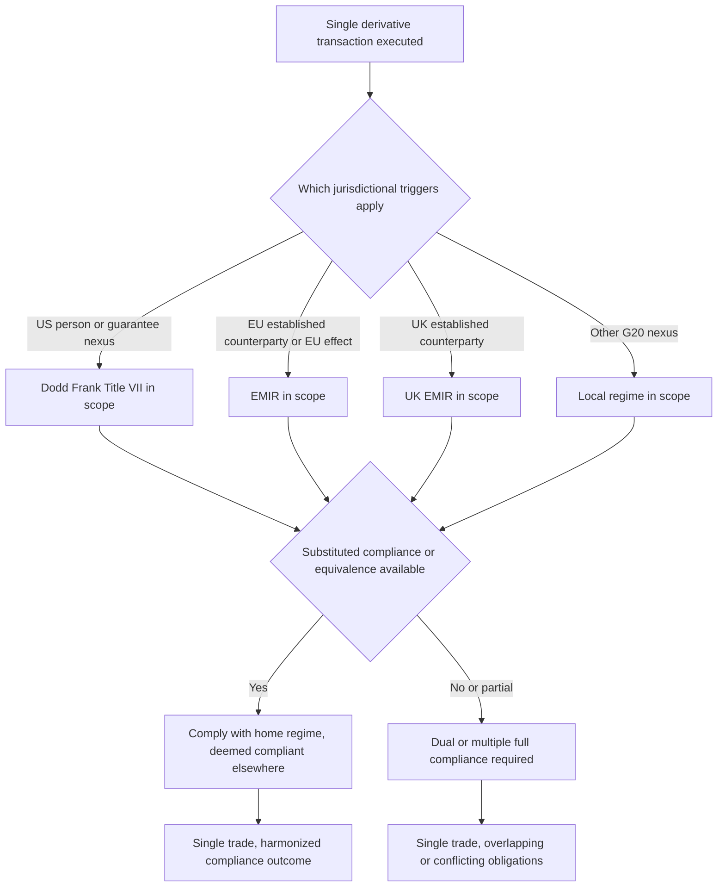

## Extraterritoriality and Cross Border Overlap

<syllabot_broad_topic/>

### Overview

Derivatives regulation is fundamentally cross-border in nature — a swap between a US dealer and a European counterparty, booked through an Asian branch and cleared at a UK-based CCP, can simultaneously fall within the regulatory perimeter of multiple national regimes. **Extraterritoriality** refers to a regulator's assertion of jurisdiction over activity that occurs, in whole or in part, outside its home territory, based on connections such as counterparty nationality, booking location, or market impact. This creates **cross-border overlap**: the same transaction can be subject to overlapping, sometimes conflicting, requirements from multiple regulators simultaneously, driving substantial industry effort toward **substituted compliance**, **equivalence determinations**, and **cross-border coordination frameworks**.

---

### Why Extraterritoriality Arises in Derivatives Regulation

**Key Points**

- Post-2008 reforms (Dodd-Frank in the US, EMIR in the EU, and equivalent frameworks in the UK, Japan, and other G20 jurisdictions) were designed around the G20 Pittsburgh commitments to reform OTC derivatives markets globally, but each jurisdiction implemented its own domestic legislation with its own **jurisdictional hooks** (tests for when the rule applies).
- Common jurisdictional triggers include:
  - **Counterparty nationality/incorporation** (e.g., a US person as defined under Dodd-Frank).
  - **Booking location** (the legal entity or branch through which a trade is booked, regardless of where the traders sit).
  - **Guarantee/support structures** (a foreign subsidiary whose obligations are guaranteed by a US or EU parent can pull that subsidiary's trades into scope).
  - **Market effect/nexus** (activity that regulators determine has a "direct and significant" connection to, or effect on, their domestic market).
- Because these tests are **not harmonized across jurisdictions**, a single trade can trigger multiple regimes' rules simultaneously — for example, a swap between a non-US bank's London branch and a non-US corporate could still be caught by Dodd-Frank if one party is guaranteed by a US parent, while also being subject to EMIR because the London branch (pre-Brexit) or a EU counterparty is involved.

---

### Key Extraterritorial Regimes

**Key Points**

- **Dodd-Frank (US)**: Title VII extends CFTC and SEC swap regulation to activity involving "US persons," and to non-US persons whose swap dealing activity has a "direct and significant connection with activities in, or effect on, commerce of the United States" — a deliberately broad standard that has driven extensive interpretive guidance and industry uncertainty over its precise boundaries.
- **EMIR (EU)**: applies to any EU-established counterparty, and separately captures certain third-country entity transactions where the contract has a "direct, substantial, and foreseeable effect" within the EU, or where the extraterritorial application is necessary to prevent the evasion of EMIR requirements.
- **UK EMIR (post-Brexit)**: following Brexit, the UK onshored EMIR into UK domestic law as a standalone regime ("UK EMIR"), which now operates in parallel with, but separately from, EU EMIR — meaning a single transaction between a UK and an EU counterparty can potentially fall within both regimes' scope, each with its own equivalence/recognition mechanics.
- **Other G20 regimes**: Japan (FIEA), Singapore (MAS), Hong Kong (SFC/HKMA), Australia (ASIC), and others each implemented their own domestic swap/derivatives reporting, clearing, and margin rules following the same G20 commitments, each with jurisdiction-specific triggers and technical requirements.

---

### Substituted Compliance and Equivalence Determinations

**Key Points**

- **Substituted compliance** (the US/CFTC/SEC term) and **equivalence** (the EU/EMIR term) are mechanisms by which a home regulator permits market participants to satisfy the home regulator's requirements by complying with a foreign jurisdiction's comparable rules instead, avoiding the need to comply with both regimes' full requirements simultaneously.
- The process typically requires:
  - A **formal determination** by the regulator that the foreign regime is "comparable" or produces "equivalent" outcomes across specific rule categories (e.g., clearing, margin, reporting, trade execution).
  - Determinations are often made **category by category** rather than as a single blanket equivalence — a jurisdiction might receive equivalence for margin requirements but not for trade reporting, for example.
  - Determinations can be **time-limited, conditional, or revocable**, and political/trade tensions between jurisdictions have historically affected the pace and scope of these determinations.
- Where no substituted compliance/equivalence determination exists for a given requirement, market participants may face **dual compliance obligations** — needing to satisfy both regimes' requirements in full for the same transaction, which can involve genuinely conflicting or duplicative requirements (e.g., differing reporting field formats, differing margin methodology, differing documentation requirements).

---

### Cross-Border Overlap Diagram

---

### Key Areas of Cross-Border Overlap

**Key Points**

- **Trade reporting**: differing field requirements, unique transaction identifier (UTI) generation rules, and reporting timelines across jurisdictions (e.g., CFTC swap data repository reporting vs. EMIR trade repository reporting vs. UK EMIR reporting) historically created significant duplicative reporting burden, prompting ongoing global efforts (such as CPMI-IOSCO's work on **Unique Transaction Identifiers (UTI)**, **Unique Product Identifiers (UPI)**, and **Critical Data Elements (CDE)**) to harmonize data standards across regimes.
- **Clearing mandates**: different jurisdictions mandate clearing for different product sets and through different eligible CCPs; cross-border recognition of foreign CCPs (e.g., US recognition of UK/EU CCPs and vice versa) has been a recurring point of negotiation, particularly acute around Brexit-era CCP recognition for euro-denominated clearing.
- **Margin requirements for uncleared derivatives**: the Basel Committee/IOSCO framework for **initial margin (IM)** and **variation margin (VM)** on non-centrally-cleared derivatives has been implemented with jurisdiction-specific timelines and technical variations, requiring substituted compliance analysis for cross-border counterparty relationships to determine which jurisdiction's margin methodology and documentation (e.g., ISDA CSA/SIMM variants) governs.
- **Trade execution requirements**: mandatory trading on regulated venues (Swap Execution Facilities under Dodd-Frank, Organized Trading Facilities/Multilateral Trading Facilities under MiFID II in the EU) creates overlapping venue-eligibility questions for cross-border counterparties.
- **Position limits and large trader reporting**: differing position limit regimes and reporting thresholds across commodity derivatives markets in particular can create overlapping or conflicting compliance obligations for globally active trading desks.

---

### Booking Model Implications

**Key Points**

- Banks structure their **legal entity and booking model** architecture partly in response to extraterritoriality concerns — deciding which legal entity and branch books a given trade materially affects which regulatory regime(s) apply.
- **Back-to-back booking** (where a trade is executed with a client by one entity and immediately offset with an intragroup trade booked in another entity/jurisdiction) is a common technique to manage regulatory capital, tax, and cross-border compliance considerations, but is itself subject to regulatory scrutiny to prevent it from being used purely for regulatory arbitrage.
- **Guarantee structures**: because certain regimes (notably Dodd-Frank) extend jurisdiction based on parental guarantees of a foreign subsidiary's obligations, banks must carefully track and manage guarantee arrangements, since these can inadvertently pull otherwise "local" foreign trades into a home regulator's extraterritorial scope.
- **Branch vs. subsidiary structuring**: operating in a foreign market via a branch (which typically remains part of the home-country legal entity) versus a locally incorporated subsidiary carries different regulatory consequences, since branches are more likely to be treated as an extension of the home entity for extraterritorial purposes.

---

### Governance and Coordination Mechanisms

**Key Points**

- **CPMI-IOSCO** and other international standard-setting bodies (Basel Committee, Financial Stability Board) coordinate on principles-level harmonization, but individual jurisdictions retain sovereign authority over final domestic implementation, meaning full harmonization has historically remained aspirational rather than fully achieved.
- **Memoranda of Understanding (MOUs)** between regulators (e.g., CFTC-ESMA, CFTC-FCA) establish cooperative supervisory arrangements, information-sharing protocols, and mutual recognition frameworks that underpin substituted compliance/equivalence determinations.
- **Industry bodies** (ISDA prominently) play a significant coordinating role, publishing cross-jurisdictional documentation protocols (e.g., variation margin and initial margin protocols) designed to allow market participants to amend legacy documentation efficiently across many counterparty relationships simultaneously in response to new cross-border regulatory requirements.

---

### Practical Pitfalls

- **Assuming booking location alone determines regulatory scope**: extraterritorial triggers based on counterparty guarantees, ultimate parent relationships, or market-effect tests can pull a trade into a regime's scope even when neither counterparty nor the booking entity is domiciled in that jurisdiction.
- **Treating equivalence/substituted compliance as static**: these determinations can be time-limited, subject to periodic renewal, or revoked in response to diverging regulatory reforms in either jurisdiction (as has occurred historically around Brexit-related UK-EU equivalence questions), requiring ongoing monitoring rather than a one-time assessment.
- **Underestimating documentation basis risk**: relying on a single, jurisdiction-agnostic set of trading documentation (ISDA Master Agreements, CSAs) without accounting for jurisdiction-specific protocol adherence can create gaps in cross-border margin or reporting compliance.
- **Ignoring evolving divergence risk**: as major jurisdictions independently revise frameworks (e.g., US Basel III Endgame recalibration, EU/UK FRTB timeline divergence — see related topics), previously aligned cross-border compliance approaches can drift out of alignment over time, requiring periodic reassessment of booking models and substituted compliance reliance.

---

**Next Steps**

- Dodd-Frank Title VII: US Person Definition and Extraterritorial Scope
- EMIR and UK EMIR: Divergence Since Brexit
- Substituted Compliance and Equivalence Determinations in Practice
- Cross-Border Margin Requirements for Uncleared Derivatives (UMR)
- CCP Recognition and Cross-Border Clearing Mandates
- Legal Entity and Booking Model Design for Global Derivatives Businesses