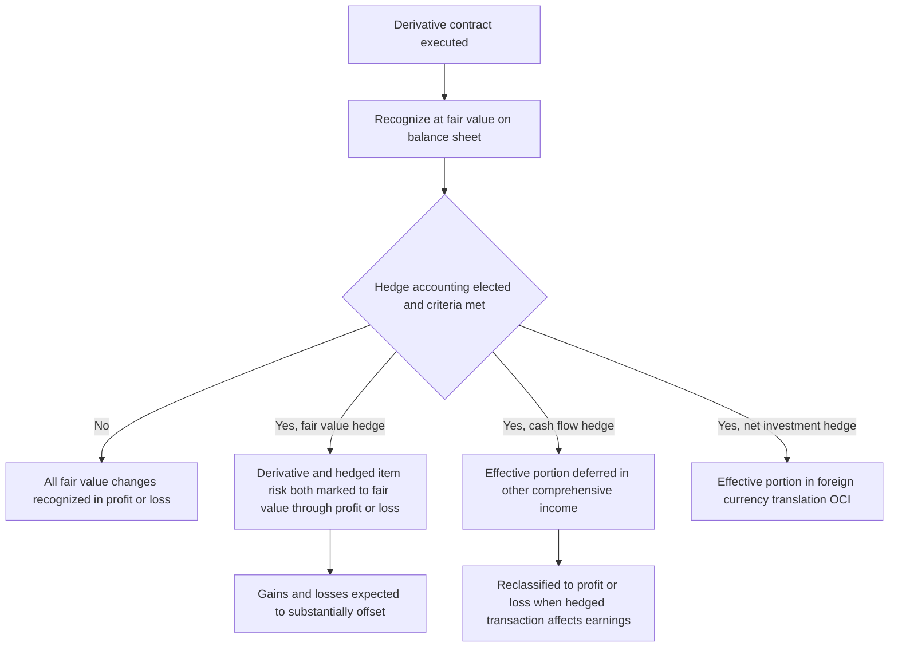

## Fair Value Accounting for Derivatives

### Overview

Under both **US GAAP** (primarily ASC 815, *Derivatives and Hedging*) and **IFRS** (IFRS 9, *Financial Instruments*), derivatives are generally required to be recognized on the balance sheet at **fair value**, with changes in fair value recognized either in profit or loss or, where specific hedge accounting criteria are met, partially or wholly in other comprehensive income (OCI). This represents a fundamental departure from historical-cost accounting and reflects the view that derivatives' economic value can change materially and rapidly, making fair value the only accounting measurement that provides decision-useful information.

---

### The Core Principle: Fair Value Through Profit or Loss (Absent Hedge Accounting)

**Key Points**

- Both frameworks start from the presumption that **all derivatives are measured at fair value**, with changes recognized in **profit or loss (P&L)** each period, unless the derivative qualifies for and is formally designated into a **hedge accounting relationship**.
- This default treatment applies regardless of the derivative's economic purpose — even a derivative used for genuine risk management (e.g., an interest rate swap hedging floating-rate debt) is marked to fair value through P&L unless hedge accounting is specifically elected and its stringent qualifying criteria are met.
- The **fair value hierarchy** (ASC 820 under US GAAP; IFRS 13 under IFRS, which are substantially converged) classifies fair value inputs into three levels:
  - **Level 1**: quoted prices in active markets for identical instruments (e.g., exchange-traded futures).
  - **Level 2**: observable inputs other than quoted prices (e.g., interest rate curves, implied volatilities from broker quotes) — the level at which most vanilla OTC derivatives (swaps, standard options) are typically classified.
  - **Level 3**: unobservable inputs requiring significant management judgment (e.g., long-dated exotic options, bespoke correlation products, or instruments referencing illiquid underlyings) — subject to enhanced disclosure requirements given the higher degree of estimation uncertainty.

---

### Definition of a Derivative for Accounting Purposes

**Key Points**

- Under ASC 815, an instrument is a derivative if it has **all three** of the following characteristics:
  1. One or more **underlyings** and one or more **notional amounts** (or payment provisions, or both).
  2. **No initial net investment**, or an initial net investment smaller than would be required for other contract types expected to have a similar response to market factors.
  3. Terms that require or permit **net settlement**, can readily be net settled through a mechanism outside the contract, or provide for delivery of an asset that puts the recipient in a position not substantially different from net settlement.
- IFRS 9 uses a substantially similar three-part definition, and both frameworks then carve out certain scope exceptions — most notably, contracts for the **normal purchase or sale** of a non-financial item (e.g., a commodity supply contract used in the ordinary course of business) are generally excluded from derivative accounting if specific criteria are met, avoiding the need to fair-value routine commercial contracts.
- **Embedded derivatives**: a derivative feature embedded within a non-derivative "host" contract (e.g., a convertible bond's conversion option, or an equity-linked note's equity participation feature) may need to be **bifurcated** and accounted for separately at fair value if its economic characteristics are not "clearly and closely related" to the host contract — a significant area of judgment, particularly for structured notes and hybrid instruments.

---

### Fair Value Measurement Techniques

**Key Points**

- For most vanilla OTC derivatives, fair value is derived from **discounted cash flow models** using market-observable curves (discount curves, forward curves) — for interest rate swaps, this means constructing the relevant forward and discount curves (often now bifurcated between an OIS/SOFR discounting curve and a separate forward-projection curve post-multi-curve transition).
- For optionality, standard **option pricing models** (Black-Scholes, Black-76, SABR, or more complex term structure models for exotic/path-dependent payoffs) are used, calibrated to observable implied volatility surfaces where available.
- **Credit and funding valuation adjustments** are integrated into the fair value measurement for uncollateralized or partially collateralized OTC derivatives:
  - **CVA (Credit Valuation Adjustment)**: adjustment for the counterparty's own default risk.
  - **DVA (Debit Valuation Adjustment)**: adjustment reflecting the reporting entity's own credit risk (a source of historically controversial "gains" from an entity's own credit deterioration, since a firm's fair value liability decreases as its own credit risk increases).
  - **FVA (Funding Valuation Adjustment)**: adjustment for the cost/benefit of funding uncollateralized derivative positions, an area with ongoing industry and standard-setter debate about the appropriate accounting treatment and its interaction with CVA/DVA.
- **Non-performance risk**: IFRS 13 and ASC 820 both explicitly require fair value measurement to incorporate the effect of non-performance risk, which includes both counterparty and the reporting entity's own credit risk — reinforcing the CVA/DVA framework as a required, not optional, component of derivative fair value.

---

### Hedge Accounting as an Exception to Default P&L Treatment

**Key Points**

- **Hedge accounting** is an elective, not mandatory, accounting treatment that allows an entity to better align the timing of gain/loss recognition on a derivative with the recognition of the exposure it is economically hedging, reducing artificial P&L volatility that would otherwise arise from marking only the derivative (and not the hedged item) to fair value.
- Three principal hedge accounting models exist under both frameworks:
  - **Fair value hedge**: hedges exposure to changes in the fair value of a recognized asset/liability or firm commitment (e.g., hedging fixed-rate debt's fair value exposure to interest rate changes with a receive-fixed swap). Both the derivative and the hedged item's relevant risk are marked to fair value through P&L, with gains/losses expected to substantially offset.
  - **Cash flow hedge**: hedges exposure to variability in cash flows of a forecasted transaction or variable-rate exposure (e.g., hedging floating-rate debt's cash flow variability with a pay-fixed swap). The **effective portion** of the derivative's fair value change is deferred in **OCI** and reclassified to P&L when the hedged transaction affects earnings; any **ineffective portion** is recognized immediately in P&L.
  - **Net investment hedge**: hedges the foreign currency exposure of a net investment in a foreign operation, with the effective portion of gain/loss recognized in the foreign currency translation component of OCI.
- **Qualifying criteria** are stringent and require, at inception and on an ongoing basis, **formal documentation** of the hedging relationship, the risk management objective, the hedged item, the hedging instrument, and the methodology for assessing effectiveness, along with an expectation (and, under US GAAP, ongoing demonstration) of a **highly effective** offsetting relationship between the hedging instrument and the hedged item.
- IFRS 9's hedge accounting model introduced a more principles-based, less bright-line **effectiveness testing** approach (replacing IAS 39's stricter 80–125% quantitative bright-line test) compared to ASC 815, which — even after simplification under ASU 2017-12 — retains more prescriptive effectiveness assessment and documentation requirements; this is one of the more consequential areas of continuing divergence between US GAAP and IFRS.

---

### Fair Value and Hedge Accounting Workflow

---

### Disclosure Requirements

**Key Points**

- Both frameworks require extensive **quantitative and qualitative disclosures** about derivative and hedging activities, including:
  - The nature and purpose of derivative instruments held.
  - Notional amounts and fair values, disaggregated by risk type and by whether designated in a hedge accounting relationship.
  - Gains and losses recognized, disaggregated by location in the financial statements (P&L line item vs. OCI).
  - Credit-risk-related contingent features (e.g., collateral posting triggers linked to credit rating downgrades).
- **Fair value hierarchy disclosures** (Level 1/2/3 classification, and for Level 3 specifically, a reconciliation of opening to closing balances and sensitivity of fair value to changes in unobservable inputs) are required to give users of financial statements insight into the degree of estimation uncertainty embedded in reported derivative fair values.

---

### US GAAP vs. IFRS: Key Areas of Divergence

**Key Points**

- **Hedge effectiveness testing**: as noted, IFRS 9 is generally more principles-based and permits a broader range of hedging strategies to qualify (e.g., hedging risk components of non-financial items more readily) than ASC 815, even post-simplification.
- **Own-use/normal purchase and sale scope exceptions**: while conceptually similar, the specific criteria and elections required differ in detail between the two frameworks, creating potential divergence in which commodity and similar contracts are scoped out of derivative accounting.
- **Embedded derivative bifurcation for financial assets**: IFRS 9's classification and measurement model for financial assets (based on business model and contractual cash flow characteristics) generally does not require separate bifurcation of embedded derivatives within a financial asset host (the whole hybrid instrument is instead classified and measured as a unit), whereas ASC 815 retains a bifurcation model for embedded derivatives in most host contract types — a substantive difference in approach relevant to structured note issuance and investment.
- **Own credit risk (DVA) presentation**: IFRS 9 requires changes in fair value of financial liabilities designated at fair value through profit or loss attributable to the entity's own credit risk to be presented in OCI (rather than P&L) in most circumstances, reducing the counterintuitive P&L volatility from an entity's own credit deterioration; ASC 815/825 treatment of own-credit-risk components for derivative liabilities has historically differed in mechanics, making this a notable area of comparative divergence between the two frameworks for structured products issuers. [Inference: given the complexity and periodic updates to standards in this area, entities should confirm current treatment against the applicable standard's latest amendments for their specific instrument type.]

---

### Practical Implications for Structured Products and Exotic Derivatives

**Key Points**

- **Embedded derivative bifurcation** is a central accounting question for structured notes (see related chapter topics on range accrual, steepener, and credit-linked notes), since the host debt instrument and any embedded equity, rate, or credit-linked feature may require separate fair value accounting depending on the bifurcation analysis outcome.
- **Level 3 classification** is common for exotic and structured derivatives referencing illiquid underlyings, bespoke correlation assumptions, or long-dated unobservable volatility/correlation inputs, driving significant disclosure and valuation-control (independent price verification) obligations for issuing and holding institutions.
- **Day-one gain/loss recognition**: where a derivative's fair value at inception is estimated using a model with at least one significant unobservable input, both frameworks generally restrict immediate recognition of any resulting "day-one" gain or loss (the difference between the transaction price and the model-derived fair value), often requiring deferral and amortization, or recognition only when the relevant inputs become observable — a particularly relevant consideration for structuring desks pricing bespoke, non-standardized derivatives.

---

### Practical Pitfalls

- **Assuming hedge accounting is automatic for economically effective hedges**: even a derivative that perfectly offsets an economic exposure will still flow entirely through P&L unless the formal, contemporaneous hedge accounting documentation and qualifying criteria are satisfied — a common source of unexpected P&L volatility for treasury and risk teams that assume "economic hedge" and "accounting hedge" are synonymous.
- **Underestimating embedded derivative bifurcation complexity**: structured note issuers and investors can face materially different accounting outcomes depending on subtle differences in contractual terms affecting whether a feature is "clearly and closely related" to its host, requiring careful, instrument-specific legal and accounting analysis.
- **Overlooking Level 3 valuation control requirements**: fair-valuing exotic or structured derivatives without robust independent price verification and documented unobservable input sensitivity analysis creates both accounting and regulatory (e.g., valuation-risk-related capital) exposure.
- **Treating US GAAP and IFRS derivative accounting as fully converged**: while broadly aligned in principle following years of convergence efforts, meaningful differences remain (hedge effectiveness testing, embedded derivative bifurcation for financial assets, own-credit-risk presentation) that can produce materially different reported results for economically identical positions under the two frameworks.

---

**Next Steps**

- Hedge Accounting Documentation and Effectiveness Testing (ASC 815 vs. IFRS 9)
- Embedded Derivative Bifurcation for Structured Notes
- CVA, DVA, and FVA in Derivative Fair Value Measurement
- Fair Value Hierarchy and Level 3 Valuation Controls
- Day-One Gain/Loss Recognition for Model-Priced Derivatives
- Tax Treatment of Derivatives (Mark-to-Market vs. Realization Methods)