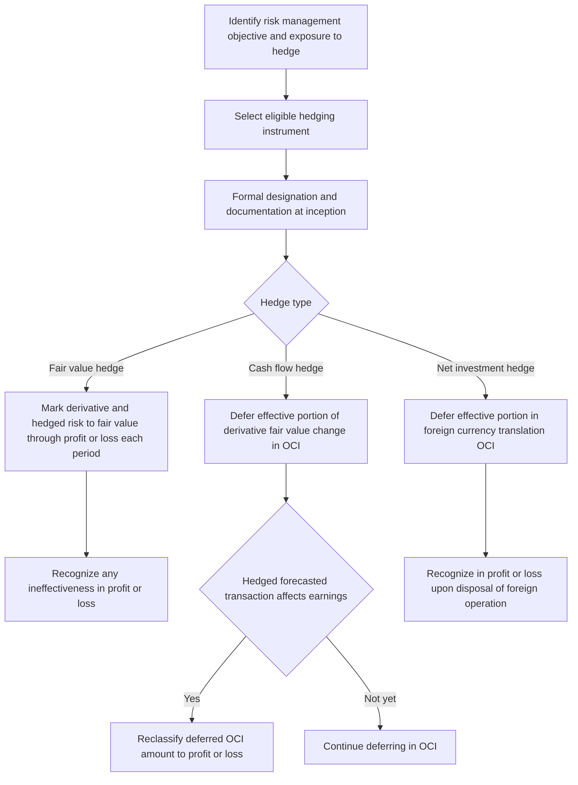

## Hedge Accounting Under ASC 815 and IFRS 9

### Overview

Hedge accounting is an elective accounting framework — under **US GAAP (ASC 815)** and **IFRS (IFRS 9)** — that allows an entity to align the timing of gain/loss recognition on a designated hedging instrument (typically a derivative) with the recognition of the offsetting change in the hedged item or hedged transaction. Without hedge accounting, a derivative used for genuine risk management purposes would flow entirely through profit or loss (P&L) while the exposure it hedges might not be remeasured on a comparable basis, creating artificial earnings volatility that does not reflect the underlying economics of the hedging strategy.

---

### The Three Hedge Accounting Models

**Key Points**

- **Fair Value Hedge**: hedges exposure to changes in the **fair value** of a recognized asset, liability, or unrecognized firm commitment attributable to a specific risk (e.g., hedging the fair value of fixed-rate debt against interest rate risk using a receive-fixed, pay-floating swap).
  - Both the derivative and the **hedged risk in the hedged item** are remeasured to fair value through P&L each period.
  - Gains/losses on the derivative and the hedged item's fair value change are expected to substantially offset; any **net ineffectiveness** flows directly to P&L.
- **Cash Flow Hedge**: hedges exposure to **variability in cash flows** of a recognized asset/liability or a highly probable forecasted transaction (e.g., hedging floating-rate debt's interest payment variability with a pay-fixed swap, or hedging a forecasted foreign-currency purchase with an FX forward).
  - The **effective portion** of the derivative's fair value change is deferred in **Other Comprehensive Income (OCI)** (termed "Accumulated Other Comprehensive Income," AOCI, under US GAAP) rather than recognized immediately in P&L.
  - Amounts deferred in OCI are reclassified into P&L in the same period(s) that the hedged forecasted transaction affects earnings (e.g., as the hedged floating-rate interest expense is recognized).
  - Any **ineffective portion** (excess derivative gain/loss beyond what is needed to offset the hedged item) is recognized immediately in P&L under US GAAP; IFRS 9's more principles-based effectiveness model handles ineffectiveness recognition somewhat differently in mechanics but preserves the same conceptual split.
- **Net Investment Hedge**: hedges the foreign-currency exposure of a reporting entity's **net investment in a foreign operation** (e.g., using FX forwards or foreign-currency-denominated debt to hedge translation risk on a foreign subsidiary).
  - The effective portion of the hedging instrument's gain/loss is recognized in the **foreign currency translation** component of OCI, mirroring the treatment of the underlying translation adjustment being hedged.

---

### Qualifying Criteria for Hedge Accounting

**Key Points**

- **Formal designation and documentation** at hedge inception is required under both frameworks, including:
  - The risk management objective and strategy for undertaking the hedge.
  - Identification of the hedging instrument and the hedged item/transaction.
  - The specific risk being hedged (e.g., benchmark interest rate risk, not total fair value/cash flow risk, in many interest rate hedges).
  - The methodology for assessing hedge effectiveness, both prospectively and (where required) retrospectively.
- **Eligible hedged items**: recognized assets/liabilities, firm commitments, highly probable forecasted transactions, and net investments in foreign operations; both frameworks permit hedging of **risk components** (e.g., only the benchmark interest rate component of a corporate bond's overall credit-and-rate risk, or a specific commodity price component of a larger purchase contract) provided that component is separately identifiable and reliably measurable.
- **Eligible hedging instruments**: derivatives are the most common hedging instrument, though non-derivative financial instruments (e.g., foreign-currency-denominated debt) are eligible for FX risk hedges, particularly in net investment hedges; purchased options and combinations of derivatives are also eligible under both frameworks, with specific rules for how time value and other components are treated.
- **"Highly probable" forecasted transactions**: for cash flow hedges of forecasted transactions, the transaction must be **highly probable** (a higher probability threshold than merely "expected"), and hedge accounting must be discontinued prospectively if the forecasted transaction is no longer expected to occur.

---

### Hedge Effectiveness: The Key Point of Divergence

**Key Points**

- **Pre-2017 US GAAP and IAS 39 (legacy IFRS)** both historically required a **quantitative bright-line effectiveness test**, commonly the "80–125% rule": the cumulative change in fair value/cash flows of the hedging instrument had to fall within 80% to 125% of the offsetting change in the hedged item for the hedge to qualify, both prospectively and retrospectively, each reporting period.
- **IFRS 9** replaced this bright-line quantitative threshold with a more **principles-based effectiveness assessment**, requiring only that:
  1. There is an **economic relationship** between the hedged item and hedging instrument (values are expected to move in offsetting directions in response to the hedged risk).
  2. **Credit risk** does not dominate the value changes resulting from that economic relationship.
  3. The **hedge ratio** designated is consistent with the actual quantities used for risk management purposes (not artificially adjusted to create accounting-motivated ineffectiveness or over-effectiveness).
- **US GAAP (ASC 815), post-ASU 2017-12 ("Targeted Improvements to Accounting for Hedging Activities")**, significantly simplified hedge accounting but retained a more prescriptive framework than IFRS 9:
  - Introduced the ability to perform **qualitative** effectiveness assessments in many circumstances (rather than mandatory quantitative testing every period), where the hedge is expected to be, and continues to be, highly effective.
  - Eliminated the requirement to separately measure and record hedge ineffectiveness for many qualifying hedges — for cash flow and net investment hedges meeting specific criteria, the **entire change in fair value of the hedging instrument** can be recorded in OCI, avoiding a separate ineffectiveness component in P&L.
  - Expanded the population of eligible hedging strategies (e.g., partial-term hedges, hedges of contractually specified components in nonfinancial forecasted transactions).
- Despite this convergence-oriented simplification, ASC 815 **still requires an initial quantitative assessment in many cases** and retains a distinct, more codified rules structure than IFRS 9's principles-based model, meaning identical economic hedging strategies can, in edge cases, produce different qualification outcomes or different mechanics of ineffectiveness recognition between the two frameworks. [Inference: because both standards have been subject to periodic amendment, entities should confirm the current text of the applicable standard for their specific fact pattern rather than relying solely on a general comparative summary.]

---

### Hedge Accounting Lifecycle

---

### Discontinuation of Hedge Accounting

**Key Points**

- Hedge accounting must be **discontinued prospectively** (not retrospectively unwound) when:
  - The hedging relationship no longer meets the qualifying criteria (e.g., the economic relationship breaks down, or the entity's risk management objective changes).
  - The hedging instrument is sold, terminated, or exercised.
  - For cash flow hedges, the forecasted transaction is no longer highly probable of occurring — if the transaction is **no longer expected to occur at all**, amounts previously deferred in OCI are reclassified to P&L immediately, rather than continuing to be deferred.
  - Under IFRS 9, an entity may **voluntarily discontinue** hedge accounting even when qualifying criteria continue to be met (unlike some prior IAS 39 restrictions), reflecting the more principles-based, risk-management-aligned philosophy of the standard.
- Upon discontinuation of a **fair value hedge**, any cumulative fair value adjustment previously made to the carrying amount of the hedged item (for hedged items measured at amortized cost, such as fixed-rate debt) is generally amortized to P&L over the remaining life of the hedged item rather than reversed immediately.

---

### Macro Hedging and Portfolio Hedge Accounting

**Key Points**

- Both frameworks accommodate hedging of a **closed portfolio of similar items** rather than requiring one-to-one designation of a single hedging instrument to a single hedged item, which is important for entities (particularly financial institutions) managing interest rate risk on a portfolio basis rather than transaction-by-transaction.
- The **IASB's separate project on macro hedge accounting** (sometimes called "dynamic risk management") has explored a more comprehensive model for portfolio-level interest rate risk management that would depart further from the individual hedge-relationship model, though as of this writing this remains a distinct, evolving area of standard-setting separate from the core IFRS 9 hedge accounting requirements used today. [Inference: given that this is an active standard-setting project, its current status and any interim guidance should be confirmed against the latest IASB publications.]

---

### Practical Implications for Derivatives Desks and Corporate Treasury

**Key Points**

- **Interest rate swap hedges of debt**: among the most common hedge accounting applications — pay-fixed swaps hedging floating-rate debt (cash flow hedges) and receive-fixed swaps hedging fixed-rate debt (fair value hedges) are standard treasury hedging strategies requiring careful documentation to qualify.
- **FX forward and option hedges of forecasted transactions**: commonly used to hedge forecasted foreign-currency revenue or purchases; the "highly probable" threshold and the treatment of **time value of options** (which under both frameworks can be treated as a cost of hedging, amortized to P&L or deferred in OCI depending on the nature of the hedged item, rather than creating P&L volatility from the option's time decay) are key structuring considerations.
- **Commodity hedges**: hedging a specific price-risk component (e.g., the crude oil component of a jet fuel purchase) rather than the entire contract price is explicitly permitted under both frameworks where that component is separately identifiable, a valuable flexibility for corporates hedging commodity input costs.
- **Structured/hybrid hedging instruments**: use of non-vanilla derivatives (e.g., collars, knock-out options) as hedging instruments is permitted but requires careful effectiveness assessment given the more complex payoff profile relative to the linear exposure typically being hedged.

---

### Practical Pitfalls

- **Treating "economically effective" as synonymous with "qualifies for hedge accounting"**: even a derivative that fully offsets an economic exposure will be recognized entirely through P&L absent proper formal designation, documentation, and ongoing qualification under the applicable standard — a frequent source of unexpected earnings volatility.
- **Inadequate or late documentation**: hedge accounting documentation must generally be completed **at or before** hedge inception; retrospective documentation, or documentation completed after the hedge relationship has already been in place, disqualifies the relationship from hedge accounting treatment for the period(s) prior to proper documentation.
- **Overlooking dedesignation and re-designation mechanics**: entities sometimes fail to properly track the amortization of cumulative fair value hedge adjustments, or the timing of OCI reclassification for cash flow hedges, after a hedge relationship is discontinued or modified.
- **Assuming full US GAAP/IFRS convergence post-ASU 2017-12**: while the 2017 US GAAP simplification narrowed many practical differences with IFRS 9, meaningful structural differences remain (particularly around initial quantitative assessment requirements and voluntary dedesignation), and economically identical hedge strategies can still produce different accounting outcomes depending on which framework applies.

---

**Next Steps**

- Fair Value Accounting for Derivatives and the Fair Value Hierarchy
- Embedded Derivative Bifurcation for Structured Notes
- Macro Hedge Accounting and Dynamic Risk Management (IASB Project)
- Time Value of Options as a Cost of Hedging
- Tax Treatment of Derivatives (Mark-to-Market vs. Realization Methods)
- Documentation Requirements and Common Hedge Accounting Audit Findings