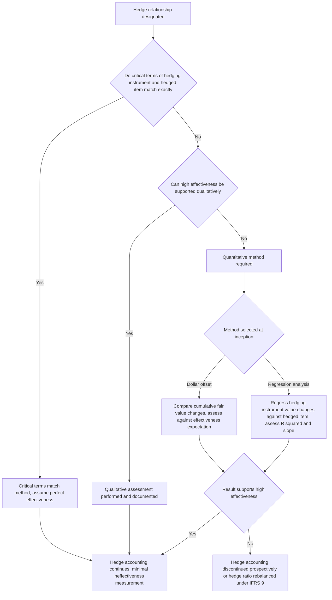

## Effectiveness Testing for Hedge Accounting

### Overview

Hedge effectiveness testing is the analytical process by which an entity demonstrates that a hedging relationship produces (and is expected to continue producing) offsetting changes in fair value or cash flows between a hedging instrument and a hedged item, sufficient to qualify for hedge accounting treatment under **ASC 815** (US GAAP) or **IFRS 9**. Effectiveness testing determines both whether a hedge **qualifies** for hedge accounting at inception and on an ongoing basis, and how much **ineffectiveness** (if any) must be recognized directly in profit or loss (P&L) rather than deferred.

---

### Purpose and Timing of Effectiveness Assessment

**Key Points**

- **Prospective assessment**: performed at hedge inception (and at each subsequent reporting date under US GAAP's more prescriptive model) to determine whether the hedge is **expected to be highly effective** in achieving offsetting changes going forward.
- **Retrospective assessment**: performed at each reporting date (historically required under both frameworks, though IFRS 9 removed the mandatory quantitative retrospective test) to determine how effective the hedge **actually was** during the period just ended, and to quantify any ineffectiveness requiring separate P&L recognition.
- Both assessments matter because a hedge can be prospectively expected to be effective but experience retrospective ineffectiveness in a given period due to basis differences, timing mismatches, or counterparty credit risk changes.

---

### Effectiveness Testing Approaches

**Key Points**

- **Critical Terms Match method**: the simplest qualifying approach — if the critical terms of the hedging instrument (notional, underlying, maturity date, reset dates, payment dates) exactly match the critical terms of the hedged item/risk, the hedge can be assumed to be perfectly effective without further quantitative testing (e.g., a receive-fixed swap with identical notional, rate index, reset dates, and maturity to the fixed-rate debt it hedges).
- **Qualitative assessment**: permitted under both frameworks (and significantly expanded under US GAAP following ASU 2017-12) where the entity can reasonably support an expectation of high effectiveness based on the nature of the hedging relationship without a full quantitative regression or dollar-offset calculation each period — commonly used for straightforward hedges with closely matched terms that fall short of an exact critical-terms match.
- **Dollar-offset method**: a quantitative approach comparing the cumulative change in fair value (or cash flows) of the hedging instrument to the cumulative change in fair value (or cash flows) of the hedged item, expressing the result as a ratio:

$$\text{Effectiveness Ratio} = \frac{\Delta \text{Fair Value of Hedging Instrument}}{\Delta \text{Fair Value of Hedged Item}}$$

Historically (under legacy IAS 39 and pre-simplification US GAAP practice), a ratio falling within **80% to 125%** was considered to demonstrate high effectiveness — the well-known "80–125% rule."

- **Regression analysis**: a statistical approach regressing historical or hypothetical changes in the hedging instrument's value against changes in the hedged item's value, assessing effectiveness via the resulting **R-squared**, **slope coefficient**, and **statistical significance (F-statistic)** of the regression — commonly used for hedges of risk components or cross-currency/cross-index hedges where an exact critical-terms match is not achievable (e.g., hedging a corporate bond's credit spread risk is not feasible, but hedging its benchmark interest rate component via regression against a swap rate index may be supportable).
- **Scenario analysis**: stress-testing the hedge relationship's expected offset behavior across a range of hypothetical market movements (parallel shifts, curve twists, volatility changes) to demonstrate the economic relationship holds across plausible future states, particularly relevant for the IFRS 9 "economic relationship" requirement.

---

### IFRS 9's Principles-Based Effectiveness Requirements

**Key Points**

- IFRS 9 replaced the bright-line 80–125% dollar-offset test with three qualitative (though quantitatively supportable) conditions that must **all** be met for a hedging relationship to qualify:
  1. **Economic relationship**: the hedging instrument and hedged item are expected to have values that generally move in the opposite direction because of the same risk (the hedged risk) — this can be demonstrated qualitatively for straightforward relationships or via regression/scenario analysis for more complex ones, but does not require a specific numerical threshold to be met each period.
  2. **Credit risk does not dominate**: the effect of credit risk (of either the reporting entity or the counterparty to the hedging instrument) must not dominate the value changes that result from the economic relationship — i.e., the hedge relationship's offset should not be substantially undermined by credit-driven fair value movements unrelated to the hedged market risk.
  3. **Hedge ratio consistency**: the hedge ratio designated for accounting purposes must be the **same ratio actually used for risk management purposes** — an entity cannot designate an artificially different quantity of the hedging instrument purely to create a more favorable accounting outcome (e.g., to deliberately introduce ineffectiveness that offsets ineffectiveness elsewhere, or conversely to mask a genuine imbalance).
- Under IFRS 9, if a hedge relationship's actual hedge ratio (per the risk management strategy) would create ineffectiveness, the standard requires **rebalancing** the hedge ratio (adjusting the quantities of the hedging instrument or hedged item designated) rather than discontinuing the hedge relationship entirely, provided the risk management objective for the hedge remains unchanged — this "rebalancing" mechanic is a distinctive feature not present in the legacy 80–125% framework.

---

### US GAAP (ASC 815) Effectiveness Requirements Post-ASU 2017-12

**Key Points**

- Retains a **"highly effective"** qualifying threshold (conceptually similar to, though not numerically identical to, the legacy 80–125% guidance, which is no longer a bright-line requirement but continues to inform practice as a reasonable benchmark in some interpretations).
- Permits a **qualitative assessment** at hedge inception and in subsequent periods when facts and circumstances indicate continued high effectiveness, without requiring a fresh quantitative test every period — a significant simplification from pre-2017 practice, which generally required quantitative retrospective testing at each reporting date.
- For qualifying **cash flow hedges and net investment hedges** meeting specified criteria (notably where critical terms match or a qualitative assessment supports high effectiveness), the standard permits recognizing the **entire change in fair value** of the hedging instrument in OCI, eliminating the need to separately compute and recognize a distinct ineffectiveness component in P&L — a substantial reduction in operational complexity for many common hedge structures.
- Where a **quantitative method** is still used (e.g., for more complex hedges, or where qualitative assessment is not supportable), regression analysis and dollar-offset remain acceptable methodologies, with the entity's documented methodology at inception governing which approach applies throughout the hedge relationship's life (a change in method generally is not permitted without dedesignating and redesignating the hedge).

---

### Effectiveness Testing Decision Flow

---

### Sources of Hedge Ineffectiveness

**Key Points**

- **Basis risk**: the hedging instrument's underlying does not exactly match the hedged item's risk (e.g., hedging a corporate borrowing rate with a swap referencing a benchmark rate that is highly, but not perfectly, correlated with the entity's actual borrowing spread).
- **Timing mismatches**: differences in reset dates, payment dates, or maturity between the hedging instrument and hedged item, even when the underlying risk is identical, can generate measurable ineffectiveness.
- **Counterparty and own credit risk changes**: fair value movements in the hedging instrument attributable to changes in counterparty credit risk (or the entity's own credit risk, for liabilities) are not offset by any corresponding movement in the hedged item's value, and can be a source of ineffectiveness particularly for longer-dated, uncollateralized derivative hedges.
- **Notional/hedge ratio mismatches**: hedging a different notional amount than the actual hedged exposure (whether due to rounding, partial-term hedging, or a deliberate risk management decision) creates a structural, quantifiable source of ineffectiveness.
- **Optionality mismatches**: using an option-based hedging instrument (e.g., a cap) to hedge a linear exposure, or vice versa, introduces convexity-driven ineffectiveness that a linear dollar-offset or regression approach must specifically capture.

---

### Practical Implementation Considerations

**Key Points**

- **Documentation of methodology at inception is critical**: both frameworks require the effectiveness assessment methodology to be specified in the hedge documentation at the time of designation; a methodology cannot generally be selected retroactively or changed opportunistically after observing actual results.
- **Regression sample period and frequency selection**: for regression-based testing, the choice of historical lookback period, observation frequency (daily, weekly, monthly), and whether to use actual historical data versus hypothetical derivative construction materially affects the resulting statistical outputs and therefore the qualification conclusion — a significant area of accounting judgment requiring consistent, well-documented policies.
- **Rebalancing mechanics under IFRS 9**: entities using dynamic hedge ratios must have processes in place to detect when rebalancing is required (i.e., when the actual risk-management hedge ratio has changed) and to properly account for the rebalancing as a continuation of the existing hedge relationship (not a new designation), which affects how cumulative OCI amounts and any existing ineffectiveness are carried forward.
- **Interaction with the IBOR transition and rate benchmark reform**: temporary reliefs were introduced by both the FASB and IASB during the transition away from LIBOR-style benchmarks to mitigate hedge accounting disruption caused purely by benchmark rate reform (rather than genuine changes in the hedge relationship's economics); entities with legacy hedges referencing transitioning benchmarks should confirm whether any such relief provisions remain applicable to their specific fact pattern.

---

### Practical Pitfalls

- **Applying the legacy 80–125% test as a hard requirement under IFRS 9**: since IFRS 9 removed the bright-line quantitative threshold, continuing to apply it as an absolute pass/fail criterion (rather than as one possible piece of supporting evidence within the broader principles-based assessment) misapplies the current standard.
- **Failing to detect the need for rebalancing under IFRS 9**: overlooking changes in the entity's actual risk management hedge ratio can result in a hedge relationship that no longer satisfies the "hedge ratio consistency" condition, jeopardizing continued qualification.
- **Inconsistent regression methodology across periods**: changing the regression lookback window, data frequency, or model specification between periods without a substantive documented reason undermines the reliability and auditability of the effectiveness conclusion.
- **Overlooking credit risk as a driver of ineffectiveness**: particularly for longer-dated or credit-sensitive hedging instruments, failing to isolate and assess the credit risk component's effect on fair value changes can mask genuine ineffectiveness that both frameworks require to be identified and, under US GAAP in particular, appropriately recognized.

---

**Next Steps**

- Hedge Accounting Under ASC 815 and IFRS 9 (Qualifying Criteria and Models)
- Dollar-Offset and Regression Methodologies in Practice
- Hedge Ratio Rebalancing Mechanics Under IFRS 9
- Benchmark Rate Reform (IBOR Transition) and Hedge Accounting Relief Provisions
- Fair Value Accounting for Derivatives and the Fair Value Hierarchy
- Documentation Standards and Common Audit Findings in Hedge Accounting