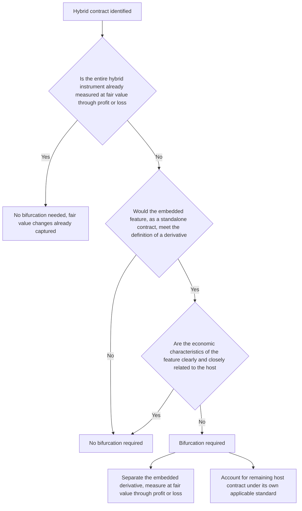

## Embedded Derivatives and Bifurcation

### Overview

An embedded derivative is a feature within a hybrid (combined) contract whose economic characteristics behave like a derivative, even though the overall contract is not itself classified as a derivative. Common examples include a convertible bond's conversion option, an equity-linked note's equity participation feature, or a lease with an inflation-indexed rent escalator. **Bifurcation** is the accounting process of separating such an embedded derivative from its "host" contract and accounting for it independently at fair value through profit or loss (P&L), while the remaining host contract is accounted for under its own applicable standard (e.g., amortized cost for a debt host).

---

### Why Bifurcation Exists

**Key Points**

- If embedded derivative features were never separated from their host, an issuer or investor could effectively achieve derivative-like economic exposure (equity participation, leveraged rate exposure, credit-linked payoff) while avoiding fair value accounting simply by wrapping the feature inside a debt or lease instrument.
- Bifurcation exists to prevent this form of **accounting arbitrage**: it ensures that a derivative-like risk embedded in a hybrid contract receives the same fair value measurement and P&L volatility treatment as a standalone derivative would, regardless of the legal form chosen to deliver that exposure.
- This is a particularly central issue for the **structured products and structured notes** market, where hybrid instruments combining a debt host with embedded equity, rate, commodity, or credit-linked features are the norm rather than the exception (see related chapter topics on range accrual, steepener, and credit-linked notes).

---

### The Three-Part Bifurcation Test (ASC 815)

**Key Points**

- Under US GAAP (ASC 815), an embedded feature must be **bifurcated and accounted for separately at fair value** if **all three** of the following conditions are met:
  1. The economic characteristics and risks of the embedded feature are **not clearly and closely related** to the economic characteristics and risks of the host contract.
  2. The hybrid instrument is **not already measured at fair value** through earnings (if the entire hybrid instrument is already marked to fair value through P&L, there is no need to separately bifurcate, since the embedded feature's fair value changes are already captured).
  3. A **separate instrument with the same terms as the embedded feature** would, on a standalone basis, meet the definition of a derivative under ASC 815 (i.e., it has an underlying, a notional, little or no initial net investment, and net settlement characteristics).
- If any one of the three conditions is **not** met, bifurcation is not required, and the hybrid instrument is accounted for as a single unit (though the entity may still elect the **fair value option** to measure the entire hybrid contract at fair value, which similarly avoids the need for a separate bifurcation analysis).

---

### "Clearly and Closely Related" — The Central Judgment

**Key Points**

- This is the most judgment-intensive element of the bifurcation test, and much of ASC 815's implementation guidance (and analogous IFRS guidance under legacy IAS 39, which continues to inform judgment for financial liability hosts under IFRS 9) consists of examples illustrating when a feature is, or is not, closely related to its host.
- **Common examples of features generally NOT closely related to a debt host (thus requiring bifurcation)**:
  - An **equity conversion option** in a convertible bond (equity risk is not closely related to debt/interest rate risk).
  - A **commodity-indexed** interest or principal payment in an otherwise conventional debt instrument.
  - A **leveraged inflation-indexed** payment feature that is not a standard, non-leveraged inflation adjustment (a straightforward, non-leveraged inflation adjustment on a debt instrument is often considered closely related; a leveraged or otherwise unusual formula is not).
  - A **credit-linked payoff** referencing a third-party reference entity distinct from the issuer (as in a credit-linked note).
  - Call/put options in a debt host whose exercise price is not clearly and closely related to the debt's amortized cost (e.g., a call option struck significantly above or below par, or contingent on a non-interest-rate-related event).
- **Common examples of features generally closely related to a debt host (no bifurcation required)**:
  - A standard **call, put, or prepayment option** in a debt instrument where the exercise price approximates amortized cost at the exercise date.
  - An interest rate **cap or floor that is at or out of the money** at issuance on a floating-rate debt instrument referencing a market interest rate index (an interest rate index itself is generally considered closely related to a debt host, since interest rate risk is inherent to debt).
  - A **non-leveraged inflation adjustment** to interest or principal payments, consistent with the currency of the debt instrument.

---

### Bifurcation Decision Framework

---

### IFRS 9's Different Approach for Financial Assets

**Key Points**

- A significant and consequential divergence from US GAAP: **IFRS 9 does not require bifurcation of embedded derivatives within financial assets** (as opposed to financial liabilities or non-financial hosts).
- Instead, under IFRS 9's classification and measurement model, the **entire hybrid financial asset** is classified as a single unit based on:
  - The entity's **business model** for managing the financial asset (held to collect contractual cash flows, held to collect and sell, or other).
  - Whether the instrument's contractual cash flows are **solely payments of principal and interest (SPPI)** on the principal amount outstanding.
- If a hybrid financial asset's embedded feature causes its cash flows to **fail the SPPI test** (e.g., an equity-linked or leveraged-inflation-linked bond held as an investment), the **entire instrument** is measured at fair value through profit or loss — there is no separate bifurcation of just the embedded feature.
- For **financial liabilities** and for hosts that are not financial assets under IFRS 9's scope (e.g., a lease host, an insurance contract host, or an executory contract host), IFRS 9 **retains a bifurcation model substantially similar to legacy IAS 39** and to ASC 815's approach, meaning the divergence is specific to financial asset hosts, not embedded derivatives in general.
- This creates an important practical distinction: a structured note **issuer** (for whom the note is a financial liability) will generally apply a bifurcation analysis broadly consistent with ASC 815 logic, while an **investor** holding the same note as a financial asset under IFRS 9 will instead apply the SPPI/business-model test to the whole instrument — potentially reaching a different unit-of-account conclusion for the same instrument depending on which side of the transaction and which framework applies.

---

### Measurement of Bifurcated Embedded Derivatives

**Key Points**

- Once bifurcation is required, the embedded derivative is measured at **fair value**, both at initial recognition and subsequently, with all changes in fair value recognized in **P&L**.
- The **host contract** is then measured as if it did not contain the embedded feature — for a typical debt host, this means the host is recorded at an amount equal to the total proceeds received **less** the initial fair value allocated to the bifurcated derivative, effectively creating an original issue discount (or premium) that is subsequently amortized under the effective interest method over the host's remaining term.
- Determining the **initial fair value split** between host and embedded derivative at issuance requires valuing the embedded derivative first (using appropriate option-pricing or structured-product valuation techniques consistent with the derivative's specific payoff), with the residual proceeds allocated to the host.
- Subsequent changes in the fair value of the bifurcated derivative introduce **P&L volatility** that would not arise if the instrument were accounted for as a single unit, which is precisely the intended effect of bifurcation — to prevent derivative-like risk from being accounted for on an amortized-cost basis simply because it is embedded in a debt instrument.

---

### Practical Relevance to Structured Notes

**Key Points**

- **Range accrual notes, steepener notes, and credit-linked notes** (see related chapter topics) are prototypical examples of hybrid instruments requiring careful bifurcation analysis: the digital/range-accrual coupon feature, the CMS spread feature, or the credit-linked payoff feature are generally **not clearly and closely related** to a conventional debt host and typically require bifurcation under ASC 815 (issuer perspective) or trigger a fair-value-through-P&L classification for the whole instrument under IFRS 9's SPPI test (investor perspective, if held as a financial asset).
- **Issuers frequently elect the fair value option** for structured notes with embedded derivatives specifically to **avoid the operational complexity of bifurcation** — electing to fair value the entire hybrid instrument through P&L sidesteps the need to separately value and track a bifurcated derivative and an amortized-cost host, at the cost of introducing full fair value volatility (including any "day-one" or own-credit-risk considerations) into the entire instrument's carrying value.
- **Investors** in structured notes accounted for under IFRS 9 will generally find that a note containing a genuinely derivative-like embedded feature (e.g., equity participation, leveraged inflation, credit-linked payoff) fails the SPPI test for the instrument as a whole, resulting in fair-value-through-P&L classification for the entire investment regardless of any bifurcation analysis that might apply to the issuer's own liability accounting.

---

### Practical Pitfalls

- **Applying an issuer-side bifurcation framework to an investor's financial asset under IFRS 9**: because IFRS 9 uses the whole-instrument SPPI test for financial assets rather than a bifurcation approach, mechanically porting an ASC 815-style bifurcation conclusion to an IFRS 9 financial asset analysis produces an incorrect accounting outcome.
- **Underestimating the judgment involved in "clearly and closely related"**: many embedded features sit in genuinely ambiguous territory (e.g., a moderately leveraged inflation adjustment, or an interest rate cap struck significantly in the money at issuance), requiring careful, well-documented analysis rather than a rote checklist approach.
- **Overlooking that the fair value option is an available alternative**: entities sometimes undertake a complex bifurcation analysis without first considering whether electing the fair value option for the entire hybrid instrument would be simpler and achieve a similar (or more conservative) P&L volatility outcome, at the potential cost of introducing own-credit-risk fair value effects into the liability's carrying value.
- **Inconsistent initial fair value allocation methodology**: because the split between host and embedded derivative at issuance depends on first valuing the derivative component using a specific model and assumption set, inconsistent or poorly documented valuation methodology at issuance can create downstream measurement and disclosure inconsistencies over the life of the instrument.

---

**Next Steps**

- Fair Value Accounting for Derivatives and the Fair Value Hierarchy
- The Fair Value Option Election for Hybrid Financial Instruments
- IFRS 9 Classification and Measurement: SPPI and Business Model Tests
- Structured Note Issuance: Range Accrual, Steepener, and Credit-Linked Notes
- Tax Treatment of Derivatives and Hybrid Debt Instruments
- Day-One Gain/Loss Recognition for Model-Priced Embedded Derivatives